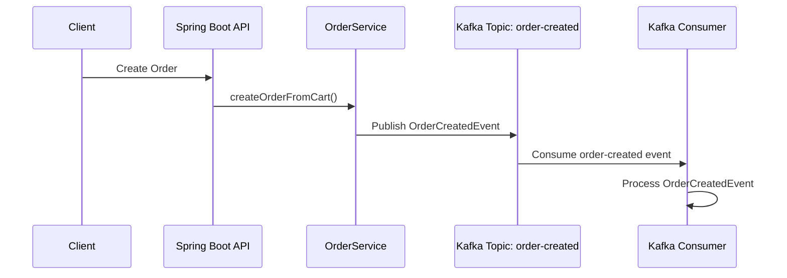
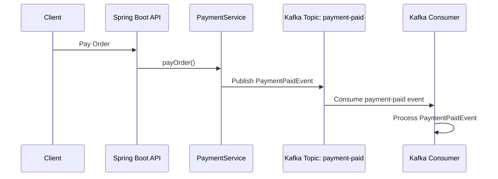
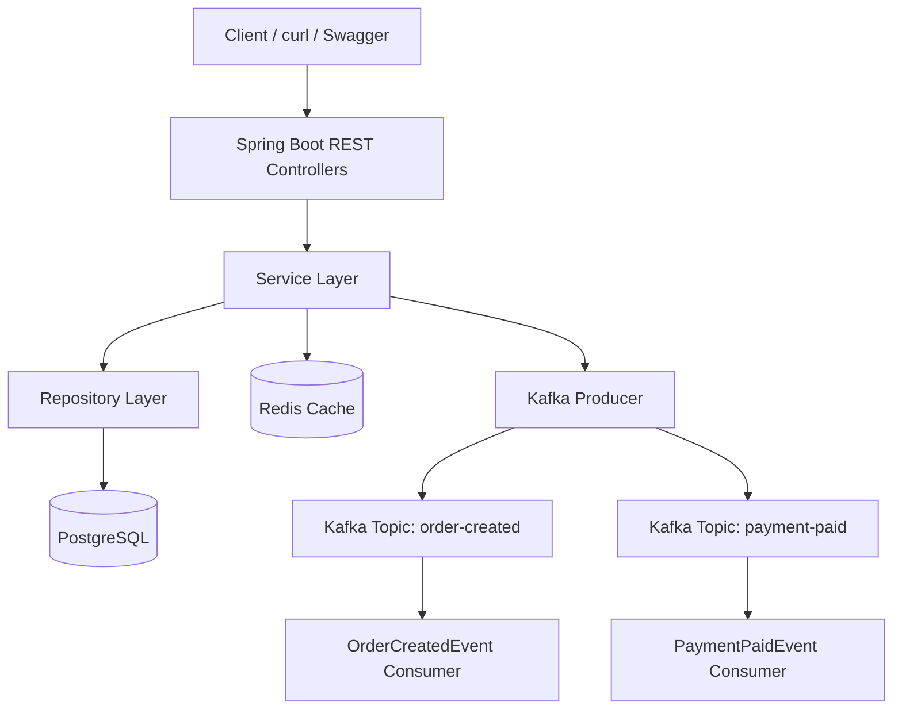

# Spring Boot E-Commerce Backend

[](https://github.com/ravan-chuang/spring-boot-ecommerce-backend/actions/workflows/ci.yml)

A production-oriented e-commerce backend built with Spring Boot, PostgreSQL, Redis, Kafka, JWT authentication, and role-based authorization.

This project is not only a basic CRUD system. It focuses on backend engineering concepts such as transactional order processing, optimistic locking, payment idempotency, Redis caching, Kafka-based event-driven architecture, JWT authentication, and ADMIN/USER authorization.

## Tech Stack

- Java 25
- Spring Boot 4
- Spring Web
- Spring Security
- JWT
- Spring Data JPA
- Hibernate
- PostgreSQL
- Redis
- Apache Kafka
- Docker Compose
- Swagger / OpenAPI
- Spring Boot Actuator
- Maven

## Core Features

### Authentication and Authorization

- User registration and login
- Password hashing with BCrypt
- JWT token generation
- USER and ADMIN roles
- Public product read APIs
- ADMIN-only product create, update, and delete APIs
- Integration tests for authentication and product authorization

### User and Product APIs

- Create, read, update, and delete users
- Public product read APIs
- ADMIN-only product create, update, and delete APIs
- Product stock management
- Product caching with Redis

### Shopping Cart

- Add products to cart
- Update cart item quantity
- Remove cart items
- Calculate item subtotal

### Order System

- Create orders from cart items
- Persist order and order items
- Deduct product stock during order creation
- Use `@Transactional` to ensure order consistency
- Prevent overselling with optimistic locking

### Payment System

- Simulate payment for orders
- Support payment method such as `CREDIT_CARD`
- Update order status after successful payment
- Prevent duplicate payment with `Idempotency-Key`


## Authentication and Authorization

The project uses JWT-based authentication with Spring Security.

### Authentication Flow

```text
Register / Login → Receive JWT → Send JWT in Authorization header
```

Example authorization header:

```http
Authorization: Bearer <JWT_TOKEN>
```

### Role Rules

```text
GET    /api/products/**      Public
POST   /api/products         ADMIN only
PUT    /api/products/**      ADMIN only
DELETE /api/products/**      ADMIN only

POST   /api/auth/register    Public
POST   /api/auth/login       Public
```

Current implementation protects product write APIs with ADMIN authorization. Cart, order, and payment APIs are kept open for the current demo flow and can be protected in a future phase with USER ownership checks.

## Kafka Event-Driven Architecture

The system publishes domain events to Kafka topics when important business actions happen.

Implemented events:

- `order-created`
- `payment-paid`

### Event Flow





## Redis Cache

Product query results are cached in Redis to reduce database access.

Example Redis key:

```text
products::1
```

## Payment Idempotency

The payment API requires an `Idempotency-Key` header.

This prevents duplicate payments when the same request is retried.

Example:

```http
Idempotency-Key: pay-order-10-001
```

If the same key is used again, the system returns the existing payment result instead of creating a duplicate payment.

## Optimistic Locking

Product stock updates use optimistic locking to prevent overselling under concurrent order creation.

The product table includes a `version` column managed by JPA `@Version`.

## System Architecture



## Observability and Health Checks

This project uses Spring Boot Actuator to expose service health and application metadata.

Available endpoints:

```text
/actuator/health
/actuator/info
```

The health endpoint reports the status of important runtime components such as:

- PostgreSQL
- Redis
- Disk space
- Liveness state
- Readiness state

Example:

```bash
curl http://localhost:8080/actuator/health
```

Example response:

```json
{
  "status": "UP"
}
```

The info endpoint exposes basic application metadata:

```bash
curl http://localhost:8080/actuator/info
```

Example response:

```json
{
  "app": {
    "name": "Spring Boot E-Commerce Backend",
    "description": "Production-oriented e-commerce backend with JWT, Redis, Kafka, Docker, and CI",
    "version": "1.0.0"
  }
}
```


## Docker Services

This project uses Docker Compose to run infrastructure services.

Services:

- Spring Boot application
- PostgreSQL
- Redis
- Kafka

Start services:

```bash
docker compose up -d
```

Stop services:

```bash
docker compose down
```

## Run with Docker Compose

The entire backend stack can be started with Docker Compose.

This includes:

- Spring Boot application
- PostgreSQL
- Redis
- Kafka

### Start the full stack

```bash
docker compose up --build
```

The Spring Boot application will be available at:

```text
http://localhost:8080
```

Swagger UI:

```text
http://localhost:8080/swagger-ui.html
```

### Stop the full stack

```bash
docker compose down
```

### Important Kafka Note

The Docker Compose configuration uses different Kafka listeners for host access and container-to-container communication.

- Host machine: `localhost:9092`
- Spring Boot container: `kafka:29092`

This prevents Kafka clients inside Docker from incorrectly connecting to `localhost:9092`.

## How to Run Locally

Use this mode if you want to run only PostgreSQL, Redis, and Kafka with Docker, while running the Spring Boot application directly on your machine.

### 1. Start infrastructure services

```bash
docker compose up -d
```

### 2. Run Spring Boot

```bash
./mvnw spring-boot:run
```

### 3. Open Swagger UI

```text
http://localhost:8080/swagger-ui.html
```

## API Demo Flow

The following demo shows a complete e-commerce backend flow with JWT authentication and ADMIN product authorization:

```text
Register Admin → Promote Admin Role → Login Admin → Create Product → Create User → Add Product to Cart → Create Order → Pay Order
```

Before running the demo, make sure the full stack is running:

```bash
docker compose up --build
```

The API server should be available at:

```text
http://localhost:8080
```

### 1. Register an admin account

```bash
curl -i -X POST http://localhost:8080/api/auth/register \
  -H "Content-Type: application/json" \
  -d '{
    "name": "Admin User",
    "email": "admin@example.com",
    "password": "password123",
    "skill": "Java Backend"
  }'
```

By default, newly registered users are created with the `USER` role. For this demo, promote the account to `ADMIN` directly in PostgreSQL:

```bash
docker exec -it spring_boot_lab_postgres psql -U ravan -d spring_boot_lab \
  -c "UPDATE users SET role = 'ADMIN' WHERE email = 'admin@example.com';"
```

### 2. Login as admin and save the JWT token

```bash
curl -i -X POST http://localhost:8080/api/auth/login \
  -H "Content-Type: application/json" \
  -d '{
    "email": "admin@example.com",
    "password": "password123"
  }'
```

Example response:

```json
{
  "message": "Login successfully",
  "data": {
    "token": "<ADMIN_JWT_TOKEN>",
    "email": "admin@example.com",
    "role": "ADMIN"
  }
}
```

Save the returned token:

```bash
ADMIN_TOKEN="<ADMIN_JWT_TOKEN>"
```

### 3. Create a product with ADMIN token

`POST /api/products` requires an ADMIN JWT token.

```bash
curl -i -X POST http://localhost:8080/api/products \
  -H "Content-Type: application/json" \
  -H "Authorization: Bearer $ADMIN_TOKEN" \
  -d '{
    "name": "MacBook Pro M3",
    "description": "Demo product for order flow",
    "price": 89999,
    "stock": 5
  }'
```

Example response:

```json
{
  "message": "Product created successfully",
  "data": {
    "id": 1,
    "name": "MacBook Pro M3",
    "price": 89999,
    "stock": 5
  }
}
```

Save the returned product id.

### 4. Verify product write authorization

Creating a product without a token should be rejected:

```bash
curl -i -X POST http://localhost:8080/api/products \
  -H "Content-Type: application/json" \
  -d '{
    "name": "Unauthorized Product",
    "description": "This request should be rejected",
    "price": 1000,
    "stock": 1
  }'
```

Expected result:

```text
403 Forbidden
```

Reading products is public:

```bash
curl -i http://localhost:8080/api/products
```

### 5. Create a normal user

```bash
curl -i -X POST http://localhost:8080/api/auth/register \
  -H "Content-Type: application/json" \
  -d '{
    "name": "Demo User",
    "email": "demo-user@example.com",
    "password": "password123",
    "skill": "Java Backend"
  }'
```

Example response:

```json
{
  "message": "Register successfully",
  "data": {
    "id": 2,
    "name": "Demo User",
    "email": "demo-user@example.com",
    "role": "USER"
  }
}
```

Save the returned user id for the next steps.

### 6. Add product to cart

Replace `{userId}` and `{productId}` with the ids returned from the previous steps.

```bash
curl -i -X POST http://localhost:8080/api/users/{userId}/cart/items \
  -H "Content-Type: application/json" \
  -d '{
    "productId": {productId},
    "quantity": 1
  }'
```

Expected result:

```json
{
  "message": "Cart item added successfully"
}
```

### 7. Create an order from cart

```bash
curl -i -X POST http://localhost:8080/api/users/{userId}/orders
```

Expected result:

```json
{
  "message": "Order created successfully",
  "data": {
    "id": 1,
    "status": "PENDING",
    "totalAmount": 89999
  }
}
```

After this step:

- The order is created with status `PENDING`
- Product stock is deducted
- An `order-created` event is published to Kafka

Save the returned order id.

### 8. Pay the order

Replace `{orderId}` with the actual order id.

```bash
curl -i -X POST http://localhost:8080/api/orders/{orderId}/payments \
  -H "Content-Type: application/json" \
  -H "Idempotency-Key: pay-order-{orderId}-001" \
  -d '{
    "method": "CREDIT_CARD"
  }'
```

Expected result:

```json
{
  "message": "Payment completed successfully",
  "data": {
    "status": "PAID",
    "method": "CREDIT_CARD"
  }
}
```

After this step:

- The payment is created
- The order status becomes `PAID`
- A `payment-paid` event is published to Kafka

### 9. Verify payment idempotency

Run the same payment request again with the same `Idempotency-Key`:

```bash
curl -i -X POST http://localhost:8080/api/orders/{orderId}/payments \
  -H "Content-Type: application/json" \
  -H "Idempotency-Key: pay-order-{orderId}-001" \
  -d '{
    "method": "CREDIT_CARD"
  }'
```

Expected behavior:

```text
The API returns the existing payment result instead of creating a duplicate payment.
```

This demonstrates payment idempotency, which is commonly used in real payment systems to prevent duplicate charges.

## Kafka Verification

Check Kafka topic offsets:

```bash
docker exec -it spring_boot_lab_kafka /opt/kafka/bin/kafka-get-offsets.sh \
  --bootstrap-server localhost:9092 \
  --topic order-created
```

Read `order-created` events:

```bash
docker exec -it spring_boot_lab_kafka /opt/kafka/bin/kafka-console-consumer.sh \
  --bootstrap-server localhost:9092 \
  --topic order-created \
  --partition 0 \
  --offset earliest \
  --timeout-ms 5000
```

Read `payment-paid` events:

```bash
docker exec -it spring_boot_lab_kafka /opt/kafka/bin/kafka-console-consumer.sh \
  --bootstrap-server localhost:9092 \
  --topic payment-paid \
  --partition 0 \
  --offset earliest \
  --timeout-ms 5000
```

Expected Spring Boot logs:

```text
Sent OrderCreatedEvent: orderId=10, topic=order-created, partition=0, offset=0
Received raw OrderCreatedEvent message: {...}
Consumed OrderCreatedEvent: orderId=10, userId=1, totalAmount=89999.00
```

```text
Sent PaymentPaidEvent: paymentId=7, orderId=10, topic=payment-paid, partition=0, offset=0
Received raw PaymentPaidEvent message: {...}
Consumed PaymentPaidEvent: paymentId=7, orderId=10, amount=89999.00, method=CREDIT_CARD
```

## Key Backend Concepts Practiced

- RESTful API design
- Layered architecture
- JWT authentication
- Role-based authorization
- BCrypt password hashing
- Transaction management
- JPA entity relationships
- Optimistic locking
- Stock consistency
- Payment idempotency
- Redis caching
- Kafka event-driven architecture
- Consumer groups
- Dockerized infrastructure
- Global exception handling
- Structured logging
- Service health checks
- Liveness and readiness checks

## Completed Engineering Improvements

- Added GitHub Actions CI pipeline
- Added Product API integration tests
- Added Payment Idempotency integration tests
- Added Auth integration tests
- Added Product ADMIN authorization integration tests
- Added JWT authentication and role-based authorization
- Added Dockerfile for the Spring Boot application
- Added Docker Compose full-stack runtime
- Added Spring Boot Actuator health and info endpoints

## Future Improvements

- Protect cart, order, and payment APIs with USER ownership checks
- Add refresh token and token revocation support
- Add more unit tests and integration tests
- Add Testcontainers for PostgreSQL, Redis, and Kafka integration tests
- Add Kafka retry and dead-letter queue
- Add Flyway database migration
- Add deployment environment
- Add performance testing
- Add monitoring with Prometheus and Grafana

## License

This project is licensed under the MIT License.
