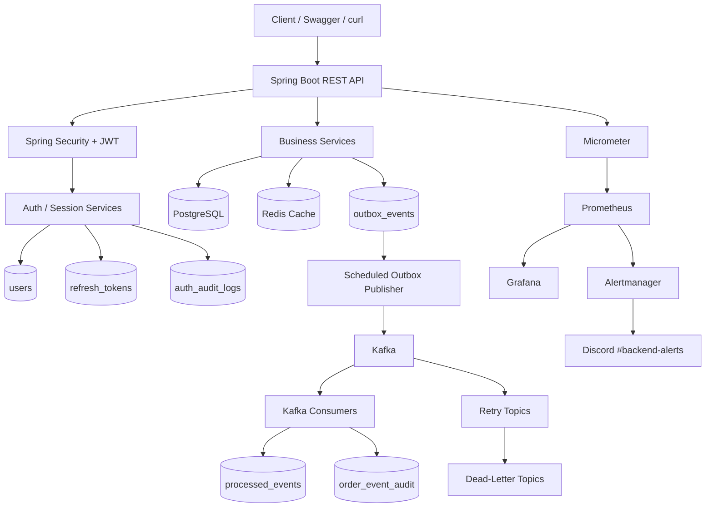

# Spring Boot E-Commerce Backend

[](https://github.com/ravan-chuang/spring-boot-ecommerce-backend/actions/workflows/ci.yml)

A production-minded e-commerce backend built with Spring Boot, PostgreSQL, Redis, Kafka, JWT authentication, transactional outbox delivery, idempotent consumers, observability, and security-event monitoring.

This is intentionally more than a CRUD project. It demonstrates how a backend handles durable event delivery, duplicate processing, authorization, token lifecycle management, failure recovery, metrics, alerting, and integration testing with real infrastructure.

---

## Highlights

- JWT access tokens with refresh-token rotation and revocation
- Multi-device session management: list sessions, revoke one session, revoke all sessions
- BCrypt passwords, USER / ADMIN authorization, and resource ownership checks
- Payment idempotency and optimistic locking for stock consistency
- Transactional Outbox with retry governance, FAILED state, and ADMIN replay
- Kafka retry topics, dead-letter topics, and idempotent consumer processing
- PostgreSQL `SKIP LOCKED` event claiming and processing-lease recovery
- Prometheus, Grafana, Alertmanager, and Discord incident notifications
- Authentication audit logs and suspicious-login monitoring
- Testcontainers integration tests for PostgreSQL, Redis, and Kafka
- Docker Compose full-stack local runtime
- Spring profiles for local, production, and test environments

---

## Tech Stack

| Area | Technologies |
|---|---|
| Language / Framework | Java 25, Spring Boot 4 |
| API / Security | Spring Web, Spring Security, JWT, Swagger / OpenAPI |
| Persistence | PostgreSQL, Spring Data JPA, Hibernate, Flyway |
| Cache / Messaging | Redis, Apache Kafka, Spring Kafka |
| Reliability | Transactional Outbox, retry topics, DLT, idempotent consumers |
| Observability | Actuator, Micrometer, Prometheus, Grafana, Alertmanager |
| Testing | JUnit, MockMvc, Testcontainers |
| Delivery | Docker, Docker Compose, GitHub Actions, Maven |

---

## Architecture



---

## Core Features

### Authentication, Refresh Tokens, and Session Management

The project uses short-lived JWT access tokens and long-lived opaque refresh tokens.

```text
Access token
→ JWT
→ 15-minute lifetime
→ sent in Authorization: Bearer <token>

Refresh token
→ cryptographically random opaque token
→ 30-day lifetime
→ only SHA-256 hash is stored in PostgreSQL
→ rotated on refresh
→ can be revoked by logout or session management APIs
```

### Authentication flow

```text
Register / Login
→ accessToken + refreshToken

Refresh
→ validate refresh token
→ revoke old refresh token
→ create replacement refresh token
→ return new accessToken + refreshToken

Logout
→ revoke supplied refresh token

Logout one session
→ revoke every active refresh token in that session chain

Logout all sessions
→ revoke all active refresh tokens for the current user
```

### Auth APIs

```text
POST   /api/auth/register                    Public
POST   /api/auth/login                       Public
POST   /api/auth/refresh                     Public
POST   /api/auth/logout                      Public

GET    /api/auth/sessions                    Authenticated
DELETE /api/auth/sessions/{sessionId}        Authenticated
POST   /api/auth/sessions/logout-all         Authenticated
```

### Session tracking

Each refresh-token session records:

```text
sessionId
deviceName
ipAddress
createdAt
lastUsedAt
expiresAt
```

Refresh-token rotation keeps the same `sessionId`, so token replacement still represents the same device session.

### Authorization rules

```text
GET    /api/products/**                      Public
POST   /api/products                         ADMIN only
PUT    /api/products/**                      ADMIN only
DELETE /api/products/**                      ADMIN only

/api/users/{userId}/cart/**                  User owner or ADMIN
/api/users/{userId}/orders/**                User owner or ADMIN
/api/orders/{orderId}/payments               Order owner or ADMIN

GET    /api/admin/outbox/failed              ADMIN only
POST   /api/admin/outbox/{eventId}/replay    ADMIN only

GET    /actuator/health                      Public
GET    /actuator/info                        Public
GET    /actuator/prometheus                  Public for local Prometheus scraping
GET    /actuator/metrics/**                  ADMIN only
```

---

## Transactional Outbox and Kafka Delivery

Order and payment changes must not be committed independently from their Kafka events. The project uses the Transactional Outbox pattern to reduce the dual-write consistency problem.

```text
Create Order / Pay Order
→ persist business data
→ persist PENDING outbox event in the same PostgreSQL transaction
→ commit once
→ background publisher claims event
→ publish to Kafka
→ mark PUBLISHED
```

### Event topics

```text
order-created
payment-paid
```

### Outbox states

```text
PENDING      Waiting to be published or retried
PROCESSING   Claimed by one publisher instance
PUBLISHED    Successfully published to Kafka
FAILED       Retry limit reached; operator action required
```

### Multi-instance-safe claiming

The publisher uses PostgreSQL row locking with:

```sql
SELECT ...
FOR UPDATE SKIP LOCKED
```

This allows multiple application instances to claim different pending events without concurrently publishing the same event.

A processing lease protects against an instance stopping after it has claimed an event:

```text
PROCESSING lease expires
→ recovery job returns event to PENDING
→ another instance may claim it
```

### Failed-event replay

ADMIN users can inspect failed events and schedule replay:

```text
GET  /api/admin/outbox/failed
POST /api/admin/outbox/{eventId}/replay
```

Replay behavior:

```text
FAILED
→ PENDING
→ retry_count reset
→ last_error cleared
→ publisher retries Kafka delivery
```

---

## Kafka Retry, DLT, and Consumer Idempotency

### Consumer retry policy

Malformed or temporarily unprocessable messages use non-blocking retry topics:

```text
Initial failure
→ retry after 1 second
→ retry after 2 seconds
→ retry after 4 seconds
→ dead-letter topic
```

### Idempotent consumers

Kafka provides at-least-once delivery semantics, so duplicate delivery is possible.

The outbox publisher attaches an event header:

```text
outbox-event-id: <UUID>
```

Consumers use this ID with the consumer name as a deduplication key:

```text
processed_events
(event_id, consumer_name)
```

Processing flow:

```text
Kafka event arrives
→ insert processed-event marker
→ first insert succeeds: run business side effect
→ duplicate insert conflicts: skip duplicate delivery
```

The marker and business side effect run in one database transaction:

```text
business action succeeds
→ marker commits

business action fails
→ transaction rolls back
→ marker is removed
→ retry can safely process again
```

The `ORDER_CREATED` consumer writes an auditable side effect to:

```text
order_event_audit
```

Verified behavior:

```text
same event delivered twice
→ processed_events contains 1 row
→ order_event_audit contains 1 row
→ duplicate side effect is prevented
```

---

## Payment Idempotency and Stock Consistency

### Payment idempotency

The payment endpoint requires an `Idempotency-Key`:

```http
Idempotency-Key: pay-order-10-001
```

When the same key is retried, the API returns the previous payment result instead of creating a duplicate charge.

### Optimistic locking

Product stock uses JPA optimistic locking with an entity version column.

```text
Concurrent orders
→ version conflict detected
→ one transaction retries or fails safely
→ overselling is prevented
```

---

## Flyway Schema Migrations

Flyway manages all PostgreSQL schema changes.

```text
V1__init_schema.sql
V2__create_outbox_events.sql
V3__add_outbox_processing_lease.sql
V4__create_processed_events.sql
V5__create_order_event_audit.sql
V6__create_refresh_tokens.sql
V7__add_refresh_token_sessions.sql
V8__create_auth_audit_logs.sql
```

Hibernate validates the schema instead of auto-updating it:

```properties
spring.jpa.hibernate.ddl-auto=validate
spring.flyway.enabled=true
spring.flyway.locations=classpath:db/migration
```

Check migration history:

```bash
docker exec -it spring_boot_lab_postgres \
  psql -U ravan -d spring_boot_lab \
  -c "SELECT installed_rank, version, description, success FROM flyway_schema_history;"
```

---

## Authentication Audit Logs and Security Monitoring

Authentication events are stored in:

```text
auth_audit_logs
```

Recorded fields include:

```text
user_id
event_type
outcome
ip_address
device_name
details
created_at
```

Audited actions include:

```text
register
login
refresh
logout
session_revoke
sessions_revoke_all
```

Failed auth attempts use an independent transaction, so an audit record remains persisted even when the API request returns an error.

### Authentication metrics

Micrometer exports:

```text
auth.events{action="login",outcome="success"}
auth.events{action="login",outcome="failure"}
auth.events{action="refresh",outcome="success"}
auth.events{action="refresh",outcome="failure"}
auth.events{action="logout",outcome="success"}
auth.events{action="session_revoke",outcome="success"}
auth.events{action="sessions_revoke_all",outcome="success"}
```

Prometheus exposes these as:

```text
auth_events_total
```

Example query:

```promql
increase(auth_events_total{action="login",outcome="failure"}[5m])
```

---

## Observability

### Actuator endpoints

```text
/actuator/health
/actuator/info
/actuator/prometheus
/actuator/metrics/**
```

### Outbox metrics

```text
outbox.events{status=PENDING}
outbox.events{status=PROCESSING}
outbox.events{status=FAILED}

outbox.publish.success
outbox.publish.failure
outbox.events.claimed
outbox.processing.recovered
```

Prometheus names:

```text
outbox_events
outbox_publish_success_total
outbox_publish_failure_total
outbox_events_claimed_total
outbox_processing_recovered_total
```

### Grafana dashboard

Grafana is provisioned automatically with a Reliability & Security dashboard.

```text
Outbox Pending Events
Outbox Processing Events
Outbox Failed Events
Outbox Publish Rate
Outbox Worker Activity

Login Successes — Last 30m
Login Failures — Last 30m
Authentication Activity Rate
Session Security Actions — Last 30m
```

### Alerting

Prometheus evaluates alert rules. Alertmanager routes alerts to Discord.

```text
OutboxFailedEvents
OutboxPublishFailuresDetected
OutboxPendingBacklog
SpringBootApplicationDown
ExcessiveLoginFailures
```

`ExcessiveLoginFailures` fires when at least five failed logins occur during a five-minute window and the condition remains true for one minute.

```promql
increase(auth_events_total{action="login",outcome="failure"}[5m]) >= 5
```

> `increase()` may display a non-integer value because Prometheus extrapolates counter increases across the selected time window. This is expected.

### Verified incident workflows

#### 1. Kafka outage and operational recovery

```text
Kafka outage
→ business transaction still commits
→ outbox event remains durable in PostgreSQL
→ publisher retries
→ event reaches FAILED
→ Prometheus and Alertmanager fire warning / critical alerts
→ Discord receives FIRING notifications
→ Kafka recovers
→ ADMIN replays the failed event
→ event becomes PUBLISHED
→ Discord receives RESOLVED notifications
```

#### 2. Suspicious failed-login activity

```text
Failed login × 5
→ auth_events_total increments
→ Grafana Login Failures panel increases
→ ExcessiveLoginFailures enters PENDING
→ rule fires after 1 minute
→ Discord receives FIRING notification
→ after the time window expires
→ alert resolves
→ Discord receives RESOLVED notification
```

### Local observability URLs

```text
Swagger UI:     http://localhost:8080/swagger-ui/index.html
Prometheus:     http://localhost:9090
Grafana:        http://localhost:3000
Alertmanager:   http://localhost:9093
```

Local Grafana credentials:

```text
username: admin
password: admin
```

For real deployment, do not publicly expose Prometheus, Grafana, Alertmanager, or `/actuator/prometheus`. Use private networking, a management network, IAM, HTTPS, and secret management.

---

## Spring Profiles

```text
application.properties
→ shared configuration

application-local.properties
→ fast failure settings for local alert demos

application-prod.properties
→ conservative Kafka retry and timeout settings

src/test/resources/application.properties
→ test profile defaults
```

The Docker Compose app service defaults to the local profile:

```yaml
SPRING_PROFILES_ACTIVE: ${SPRING_PROFILES_ACTIVE:-local}
```

Start with production settings:

```bash
SPRING_PROFILES_ACTIVE=prod docker compose up -d --build app
```

---

## Docker Compose

The full local stack includes:

```text
Spring Boot application
PostgreSQL
Redis
Kafka
Prometheus
Grafana
Alertmanager
```

Start everything:

```bash
docker compose up -d --build
```

Stop:

```bash
docker compose down
```

Kafka listeners:

```text
Host machine:                localhost:9092
Spring Boot container:       kafka:29092
```

---

## Local Development

Start infrastructure and application:

```bash
docker compose up -d postgres redis kafka
./mvnw spring-boot:run
```

Open Swagger:

```text
http://localhost:8080/swagger-ui/index.html
```

Reset local data and rerun migrations:

```bash
docker compose down -v
docker compose up -d
```

---

## Testing

The integration suite uses Testcontainers with real:

```text
PostgreSQL
Redis
Kafka
```

Run all tests:

```bash
./mvnw clean test
```

Current expected result:

```text
Tests run: 40, Failures: 0, Errors: 0, Skipped: 0
BUILD SUCCESS
```

Key coverage includes:

```text
Authentication and authorization
Refresh-token rotation and logout revocation
Multi-device session management
Authentication audit logs and metrics
Product ADMIN authorization
User ownership checks
Payment idempotency
Order flow and optimistic locking
Kafka retry / DLT
Transactional Outbox publishing and retry governance
ADMIN failed-event replay
Multi-instance event claiming and lease recovery
Idempotent Kafka consumers
Consumer-side audit effects
Prometheus metric authorization
Event-retention cleanup
```

For Docker Desktop on macOS:

```bash
export DOCKER_HOST=unix://$HOME/.docker/run/docker.sock
```

The project also includes:

```text
src/test/resources/docker-java.properties
```

with a compatible Docker Java API version.

---

## Example API Flow

```text
Register / Login
→ Authorize Swagger with accessToken
→ ADMIN creates product
→ USER adds product to cart
→ USER creates order
→ USER pays with Idempotency-Key
→ Outbox publishes Kafka events
```

Example login request:

```bash
curl -X POST http://localhost:8080/api/auth/login \
  -H "Content-Type: application/json" \
  -d '{
    "email": "demo-user@example.com",
    "password": "password123"
  }'
```

The response returns:

```json
{
  "status": 200,
  "message": "Login successfully",
  "data": {
    "accessToken": "<JWT_ACCESS_TOKEN>",
    "refreshToken": "<OPAQUE_REFRESH_TOKEN>",
    "tokenType": "Bearer",
    "userId": 1,
    "email": "demo-user@example.com",
    "role": "USER"
  }
}
```

Use the access token with:

```http
Authorization: Bearer <JWT_ACCESS_TOKEN>
```

Refresh:

```bash
curl -X POST http://localhost:8080/api/auth/refresh \
  -H "Content-Type: application/json" \
  -d '{
    "refreshToken": "<OPAQUE_REFRESH_TOKEN>"
  }'
```

---

## Project Structure

```text
src/main/java/com/ravan/SpringBootLab
├── controller
├── service
├── repository
├── model
├── dto
├── security
└── config

src/main/resources
├── application.properties
├── application-local.properties
├── application-prod.properties
└── db/migration

observability
├── prometheus
├── grafana
├── alertmanager
└── secrets                 # ignored by Git
```

---

## Engineering Concepts Practiced

- REST API design and layered architecture
- JWT authorization and ownership checks
- Refresh-token rotation, revocation, and session management
- Audit logging and security-event monitoring
- BCrypt password hashing
- PostgreSQL transactions and Flyway migrations
- Optimistic locking
- Payment idempotency
- Redis caching
- Kafka event-driven architecture
- Retry topics and dead-letter topics
- Transactional Outbox pattern
- Multi-instance event processing with `SKIP LOCKED`
- Lease recovery
- At-least-once delivery and consumer idempotency
- Micrometer custom metrics
- PromQL, Grafana provisioning, alert rules, Alertmanager routing
- Incident lifecycle validation
- Docker Compose infrastructure
- Testcontainers integration testing
- GitHub Actions CI

---

## Future Improvements

- Rate limiting and temporary account lockout for brute-force protection
- Cloud deployment with private observability networking
- CI/CD deployment pipeline
- Load testing with k6 or Gatling and published latency metrics
- Distributed tracing with OpenTelemetry and Tempo / Jaeger
- Secret management, IAM, HTTPS, and production network policies
- User-facing frontend or admin console
- Retention cleanup for auth audit logs and expired refresh tokens

---

## License

MIT License.
