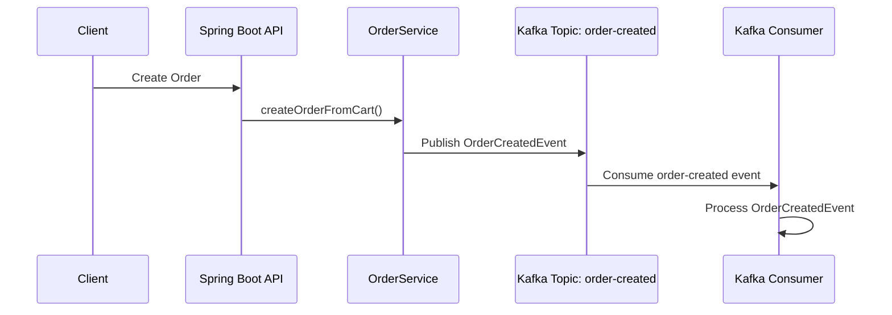
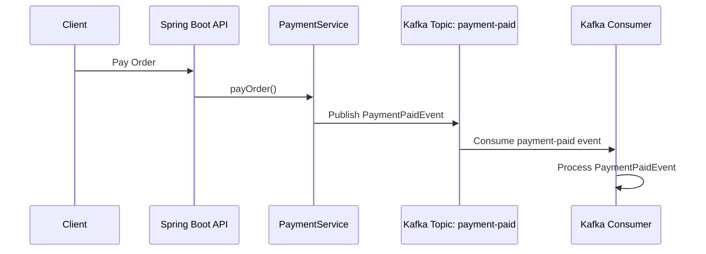
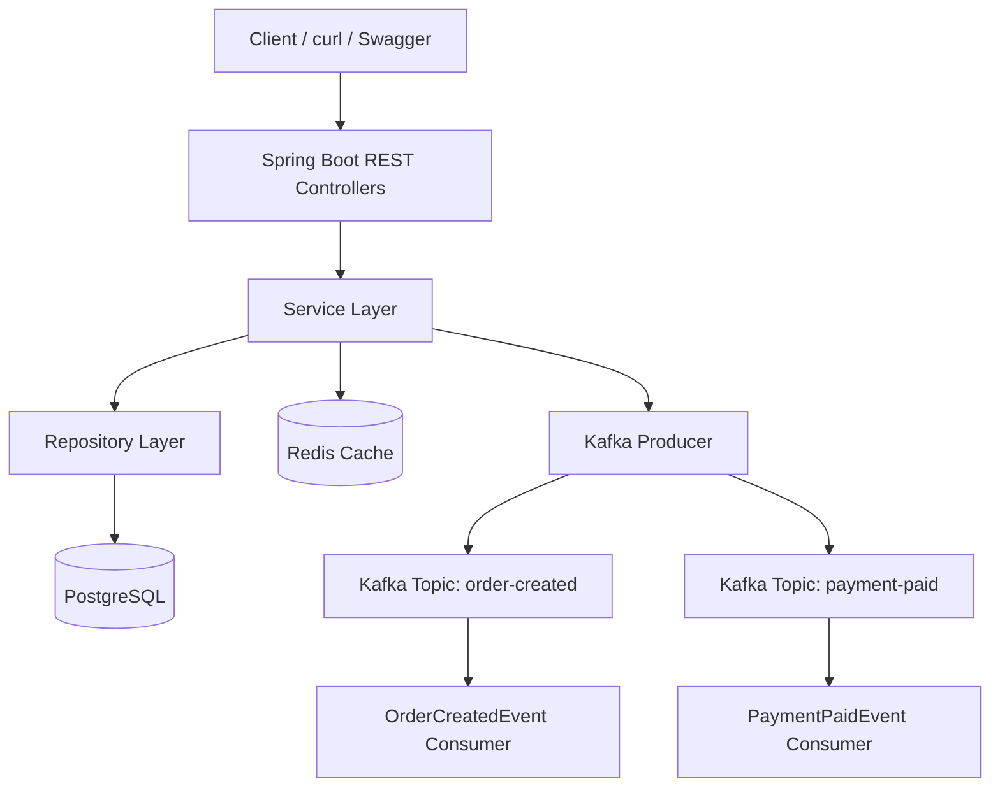

# Spring Boot E-Commerce Backend

[](https://github.com/ravan-chuang/spring-boot-ecommerce-backend/actions/workflows/ci.yml)


A production-oriented e-commerce backend built with Spring Boot, PostgreSQL, Redis, and Kafka.

This project is not only a basic CRUD system. It focuses on backend engineering concepts such as transactional order processing, optimistic locking, payment idempotency, Redis caching, and Kafka-based event-driven architecture.

## Tech Stack

- Java 25
- Spring Boot 4
- Spring Web
- Spring Data JPA
- Hibernate
- PostgreSQL
- Redis
- Apache Kafka
- Docker Compose
- Swagger / OpenAPI
- Maven

## Core Features

### User and Product APIs

- Create, read, update, and delete users
- Create, read, update, and delete products
- Product stock management
- Product caching with Redis

### Shopping Cart

- Add products to cart
- Update cart item quantity
- Remove cart items
- Calculate item subtotal

### Order System

- Create orders from cart items
- Persist order and order items
- Deduct product stock during order creation
- Use `@Transactional` to ensure order consistency
- Prevent overselling with optimistic locking

### Payment System

- Simulate payment for orders
- Support payment method such as `CREDIT_CARD`
- Update order status after successful payment
- Prevent duplicate payment with `Idempotency-Key`

## Kafka Event-Driven Architecture

The system publishes domain events to Kafka topics when important business actions happen.

Implemented events:

- `order-created`
- `payment-paid`

### Event Flow





## Redis Cache

Product query results are cached in Redis to reduce database access.

Example Redis key:

```text
products::1
```

## Payment Idempotency

The payment API requires an `Idempotency-Key` header.

This prevents duplicate payments when the same request is retried.

Example:

```http
Idempotency-Key: pay-order-10-001
```

If the same key is used again, the system returns the existing payment result instead of creating a duplicate payment.

## Optimistic Locking

Product stock updates use optimistic locking to prevent overselling under concurrent order creation.

The product table includes a `version` column managed by JPA `@Version`.

## System Architecture



## Docker Services

This project uses Docker Compose to run infrastructure services.

Services:

- Spring Boot application
- PostgreSQL
- Redis
- Kafka

Start services:

```bash
docker compose up -d
```

Stop services:

```bash
docker compose down
```

## Run with Docker Compose

The entire backend stack can be started with Docker Compose.

This includes:

- Spring Boot application
- PostgreSQL
- Redis
- Kafka

### Start the full stack

```bash
docker compose up --build
```

The Spring Boot application will be available at:

```text
http://localhost:8080
```

Swagger UI:

```text
http://localhost:8080/swagger-ui.html
```

### Stop the full stack

```bash
docker compose down
```

### Important Kafka Note

The Docker Compose configuration uses different Kafka listeners for host access and container-to-container communication.

- Host machine: `localhost:9092`
- Spring Boot container: `kafka:29092`

This prevents Kafka clients inside Docker from incorrectly connecting to `localhost:9092`.

## How to Run Locally

Use this mode if you want to run only PostgreSQL, Redis, and Kafka with Docker, while running the Spring Boot application directly on your machine.

### 1. Start infrastructure services

```bash
docker compose up -d
```

### 2. Run Spring Boot

```bash
./mvnw spring-boot:run
```

### 3. Open Swagger UI

```text
http://localhost:8080/swagger-ui.html
```

## API Demo Flow

### 1. Update product stock

```bash
curl -i -X PUT http://localhost:8080/api/products/1 \
  -H "Content-Type: application/json" \
  -d '{
    "name": "MacBook Pro M3",
    "description": "Kafka final test product",
    "price": 89999,
    "stock": 5
  }'
```

### 2. Add item to cart

```bash
curl -i -X POST http://localhost:8080/api/users/1/cart/items \
  -H "Content-Type: application/json" \
  -d '{
    "productId": 1,
    "quantity": 1
  }'
```

### 3. Create order

```bash
curl -i -X POST http://localhost:8080/api/users/1/orders
```

Expected result:

```json
{
  "message": "Order created successfully",
  "data": {
    "status": "PENDING"
  }
}
```

### 4. Pay order

Replace `{orderId}` with the actual order id.

```bash
curl -i -X POST http://localhost:8080/api/orders/{orderId}/payments \
  -H "Content-Type: application/json" \
  -H "Idempotency-Key: pay-order-{orderId}-001" \
  -d '{
    "method": "CREDIT_CARD"
  }'
```

Expected result:

```json
{
  "message": "Payment completed successfully",
  "data": {
    "status": "PAID",
    "method": "CREDIT_CARD"
  }
}
```

## Kafka Verification

Check Kafka topic offsets:

```bash
docker exec -it spring_boot_lab_kafka /opt/kafka/bin/kafka-get-offsets.sh \
  --bootstrap-server localhost:9092 \
  --topic order-created
```

Read `order-created` events:

```bash
docker exec -it spring_boot_lab_kafka /opt/kafka/bin/kafka-console-consumer.sh \
  --bootstrap-server localhost:9092 \
  --topic order-created \
  --partition 0 \
  --offset earliest \
  --timeout-ms 5000
```

Read `payment-paid` events:

```bash
docker exec -it spring_boot_lab_kafka /opt/kafka/bin/kafka-console-consumer.sh \
  --bootstrap-server localhost:9092 \
  --topic payment-paid \
  --partition 0 \
  --offset earliest \
  --timeout-ms 5000
```

Expected Spring Boot logs:

```text
Sent OrderCreatedEvent: orderId=10, topic=order-created, partition=0, offset=0
Received raw OrderCreatedEvent message: {...}
Consumed OrderCreatedEvent: orderId=10, userId=1, totalAmount=89999.00
```

```text
Sent PaymentPaidEvent: paymentId=7, orderId=10, topic=payment-paid, partition=0, offset=0
Received raw PaymentPaidEvent message: {...}
Consumed PaymentPaidEvent: paymentId=7, orderId=10, amount=89999.00, method=CREDIT_CARD
```

## Key Backend Concepts Practiced

- RESTful API design
- Layered architecture
- Transaction management
- JPA entity relationships
- Optimistic locking
- Stock consistency
- Payment idempotency
- Redis caching
- Kafka event-driven architecture
- Consumer groups
- Dockerized infrastructure
- Global exception handling
- Structured logging

## Completed Engineering Improvements

- Added GitHub Actions CI pipeline
- Added Product API integration tests
- Added Payment Idempotency integration tests
- Added Dockerfile for the Spring Boot application
- Added Docker Compose full-stack runtime

## Future Improvements

- Add JWT authentication and role-based authorization
- Add more unit tests and integration tests
- Add Kafka retry and dead-letter queue
- Add Flyway database migration
- Add deployment environment
- Add performance testing
- Add monitoring with Spring Boot Actuator, Prometheus, and Grafana
