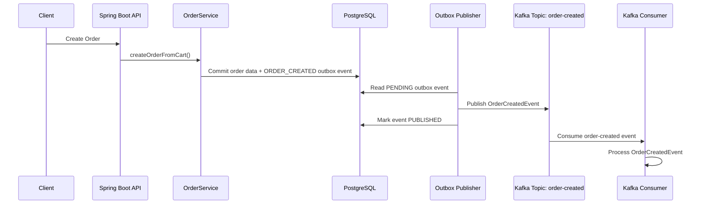
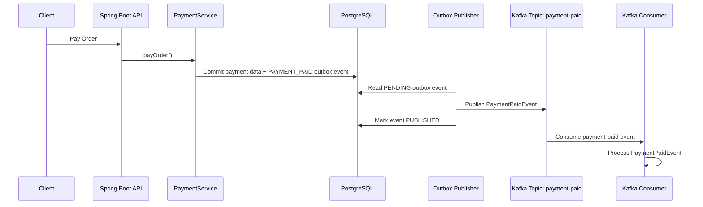
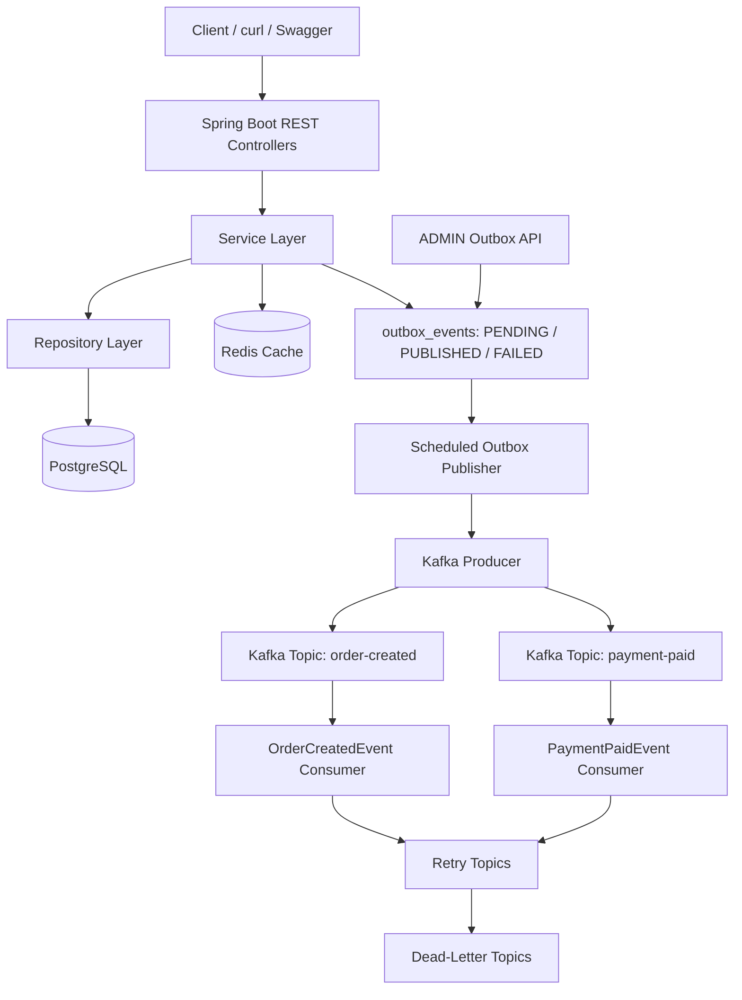

# Spring Boot E-Commerce Backend

[](https://github.com/ravan-chuang/spring-boot-ecommerce-backend/actions/workflows/ci.yml)

A production-oriented e-commerce backend built with Spring Boot, PostgreSQL, Redis, Kafka, JWT authentication, role-based authorization, user ownership checks, Flyway database migrations, Testcontainers-based integration tests, Kafka retry and dead-letter topic handling, transactional outbox failure governance and replay, and Spring Boot Actuator health checks.

This project is not only a basic CRUD system. It focuses on backend engineering concepts such as transactional order processing, optimistic locking, payment idempotency, Redis caching, Kafka-based event-driven architecture, JWT authentication, ADMIN/USER authorization, user ownership checks, Flyway-managed schema versioning, self-contained integration testing with Testcontainers, Kafka retry and dead-letter topic handling, transactional outbox event publishing, failed-event replay, and service health monitoring.

## Tech Stack

- Java 25
- Spring Boot 4
- Spring Web
- Spring Security
- JWT
- Spring Data JPA
- Hibernate
- PostgreSQL
- Redis
- Apache Kafka
- Spring Retry
- Docker Compose
- Testcontainers
- Swagger / OpenAPI
- Spring Boot Actuator
- Maven

## Core Features

### Authentication and Authorization

- User registration and login
- Password hashing with BCrypt
- JWT token generation
- USER and ADMIN roles
- Public product read APIs
- ADMIN-only product create, update, and delete APIs
- Authenticated USER ownership checks for cart, order, and payment APIs
- Testcontainers-based integration tests for authentication, product authorization, user ownership, payment idempotency, full order flow, and Kafka retry / DLT handling
- Kafka non-blocking retry and dead-letter topic handling for failed consumer messages
- Transactional Outbox for reliable order and payment event publication

### User and Product APIs

- Create, read, update, and delete users
- Public product read APIs
- ADMIN-only product create, update, and delete APIs
- Product stock management
- Product caching with Redis

### Shopping Cart

- Add products to cart
- Update cart item quantity
- Remove cart items
- Calculate item subtotal
- Require authenticated users to access only their own cart resources

### Order System

- Create orders from cart items
- Persist order and order items
- Deduct product stock during order creation
- Use `@Transactional` to ensure order consistency
- Prevent overselling with optimistic locking
- Require authenticated users to access only their own orders

### Payment System

- Simulate payment for orders
- Support payment method such as `CREDIT_CARD`
- Update order status after successful payment
- Prevent duplicate payment with `Idempotency-Key`
- Require authenticated users to pay only their own orders

### Database Migration

- Manage PostgreSQL schema with Flyway migrations
- Initialize database schema with `V1__init_schema.sql`
- Replace Hibernate auto schema updates with schema validation
- Keep database structure version-controlled and reproducible

## Authentication and Authorization

The project uses JWT-based authentication with Spring Security.

### Authentication Flow

```text
Register / Login → Receive JWT → Send JWT in Authorization header
```

Example authorization header:

```http
Authorization: Bearer <JWT_TOKEN>
```

### Authorization Rules

```text
GET    /api/products/**              Public
POST   /api/products                 ADMIN only
PUT    /api/products/**              ADMIN only
DELETE /api/products/**              ADMIN only

POST   /api/users/{userId}/cart/**   Authenticated user owner or ADMIN
GET    /api/users/{userId}/cart/**    Authenticated user owner or ADMIN
PUT    /api/users/{userId}/cart/**    Authenticated user owner or ADMIN
DELETE /api/users/{userId}/cart/**    Authenticated user owner or ADMIN

POST   /api/users/{userId}/orders/** Authenticated user owner or ADMIN
GET    /api/users/{userId}/orders/**  Authenticated user owner or ADMIN
GET    /api/orders/{orderId}          Order owner or ADMIN
POST   /api/orders/{orderId}/cancel   Order owner or ADMIN

POST   /api/orders/{orderId}/payments Order owner or ADMIN
GET    /api/orders/{orderId}/payment  Order owner or ADMIN

POST   /api/auth/register             Public
POST   /api/auth/login                Public
GET    /actuator/health               Public
GET    /actuator/info                 Public
GET    /api/admin/outbox/failed       ADMIN only
POST   /api/admin/outbox/{eventId}/replay ADMIN only
```

Product write APIs require the `ADMIN` role. Cart, order, and payment APIs require authentication and enforce ownership checks, so normal users can only operate on their own cart, orders, and payments. ADMIN users can pass ownership checks for management and testing scenarios.

## Kafka Event-Driven Architecture

The system records domain events in PostgreSQL within the same business transaction, then an Outbox Publisher publishes pending events to Kafka.

Implemented events:

- `order-created`
- `payment-paid`

### Event Flow





## Kafka Retry and Dead-Letter Topics

Kafka consumers use non-blocking retry topics to prevent malformed or temporarily unprocessable messages from blocking the main consumer flow.

Retry policy:

```text
Initial processing failure
→ retry after 1 second
→ retry after 2 seconds
→ retry after 4 seconds
→ dead-letter topic (DLT)
```

Implemented retry behavior:

- Retry topics are generated automatically from the original topic.
- Failed `order-created` and `payment-paid` messages are retried with exponential backoff.
- Messages that still fail after all retry attempts are forwarded to a dead-letter topic.
- The DLT handler logs the failed message topic, partition, offset, key, and payload for later investigation.

Main retry configuration:

```text
src/main/java/com/ravan/SpringBootLab/config/KafkaRetryConfig.java
```

Consumer retry and DLT handling:

```text
src/main/java/com/ravan/SpringBootLab/service/EventConsumer.java
```

Example DLT log:

```text
Message moved to DLT: topic=order-created-dlt, partition=0, offset=0, key=null, value=
```

### Manual DLT Verification

Start the local infrastructure and Spring Boot application:

```bash
docker compose up -d postgres redis kafka
./mvnw spring-boot:run
```

In another terminal, publish an empty message to trigger the retry flow:

```bash
printf '\n' | docker exec -i spring_boot_lab_kafka \
  /opt/kafka/bin/kafka-console-producer.sh \
  --bootstrap-server localhost:9092 \
  --topic order-created
```

Then inspect the DLT topic:

```bash
docker exec -it spring_boot_lab_kafka \
  /opt/kafka/bin/kafka-console-consumer.sh \
  --bootstrap-server localhost:9092 \
  --topic order-created-dlt \
  --from-beginning \
  --timeout-ms 5000
```

A console consumer timeout after processing is expected when no additional messages arrive.

### Automated Retry / DLT Integration Test

The retry and DLT workflow is also covered by an automated Testcontainers-based integration test:

```text
src/test/java/com/ravan/SpringBootLab/integration/KafkaRetryDltIntegrationTest.java
```

The test publishes an empty `order-created` message with a unique key, waits for the retry pipeline to complete, and verifies that the same message is eventually consumed from `order-created-dlt`.

Verified flow:

```text
order-created
→ retry after 1 second
→ retry after 2 seconds
→ retry after 4 seconds
→ order-created-dlt
```

Run only this test:

```bash
./mvnw test -Dtest=KafkaRetryDltIntegrationTest
```

## Transactional Outbox and Failure Governance

Order and payment data should not be committed independently from their Kafka events. This project uses the Transactional Outbox pattern to mitigate the dual-write consistency problem.

Within the same PostgreSQL transaction, the application persists both business data and an outbox record:

```text
Create Order / Pay Order
→ persist business data
→ persist outbox_events record with status PENDING
→ commit one database transaction
→ background publisher sends the event to Kafka
```

Outbox records include:

```text
id
aggregate_type
aggregate_id
event_type
topic
payload
status
retry_count
created_at
published_at
last_error
```

Event states:

```text
PENDING   Waiting to be published or retried
PUBLISHED Successfully published to Kafka
FAILED    Reached the configured retry limit and requires operational action
```

### Publisher behavior

```text
PENDING
→ Kafka publish succeeds
→ PUBLISHED

PENDING
→ Kafka publish fails
→ retry_count increases
→ remains PENDING until the retry limit is reached

retry limit reached
→ FAILED
→ automatic retry stops
```

The default retry limit is configurable:

```properties
outbox.publisher.max-attempts=10
```

### Failed-event administration

ADMIN users can inspect failed events and schedule a replay.

```text
GET  /api/admin/outbox/failed
POST /api/admin/outbox/{eventId}/replay
```

Replay behavior:

```text
FAILED
→ PENDING
→ retry_count reset to 0
→ last_error cleared
→ publisher can attempt Kafka delivery again
```

Example requests:

```bash
curl -i -X GET http://localhost:8080/api/admin/outbox/failed   -H "Authorization: Bearer $ADMIN_TOKEN"
```

```bash
curl -i -X POST http://localhost:8080/api/admin/outbox/{eventId}/replay   -H "Authorization: Bearer $ADMIN_TOKEN"
```

### Outbox test coverage

```text
PENDING event → Kafka publish → PUBLISHED
Kafka publish failure → PENDING + retry_count increment
Maximum publish attempts → FAILED
Order creation → ORDER_CREATED outbox event persisted
Payment success → PAYMENT_PAID outbox event persisted
ADMIN replay → FAILED event reset to PENDING
Normal USER → rejected from ADMIN outbox APIs
```

## Redis Cache

Product query results are cached in Redis to reduce database access.

Example Redis key:

```text
products::1
```

## Payment Idempotency

The payment API requires an `Idempotency-Key` header.

This prevents duplicate payments when the same request is retried.

Example:

```http
Idempotency-Key: pay-order-10-001
```

If the same key is used again, the system returns the existing payment result instead of creating a duplicate payment.

## Optimistic Locking

Product stock updates use optimistic locking to prevent overselling under concurrent order creation.

The product table includes a `version` column managed by JPA `@Version`.

## Flyway Database Migration

This project uses Flyway to manage PostgreSQL schema versions.

Database migrations include:

```text
src/main/resources/db/migration/V1__init_schema.sql
src/main/resources/db/migration/V2__create_outbox_events.sql
```

Hibernate is configured to validate the schema instead of automatically updating it:

```properties
spring.jpa.hibernate.ddl-auto=validate
spring.flyway.enabled=true
spring.flyway.locations=classpath:db/migration
```

This makes the database schema reproducible, version-controlled, and closer to a production backend workflow.

To reset the local database and rerun migrations:

```bash
docker compose down -v
docker compose up -d postgres redis kafka
./mvnw test
```

Flyway migration history can be checked with:

```bash
docker exec -it spring_boot_lab_postgres psql -U ravan -d spring_boot_lab \
  -c "SELECT installed_rank, version, description, success FROM flyway_schema_history;"
```

Expected result includes both schema migrations:

```text
1 | 1 | init schema | t
2 | 2 | create outbox events | t
```

## Testcontainers Integration Testing

This project uses Testcontainers to run integration tests with real infrastructure services instead of relying on manually started local containers.

Testcontainers automatically starts test-time containers for:

- PostgreSQL
- Redis
- Kafka

The shared Testcontainers configuration is defined in:

```text
src/test/java/com/ravan/SpringBootLab/TestcontainersIntegrationTest.java
```

The integration tests dynamically inject container connection properties into Spring Boot:

```text
spring.datasource.url
spring.datasource.username
spring.datasource.password
spring.data.redis.host
spring.data.redis.port
spring.kafka.bootstrap-servers
```

This makes the test suite more reproducible and closer to a CI-friendly backend workflow.

Run all tests:

```bash
./mvnw test
```

Expected result:

```text
Tests run: 24, Failures: 0, Errors: 0, Skipped: 0
BUILD SUCCESS
```

For Docker Desktop on macOS, this project includes a test resource file to ensure Docker Java API compatibility:

```text
src/test/resources/docker-java.properties
```

It pins a compatible Docker Java API version for the local Docker Desktop environment:

```properties
api.version=1.44
```

## System Architecture



## Observability and Health Checks

This project uses Spring Boot Actuator to expose service health and application metadata.

Available endpoints:

```text
/actuator/health
/actuator/info
```

The health endpoint reports the status of important runtime components such as:

- PostgreSQL
- Redis
- Disk space
- Liveness state
- Readiness state

Example:

```bash
curl http://localhost:8080/actuator/health
```

Example response:

```json
{
  "status": "UP"
}
```

The info endpoint exposes basic application metadata:

```bash
curl http://localhost:8080/actuator/info
```

Example response:

```json
{
  "app": {
    "name": "Spring Boot E-Commerce Backend",
    "description": "Production-oriented e-commerce backend with JWT, ownership authorization, Redis, Kafka, Flyway, Testcontainers, Docker, and CI",
    "version": "1.0.0"
  }
}
```

## Docker Services

This project uses Docker Compose to run infrastructure services.

Services:

- Spring Boot application
- PostgreSQL
- Redis
- Kafka

Start services:

```bash
docker compose up -d
```

Stop services:

```bash
docker compose down
```

## Run with Docker Compose

The entire backend stack can be started with Docker Compose.

This includes:

- Spring Boot application
- PostgreSQL
- Redis
- Kafka

### Start the full stack

```bash
docker compose up --build
```

The Spring Boot application will be available at:

```text
http://localhost:8080
```

Swagger UI:

```text
http://localhost:8080/swagger-ui.html
```

### Stop the full stack

```bash
docker compose down
```

### Important Kafka Note

The Docker Compose configuration uses different Kafka listeners for host access and container-to-container communication.

- Host machine: `localhost:9092`
- Spring Boot container: `kafka:29092`

This prevents Kafka clients inside Docker from incorrectly connecting to `localhost:9092`.

## How to Run Locally

Use this mode if you want to run only PostgreSQL, Redis, and Kafka with Docker, while running the Spring Boot application directly on your machine.

### 1. Start infrastructure services

```bash
docker compose up -d
```

Flyway will automatically run database migrations when the Spring Boot application starts.

### 2. Run Spring Boot

```bash
./mvnw spring-boot:run
```

### 3. Open Swagger UI

```text
http://localhost:8080/swagger-ui.html
```

## How to Run Tests

The integration tests use Testcontainers, so PostgreSQL, Redis, and Kafka are started automatically during the test run.

Make sure Docker Desktop is running, then execute:

```bash
./mvnw test
```

You do not need to manually start Docker Compose services before running the test suite.

If Docker Desktop on macOS cannot be detected automatically, set the Docker socket path:

```bash
export DOCKER_HOST=unix://$HOME/.docker/run/docker.sock
```

## API Demo Flow

The following demo shows a complete e-commerce backend flow with JWT authentication, ADMIN product authorization, and USER ownership checks:

```text
Register Admin → Promote Admin Role → Login Admin → Create Product → Register User → Login User → Add Product to Cart with USER token → Create Order with USER token → Pay Own Order with USER token
```

Before running the demo, make sure the full stack is running:

```bash
docker compose up --build
```

The API server should be available at:

```text
http://localhost:8080
```

### 1. Register an admin account

```bash
curl -i -X POST http://localhost:8080/api/auth/register \
  -H "Content-Type: application/json" \
  -d '{
    "name": "Admin User",
    "email": "admin@example.com",
    "password": "password123",
    "skill": "Java Backend"
  }'
```

By default, newly registered users are created with the `USER` role. For this demo, promote the account to `ADMIN` directly in PostgreSQL:

```bash
docker exec -it spring_boot_lab_postgres psql -U ravan -d spring_boot_lab \
  -c "UPDATE users SET role = 'ADMIN' WHERE email = 'admin@example.com';"
```

### 2. Login as admin and save the JWT token

```bash
curl -i -X POST http://localhost:8080/api/auth/login \
  -H "Content-Type: application/json" \
  -d '{
    "email": "admin@example.com",
    "password": "password123"
  }'
```

Example response:

```json
{
  "message": "Login successfully",
  "data": {
    "token": "<ADMIN_JWT_TOKEN>",
    "email": "admin@example.com",
    "role": "ADMIN"
  }
}
```

Save the returned token:

```bash
ADMIN_TOKEN="<ADMIN_JWT_TOKEN>"
```

### 3. Create a product with ADMIN token

`POST /api/products` requires an ADMIN JWT token.

```bash
curl -i -X POST http://localhost:8080/api/products \
  -H "Content-Type: application/json" \
  -H "Authorization: Bearer $ADMIN_TOKEN" \
  -d '{
    "name": "MacBook Pro M3",
    "description": "Demo product for order flow",
    "price": 89999,
    "stock": 5
  }'
```

Example response:

```json
{
  "message": "Product created successfully",
  "data": {
    "id": 1,
    "name": "MacBook Pro M3",
    "price": 89999,
    "stock": 5
  }
}
```

Save the returned product id.

### 4. Verify product write authorization

Creating a product without a token should be rejected:

```bash
curl -i -X POST http://localhost:8080/api/products \
  -H "Content-Type: application/json" \
  -d '{
    "name": "Unauthorized Product",
    "description": "This request should be rejected",
    "price": 1000,
    "stock": 1
  }'
```

Expected result:

```text
403 Forbidden
```

Reading products is public:

```bash
curl -i http://localhost:8080/api/products
```

### 5. Create a normal user

```bash
curl -i -X POST http://localhost:8080/api/auth/register \
  -H "Content-Type: application/json" \
  -d '{
    "name": "Demo User",
    "email": "demo-user@example.com",
    "password": "password123",
    "skill": "Java Backend"
  }'
```

Example response:

```json
{
  "message": "Register successfully",
  "data": {
    "id": 2,
    "name": "Demo User",
    "email": "demo-user@example.com",
    "role": "USER"
  }
}
```

Save the returned user id for the next steps.

### 6. Login as normal user and save the JWT token

```bash
curl -i -X POST http://localhost:8080/api/auth/login \
  -H "Content-Type: application/json" \
  -d '{
    "email": "demo-user@example.com",
    "password": "password123"
  }'
```

Save the returned token:

```bash
USER_TOKEN="<USER_JWT_TOKEN>"
```

### 7. Add product to cart

Replace `{userId}` and `{productId}` with the ids returned from the previous steps.

`POST /api/users/{userId}/cart/items` requires a JWT token belonging to the same user, or an ADMIN token.

```bash
curl -i -X POST http://localhost:8080/api/users/{userId}/cart/items \
  -H "Content-Type: application/json" \
  -H "Authorization: Bearer $USER_TOKEN" \
  -d '{
    "productId": {productId},
    "quantity": 1
  }'
```

Expected result:

```json
{
  "message": "Cart item added successfully"
}
```

### 8. Create an order from cart

```bash
curl -i -X POST http://localhost:8080/api/users/{userId}/orders \
  -H "Authorization: Bearer $USER_TOKEN"
```

Expected result:

```json
{
  "message": "Order created successfully",
  "data": {
    "id": 1,
    "status": "PENDING",
    "totalAmount": 89999
  }
}
```

After this step:

- The order is created with status `PENDING`
- Product stock is deducted
- An `ORDER_CREATED` outbox event is persisted and later published to Kafka by the Outbox Publisher

Save the returned order id.

### 9. Pay the order

Replace `{orderId}` with the actual order id.

```bash
curl -i -X POST http://localhost:8080/api/orders/{orderId}/payments \
  -H "Content-Type: application/json" \
  -H "Authorization: Bearer $USER_TOKEN" \
  -H "Idempotency-Key: pay-order-{orderId}-001" \
  -d '{
    "method": "CREDIT_CARD"
  }'
```

Expected result:

```json
{
  "message": "Payment completed successfully",
  "data": {
    "status": "PAID",
    "method": "CREDIT_CARD"
  }
}
```

After this step:

- The payment is created
- The order status becomes `PAID`
- A `PAYMENT_PAID` outbox event is persisted and later published to Kafka by the Outbox Publisher

### 10. Verify payment idempotency

Run the same payment request again with the same `Idempotency-Key`:

```bash
curl -i -X POST http://localhost:8080/api/orders/{orderId}/payments \
  -H "Content-Type: application/json" \
  -H "Authorization: Bearer $USER_TOKEN" \
  -H "Idempotency-Key: pay-order-{orderId}-001" \
  -d '{
    "method": "CREDIT_CARD"
  }'
```

Expected behavior:

```text
The API returns the existing payment result instead of creating a duplicate payment.
```

This demonstrates payment idempotency, which is commonly used in real payment systems to prevent duplicate charges.

### 11. Verify USER ownership authorization

A normal USER token can only access its own cart, orders, and payments.

For example, using a token from another user to access this user's cart should be rejected:

```bash
curl -i -X GET http://localhost:8080/api/users/{userId}/cart/items \
  -H "Authorization: Bearer <OTHER_USER_JWT_TOKEN>"
```

Expected result:

```text
403 Forbidden
```

## Kafka Verification

Check Kafka topic offsets:

```bash
docker exec -it spring_boot_lab_kafka /opt/kafka/bin/kafka-get-offsets.sh \
  --bootstrap-server localhost:9092 \
  --topic order-created
```

Read `order-created` events:

```bash
docker exec -it spring_boot_lab_kafka /opt/kafka/bin/kafka-console-consumer.sh \
  --bootstrap-server localhost:9092 \
  --topic order-created \
  --partition 0 \
  --offset earliest \
  --timeout-ms 5000
```

Read `payment-paid` events:

```bash
docker exec -it spring_boot_lab_kafka /opt/kafka/bin/kafka-console-consumer.sh \
  --bootstrap-server localhost:9092 \
  --topic payment-paid \
  --partition 0 \
  --offset earliest \
  --timeout-ms 5000
```

Expected Spring Boot logs:

```text
Sent OrderCreatedEvent: orderId=10, topic=order-created, partition=0, offset=0
Received raw OrderCreatedEvent message: {...}
Consumed OrderCreatedEvent: orderId=10, userId=1, totalAmount=89999.00
```

```text
Sent PaymentPaidEvent: paymentId=7, orderId=10, topic=payment-paid, partition=0, offset=0
Received raw PaymentPaidEvent message: {...}
Consumed PaymentPaidEvent: paymentId=7, orderId=10, amount=89999.00, method=CREDIT_CARD
```

## Key Backend Concepts Practiced

- RESTful API design
- Layered architecture
- JWT authentication
- Role-based authorization
- User ownership authorization
- BCrypt password hashing
- Transaction management
- JPA entity relationships
- Flyway database migration
- Schema versioning
- Optimistic locking
- Stock consistency
- Payment idempotency
- Redis caching
- Kafka event-driven architecture
- Transactional Outbox pattern
- Dual-write consistency mitigation
- Outbox retry limit and failed-event governance
- Operational replay for failed events
- Kafka non-blocking retry topics
- Dead-letter topic handling
- Exponential retry backoff
- Kafka retry / DLT integration testing
- Consumer groups
- Dockerized infrastructure
- Testcontainers-based integration testing
- Self-contained integration tests
- Global exception handling
- Structured logging
- Service health checks
- Liveness and readiness checks

## Completed Engineering Improvements

- Added GitHub Actions CI pipeline
- Added Product API integration tests
- Added Payment Idempotency integration tests
- Added Auth integration tests
- Added Product ADMIN authorization integration tests
- Added USER ownership authorization for cart, order, and payment APIs
- Added JWT authentication and role-based authorization
- Added Dockerfile for the Spring Boot application
- Added Docker Compose full-stack runtime
- Added Spring Boot Actuator health and info endpoints
- Added Flyway database migration with schema validation
- Added Testcontainers-based integration test infrastructure
- Added self-contained integration tests for PostgreSQL, Redis, and Kafka
- Added Kafka retry and dead-letter topic handling
- Added exponential retry backoff (1s → 2s → 4s)
- Added manual DLT verification for malformed Kafka messages
- Added Kafka retry and DLT integration test with Testcontainers
- Added Transactional Outbox for order and payment events
- Added scheduled outbox publisher with PENDING and PUBLISHED states
- Added outbox retry counting, retry limit, and FAILED state handling
- Added Outbox Publisher integration tests for successful and failed Kafka delivery
- Added order and payment outbox persistence tests
- Added ADMIN APIs to inspect FAILED events and replay them
- Added ADMIN outbox authorization and replay integration tests
- Updated full order flow and payment tests to use JWT ownership authorization

## Future Improvements

- Add refresh token and token revocation support
- Add more unit tests and integration tests
- Add deployment environment
- Add performance testing
- Add monitoring with Prometheus and Grafana

## License

This project is licensed under the MIT License.
