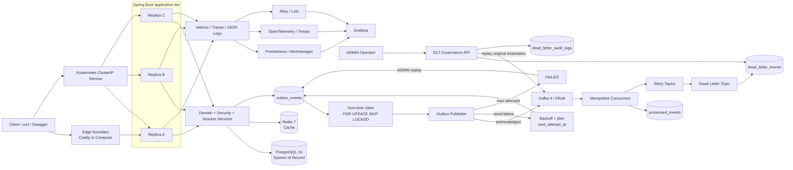
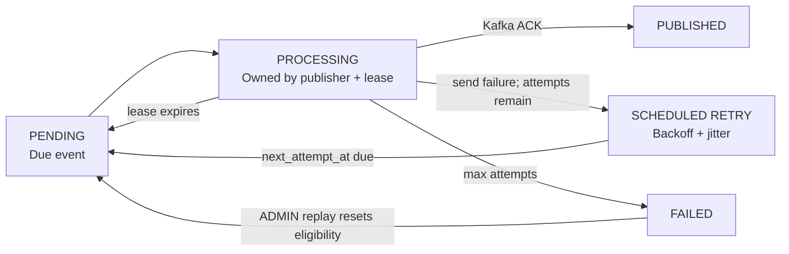
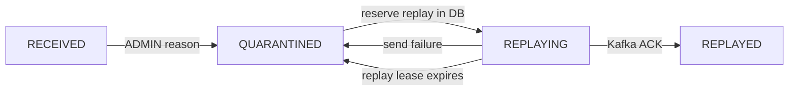

# Spring Boot E-Commerce Backend

[](https://github.com/ravan-chuang/spring-boot-ecommerce-backend/actions/workflows/ci.yml)

A production-minded distributed event-driven e-commerce backend built with **Java 25**, **Spring Boot 4.1.0**, **PostgreSQL 16**, **Redis 7**, and **Apache Kafka 4**. The repository treats transaction correctness, durable event delivery, identity and authorization, failure recovery, operability, and deployment behavior as one system rather than unrelated features.

The project has progressed beyond a single-instance Docker Compose backend. The current verified application tier runs as **three Spring Boot replicas in Kubernetes**, supports **CPU-based horizontal autoscaling from 3 to 8 replicas**, has verified **zero-unavailable rolling updates**, demonstrates **multi-replica Transactional Outbox coordination**, and includes a **four-node local kind topology** (one control-plane plus three workers) for controlled drain and hard-node-failure experiments.

The engineering boundary remains explicit: **PostgreSQL, Redis, Kafka, and the kind control-plane are still single-instance failure domains**, and abrupt worker loss produced transient client-side transport failures before the Kubernetes dataplane converged. The repository therefore demonstrates **application-tier high-availability engineering and recovery behavior in a local multi-node environment**, not production-grade multi-zone HA.

**Current verified release:** `v1.5.0-phase33-multinode-ha`  
**Latest merged milestone:** PR #29 - multi-node Kubernetes failure recovery  
**Previous Kubernetes milestone:** PR #28 - multi-replica deployment and autoscaling  
**Current main commit:** `f48a7158365b120dcd5f915d7a36b919b9f3a649`  
**Verification date:** 2026-08-08

---

## Engineering Highlights

- Secure authentication with short-lived JWT access tokens, opaque refresh-token rotation, revocation, session tracking, and authorization boundaries.
- Payment idempotency protected by PostgreSQL uniqueness, SHA-256 request fingerprints, pessimistic order locking, persisted replay metadata, and concurrency verification.
- Transactional Outbox with `FOR UPDATE SKIP LOCKED`, processing ownership, leases, scheduled exponential retry, bounded jitter, terminal `FAILED`, and administrative replay.
- Kafka at-least-once consumer safety with transactionally persisted deduplication markers, retry topics, persisted dead-letter evidence, quarantine, replay reservation, and operator audit.
- Correlation IDs propagated across HTTP, MDC, PostgreSQL, Outbox, Kafka headers, consumers, DLT evidence, structured logs, and traces.
- Prometheus, Grafana, Tempo, Loki, Alloy, Alertmanager, SLO recording rules, alerts, and runbooks.
- **146 automated tests** currently passing with no failures, errors, or skips.
- Last recorded JaCoCo report: **89.78% instruction coverage** and **73.63% branch coverage**; coverage is treated as a regression signal, not proof of correctness.
- Flyway **V1-V11** validated on PostgreSQL 16.
- Executed Kafka outage, Outbox backlog/recovery, failed-login, PostgreSQL backup/restore, Kubernetes self-healing, rolling-update, autoscaling, controlled-drain, and hard-node-loss drills.
- Kubernetes application baseline: **3/3 Ready**, health probes active, ClusterIP Service, resource requests/limits, graceful termination, and HPA **3 -> 6 -> 8 -> 6 -> 4 -> 3**.
- Multi-replica Outbox drill: **90 synthetic events**, **30/30/30 claims across three application replicas**, **90 Kafka messages**, **0 retries**, **0 observed duplicates**, and **0 missing messages** under the tested conditions.
- Multi-node kind baseline: **1 control-plane + 3 workers**, application replicas spread one-per-worker in repeated steady-state rollouts.
- Planned-disruption behavior: PodDisruptionBudget `minAvailable: 2`, zero-unavailable rolling updates, and controlled node drain without observed non-200 application responses in the probe trace.
- Hard worker failure: surviving replicas remained operational; client trace recorded **34 transport failures and no application-generated HTTP 5xx**; full three-replica capacity returned at approximately **T+94s**.

---

## Verified Capability Matrix

| Capability | Current evidence | Engineering interpretation |
|---|---|---|
| Application replication | 3 Spring Boot replicas behind a Kubernetes ClusterIP Service | Horizontal application execution is verified |
| Rolling updates | `maxUnavailable: 0`, `maxSurge: 1`; repeated rollout success | Planned application releases can preserve serving capacity in the tested environment |
| Autoscaling | CPU HPA target 60%, min 3, max 8; observed 3 -> 6 -> 8 and 8 -> 6 -> 4 -> 3 | CPU-driven horizontal scaling is verified locally |
| Pod self-healing | Application Pod deleted; Deployment restored 3/3 | Controller reconciliation behavior is verified |
| Outbox concurrency | 90 events, three replicas, 30/30/30 claims, no observed duplicates/missing | `SKIP LOCKED` coordination is empirically verified; equal split is not a fairness guarantee |
| Multi-node placement | 3 workers; repeated steady-state rollout reached one app replica per worker | Fault-domain-aware placement works under normal capacity |
| Voluntary disruption | PDB `minAvailable: 2`; controlled drain passed | PDB protects planned eviction, not hard failures |
| Hard worker loss | Node stop via Docker; full capacity restored at ~T+94s | Automatic workload recovery is verified, but zero-downtime hard-failure behavior is not |
| Stateful HA | PostgreSQL, Redis, Kafka each remain single-replica | Primary remaining reliability boundary |
| Production cloud | Not deployed with managed services / multi-zone control plane | Not yet production-proven |

---

## Technology Stack

| Area | Technologies / mechanisms |
|---|---|
| Language / Framework | Java 25, Spring Boot 4.1.0 |
| API / Security | Spring Web, Spring Security, JWT, opaque refresh tokens, Swagger / OpenAPI |
| Persistence | PostgreSQL 16, Spring Data JPA, Hibernate, Flyway |
| Cache / Messaging | Redis 7, Apache Kafka 4, Spring Kafka |
| Reliability | Transactional Outbox, scheduled retry, processing lease, idempotent consumer, persisted DLT governance |
| Observability | Actuator, Micrometer, OpenTelemetry, Prometheus, Grafana, Tempo, Loki, Alloy, Alertmanager |
| Testing | JUnit, MockMvc, Testcontainers, concurrency and recovery drills |
| Containers | Multi-stage Docker image, Docker Compose |
| Orchestration | Kubernetes `apps/v1`, Service, probes, resources, HPA v2, PDB, topology spread, pod anti-affinity |
| Local multi-node platform | kind v0.32.0, Kubernetes v1.36.1, 1 control-plane + 3 workers |
| Delivery | Maven Wrapper, GitHub Actions, CodeQL, Dependabot, release tags |

---

## Current Architecture

The system has two verified deployment modes: a Docker Compose operating stack used for end-to-end observability and recovery drills, and Kubernetes application-tier deployments used for replica, scheduling, autoscaling, and node-failure verification.


```mermaid
%%{init: {"flowchart": {"curve": "basis", "nodeSpacing": 28, "rankSpacing": 36}}}%%
flowchart LR
    Client[Client / curl / Swagger] --> Edge[Edge boundary\nCaddy in Compose]
    Client --> KService[Kubernetes ClusterIP Service]

    subgraph AppTier[Spring Boot application tier]
        A1[Replica A]
        A2[Replica B]
        A3[Replica C]
    end

    Edge --> A1
    KService --> A1
    KService --> A2
    KService --> A3

    A1 --> Domain[Domain + Security + Session Services]
    A2 --> Domain
    A3 --> Domain

    Domain --> PG[(PostgreSQL 16\nSystem of Record)]
    Domain --> Redis[(Redis 7\nCache)]
    Domain --> Outbox[(outbox_events)]

    Outbox --> Claim[Due-time claim\nFOR UPDATE SKIP LOCKED]
    Claim --> Publisher[Outbox Publisher]
    Publisher -->|acknowledged| Kafka[Kafka 4 / KRaft]
    Publisher -->|send failure| Retry[Backoff + jitter\nnext_attempt_at]
    Retry --> Outbox
    Publisher -->|max attempts| Failed[FAILED]
    Failed -->|ADMIN replay| Outbox

    Kafka --> Consumers[Idempotent Consumers]
    Consumers --> Processed[(processed_events)]
    Consumers --> RetryTopics[Retry Topics]
    RetryTopics --> DLT[Dead-Letter Topic]
    DLT --> DLTStore[(dead_letter_events)]
    Operator[ADMIN Operator] --> DLTAPI[DLT Governance API]
    DLTAPI --> DLTStore
    DLTAPI -->|replay original destination| Kafka
    DLTAPI --> Audit[(dead_letter_audit_logs)]

    A1 --> Telemetry[Metrics / Traces / JSON Logs]
    A2 --> Telemetry
    A3 --> Telemetry
    Telemetry --> Prom[Prometheus / Alertmanager]
    Telemetry --> Tempo[OpenTelemetry / Tempo]
    Telemetry --> Loki[Alloy / Loki]
    Prom --> Grafana[Grafana]
    Tempo --> Grafana
    Loki --> Grafana
```

### Deployment boundary

The application tier is now multi-replica and multi-node verified. The **stateful tier is not**:

```text
Application tier:  3 replicas, HPA 3-8, multi-node worker recovery verified
PostgreSQL:        1 replica + local RWO PVC
Redis:             1 replica
Kafka:             1 KRaft broker/controller
Kubernetes API:    1 kind control-plane
```

This distinction is central to the project documentation. The repository demonstrates production-minded application availability engineering, but it does not claim end-to-end service availability through loss of PostgreSQL, Redis, Kafka, the control plane, an availability zone, or a cloud region.

---

## Domain Transactions and Invariants

### Product, cart, and order correctness

- Product detail reads use Redis; product mutations evict cache entries.
- Product stock uses JPA optimistic locking through `@Version`.
- A cart is not inventory reservation; checkout revalidates and deducts stock inside the order transaction.
- Order items persist purchase-time name, unit-price, and subtotal snapshots.
- Order creation, stock deduction, cart deletion, and `ORDER_CREATED` Outbox insertion commit atomically.
- Cancellation is accepted only from `PENDING`, restores stock, and obtains the same pessimistic order lock used by payment.

### Payment idempotency

```text
Idempotency-Key + request path lookup
        -> request fingerprint validation
        -> SELECT order FOR UPDATE
        -> second idempotency lookup under lock
        -> validate PENDING and absence of payment
        -> persist payment + replay metadata + response snapshot
        -> order -> PAID
        -> persist PAYMENT_PAID Outbox event
        -> one PostgreSQL commit
```

PostgreSQL enforces one payment per order and one replay record per `(idempotency_key, request_path)`. Reusing the same key with a different SHA-256 request fingerprint is rejected. Concurrent duplicate payment requests have been verified to resolve to one logical payment.

---

## Transactional Outbox and Multi-Replica Coordination

The Outbox contains the database/Kafka dual-write boundary inside PostgreSQL: business state and event intent commit together; Kafka publication happens asynchronously after commit.


```mermaid
%%{init: {"flowchart": {"curve": "basis"}}}%%
flowchart LR
    P[PENDING\nDue event] --> C[PROCESSING\nOwned by publisher + lease]
    C -->|Kafka ACK| S[PUBLISHED]
    C -->|send failure; attempts remain| R[SCHEDULED RETRY\nBackoff + jitter]
    R -->|next_attempt_at due| P
    C -->|lease expires| P
    C -->|max attempts| F[FAILED]
    F -->|ADMIN replay resets eligibility| P
```

### Claim query

```sql
SELECT ...
FROM outbox_events
WHERE status = 'PENDING'
  AND (next_attempt_at IS NULL OR next_attempt_at <= :now)
ORDER BY next_attempt_at, created_at
FOR UPDATE SKIP LOCKED
LIMIT :limit;
```

`SKIP LOCKED` is the critical multi-worker primitive: one transaction locks a row while competing publishers skip it and claim other due rows. The Phase 3 Kubernetes drill inserted 90 synthetic events and observed all three application replicas participate, each claiming 30 events, while Kafka received exactly 90 distinct test messages.

**Interpretation:** the test verifies non-overlapping multi-replica work under the tested workload. It does **not** convert Kafka delivery into a globally exactly-once protocol, and the observed 30/30/30 split should not be treated as a scheduler fairness contract.

---

## Kafka Consumer Safety and Governed Dead-Letter Recovery

Kafka remains at-least-once. The design therefore treats duplicate delivery as normal rather than exceptional.

```text
Kafka event
-> insert (event_id, consumer_name) into processed_events
-> execute side effect in the same database transaction
-> commit marker + side effect together

Duplicate delivery
-> unique conflict on processed_events
-> skip duplicate side effect

Side-effect failure
-> transaction rollback
-> marker also rolls back
-> retry remains safe
```

Dead-letter records are persisted with original broker coordinates, payload, bounded headers, Outbox and correlation identifiers, exception evidence, lifecycle state, actor information, and replay attempt history.


```mermaid
%%{init: {"flowchart": {"curve": "basis"}}}%%
flowchart LR
    R[RECEIVED] -->|ADMIN reason| Q[QUARANTINED]
    Q -->|reserve replay in DB| P[REPLAYING]
    P -->|Kafka ACK| D[REPLAYED]
    P -->|send failure| Q
    P -->|replay lease expires| Q
```

PDBs, Kubernetes recovery, or replica count do not change the consumer delivery contract. Duplicate defense and replay governance remain application-level responsibilities.

---

## Authentication, Authorization, and Session Lifecycle

### Token design

```text
Access token
-> HMAC JWT
-> short lifetime (15 minutes by default)

Refresh token
-> cryptographically random opaque secret
-> only SHA-256 hash persisted
-> rotated on refresh
-> predecessor revoked
-> stable session identifier maintained across rotation
```

### Authorization boundary

| Route family | Policy |
|---|---|
| Product reads | Public |
| Product writes | ADMIN |
| User collection create/list | ADMIN |
| User item routes | Owner or ADMIN where applicable |
| Cart | Path owner or ADMIN |
| Orders / payments | Resource owner or ADMIN |
| Outbox administration | ADMIN |
| DLT administration | ADMIN |
| Health / info | Public |
| Detailed Actuator metrics | ADMIN |
| Unmatched routes | Denied by default |

The Phase 3.3 local/HA-only `/internal/instance` diagnostic endpoint exposes the serving Pod hostname for load-distribution and failure tracing. The controller is profile-gated to `local` and `ha`; it is evidence tooling, not a production business API.

---

## Schema Evolution

Flyway owns PostgreSQL schema evolution while Hibernate runs with `ddl-auto=validate` and `open-in-view=false`.

```text
V1  Initial commerce schema
V2  Transactional Outbox
V3  Outbox processing lease
V4  Processed-event deduplication
V5  Order event audit
V6  Refresh tokens
V7  Refresh-token sessions
V8  Authentication audit logs
V9  Payment idempotency hardening
V10 Persisted DLT operations and correlation IDs
V11 Outbox retry scheduling and due-time index
```

The backup/restore drill restored a custom-format PostgreSQL backup into a disposable verification database and revalidated the migration history, data, V11 retry index, and DLT/idempotency constraints.

---

## Kubernetes Phase 3: Multi-Replica Baseline

The base Kubernetes manifests add application orchestration without overstating stateful availability.

### Application Deployment

```yaml
replicas: 3
strategy:
  type: RollingUpdate
  rollingUpdate:
    maxUnavailable: 0
    maxSurge: 1
```

The application defines startup, readiness, and liveness probes, a 40-second termination grace period, a `preStop` delay, resource requests and limits, ConfigMap-based non-secret configuration, and a gitignored local Secret with tracked `.example.yaml` templates.

### Verified baseline

- PostgreSQL Pod healthy; PVC `Bound`.
- Redis healthy.
- Kafka KRaft broker healthy.
- Spring Boot Deployment `3/3 Ready`.
- ClusterIP Service exposed all three application endpoints.
- `/actuator/health/liveness` and `/actuator/health/readiness` returned `UP`.
- Flyway V1-V11 applied successfully from the Kubernetes deployment.
- Deleting one application Pod triggered automatic replacement.
- Rolling update completed with Service-level HTTP continuity in the test probe.

### CPU HorizontalPodAutoscaler

```yaml
minReplicas: 3
maxReplicas: 8
averageUtilization: 60
```

Observed scale-out:

```text
3 -> 6 -> 8
```

Observed scale-down after load removal:

```text
8 -> 6 -> 4 -> 3
```

Peak observed utilization reached 172% of the CPU request and HPA correctly reported `ScalingLimited=True` at the configured maximum. After load removal, CPU returned to approximately 12-17% and the Deployment stabilized at three replicas.

**Boundary:** metrics-server was installed in the local cluster for the verification exercise; it is not currently vendored or lifecycle-managed by this repository.

---

## Kubernetes Phase 3.3: Multi-Node Availability Engineering

### kind topology

```text
1 control-plane
3 worker nodes
3 Spring Boot replicas
```

The HA application profile adds:

- topology spread across `kubernetes.io/hostname` with `maxSkew: 1`;
- preferred Pod anti-affinity to discourage co-location;
- `ScheduleAnyway` as the spread fallback;
- `node.kubernetes.io/not-ready:NoExecute` for 30 seconds;
- `node.kubernetes.io/unreachable:NoExecute` for 30 seconds;
- PodDisruptionBudget `minAvailable: 2`;
- `maxUnavailable: 0`, `maxSurge: 1` rolling updates.

### Why the scheduling policy is soft

A strict `DoNotSchedule` topology rule was intentionally rejected after it blocked the third application Pod when the available worker topology could not satisfy the skew constraint. The final policy uses **soft spread + preferred anti-affinity**:

```text
normal capacity
-> scheduler strongly prefers one replica per worker

degraded capacity
-> scheduler may co-locate replicas on surviving workers
-> availability is preferred over perfect distribution
```

Repeated steady-state rollouts after the final tuning produced one application replica on each of the three workers. This is the desired baseline, while `ScheduleAnyway` preserves a recovery path when a worker is unavailable.

### PDB semantics

`minAvailable: 2` protects **voluntary eviction**. During a controlled drain, Kubernetes delayed eviction when necessary until a replacement maintained the budget, and the HTTP probe did not record a non-200 response.

A PDB does **not** prevent loss caused by an abrupt node/container failure. Hard-node recovery is governed by node health detection, NoExecute tolerations, ReplicaSet reconciliation, scheduling, application startup, EndpointSlice updates, and the Service dataplane.

---

## Hard Worker Failure Verification

The final Phase 3.3 drill hard-stopped `spring-boot-ha-worker` while the HTTP probe remained on another worker. The baseline had one application replica on each worker.

### Observed client trace

| Evidence | Result |
|---|---:|
| Total completed trace attempts | 458 |
| HTTP 200 | 424 |
| Transport failures (`HTTP 000`) | 34 |
| Application-generated HTTP 5xx | 0 |
| First observed transport failure | T+0s |
| Last observed transport failure | approximately T+40s |
| First success after last observed failure | approximately T+41s |
| Node Ready -> Unknown | approximately T+48s |
| Replacement Pod created | approximately T+78s |
| Replacement Pod Ready | approximately T+94s |
| EndpointSlice last-change | approximately T+94s |
| Final Deployment | 3/3 Ready |

The 34 transport failures were connection refusals or connection timeouts. Successful responses were also observed during the incident; therefore **40 seconds is an intermittent client-visible failure window, not 40 seconds of continuous outage**.

The request-count ratio is also **not** a valid availability SLI because failed connections waited roughly one second while successful requests completed in a few milliseconds. Time-weighted production availability must be measured with a proper synthetic monitor or ingress-level telemetry.

### Engineering conclusion

The experiment verifies that:

- surviving Spring Boot replicas continue serving after a worker disappears;
- Kubernetes eventually evicts/replaces the failed replica without manual workload repair;
- a replacement Pod starts in approximately 16 seconds after creation;
- the Deployment returns to full three-replica capacity in approximately 94 seconds;
- the local Service dataplane can still expose transient transport failures before convergence;
- zero-downtime behavior under abrupt worker loss is **not** demonstrated.

This is a stronger result than claiming "HA" from `replicas: 3` alone because the failure mode, observed client behavior, controller timeline, and limits are documented separately.

---

## Observability, SLOs, and Operational Response

Correlation path:

```text
HTTP X-Correlation-ID
-> MDC
-> Outbox row
-> Kafka headers
-> consumer
-> DLT evidence
-> structured logs / traces
```

| Signal | Implementation | Operational use |
|---|---|---|
| HTTP latency / errors | Actuator + Micrometer histograms | latency and error-budget diagnosis |
| Outbox | PENDING / PROCESSING / FAILED gauges, success/failure counters | backlog, retry, terminal failure |
| DLT | state gauges + action counters | review, quarantine, replay, lease recovery |
| Auth | `auth.events` action/outcome metrics | failed-login and suspicious activity analysis |
| Traces | OpenTelemetry Collector -> Tempo | request path and distributed timing |
| Logs | JSON -> Docker -> Alloy -> Loki | structured incident search |
| Alerts | Prometheus rules -> Alertmanager | runbook-linked warning and critical response |

Current service objectives include 99.5% HTTP availability over 30 days and P95 latency <= 750 ms over five minutes, plus DLT review and replay-lease objectives. These are engineering objectives and alert definitions; they are not claims of a historical production SLO attainment record.

---

## Testing and Quality Evidence

The current suite contains **146 automated tests**, all passing in the final Phase 3.3 verification run.

Representative coverage:

- authentication, token rotation, logout, sessions, and audit;
- ownership, USER/ADMIN, anonymous, and denied-route authorization;
- catalog, cart, order, stock, cancellation, payment, and idempotency;
- Outbox creation, due-time claim, `SKIP LOCKED`, publication, lease recovery, retry scheduling, terminal failure, and replay;
- Kafka retry-to-DLT and consumer deduplication;
- DLT capture, deduplication, quarantine, replay, audit, metrics, and lease recovery;
- correlation validation and MDC cleanup;
- Flyway startup, retention, and Testcontainers infrastructure.

Last recorded JaCoCo baseline before the Phase 3 Kubernetes changes:

```text
Instruction coverage: 89.78%
Branch coverage:      73.63%
Regression baseline:  81.48% instruction / 68.29% branch
Maximum permitted drop: 0.50 percentage points
```

Exact coverage should be regenerated for a release-quality Phase 3.3 report because the diagnostic controller and Kubernetes-related application wiring changed after the last published percentage snapshot.

---

## Performance and Concurrency Evidence

### Catalog read baseline

| Metric | Result |
|---|---:|
| Requests | 9,544 |
| Average throughput | 79.44 req/s |
| Average latency | 9.92 ms |
| P90 / P95 / P99 | 17.07 / 17.93 / 20.12 ms |
| Failed requests | 0.00% |

### High-rate local soak

| Metric | Result |
|---|---:|
| Target | 5 minutes at 2,500 req/s |
| Requests | 750,000 |
| Achieved throughput | 2,499.91 req/s |
| P95 / P99 | 0.84 / 1.11 ms |
| Client-side failure rate | 0.07% |
| Observed application-side 5xx | None |

### Payment idempotency concurrency

| Metric | Result |
|---|---:|
| Concurrent requests | 30 |
| HTTP success | 100% |
| Payment rows | 1 |
| Idempotency rows | 1 |
| Duplicate payments | 0 |

All performance figures are local profiles, not capacity guarantees. The next benchmark phase should move beyond read-heavy local traffic to write-heavy transaction paths, Outbox throughput, recovery throughput, retry storms, broker failover, and longer-duration multi-node tests.

---

## Docker Compose Operations

The Compose stack remains useful for full telemetry and local operational exercises.

Typical development startup:

```bash
docker compose up -d postgres redis kafka
./mvnw spring-boot:run
```

Production-style local stack:

```bash
docker compose \
  -f docker-compose.yml \
  -f docker-compose.prod.yml \
  up -d --build
```

The production overlay keeps Caddy as the public edge while application, database, cache, broker, and telemetry ports remain internal to the Compose network.

### Local observability endpoints

Use the ports defined by the repository Compose files. Typical services include:

```text
Spring Boot Actuator
Prometheus
Alertmanager
Grafana
Tempo
Loki
```

Operational runbooks live under `observability/runbooks/`.

---

## Kubernetes Operations

### Base single-node verification profile

Tracked manifests:

```text
k8s/base/namespace.yaml
k8s/base/postgres.yaml
k8s/base/redis.yaml
k8s/base/kafka.yaml
k8s/base/app-configmap.yaml
k8s/base/app.yaml
k8s/base/app-hpa.yaml
k8s/base/*-secret.example.yaml
```

Local secret manifests are intentionally ignored by Git:

```text
k8s/base/app-secret.yaml
k8s/base/postgres-secret.yaml
```

### Multi-node kind profile

```text
k8s/ha/kind-cluster.yaml
k8s/ha/app-ha.yaml
k8s/ha/app-pdb.yaml
```

Create the cluster:

```bash
kind create cluster \
  --name spring-boot-ha \
  --config k8s/ha/kind-cluster.yaml
```

Build and load the image that matches the `image:` value in `k8s/ha/app-ha.yaml`:

```bash
docker build -t <image-from-app-ha.yaml> .
kind load docker-image <image-from-app-ha.yaml> --name spring-boot-ha
```

Then apply namespace, local secrets, stateful services, configuration, application, and PDB.

```bash
kubectl apply -f k8s/base/namespace.yaml
kubectl apply -f k8s/base/postgres-secret.yaml
kubectl apply -f k8s/base/postgres.yaml
kubectl apply -f k8s/base/redis.yaml
kubectl apply -f k8s/base/kafka.yaml
kubectl apply -f k8s/base/app-configmap.yaml
kubectl apply -f k8s/base/app-secret.yaml
kubectl apply -f k8s/ha/app-ha.yaml
kubectl apply -f k8s/ha/app-pdb.yaml
```

Verify placement:

```bash
kubectl get pods -n spring-boot-lab -l app=spring-boot-lab -o wide
kubectl get pdb -n spring-boot-lab
```

### Current image-distribution boundary

The HA verification used a locally built image loaded directly into kind. A production pipeline should replace this with an immutable registry digest, provenance/SBOM, vulnerability scanning, and deployment promotion by digest rather than an ad-hoc local tag.

---

## Repository Verification Evidence

Committed evidence includes:

```text
verification/phase3/kubernetes_hpa_verification.md
verification/phase3/kubernetes_outbox_concurrency.md
verification/phase3/kubernetes_hard_node_failure.md
verification/phase3/kubernetes_single_replica_hard_failure.md
verification/phase3/kubernetes_multinode_hard_failure.md
```

Release milestones:

```text
v1.3.0-phase21-reliability
v1.4.0-phase3-kubernetes
v1.5.0-phase33-multinode-ha
```

The documentation deliberately separates configuration from executed proof. A manifest describing a PDB or HPA is not treated as evidence until the corresponding behavior is observed and recorded.

---

## Production Boundaries and Risk Register

| Priority | Boundary | Required next step |
|---|---|---|
| P0 | File/environment secrets are suitable only for local verification | External secret manager, workload identity, rotation, and secret scanning |
| P0 | PostgreSQL is single-replica with local RWO storage | Managed HA PostgreSQL or operator-based replication, backups, failover, timed restore |
| P0 | Kafka is a single KRaft broker/controller | Multi-broker KRaft, replication factor >= 3 where appropriate, ISR/failure drills |
| P1 | Redis is single-replica | Managed Redis or Sentinel/Cluster according to workload semantics |
| P1 | kind has one control-plane | Managed/multi-control-plane Kubernetes before production availability claims |
| P1 | No verified cloud deployment | IaC, IAM, managed networking, TLS, ingress/load balancer, external synthetic checks, rollback |
| P1 | Local kind image loading | Registry digest promotion, SBOM, signature/provenance, image scanning |
| P1 | Hard node loss still causes transient transport failures | Production CNI/LB evaluation, time-weighted synthetic monitoring, failure-domain tests |
| P1 | Payment provider is simulated | Real sandbox adapter, signed webhooks, reconciliation, provider idempotency |
| P1 | No production RPO/RTO | Off-host backup policy, restore cadence, measured RPO/RTO, disaster-recovery exercises |
| P2 | No rate limiting / lockout / MFA | Gateway/app controls and abuse-focused security tests |
| P2 | Partial retention lifecycle | Approved retention and erasure automation |
| P2 | Telemetry cost/retention untuned | Representative sampling and storage budgets |
| P2 | Cancel-vs-pay stress evidence not archived | High-iteration PostgreSQL contention drill and invariant verification |

---

## Senior Engineering Assessment

The repository is strongest where a mechanism is connected to durable state, automated tests, runtime metrics, and an executed failure drill. Examples include:

- Outbox ownership and retry scheduling are backed by PostgreSQL state, tests, metrics, broker-outage evidence, and a real multi-replica concurrency drill.
- DLT handling is a governed state machine with durable evidence and operator audit rather than a broker-only escape hatch.
- Payment idempotency is protected at both application and database layers.
- Consumer duplicate defense uses transactional persistence instead of process-local memory.
- Kubernetes work progressed from replica count to actual scheduling, voluntary disruption, autoscaling, hard node loss, client trace analysis, and explicit non-zero-downtime findings.
- Recovery documentation distinguishes node detection, Pod recreation, Pod readiness, EndpointSlice convergence, client-visible errors, and full replica restoration rather than collapsing them into one misleading MTTR value.

**Current positioning:** advanced student-level / strong junior backend and platform engineering evidence, with several reliability and failure-analysis practices approaching early mid-level reasoning. The remaining gap to production mid-level ownership is not more CRUD functionality; it is operating replicated stateful infrastructure, cloud/IaC delivery, production traffic, incident response, cost/security controls, and repeated external failure evidence.

---

## Prioritized Roadmap

### Completed - Phase 1 / Phase 2 / Phase 2.1

- Security and authorization hardening.
- Payment idempotency and concurrency controls.
- Transactional Outbox, leases, scheduled retry, and replay.
- Idempotent consumers and governed DLT operations.
- Correlation, tracing, structured logs, SLOs, alerts, and runbooks.
- Kafka outage, backlog/recovery, failed-login, and PostgreSQL restore drills.

### Completed - Phase 3 Kubernetes baseline

- Kubernetes manifests for PostgreSQL, Redis, Kafka, and application.
- Three application replicas and ClusterIP Service.
- Startup/readiness/liveness probes.
- Zero-unavailable rolling updates.
- CPU HPA 3-8 with observed scale-out and scale-down.
- Pod self-healing.
- Multi-replica Outbox concurrency drill.

### Completed - Phase 3.3 multi-node application recovery

- kind 1+3 node topology.
- topology spread + preferred anti-affinity.
- PDB `minAvailable: 2`.
- 30-second NoExecute tolerations.
- controlled drain.
- repeated placement rollouts.
- hard worker failure with request-level instance tracing.
- explicit client transport-failure and full-capacity recovery timeline.

### Next - Phase 4 stateful high availability

1. PostgreSQL HA and failover first, because it is the primary source of truth and current largest end-to-end availability gap.
2. Kafka multi-broker KRaft with replication, ISR verification, broker failure, producer retry, and Outbox recovery evidence.
3. Redis failover appropriate to cache semantics.
4. Re-run application hard-node tests while stateful services also survive a worker loss.

### Next - Phase 5 production delivery

1. Cloud IaC and managed Kubernetes or a production-like cluster.
2. Ingress/load balancer, TLS, DNS, NetworkPolicy, workload identity, and external secrets.
3. Registry digest promotion, SBOM, signatures/provenance, image scanning, and rollback.
4. External time-weighted synthetic checks and production-grade telemetry retention.
5. RPO/RTO, backup cadence, disaster recovery, error-budget review, and postmortem practice.

---

## License

This repository is an engineering portfolio project. Add or update the repository license according to the intended distribution policy.
