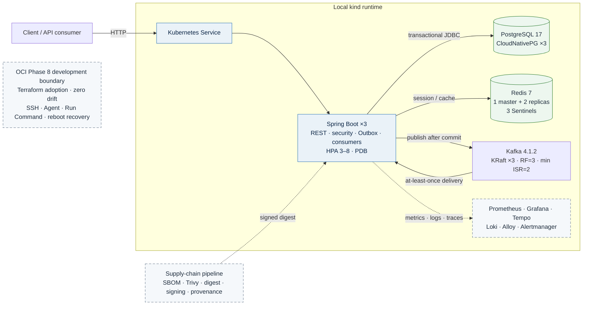
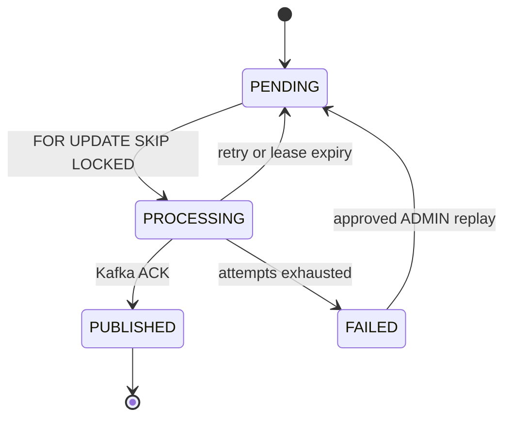
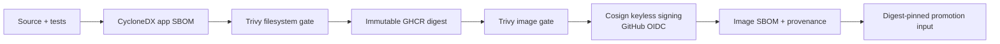

# Spring Boot E-Commerce Backend

[](https://github.com/ravan-chuang/spring-boot-ecommerce-backend/actions/workflows/ci.yml)

An evidence-led, event-driven commerce backend built with **Java 25** and **Spring Boot 4.1.0**. The project focuses on transactional correctness, idempotent commands, durable event delivery, application and stateful-service recovery, observability, software-supply-chain provenance, and brownfield Infrastructure as Code on Oracle Cloud Infrastructure.

This repository is deliberately described by evidence rather than by configuration alone. A mechanism may be implemented without being production-proven; a successful failure drill applies only to the tested failure domain; and zero-loss observations apply only to the captured acknowledgement set that was reconciled against durable state.

> **Verified repository baseline — 2026-08-10**
>
> - Phase 8 documentation baseline: **`phase8-docs-final` → `929bee0`**
> - Phase 8 OCI milestone: **`phase8-oci-iac` → `ed626cb`**
> - Phase 8 final documentation: **`phase8-docs-final` → `929bee0`**
> - Independent clean-clone run: **146 tests passed, 0 failed, 0 errors, 0 skipped**
> - Current JaCoCo: **89.54% instruction / 73.63% branch**, 111 analyzed classes
> - Latest-main documentation records: **CI PASS · CodeQL PASS · Supply Chain Security PASS**

The inspected source, configuration, infrastructure, and verification paths match `main`. README, engineering-summary, and portfolio files were active documentation edits in the inspected working tree and are not represented as a completely clean repository state.

## What is verified

- Three Spring Boot replicas with HPA, PDB, probes, topology spread, and worker-recovery controls.
- Transactional commerce invariants, payment idempotency, Transactional Outbox, idempotent Kafka consumers, and persisted DLT governance.
- CloudNativePG PostgreSQL 17 failover, acknowledgement reconciliation, physical backup, and independent restore.
- Three-node Kafka 4.1.2 KRaft behavior under one broker/node loss.
- Redis 7 replication and Sentinel promotion under active-master loss.
- Prometheus/Grafana metrics, OpenTelemetry/Tempo traces, Alloy/Loki logs, Alertmanager rules, and operational playbooks.
- CycloneDX SBOMs, Trivy gates, immutable GHCR digests, Cosign OIDC signing, image SBOM, and provenance.
- OCI brownfield Terraform adoption with a final `No changes` plan, plus SSH, Cloud Agent, Run Command, IAM, and controlled-reboot recovery.

## What is not claimed

- A production multi-zone application or data platform.
- Zero-downtime continuity during abrupt worker loss.
- Universal zero-RPO behavior across PostgreSQL, Kafka, or Redis.
- Historical production SLO or error-budget attainment.
- Managed secrets/workload identity, admission-time signature enforcement, or production payment-provider ownership.
- Proof that the full local Kubernetes and stateful stack is deployed on the OCI Phase 8 VM.

---

## Current engineering baseline

| Domain | As-built or observed state | Evidence boundary |
|---|---|---|
| Repository baseline | Phase 8 docs `929bee0`; OCI milestone `ed626cb` | `phase8-docs-final` and `phase8-oci-iac` preserve the two verified milestones |
| Build and tests | 146 passed / 0 failed / 0 errors / 0 skipped | Independent clean-clone `./mvnw clean verify` |
| Coverage | 89.54% instruction / 73.63% branch; 111 classes | Current rerun, distinct from historical coverage and the CI floor |
| Application | 3 replicas; HPA 3–8; PDB; probes; topology spread | Local kind; one control-plane |
| PostgreSQL | 16 in Compose/Testcontainers; 17 in CloudNativePG ×3 | HA/restore evidence applies to CloudNativePG PostgreSQL 17 |
| Kafka | 4.1.0 in Testcontainers; 4.1.2 in Compose/Kubernetes; KRaft ×3 drill | Version scopes are not interchangeable |
| Redis | Redis 7; 3 data nodes + 3 Sentinels in HA drill | Asynchronous replication |
| Schema | Flyway V1–V11; `ddl-auto=validate`; Open Session in View disabled | Repository-backed migrations |
| Supply chain | CycloneDX, Trivy, GHCR digest, Cosign OIDC, image SBOM, provenance | No cluster admission enforcement |
| OCI / Terraform | VCN, subnet, IGW, route, security objects, NSGs, rules, and VM adopted | Single development VM, not the full runtime stack |

### Coverage precision

| Coverage fact | Instruction | Branch | Meaning |
|---|---:|---:|---|
| Current clean verification | **89.54%** | **73.63%** | Release-current rerun used here |
| Historical Phase 2.1 snapshot | 89.78% | 73.63% | Earlier evidence; not labeled current |
| CI regression floor | 81.4756% | 68.2927% | Baseline gate with maximum drop `0.005` |

---

## As-built architecture


```mermaid
flowchart LR
    Client["Client / API consumer"] -->|HTTP| Service["Kubernetes Service"]

    subgraph Runtime["Local kind runtime"]
        Service --> App["Spring Boot ×3<br/>REST · security · Outbox · consumers<br/>HPA 3–8 · PDB"]
        App -->|transactional JDBC| PG[("PostgreSQL 17<br/>CloudNativePG ×3")]
        App -->|session / cache| Redis[("Redis 7<br/>1 master + 2 replicas<br/>3 Sentinels")]
        App -->|publish after commit| Kafka["Kafka 4.1.2<br/>KRaft ×3 · RF=3 · min ISR=2"]
        Kafka -->|at-least-once delivery| App
        App -.->|metrics · logs · traces| Obs["Prometheus · Grafana · Tempo<br/>Loki · Alloy · Alertmanager"]
    end

    Supply["Supply-chain pipeline<br/>SBOM · Trivy · digest · signing · provenance"] -.->|signed digest| App
    OCI["OCI Phase 8 development boundary<br/>Terraform adoption · zero drift<br/>SSH · Agent · Run Command · reboot recovery"]

    classDef runtime fill:#eaf2f8,stroke:#2e74b5,color:#0b2545;
    classDef data fill:#edf7ef,stroke:#2e7d32,color:#1f2d3d;
    classDef control fill:#f5f8fb,stroke:#6b7c8f,color:#1f2d3d,stroke-dasharray:6 4;
    class App,Service runtime;
    class PG,Redis data;
    class Supply,OCI,Obs control;
```

The architectural correctness boundary is the PostgreSQL commit. Business state and outbound event intent become durable together; Kafka publication occurs after commit. Redis improves cache/session behavior but is not the source of record. Kafka remains at-least-once, so consumer-side idempotency is an explicit requirement.

The supply-chain and OCI paths are separate control boundaries. No deployment edge is claimed from OCI to the full local Kubernetes/stateful runtime.

---

## Transaction correctness

### Commerce invariants

- Product stock uses optimistic locking through JPA `@Version`.
- Cart contents are not inventory reservations; checkout revalidates stock inside the order transaction.
- Order-item snapshots preserve purchase-time name, price, and subtotal.
- Order creation, stock deduction, cart deletion, and `ORDER_CREATED` Outbox insertion commit atomically.
- Payment and cancellation serialize terminal order transitions through the same pessimistic order lock.

### Payment idempotency

```text
Idempotency-Key + request path
→ normalized key + SHA-256 request fingerprint
→ SELECT order FOR UPDATE
→ replay lookup under lock
→ validate PENDING and no existing payment
→ persist payment + replay metadata + response snapshot
→ order = PAID + PAYMENT_PAID Outbox event
→ one PostgreSQL commit
```

Database constraints enforce one payment per order and one replay identity per `(idempotency_key, request_path)`. Reusing a key with a different request fingerprint is rejected.

### Transactional Outbox


```mermaid
stateDiagram-v2
    [*] --> PENDING
    PENDING --> PROCESSING: FOR UPDATE SKIP LOCKED
    PROCESSING --> PUBLISHED: Kafka ACK
    PROCESSING --> PENDING: retry or lease expiry
    PROCESSING --> FAILED: attempts exhausted
    FAILED --> PENDING: approved ADMIN replay
    PUBLISHED --> [*]
```

An executed three-replica drill produced **90 events**, distributed claims **30/30/30**, **90 PUBLISHED database rows**, and **90 valid unique Kafka sequences**, with **0 duplicate, missing, or unexpected values**. This is workload-scoped evidence, not a global exactly-once claim.

Consumers persist `(event_id, consumer_name)` with the business side effect in the same transaction. Persisted DLT governance covers quarantine, replay reservation, audit history, original destination, and lease recovery.

---

## Kubernetes and stateful reliability evidence

| Subsystem | Injected fault or workload | Observed result | Honest boundary |
|---|---|---|---|
| Application | Abrupt worker stop; 458 client traces | 424 HTTP 200; 34 transport failures; 0 app 5xx; 3/3 Ready around T+94s | Self-healing passed; zero-downtime did not |
| PostgreSQL | CloudNativePG primary hard loss | Client-visible write RTO 51.543s; 72 captured ACK commits; 0 missing | RPO=0 only for the captured ACK set |
| PostgreSQL restore | Independent physical restore | 3,864 probe rows; restore cluster healthy in about 49s | Local restore domain; no multi-zone DR proof |
| Kafka | One KRaft broker/node loss | 3,733 captured ACK values; 0 missing; 6,337 consumed; all 6 partitions returned to ISR=3 | One-node experiment; not universal zero-loss |
| Redis | Active-master hard loss | New master around T+18s; checked data readable; post-promotion writes succeeded | Async replication; no general zero-RPO claim |

Node detection, replacement creation, Pod readiness, EndpointSlice convergence, client-visible recovery, and durable-state reconciliation are different measurements. The project does not collapse them into one misleading MTTR number.

### Kubernetes controls

- 3 baseline replicas.
- HPA min 3 / max 8; average CPU target 60%.
- PDB `minAvailable: 2`.
- Rolling update `maxUnavailable: 0`, `maxSurge: 1`.
- Startup, readiness, and liveness probes.
- Topology spread `maxSkew: 1` and preferred anti-affinity.
- 30-second NotReady/Unreachable `NoExecute` tolerations used by the local failure experiment.

---

## Software supply chain


```mermaid
flowchart LR
    Source["Source + tests"] --> AppSBOM["CycloneDX app SBOM"]
    AppSBOM --> FSGate["Trivy filesystem gate"]
    FSGate --> Image["Immutable GHCR digest"]
    Image --> ImageGate["Trivy image gate"]
    ImageGate --> Sign["Cosign keyless signing<br/>GitHub OIDC"]
    Sign --> Evidence["Image SBOM + provenance"]
    Evidence --> Promote["Digest-pinned promotion input"]
```

Trivy filesystem and image gates fail on HIGH/CRITICAL findings. The repository also creates application and image SBOMs, publishes immutable image identity, signs with GitHub OIDC, and records provenance.

**Open enforcement point:** signed artifacts can be produced, but unsigned or unverified digests are not yet rejected at Kubernetes admission time.

---

## OCI brownfield Infrastructure as Code

Phase 8 adopted the already-running development environment instead of replacing it. Terraform represents the VCN, public subnet, internet gateway, route table, default security list, two NSGs, NSG rules, and the compute instance. Adopted resources use `prevent_destroy` safeguards.

Verified operational paths include:

- `VM.Standard.E2.1.Micro` Oracle Linux development VM in Tokyo.
- SSH public-key authentication as `opc`.
- Oracle Cloud Agent and Run Command plugin health.
- Dynamic Group/IAM authorization for Run Command.
- Final Run Command `ACKED / SUCCEEDED / exit 0`.
- Controlled restart followed by SSH, agent, CPU, memory, disk, and guest-health checks.
- `terraform fmt -check`, `terraform validate`, and final plan **`No changes`**.

Terraform state and credentials are ignored from Git, but state is still local. Remote encrypted state, locking, backup, and plan review are required before team or production use.

### Network hardening finding

Current Terraform rules allow `0.0.0.0/0` ingress to TCP **22, 80, 443, and 8080**. This is a development-only exposure. Production evolution should close direct 8080 access, restrict SSH, and route public traffic through controlled TLS/load-balancer/WAF paths.

---

## Performance and evidence quality

| Profile | Recorded result | Evidence quality | Claim boundary |
|---|---|---|---|
| Current Maven verification | 146/0/0/0; 49.896s; 111 classes | Direct clean-clone rerun | Automated verification, not runtime capacity |
| Catalog read baseline | 9,544 requests; 79.44 req/s; avg 9.92ms; P95 17.93ms; P99 20.12ms; 0% failed | Saved `reports/performance-baseline.md` | Local Docker Compose; 300ms think time |
| High-rate catalog soak | 5m @ 2,500 req/s; 750,000 requests; P95 0.84ms; P99 1.11ms; 0.07% client failures; no observed app 5xx | Documented result; raw k6 summary not retained | Not production capacity or an SLA |
| Payment idempotency drill | 30 concurrent requests; 100% HTTP success; 1 payment row; 1 idempotency row; 0 duplicates | Documented k6 result; automated suite separately tests 8-way concurrency | Local deduplication evidence |

The workload scripts remain useful for reproduction, but a script definition is not the same as a preserved result artifact.

---

## Local verification

Run the current automated verification from a clean clone with a working Docker environment:

```bash
./mvnw clean verify
```

The test suite uses Testcontainers and therefore requires access to a compatible container runtime. Review generated JaCoCo output under `target/site/jacoco/` after the run.

Important evidence locations include:

- `verification/phase21_reliability_verification.md`
- `verification/phase3/`
- `verification/phase4/`
- `verification/phase5/message_reconciliation.txt`
- `verification/phase6/redis_ha_failover_verification.md`
- `verification/phase7/software_supply_chain_security.md`
- `verification/phase8/`
- `reports/performance-baseline.md`
- `infra/terraform/oci/`

---

## Prioritized next engineering sequence

| Priority | Boundary | Required next evidence |
|---|---|---|
| P0 | External secrets + workload identity | Remove environment/local-secret dependence; verify rotation and policy |
| P0 | OCI public exposure | Close direct 8080; restrict SSH; place TLS/LB/WAF at the edge |
| P0 | Local Terraform state | Remote encrypted state, locking, backup, and reviewed plans |
| P1 | Managed multi-zone runtime | Deploy across real application and data failure domains |
| P1 | Signed-image admission | Reject unsigned/unverified digests at cluster entry |
| P1 | External SLI/SLO operation | Synthetic availability/latency, error budgets, and incident cadence |
| P1 | Payment-provider ownership | Sandbox adapter, signed webhooks, reconciliation, provider idempotency |
| P1 | Production endpoints | Explicitly disable or protect SpringDoc UI/API docs in production |
| P2 | Workload depth | Write/event-heavy soak, retry storms, saturation, and correlated failures |
| P2 | Recovery distributions | Repeated RPO/RTO and restore drills rather than one-off observations |

## Engineering position

The project is best described as an **advanced student / strong junior backend-platform portfolio**, with selected **early mid-level reasoning** in transaction boundaries, durable state machines, failure reconciliation, restore validation, negative-result preservation, supply-chain provenance, and brownfield IaC.

Its strongest professional characteristic is the discipline of separating implemented mechanisms, executed observations, current limitations, and proposed next architecture. It should not be represented as production-proven senior engineering until real multi-zone operation, identity/secrets, live traffic and incidents, SLO/error-budget history, cost ownership, and third-party integration responsibility are evidenced.
