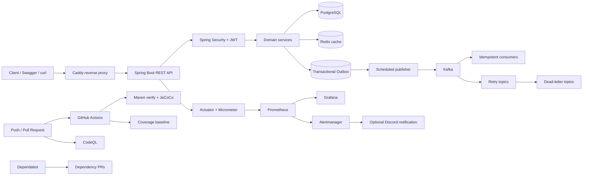
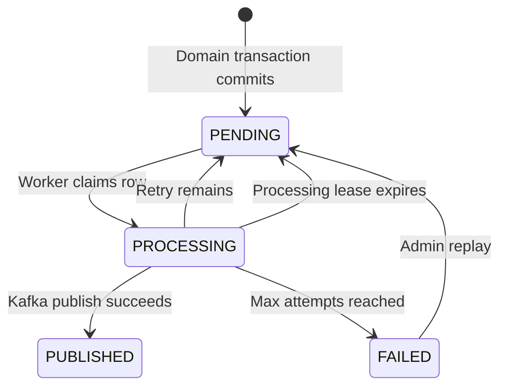

# Spring Boot E-Commerce Backend

[](https://github.com/ravan-chuang/spring-boot-ecommerce-backend/actions/workflows/ci.yml)
[](https://github.com/ravan-chuang/spring-boot-ecommerce-backend/actions/workflows/codeql.yml)
[](https://openjdk.org/)
[](https://spring.io/projects/spring-boot)
[](LICENSE)

A production-minded Spring Boot e-commerce backend centered on transactional correctness, recoverable failure handling, concurrency safety, and operational visibility. The project goes beyond CRUD by integrating authentication, multi-device sessions, order and payment transactions, a Transactional Outbox, Kafka at-least-once delivery, idempotent processing, monitoring, containerized delivery, and automated quality gates into one executable system.

Repository: <https://github.com/ravan-chuang/spring-boot-ecommerce-backend>

## Project Positioning

This repository is an engineering portfolio and reliability lab, not a claim that the system currently carries commercial production traffic. Its purpose is to demonstrate explicit, testable behavior under duplicate requests, duplicate messages, Kafka outages, competing publishers, stock conflicts, and credential revocation.

Key engineering properties:

- Order or payment state and its outbound event are committed in one PostgreSQL transaction, closing the database/Kafka dual-write gap.
- Concurrent payment attempts for one order are serialized by a PostgreSQL pessimistic lock, a one-payment-per-order database constraint, and a second idempotency lookup after the lock is acquired.
- Payment cancellation and payment acquisition use the same order lock, so competing terminal transitions cannot both succeed.
- HTTP idempotency is backed by a unique key/path constraint, SHA-256 request fingerprints, a persisted response reference/status, and a 24-hour retention horizon.
- Multiple outbox workers cooperate through `FOR UPDATE SKIP LOCKED`, per-instance claim ownership, and an expiring processing lease.
- Kafka retry topics, dead-letter topics, and a transactionally persisted processed-event marker support at-least-once delivery.
- Short-lived JWT access tokens are paired with opaque refresh tokens, token hashing, rotation, and per-device session revocation.
- Testcontainers, JaCoCo, a coverage regression baseline, GitHub Actions, CodeQL, and Dependabot provide reproducible quality evidence.
- Actuator, Micrometer, Prometheus, Grafana, and Alertmanager turn failure states into metrics, dashboards, and alerts.

## Verified Engineering Baseline

The documentation baseline is the local working tree verified on 2026-08-05, based on Git `HEAD 79971f8` plus the Phase 1 hardening changes described here.

| Verification | Result |
|---|---:|
| Maven command | `./mvnw --batch-mode --no-transfer-progress clean verify` |
| Build | **SUCCESS** |
| Test suites | 24 |
| Tests | 113 |
| Passed / failed / errors / skipped | **113 / 0 / 0 / 0** |
| Testcontainers | PostgreSQL 16 Alpine, Redis 7 Alpine, Kafka 4.1.0 |
| JaCoCo instruction coverage | **87.24%** |
| JaCoCo branch coverage | **71.43%** |
| JaCoCo line coverage | **86.57%** |
| Maven coverage gate | **Passed**: instruction >= 70%, branch >= 50% |
| Coverage baseline check | **Passed**: maximum allowed drop 0.50 percentage points |
| Maven time | 43.246 seconds on the local verification environment |

> On JDK 25, Mockito's inline mock maker cannot self-attach in some restricted environments. This verification explicitly loaded the Byte Buddy agent. That is a test-runtime accommodation; no product code, assertions, tests, or coverage rules were changed or skipped.

## System Architecture


```mermaid
flowchart LR
    Client[Client / Swagger / curl] --> Caddy[Caddy reverse proxy]
    Caddy --> API[Spring Boot REST API]
    API --> Security[Spring Security + JWT]
    Security --> Services[Domain services]

    Services --> PostgreSQL[(PostgreSQL)]
    Services --> Redis[(Redis cache)]
    Services --> Outbox[(Transactional Outbox)]

    Outbox --> Publisher[Scheduled publisher]
    Publisher --> Kafka[Kafka]
    Kafka --> Consumer[Idempotent consumers]
    Kafka --> Retry[Retry topics]
    Retry --> DLT[Dead-letter topics]

    API --> Metrics[Actuator + Micrometer]
    Metrics --> Prometheus[Prometheus]
    Prometheus --> Grafana[Grafana]
    Prometheus --> Alertmanager[Alertmanager]
    Alertmanager --> Discord[Optional Discord notification]

    GitHub[Push / Pull Request] --> CI[GitHub Actions]
    CI --> Verify[Maven verify + JaCoCo]
    CI --> Baseline[Coverage baseline]
    GitHub --> CodeQL[CodeQL]
    Dependabot[Dependabot] --> PullRequests[Dependency PRs]
```

The code follows controller, security, service, repository, model, DTO, event, exception, and configuration layers. PostgreSQL owns business truth, outbox state, idempotency state, and audit history. Redis currently caches individual product reads. Kafka delivers domain events. Prometheus, Grafana, and Alertmanager provide operational visibility.

### Source and Operational Inventory

| Asset | Count | Responsibility |
|---|---:|---|
| Main Java source files | 99 | Product code and configuration |
| Controllers | 7 | Auth, User, Product, Cart, Order, Payment, Outbox Admin |
| Services | 19 | Domain, auth, outbox, Kafka, audit, retention, metrics |
| Repositories | 9 | Spring Data JPA persistence and locking |
| Model and enum files | 13 | 9 JPA entities and 4 lifecycle enums |
| DTO files | 24 | Request, response, validation, and pagination contracts |
| Exception files | 14 | Domain exceptions and global mapping |
| Flyway migrations | 9 | Schema versions V1 through V9 |
| Test source files | 25 | 24 suites plus one shared Testcontainers base |
| k6 scenarios | 6 | Load, stress, soak, arrival-rate, and payment idempotency |
| Grafana dashboards | 2 | Performance and outbox operations |

## Domain and Transaction Design

### Product and Cart

- Products support create, paginated and sorted reads, detail reads, updates, and deletion.
- `GET /api/products/{id}` uses the Redis `products` cache; update and delete evict the product ID.
- Product create and update DTOs validate name, description, price, and stock.
- `Product.version` provides optimistic locking for concurrent stock mutations.
- Cart operations add, list, update quantity, and delete. Adding the same product increments its quantity.
- Add and update perform an early stock check, but the order transaction revalidates and deducts stock; the cart is not an inventory reservation.
- Controller-level owner-or-admin checks are followed by service-level item ownership validation.

### Order Transaction

Creating an order performs the following work in one transaction:

1. Load the user and cart.
2. Reject a missing user or empty cart and revalidate every stock quantity.
3. Persist a `PENDING` order and order-item name, price, and subtotal snapshots.
4. Decrement product stock and update optimistic-lock versions.
5. Delete the cart items.
6. Insert a `PENDING` `ORDER_CREATED` outbox event.

Cancellation accepts only a `PENDING` order, acquires the same pessimistic order lock as payment, restores stock, and changes the order to `CANCELLED`. A scalar owner-ID authorization query avoids loading a stale order entity before lock acquisition. `/orders/slow` intentionally delays for five seconds to demonstrate an optimistic-lock race. It is a lab endpoint and should be replaced by a test harness in a production API.

### Payment and HTTP Idempotency

`POST /api/orders/{orderId}/payments` requires an `Idempotency-Key` header. The service:

1. Looks up an existing result by `(idempotencyKey, requestPath)`.
2. Compares the stored SHA-256 request fingerprint and returns HTTP 409 when the same key/path is reused with a different payment method.
3. Acquires a `PESSIMISTIC_WRITE` lock on the order.
4. Repeats the idempotency lookup after acquiring the lock to close the check-then-act race.
5. Requires a `PENDING` order with no existing payment.
6. Persists a `PAID` payment, response status, payment response reference, fingerprint, and 24-hour expiry metadata, then changes the order to `PAID`.
7. Inserts a `PAYMENT_PAID` outbox event in the same transaction.

The database enforces both `payments.order_id UNIQUE` and `UNIQUE (idempotency_key, request_path)`. Idempotency keys are trimmed, required, and limited to 255 characters. The payment row is the durable response reference, allowing a retry to reconstruct the same response. A future cleanup workflow should define deletion timing and whether a serialized response snapshot is needed for immutable historical replay.

## Transactional Outbox and Kafka Reliability


```mermaid
stateDiagram-v2
    [*] --> PENDING: Domain transaction commits
    PENDING --> PROCESSING: Worker claims row
    PROCESSING --> PUBLISHED: Kafka publish succeeds
    PROCESSING --> PENDING: Retry remains
    PROCESSING --> FAILED: Max attempts reached
    FAILED --> PENDING: Admin replay
    PROCESSING --> PENDING: Processing lease expires
```

### Producer Side

- `OrderService` and `PaymentService` write `outbox_events` inside their business transactions.
- The publisher runs every second by default, claims up to 50 events, and starts after a three-second delay.
- The native claim query orders by creation time and uses `FOR UPDATE SKIP LOCKED`.
- A claim records `processing_at` and a random `processing_by` publisher instance ID.
- Publish-time ownership validation prevents a stale worker from processing a claim it no longer owns.
- The default processing lease is 60 seconds; expired `PROCESSING` events return to `PENDING`.
- Maximum attempts are 3 in the local profile and 10 in the production profile.
- Successful events become `PUBLISHED`; retryable failures return to `PENDING`; exhausted failures become `FAILED` with `last_error` retained.
- Admin APIs list failed events and replay a selected event to `PENDING`.
- Kafka records include an `outbox-event-id` header for consumer deduplication.

### Consumer Side

- Domain topics are `order-created` and `payment-paid`, currently configured with one partition and replication factor 1.
- Each listener has four total attempts with retry-topic delays of 1, 2, and 4 seconds.
- Exhausted records are sent to a `-dlt` topic; the current `@DltHandler` records the terminal error in logs.
- `processed_events` uses `(event_id, consumer_name)` as its primary key.
- The deduplication marker and business action share one transaction. A failed business action rolls back the marker and preserves safe retry behavior.
- The `ORDER_CREATED` consumer also writes `order_event_audit`; a unique event ID prevents a duplicate audit side effect.
- Legacy messages without `outbox-event-id` are still handled, but only a warning is logged and deduplication cannot be guaranteed.
- Scheduled cleanup removes `processed_events` older than 30 days and `order_event_audit` rows older than 90 days.

## Security and Session Lifecycle

- Spring Security uses stateless sessions and a custom JWT filter.
- HMAC JWT access tokens expire after 15 minutes by default and contain the user ID and role with email as the subject.
- Passwords are hashed with BCrypt.
- A refresh token is a 48-byte cryptographically random opaque value. The API returns the raw secret once; the database stores only its SHA-256 hash.
- Refresh tokens expire after 30 days by default and rotate on every refresh. A predecessor is revoked and linked to its replacement.
- Sessions retain device, IP, creation, last-used, and expiry metadata and support listing, single-session revocation, and logout-all.
- Authentication successes and failures are written to `auth_audit_logs`. Failure audit uses `REQUIRES_NEW`, preserving the audit row when the outer authentication transaction fails.
- `auth.events{action,outcome}` exposes security-event counts.
- `USER` and `ADMIN` roles protect product writes, outbox administration, and Actuator metrics. Cart, order, and payment routes also enforce owner-or-admin access.

### Closed Authorization Boundary

The legacy `/api/users/**` CRUD surface now has an explicit policy: collection reads and legacy creation require `ADMIN`; item reads, updates, and deletion require the resource owner or `ADMIN`. Anonymous, cross-user, normal-user collection, and administrator flows are covered by integration tests. Unmatched routes now terminate at `anyRequest().denyAll()` instead of falling through to public access. The remaining design concern is overlap between legacy admin-created users and `/api/auth/register`, not an unauthenticated access path.

Other identity boundaries include the lack of immediate access-token revocation, rate limiting, account lockout, password reset, email verification, and MFA. Swagger and OpenAPI are public at the application layer and should be disabled or restricted by environment in a production deployment.

## Complete API Surface

Normal successful responses use `ApiResponse<T>`. Validation failures return a field-error map. Domain failures map to HTTP 400, 404, or 409 as appropriate.

### Authentication

| Method | Endpoint | Access | Purpose |
|---|---|---|---|
| `POST` | `/api/auth/register` | Public | Register and issue an access/refresh pair |
| `POST` | `/api/auth/login` | Public | Authenticate and create a session |
| `POST` | `/api/auth/refresh` | Public | Rotate the refresh token and issue an access token |
| `POST` | `/api/auth/logout` | Public | Revoke the session identified by a refresh token |
| `GET` | `/api/auth/sessions` | Authenticated | List the current user's active sessions |
| `DELETE` | `/api/auth/sessions/{sessionId}` | Authenticated owner | Revoke one owned session |
| `POST` | `/api/auth/sessions/logout-all` | Authenticated | Revoke all active sessions for the current user |

### User, Product, Cart, Order, and Payment

| Method | Endpoint | Access | Purpose |
|---|---|---|---|
| `POST` | `/api/users` | Admin | Legacy user creation |
| `GET` | `/api/users` | Admin | User pagination and sorting |
| `GET` | `/api/users/{id}` | Owner or admin | User detail |
| `PUT` | `/api/users/{id}` | Owner or admin | Legacy user update |
| `DELETE` | `/api/users/{id}` | Owner or admin | Legacy user deletion |
| `POST` | `/api/products` | Admin | Create a product |
| `GET` | `/api/products` | Public | Paginated and sorted catalog |
| `GET` | `/api/products/{id}` | Public | Redis-cached product detail |
| `PUT` | `/api/products/{id}` | Admin | Update a product and evict cache |
| `DELETE` | `/api/products/{id}` | Admin | Delete a product and evict cache |
| `POST` | `/api/users/{userId}/cart/items` | Owner or admin | Add or increment a cart item |
| `GET` | `/api/users/{userId}/cart/items` | Owner or admin | List cart items |
| `PUT` | `/api/users/{userId}/cart/items/{cartItemId}` | Owner or admin | Update quantity |
| `DELETE` | `/api/users/{userId}/cart/items/{cartItemId}` | Owner or admin | Remove an item |
| `POST` | `/api/users/{userId}/orders` | Owner or admin | Create an order from the cart |
| `GET` | `/api/users/{userId}/orders` | Owner or admin | List a user's orders |
| `GET` | `/api/orders/{orderId}` | Order owner or admin | Read order detail |
| `POST` | `/api/orders/{orderId}/cancel` | Order owner or admin | Cancel a pending order and restore stock |
| `POST` | `/api/users/{userId}/orders/slow` | Owner or admin | Optimistic-lock lab endpoint |
| `POST` | `/api/orders/{orderId}/payments` | Order owner or admin | Idempotent payment; requires `Idempotency-Key` |
| `GET` | `/api/orders/{orderId}/payment` | Order owner or admin | Read an order's payment |

### Operations

| Method | Endpoint | Access | Purpose |
|---|---|---|---|
| `GET` | `/api/admin/outbox/failed` | Admin | List failed outbox events |
| `POST` | `/api/admin/outbox/{eventId}/replay` | Admin | Replay a failed event |
| `GET` | `/actuator/health` | Public | Health probe |
| `GET` | `/actuator/info` | Public | Application metadata |
| `GET` | `/actuator/prometheus` | Public at app layer | Prometheus scrape; blocked by production Caddy |
| `GET` | `/actuator/metrics/**` | Admin | Metric detail; blocked by production Caddy |
| `GET` | `/swagger-ui/index.html` | Public | API explorer |
| `GET` | `/v3/api-docs` | Public | OpenAPI document |

The 30 auth, commerce, and admin mappings exclude Actuator and documentation endpoints.

## Data Model and Schema Evolution

| Table | Role | Important constraint or index |
|---|---|---|
| `users` | Identity, credential, and role | Unique email |
| `products` | Catalog, price, and stock | Optimistic-lock `version` |
| `cart_items` | Per-user cart | User and product indexes |
| `orders` | Order total and state | User index |
| `order_items` | Purchase-time product snapshots | Order and product indexes |
| `payments` | One payment per order | `order_id UNIQUE` |
| `idempotency_records` | HTTP idempotency result and replay metadata | Unique key/path; payment FK; fingerprint, status, and expiry |
| `outbox_events` | Durable outbound events | Status, creation, and processing indexes |
| `processed_events` | Consumer deduplication marker | `(event_id, consumer_name)` primary key |
| `order_event_audit` | `ORDER_CREATED` audit side effect | Unique event ID |
| `refresh_tokens` | Hashed token and session chain | Unique token hash; session and active-user indexes |
| `auth_audit_logs` | Authentication security history | User/time and event/outcome/time indexes |

Flyway migrations:

1. `V1__init_schema.sql`: core commerce schema.
2. `V2__create_outbox_events.sql`: Transactional Outbox.
3. `V3__add_outbox_processing_lease.sql`: claim ownership and lease.
4. `V4__create_processed_events.sql`: consumer idempotency.
5. `V5__create_order_event_audit.sql`: order-event audit.
6. `V6__create_refresh_tokens.sql`: hashed refresh tokens.
7. `V7__add_refresh_token_sessions.sql`: multi-device session metadata.
8. `V8__create_auth_audit_logs.sql`: authentication audit trail.
9. `V9__harden_payment_idempotency.sql`: unique request identity, fingerprint, response metadata, expiry, and payment foreign key.

Hibernate uses `ddl-auto=validate` and `open-in-view=false`. Flyway exclusively owns schema changes; application startup fails when entity mappings and migrations disagree.

## Observability and Incident Signals

### Metrics

- Spring Boot Actuator and the Prometheus registry.
- HTTP server request histograms with P95 and P99 percentiles.
- `outbox.publish.success` and `outbox.publish.failure` counters.
- `outbox.events.claimed` and `outbox.processing.recovered` counters.
- `outbox.events{status=PENDING|PROCESSING|FAILED}` gauges.
- `auth.events{action,outcome}` security counters.

### Alerts

Prometheus scrapes and evaluates every five seconds. Rules include:

- A failed outbox event persisting for 30 seconds: critical.
- Any publish failure during five minutes: warning.
- A pending backlog persisting for five minutes: warning.
- Application scrape target down for one minute: critical.
- At least five login failures in five minutes, sustained for one minute: warning.

Alertmanager groups by alert name, service, and severity. An optional Discord webhook is mounted from a secret file; a real webhook must never be committed.

### Dashboards

- `performance-dashboard.json`: application, JVM, HTTP latency, and throughput.
- `outbox-dashboard.json`: queue state, claims, recovery, publish results, and failures.

## Technology Stack

| Area | Technology |
|---|---|
| Language and runtime | Java 25 |
| Framework | Spring Boot 4.1.0, Spring Web MVC |
| Persistence | Spring Data JPA, Hibernate 7, PostgreSQL 16, Flyway |
| Cache | Redis 7, Spring Cache |
| Messaging | Apache Kafka, Spring Kafka, retry topics, DLT |
| Security | Spring Security, JWT with JJWT 0.13.0, BCrypt |
| API | REST, Bean Validation, springdoc OpenAPI 3.0.3 |
| Observability | Actuator, Micrometer, Prometheus, Grafana, Alertmanager |
| Testing | JUnit 5, Mockito, MockMvc, Testcontainers 1.21.4, JaCoCo 0.8.15, k6 |
| Delivery | Maven Wrapper, multi-stage Docker build, Docker Compose, Caddy |
| Governance | GitHub Actions, CodeQL security-extended, Dependabot |

## Quick Start with Docker Compose

### Prerequisites

- Docker Desktop or another Docker runtime with Compose v2
- Git

```bash
git clone https://github.com/ravan-chuang/spring-boot-ecommerce-backend.git
cd spring-boot-ecommerce-backend
cp .env.example .env
```

At minimum, replace `POSTGRES_PASSWORD`, `DB_PASSWORD`, `JWT_SECRET`, and `GRAFANA_ADMIN_PASSWORD`. Generate a sufficiently long Base64 JWT secret with:

```bash
openssl rand -base64 64
```

Start the complete local stack:

```bash
docker compose up --build -d
docker compose ps
```

| Service | Default local URL or port |
|---|---|
| Application | <http://localhost:8080> |
| Swagger UI | <http://localhost:8080/swagger-ui/index.html> |
| Health | <http://localhost:8080/actuator/health> |
| PostgreSQL | `localhost:5433` |
| Redis | `localhost:6379` |
| Kafka | `localhost:9092` |
| Prometheus | <http://localhost:9090> |
| Grafana | <http://localhost:3000> |
| Alertmanager | <http://localhost:9093> |

```bash
docker compose logs -f app
docker compose down
```

Use `docker compose down -v` only when persistent local data is no longer required.

## Local Application Development

Requirements: JDK 25 and Docker.

```bash
docker compose up -d postgres redis kafka

export DB_URL=jdbc:postgresql://localhost:5433/spring_boot_lab
export DB_USERNAME=<your-postgres-user>
export DB_PASSWORD=<your-postgres-password>
export REDIS_HOST=localhost
export REDIS_PORT=6379
export KAFKA_BOOTSTRAP_SERVERS=localhost:9092
export JWT_SECRET=<your-base64-secret>

./mvnw spring-boot:run
```

Profiles:

- `local` is the default. It uses three outbox attempts and shorter Kafka timeouts for failure demonstrations.
- `prod` uses ten outbox attempts, more conservative Kafka timeouts, disabled SQL logging, and protected health details.
- `test` supplies test JWT settings, disables the scheduled publisher, and receives infrastructure endpoints from Testcontainers.

## Testing and Quality Gates

```bash
./mvnw --batch-mode --no-transfer-progress clean verify
python3 scripts/coverage_baseline.py
```

`clean verify` compiles the project, runs unit, component, and integration tests, packages the JAR, creates the JaCoCo report, and enforces the Maven coverage gate. The coverage-baseline script is a separate regression check run immediately afterward in CI.

Artifacts:

- `target/surefire-reports/`
- `target/site/jacoco/index.html`
- `target/spring-boot-lab-0.0.1-SNAPSHOT.jar`

### Complete Verified Test Matrix

| Test suite | Tests | Type | Primary evidence |
|---|---:|---|---|
| `SpringBootLabApplicationTests` | 1 | Integration | Spring context, Flyway, infrastructure wiring |
| `AuthControllerIntegrationTest` | 8 | API integration | Register, login, duplicate email, wrong password, rotation, logout, single/all sessions |
| `OrderFlowIntegrationTest` | 2 | API integration | Order plus outbox and complete cart-to-order-to-payment flow |
| `OutboxAdminControllerIntegrationTest` | 2 | API integration | USER denial and ADMIN replay of a failed event |
| `OutboxMetricsAuthorizationIntegrationTest` | 2 | API integration | USER and ADMIN authorization for metrics |
| `PaymentControllerIntegrationTest` | 7 | API integration | Payment outbox, replay, payload conflict, DB uniqueness, same-key concurrency, pay/cancel race, missing key |
| `ProductControllerIntegrationTest` | 8 | API integration | Public reads, admin writes, USER write denial |
| `UserAuthorizationIntegrationTest` | 4 | API integration | Anonymous denial, self-service isolation, admin collection and profile management |
| `AuthAuditIntegrationTest` | 4 | DB/metrics integration | Success/failure audit, session revoke, logout-all |
| `EventRetentionCleanupIntegrationTest` | 1 | DB integration | Deletes only rows beyond retention windows |
| `KafkaConsumerIdempotencyIntegrationTest` | 1 | Kafka/DB integration | Duplicate delivery creates one audit row |
| `KafkaRetryDltIntegrationTest` | 1 | Kafka integration | Empty message retries and reaches DLT |
| `OutboxEventClaimServiceIntegrationTest` | 3 | Concurrency integration | Single claim, disjoint multi-worker distribution, lease recovery |
| `OutboxEventPublisherIntegrationTest` | 1 | Kafka/DB integration | `PENDING` to Kafka to `PUBLISHED` |
| `OutboxEventPublisherRetryIntegrationTest` | 2 | Failure integration | Retry to `PENDING` and exhausted `FAILED` state |
| `ProcessedEventServiceIntegrationTest` | 2 | DB integration | First-time-only processing and business-failure rollback |
| `ProductControllerTest` | 6 | Component | Response mapping and pagination/sort delegation |
| `GlobalExceptionHandlerTest` | 5 | Component | Validation, 404, 400, and 409 mapping |
| `CartServiceTest` | 13 | Unit | Create/increment/read/update/delete, ownership, stock, missing resources |
| `OrderServiceTest` | 9 | Unit | Creation, snapshots, stock, cart clearing, cancellation, failures |
| `OutboxEventPublisherTest` | 5 | Unit | Empty claim, stale claim, publish, retry, terminal failure |
| `OutboxMetricsTest` | 3 | Unit | Counters, batch guards, status gauges |
| `PaymentServiceTest` | 15 | Unit | Key validation, fingerprint conflict, replay, locking, state validation, persistence, outbox |
| `ProductServiceTest` | 8 | Unit | CRUD mapping, pagination, missing resources |
| **Total** | **113** | **64 unit/component + 49 integration** | **113 passed; 0 failed, errors, or skipped** |

### Coverage Results

| Counter | Covered | Missed | Total | Coverage |
|---|---:|---:|---:|---:|
| Instruction | 5,638 | 825 | 6,463 | **87.24%** |
| Branch | 120 | 48 | 168 | **71.43%** |
| Line | 1,541 | 239 | 1,780 | **86.57%** |
| Complexity | 516 | 121 | 637 | **81.00%** |
| Method | 472 | 81 | 553 | **85.35%** |
| Class | 90 | 2 | 92 | **97.83%** |

The Maven gate requires instruction >= 70% and branch >= 50%. The saved regression baseline remains 81.4756% instruction and 68.2927% branch, with a maximum allowed drop of 0.5 percentage points. Current coverage is above both baselines, and the comparison passed.

## Performance and Concurrency Evidence

### Catalog Read Baseline

`reports/performance-baseline.md` records a local Docker Compose run on a MacBook Pro M3 Max with up to 50 VUs against `GET /api/products`:

| Metric | Result |
|---|---:|
| Requests | 9,544 |
| Average throughput | 79.44 req/s |
| Average latency | 9.92 ms |
| P90 / P95 / P99 | 17.07 / 17.93 / 20.12 ms |
| Maximum latency | 47.17 ms |
| Failed requests | 0.00% |
| Check pass rate | 100.00% |

Each iteration includes 300 ms of think time, so the script intentionally limits throughput. This is a reproducible local baseline, not a production capacity claim.

### Payment Idempotency Verification

Existing project documentation records the following k6/PostgreSQL operational verification. It was not rerun as part of the Maven verification above.

| Metric | Result |
|---|---:|
| Concurrent requests | 30 |
| Success rate / HTTP failures | 100% / 0% |
| Average / P95 latency | 45.50 / 53.73 ms |
| Payment rows | 1 |
| Idempotency rows | 1 |
| Duplicate payments | 0 |

`load-tests/payment-idempotency.js` also checks HTTP 200, a payment ID, `PAID` state, P95 below one second, P99 below two seconds, and supports configurable concurrency through `VUS`.

### k6 Scenarios

| Script | Load model | Main thresholds |
|---|---|---|
| `catalog-read.js` | 10 to 30 to 50 VUs | failure < 1%, P95 < 500 ms, P99 < 1 s |
| `catalog-stress.js` | 50 to 100 to 200 VUs | failure < 1%, P95 < 500 ms, P99 < 1 s |
| `catalog-arrival-rate.js` | 500 to 4,000 req/s ramp | failure < 0.1%, P95 < 100 ms, P99 < 300 ms |
| `catalog-3k.js` | 3,000 req/s for 5 min | failure < 0.1%, zero dropped, P95 < 100 ms |
| `catalog-2_5k-soak.js` | 2,500 req/s for 5 min | failure < 0.2%, fewer than 5 dropped, P95 < 100 ms |
| `payment-idempotency.js` | 30 simultaneous one-shot requests by default | Response correctness, latency, zero custom failures |

The high arrival-rate scripts define targets and stress conditions. Apart from the catalog baseline and payment verification above, the repository does not contain saved results for them; they must not be presented as achieved capacity.

## CI, Security Scanning, and Dependency Governance

### Continuous Integration

- Runs on pushes to `main` and every pull request.
- Uses Temurin JDK 25 and the Maven cache.
- Provides PostgreSQL 16 and Redis 7 service containers.
- Runs `clean verify`, the coverage baseline comparison, and a test summary.
- Retains test and JaCoCo artifacts for 14 days.
- Uses a 15-minute job timeout and read-only repository permission.

### CodeQL

- Runs on `main` pushes, pull requests, and a Monday schedule.
- Analyzes Java/Kotlin with build mode `none` and the `security-extended` query suite.

### Dependabot

- Checks Maven and GitHub Actions every Monday in `Asia/Taipei`.
- Groups Spring/Java and testing dependencies.
- Defers a Testcontainers major upgrade to a dedicated migration to avoid a partial BOM upgrade.

## Deployment Model

The `Dockerfile` uses a Java 25 JDK build stage and Java 25 JRE runtime stage. Image construction runs with `-DskipTests`; merge-time CI owns the test gate.

Start the production overlay with:

```bash
docker compose -f docker-compose.yml -f docker-compose.prod.yml up --build -d
```

- PostgreSQL, Redis, Kafka, the application, Prometheus, Grafana, and Alertmanager do not publish host ports.
- Caddy is the only public edge and listens on ports 80, 443, and HTTP/3.
- Caddy returns 404 for `/actuator/prometheus` and `/actuator/metrics*` to prevent public proxy exposure.
- All services use `restart: unless-stopped`.

The topology remains single-host with one Kafka broker and replication factor 1. `depends_on` is not a readiness guarantee. A production environment requires health checks, managed secrets, backups and restore drills, resource limits, and external or highly available stateful services.

## OCI Progress and Boundary

Existing engineering notes report a Tokyo-region VCN, public subnet, Internet Gateway, route, NSG, public IPv4 address, VM, and SSH key. Application deployment has not been verified. The recorded Oracle Linux 9 `VM.Standard.E2.1.Micro` instance has one GB of RAM, times out before the SSH banner exchange, and is too small for the complete Spring Boot, PostgreSQL, Redis, Kafka, Prometheus, and Grafana stack.

This is an external infrastructure progress note. The repository contains no Terraform or Pulumi definition that can independently recreate or verify the OCI state. The next evidence-producing step is to repair or replace the VM, verify SSH, reduce or externalize stateful services, deploy behind domain TLS, and retain an external health-check result.

## Known Limitations and Engineering Risks

| Priority | Current state | Impact | Recommended action |
|---|---|---|---|
| P0 | JWT, database, and Grafana secrets depend on environment files | Secret exposure breaks the security boundary | Use a managed secret store, rotation, and secret scanning |
| P1 | Idempotency expiry metadata has no cleanup workflow or serialized body snapshot | Retention and long-term replay semantics remain incomplete | Add cleanup, retention metrics, and a response snapshot if immutable replay is required |
| P1 | Single Kafka broker and RF=1 | No broker-level availability | Use managed or clustered Kafka with replication |
| P1 | DLT handling is log-only | Terminal records lack an operator workflow | Add DLT inspection/replay, quarantine, and operator audit |
| P1 | Payment is simulated | The project does not prove a real payment integration | Add a sandbox adapter, provider idempotency, and signed webhooks |
| P1 | Access JWTs have no immediate denylist | Refresh revocation does not invalidate an issued access token immediately | Keep a short TTL; add token versioning or a denylist if required |
| P2 | Compose lacks complete health checks and resource limits | Startup races and noisy-neighbor risk | Add readiness, limits, startup ordering, and shutdown tests |
| P2 | No distributed tracing or correlation ID | HTTP-to-outbox-to-Kafka diagnosis is expensive | Add OpenTelemetry and trace propagation |
| P2 | No rate limiting or abuse controls | Login and public endpoints can be abused | Add gateway/application limits, lockout policy, and a WAF |
| P2 | Retention policy is incomplete for user and audit data | Privacy and capacity governance remain incomplete | Define classification, retention, erasure, and backup policies |

## Prioritized Roadmap

1. Add idempotency-record cleanup, retention metrics, and a serialized response snapshot if immutable replay is required.
2. Remove the slow-order lab endpoint from the normal API surface and define trusted proxy headers.
3. Establish a stable cloud host, infrastructure as code, domain TLS, protected CI/CD, and rollback evidence.
4. Move PostgreSQL, Redis, Kafka, and observability state to backed-up, highly available services.
5. Add OpenTelemetry, correlation IDs, and trace-aware logging.
6. Add a DLT operator workflow, backup/restore drills, and an incident runbook.
7. Add API contract tests, a full end-to-end test, image scanning, and an SBOM.
8. Integrate a payment-provider sandbox through an adapter and verify signed webhooks.

## Repository Structure

```text
.
├── .github/
│   ├── workflows/              # CI and CodeQL
│   └── dependabot.yml
├── config/
│   └── coverage-baseline.json
├── infrastructure/caddy/
├── load-tests/                 # Six k6 scenarios
├── observability/
│   ├── alertmanager/
│   ├── grafana/
│   └── prometheus/
├── reports/
│   └── performance-baseline.md
├── scripts/
│   └── coverage_baseline.py
├── src/main/java/com/ravan/SpringBootLab/
│   ├── config/
│   ├── controller/
│   ├── dto/
│   ├── event/
│   ├── exception/
│   ├── model/
│   ├── repository/
│   ├── security/
│   └── service/
├── src/main/resources/
│   ├── db/migration/
│   └── application*.properties
├── src/test/                   # Unit, component, integration, Testcontainers
├── Dockerfile
├── docker-compose.yml
├── docker-compose.prod.yml
└── pom.xml
```

## Professional Assessment

This project demonstrates a level of engineering completeness that is unusual for a junior backend or internship portfolio. It connects transaction boundaries, pessimistic and optimistic locking, at-least-once delivery, idempotency, explicit failure lifecycles, operational metrics, and CI quality gates into one coherent design, then supports those claims with executable tests.

The accurate positioning is: **a backend engineering portfolio with production thinking, established reliability patterns, and comprehensive automated evidence**. It is not yet a commercial production service, and its security gap, single-host topology, simulated payment integration, and unverified cloud deployment should remain transparent.

## License

MIT License. See [`LICENSE`](LICENSE).
