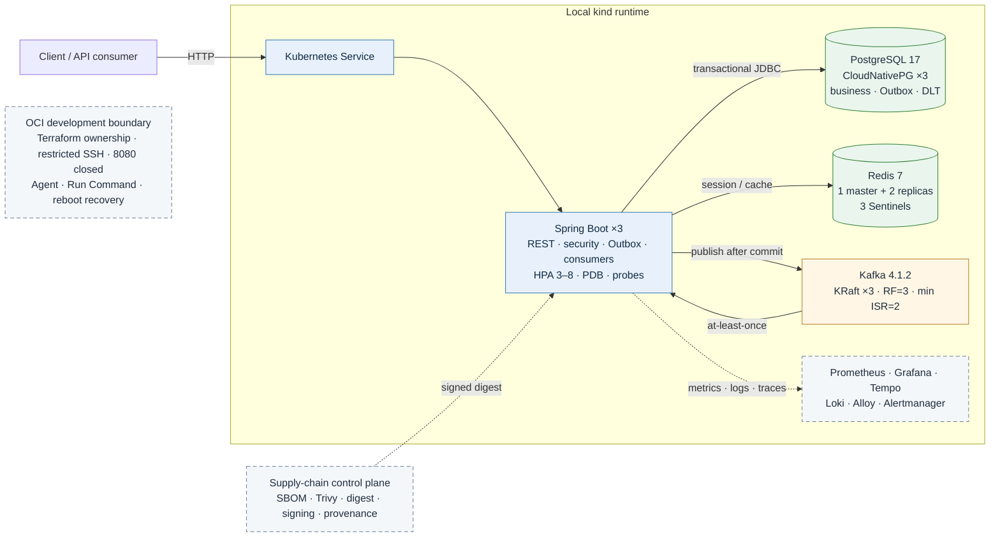
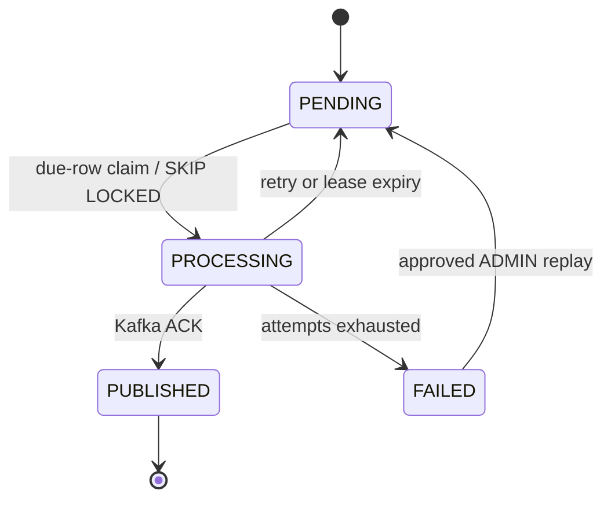
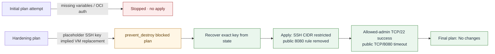

# Spring Boot E-Commerce Backend

[](https://github.com/ravan-chuang/spring-boot-ecommerce-backend/actions/workflows/ci.yml)
[](https://github.com/ravan-chuang/spring-boot-ecommerce-backend/actions/workflows/codeql.yml)
[](https://github.com/ravan-chuang/spring-boot-ecommerce-backend/actions/workflows/supply-chain.yml)

An evidence-led, event-driven commerce backend built with **Java 25** and **Spring Boot 4.1.0**. The project concentrates on transactional correctness, idempotent commands, durable event delivery, local failure recovery, observability, software-supply-chain provenance, and brownfield Infrastructure as Code on Oracle Cloud Infrastructure.

This repository separates four kinds of statements:

- **Implemented** — the mechanism exists in version-controlled code or configuration.
- **Verified** — the behavior was executed and retained evidence supports it.
- **Observed** — the number applies only to the stated workload and failure domain.
- **Proposed / not claimed** — the capability is a next step, not current proof.

> [!IMPORTANT]
> **Current repository boundary — 2026-08-15**
>
> - Repository HEAD: **`45899b8`**, tagged **`phase9-recovery-complete`**.
> - Latest independently verified application source: **`ff5e527`**.
> - Automated verification at `ff5e527`: **172 passed / 0 failed / 0 errors / 0 skipped**.
> - JaCoCo at `ff5e527`: **92.55% instruction / 82.75% branch**, 112 analyzed classes.
> - Maven hard gate: **85% instruction / 75% branch — PASS**.
> - Changes from `ff5e527` to current HEAD are confined to documentation, OCI Terraform, and retained verification evidence; no newer application-test result is claimed.
> - Phase 9 network hardening and VM recovery: **PASS**; direct public TCP/8080 removed, SSH restricted to an approved CIDR, final Terraform plan **`No changes`**, controlled-reboot acceptance **PASS**.

## Engineering position

The accurate description is a **locally verified distributed backend and platform-engineering portfolio**. It demonstrates strong transactional and recovery reasoning, but it is not a production-proven multi-zone platform.

| Verified or observed | Explicitly not claimed |
|---|---|
| Three application replicas, HPA, PDB, probes, topology spread, and hard-worker recovery | Zero-downtime continuity during abrupt worker loss |
| Transactional commerce invariants, payment idempotency, Transactional Outbox, consumer deduplication, and persisted DLT governance | Global exactly-once delivery |
| CloudNativePG failover and independent restore; Kafka KRaft and Redis Sentinel one-node drills | Universal zero-RPO or multi-zone disaster recovery |
| Signed/attested image path and OCI brownfield Terraform ownership | Admission-time signature enforcement or proof that the full local stack runs on OCI |
| Phase 9 restricted SSH, closed direct 8080, zero-drift reconciliation, and VM recovery acceptance | Complete production edge security, workload identity, remote Terraform state, or historical SLO attainment |

## Current evidence baseline

| Domain | As-built or observed state | Evidence boundary |
|---|---|---|
| Repository | HEAD `45899b8`; tag `phase9-recovery-complete` | Current source/configuration state |
| Application verification | `ff5e527`: 172/0/0/0; 49.278 s; 112 classes | Latest retained clean-clone application rerun, 2026-08-10 |
| Coverage | 92.55% instruction / 82.75% branch | Measured at `ff5e527`; hard gate 85% / 75% passed |
| Application runtime | 3 replicas; HPA 3–8; PDB; probes; topology spread | Local kind, one control-plane |
| PostgreSQL | 16 in Compose/Testcontainers; 17 in CloudNativePG ×3 | HA and restore results apply to CNPG PostgreSQL 17 |
| Kafka | 4.1.0 in Testcontainers; 4.1.2 in Compose/Kubernetes; KRaft ×3 | Version scopes are not interchangeable |
| Redis | Redis 7; 1 master + 2 replicas; 3 Sentinels | Asynchronous replication |
| Schema | Flyway V1–V11; `ddl-auto=validate`; Open Session in View disabled | Repository-backed migration history |
| Supply chain | CycloneDX, Trivy, GHCR digest, Cosign OIDC, image SBOM, provenance | No admission-time verification policy |
| OCI / Terraform | Brownfield VCN, subnet, route, security objects, NSGs, rules, and VM | Single development VM; not the application/data platform |
| Phase 9 hardening | SSH restricted; direct 8080 removed; final plan `No changes` | Approved-admin positive test and public 8080 negative test only |
| Phase 9 recovery | Controlled reboot, SSH, LVM mounts, OCI Agent, 0 failed systemd units | One development VM recovery acceptance, 2026-08-15 |

### Coverage precision

| Coverage fact | Instruction | Branch | Meaning |
|---|---:|---:|---|
| Latest verified application baseline | **92.55%** | **82.75%** | Clean-clone rerun at `ff5e527` |
| Historical Phase 2.1 snapshot | 89.78% | 73.63% | Earlier evidence; not current |
| Maven hard gate | 85.00% | 75.00% | Bundle minimum; latest verified run passed |
| Regression reference | 81.4756% | 68.2927% | Secondary script; maximum absolute drop `0.005` |

## As-built architecture


```mermaid
flowchart LR
    Client["Client / API consumer"] -->|HTTP| Service["Kubernetes Service"]

    subgraph Runtime["Local kind runtime"]
        Service --> App["Spring Boot ×3<br/>REST · security · Outbox · consumers<br/>HPA 3–8 · PDB · probes"]
        App -->|transactional JDBC| PG[("PostgreSQL 17<br/>CloudNativePG ×3<br/>business · Outbox · DLT")]
        App -->|session / cache| Redis[("Redis 7<br/>1 master + 2 replicas<br/>3 Sentinels")]
        App -->|publish after commit| Kafka["Kafka 4.1.2<br/>KRaft ×3 · RF=3 · min ISR=2"]
        Kafka -->|at-least-once| App
        App -.->|metrics · logs · traces| Obs["Prometheus · Grafana · Tempo<br/>Loki · Alloy · Alertmanager"]
    end

    Supply["Supply-chain control plane<br/>SBOM · Trivy · digest · signing · provenance"] -.->|signed digest| App
    OCI["OCI development boundary<br/>Terraform ownership · restricted SSH · 8080 closed<br/>Agent · Run Command · reboot recovery"]

    classDef runtime fill:#e8f1fb,stroke:#2f75b5,color:#102a43;
    classDef durable fill:#eaf6ed,stroke:#2e7d32,color:#1f2d3d;
    classDef async fill:#fff6e5,stroke:#b7791f,color:#1f2d3d;
    classDef control fill:#f4f7fa,stroke:#6b7c8f,color:#1f2d3d,stroke-dasharray:6 4;
    class App,Service runtime;
    class PG,Redis durable;
    class Kafka async;
    class Supply,OCI,Obs control;
```

The **PostgreSQL commit** is the correctness boundary: business state and outbound event intent become durable together. Kafka publication follows the commit and remains at-least-once. Redis is an acceleration/session component, not the system of record.

The OCI box is deliberately disconnected from the local runtime. The repository proves ownership and recovery of a development VM boundary; it does not prove deployment of Kubernetes, PostgreSQL, Kafka, or Redis on that VM.

## Transaction correctness

### Commerce invariants

- Product stock uses JPA optimistic locking through `@Version`.
- Cart contents are not inventory reservations; checkout revalidates stock inside the order transaction.
- Order-item snapshots retain purchase-time name, price, and subtotal.
- Order creation, stock deduction, cart deletion, and `ORDER_CREATED` Outbox insertion commit atomically.
- Payment and cancellation serialize terminal state transitions through the same pessimistic order lock.
- Production contains one checkout workflow; the prior slow endpoint, duplicated implementation, and `Thread.sleep` calls were removed from `src/main/java`.
- Timing control remains testable through `OrderProcessingDelay`; production uses `NoOpOrderProcessingDelay`.

### Payment idempotency

```text
Idempotency-Key + request path
→ normalize key and compute SHA-256 request fingerprint
→ SELECT order FOR UPDATE
→ replay lookup while holding the order lock
→ validate PENDING and no existing payment
→ persist payment + replay metadata + response snapshot
→ set order PAID + insert PAYMENT_PAID Outbox event
→ one PostgreSQL commit
```

Database constraints enforce one payment per order and one replay identity per `(idempotency_key, request_path)`. Reusing a key with a different fingerprint is rejected.

### Transactional Outbox and consumers


```mermaid
stateDiagram-v2
    [*] --> PENDING
    PENDING --> PROCESSING: due-row claim / SKIP LOCKED
    PROCESSING --> PUBLISHED: Kafka ACK
    PROCESSING --> PENDING: retry or lease expiry
    PROCESSING --> FAILED: attempts exhausted
    FAILED --> PENDING: approved ADMIN replay
    PUBLISHED --> [*]
```

Competing publishers use `FOR UPDATE SKIP LOCKED`. Consumers persist `(event_id, consumer_name)` with the business side effect in one transaction. Persisted DLT governance covers quarantine, replay reservation, audit history, original destination, and lease recovery.

The executed three-replica Outbox drill produced **90 events**, claim distribution **30/30/30**, **90 `PUBLISHED` rows**, and **90 valid unique Kafka sequences**, with **0 duplicate, missing, unexpected, or parse-error values**. This is workload-scoped evidence, not a global exactly-once claim.

## Reliability evidence

| Subsystem | Injected fault or workload | Observed result | Honest boundary |
|---|---|---|---|
| Application | Abrupt worker stop; 458 client traces | 424 HTTP 200; 34 transport failures; 0 app 5xx; full 3/3 Ready around T+94 s | Self-healing passed; zero-downtime did not |
| PostgreSQL | CloudNativePG primary hard loss | Write RTO 51.543 s; 72 captured ACK commits; 0 missing | RPO=0 only for the captured ACK set |
| PostgreSQL restore | Independent physical restore | 3,864 application probe rows; restore cluster healthy in about 49 s | Local kind + local object-store domain |
| Kafka | One KRaft broker/node loss | 3,733 captured ACK values; 0 missing; 6,337 consumed; all 6 partitions returned to ISR=3 | One-node experiment; not universal zero-loss |
| Redis | Active-master hard loss | New master around T+18 s; checked data readable; post-promotion writes succeeded | Async replication; no general zero-RPO claim |

Node detection, replacement creation, Pod readiness, EndpointSlice convergence, client-visible recovery, and durable-state reconciliation are separate measurements. The project does not collapse them into a misleading single MTTR.

### Kubernetes controls

- 3 baseline replicas; HPA min 3 / max 8; average CPU target 60%.
- Executed HPA path: `3 → 6 → 8 → 6 → 4 → 3`.
- PDB `minAvailable: 2`.
- Rolling update `maxUnavailable: 0`, `maxSurge: 1`.
- Startup, readiness, and liveness probes.
- Topology spread `maxSkew: 1` and preferred anti-affinity.
- 30-second NotReady/Unreachable `NoExecute` tolerations used by the local worker-loss experiment.

## Software supply chain


```mermaid
flowchart LR
    Source["Source + Java 25 tests"] --> AppSBOM["CycloneDX app SBOM"]
    AppSBOM --> FSGate["Trivy filesystem gate"]
    FSGate --> Image["Immutable GHCR digest"]
    Image --> ImageGate["Trivy image gate"]
    ImageGate --> Sign["Cosign keyless signing<br/>GitHub OIDC"]
    Sign --> Evidence["Image SBOM + provenance"]
    Evidence --> Promote["Digest-pinned promotion input"]

    classDef verified fill:#eaf6ed,stroke:#2e7d32,color:#1f2d3d;
    class Source,AppSBOM,FSGate,Image,ImageGate,Sign,Evidence,Promote verified;
```

Trivy filesystem and image scans fail on HIGH/CRITICAL findings with available fixes. The workflow produces application and image SBOMs, immutable image identity, OIDC-backed signing, and provenance.

**Open enforcement point:** Kubernetes admission does not yet reject unsigned or unverified digests.

## OCI brownfield IaC and Phase 9 hardening

Terraform owns the existing development VCN, public subnet, internet gateway, route table, default security list, two NSGs, security rules, and compute instance. Adopted resources use `prevent_destroy` safeguards.

### Phase 9 network change


```mermaid
flowchart LR
    Plan0["Initial plan attempt"] -->|missing variables / OCI auth| Stop0["Stopped · no apply"]
    Plan1["Hardening plan"] -->|placeholder SSH key implied VM replacement| Guard["prevent_destroy blocked plan"]
    Guard --> Correct["Recover exact key from state"]
    Correct --> Apply["Apply: SSH CIDR restricted<br/>public 8080 rule removed"]
    Apply --> Test["Allowed-admin TCP/22 success<br/>public TCP/8080 timeout"]
    Test --> Reconcile["Final plan: No changes"]

    classDef stop fill:#fdecec,stroke:#a62b2b,color:#651b1b;
    classDef safe fill:#fff6e5,stroke:#b7791f,color:#5f3b00;
    classDef pass fill:#eaf6ed,stroke:#2e7d32,color:#1f2d3d;
    class Stop0 stop;
    class Guard safe;
    class Correct,Apply,Test,Reconcile pass;
```

The sanitized approved plan reported **0 add / 2 change / 1 rule destroy**. The destroyed item was the direct TCP/8080 ingress rule; no compute replacement occurred. The final Terraform plan reported **`No changes`**.

### Phase 9 VM recovery

Final acceptance captured on **2026-08-15 04:04:33 UTC** reported:

- controlled reboot: PASS;
- post-reboot SSH: PASS;
- post-reboot LVM mounts: PASS;
- Oracle Cloud Agent: PASS;
- `sshd` and `oracle-cloud-agent` active;
- 0 failed systemd units;
- root filesystem 30 GiB, 19% used; 946 MiB RAM, 499 MiB available; swap unused.

During verification, SSH banner exchange and Run Command degraded while TCP/22 remained reachable. Serial console output reported `systemd-journald` unable to open the runtime journal because no space was available. A power cycle restored service. Because persistent journal evidence was unavailable, transient `/run` or runtime-journal exhaustion is a **probable**, not confirmed, root cause; no evidence ties the incident to the NSG/security-list change.

## Performance and evidence quality

| Profile | Recorded result | Evidence quality | Claim boundary |
|---|---|---|---|
| Maven verification | 172/0/0/0; 49.278 s; 112 classes | Direct clean-clone rerun at `ff5e527` | Automated verification, not capacity |
| Catalog read baseline | 9,544 requests; 79.44 req/s; avg 9.92 ms; P95 17.93 ms; P99 20.12 ms; 0% failed | Saved `reports/performance-baseline.md` | Local Docker Compose; 300 ms think time |
| High-rate catalog soak | 5 min @ 2,500 req/s; 750,000 requests; P95 0.84 ms; P99 1.11 ms; 0.07% client failures; no observed app 5xx | Documented result; raw k6 summary not retained | Not production capacity or an SLA |
| Payment idempotency drill | 30 concurrent requests; 100% HTTP success; 1 payment; 1 idempotency row; 0 duplicates | Documented k6 result; automated suite separately tests 8-way concurrency | Local deduplication evidence |

A workload script is reproducible input, not proof that a recorded result occurred. Stronger claims require preserved raw summaries and environment metadata.

## Observability and operations

| Signal | Implementation | Purpose |
|---|---|---|
| Correlation | HTTP → MDC → Outbox → Kafka → consumer → DLT | Cross-boundary transaction traceability |
| Metrics | Actuator, Micrometer, Prometheus | Rates, latency, failures, durable-state conditions |
| Traces | OpenTelemetry Collector → Tempo | Distributed timing and dependency analysis |
| Logs | JSON → Alloy → Loki | Structured incident queries |
| Alerts | Prometheus rules → Alertmanager | Runbook-linked response |
| Dashboards | Grafana | Operating visibility |
| OCI telemetry | Oracle Cloud Agent | Development VM CPU/memory evidence |

Runbooks cover application down, Outbox backlog/failure, DLT operations, PostgreSQL backup/restore, privacy retention, and secret rotation. Current SLOs are engineering definitions; no historical production SLO or error-budget attainment is claimed.

## Local verification

```bash
./mvnw clean verify
```

The suite uses Testcontainers and requires a compatible container runtime. Review generated coverage under `target/site/jacoco/`.

Primary evidence locations:

- `verification/phase21_reliability_verification.md`
- `verification/phase3/`
- `verification/phase4/`
- `verification/phase5/message_reconciliation.txt`
- `verification/phase6/redis_ha_failover_verification.md`
- `verification/phase7/software_supply_chain_security.md`
- `verification/phase8/`
- `verification/phase9/network/`
- `verification/phase9/recovery/final-acceptance.txt`
- `reports/performance-baseline.md`
- `infra/terraform/oci/`

## Prioritized next evidence

| Priority | Current boundary | Required next evidence |
|---|---|---|
| P0 | Environment/local-secret dependence | External secret manager, workload identity, rotation, and policy tests |
| P0 | Terraform state remains local | Remote encrypted state, locking, backup, and reviewed team plans |
| P1 | Public edge is not a production TLS/LB/WAF design | Controlled edge path, certificate lifecycle, and external synthetic checks |
| P1 | Local kind and local stateful failure domains | Managed multi-zone application and data services |
| P1 | Signing stops before cluster admission | Reject unsigned/unverified digests at deployment time |
| P1 | No historical production SLI/SLO operation | External availability/latency, error budgets, incident reviews, repeated game days |
| P1 | Payment provider is simulated | Sandbox adapter, signed webhooks, reconciliation, provider idempotency |
| P1 | SpringDoc exposure is not production-profile controlled | Disable or protect API docs/UI in production |
| P2 | Performance evidence is read-heavy and partially documentation-only | Saved write/event-heavy soak, retry storm, saturation, and correlated-failure artifacts |
| P2 | Recovery measurements are single observations | Repeat drills and build RTO/RPO distributions and trends |
| P2 | Phase 9 runtime-space root cause is probable | Persistent journaling/telemetry and resource-limit evidence across recurrence testing |

## Final assessment

The repository is best represented as an **advanced student / strong junior backend-platform portfolio**, with selected **early mid-level reasoning** in transaction boundaries, durable state machines, failure reconciliation, restore validation, negative-result preservation, supply-chain provenance, brownfield IaC, and safe infrastructure change control.

Its most professional characteristic is evidence discipline: implemented mechanisms, executed observations, current limitations, and proposed architecture remain visibly separate.

