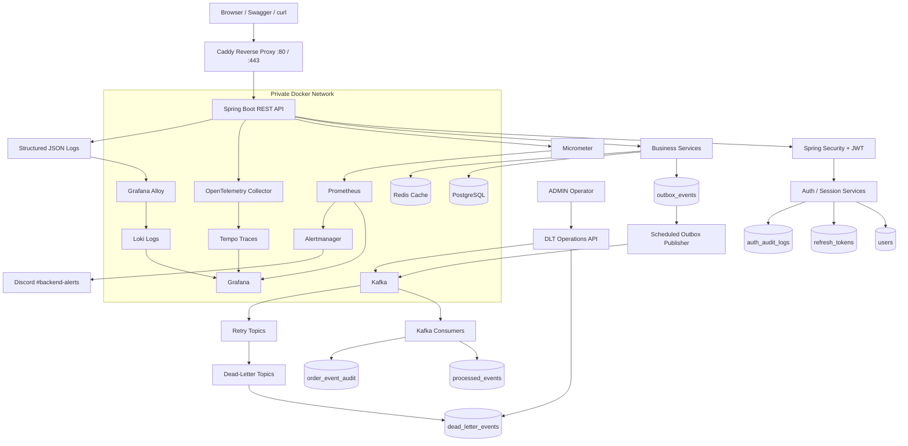

# Spring Boot E-Commerce Backend

[](https://github.com/ravan-chuang/spring-boot-ecommerce-backend/actions/workflows/ci.yml)

A production-minded e-commerce backend built with Spring Boot, PostgreSQL, Redis, Kafka, JWT authentication, transactional outbox delivery, idempotent consumers, governed dead-letter operations, distributed tracing, service-level objectives, and security-event monitoring.

This is intentionally more than a CRUD project. It demonstrates how a backend handles durable event delivery, duplicate processing, authorization, token lifecycle management, failure recovery, metrics, alerting, and integration testing with real infrastructure.

---

## Highlights

- JWT access tokens with refresh-token rotation and revocation
- Multi-device session management: list sessions, revoke one session, revoke all sessions
- BCrypt passwords, USER / ADMIN authorization, and resource ownership checks
- Payment idempotency and optimistic locking for stock consistency
- Transactional Outbox with retry governance, FAILED state, and ADMIN replay
- Persisted Kafka dead-letter intake with ADMIN inspection, quarantine, audited replay, and replay-lease recovery
- End-to-end HTTP/Kafka correlation IDs, OpenTelemetry tracing, structured production logs, Tempo, Loki, and Alloy
- PostgreSQL `SKIP LOCKED` event claiming and processing-lease recovery
- Prometheus recording rules, 99.5% availability SLOs, Grafana, Alertmanager, and Discord incident notifications
- Reproducible k6 capacity tests with provisioned Grafana performance dashboards
- Authentication audit logs and suspicious-login monitoring
- Testcontainers integration tests for PostgreSQL, Redis, and Kafka
- Health-checked Docker Compose runtime with graceful application shutdown
- PostgreSQL backup/restore verification, privacy-retention, and secret-rotation runbooks and scripts
- Spring profiles for local, production, and test environments
- Caddy reverse proxy with production-style private service networking
- Temporary public demo workflow through Cloudflare Quick Tunnel

---

## Tech Stack

| Area | Technologies |
|---|---|
| Language / Framework | Java 25, Spring Boot 4 |
| API / Security | Spring Web, Spring Security, JWT, Swagger / OpenAPI |
| Persistence | PostgreSQL, Spring Data JPA, Hibernate, Flyway |
| Cache / Messaging | Redis, Apache Kafka, Spring Kafka |
| Reliability | Transactional Outbox, retry topics, persisted DLT operations, idempotent consumers |
| Observability | Actuator, Micrometer, OpenTelemetry, Prometheus, Grafana, Tempo, Loki, Alloy, Alertmanager |
| Testing | JUnit, MockMvc, Testcontainers |
| Delivery | Docker, Docker Compose, GitHub Actions, Maven |

---

## Architecture


```mermaid
flowchart TD
    Client[Browser / Swagger / curl] --> Caddy[Caddy Reverse Proxy :80 / :443]
    Caddy --> API[Spring Boot REST API]
    API --> Security[Spring Security + JWT]
    Security --> Auth[Auth / Session Services]
    Auth --> Users[(users)]
    Auth --> RefreshTokens[(refresh_tokens)]
    Auth --> AuthAudit[(auth_audit_logs)]

    API --> Services[Business Services]
    Services --> PostgreSQL[(PostgreSQL)]
    Services --> Redis[(Redis Cache)]
    Services --> Outbox[(outbox_events)]

    Outbox --> Publisher[Scheduled Outbox Publisher]
    Publisher --> Kafka[Kafka]
    Kafka --> Consumer[Kafka Consumers]
    Consumer --> Processed[(processed_events)]
    Consumer --> OrderAudit[(order_event_audit)]
    Kafka --> Retry[Retry Topics]
    Retry --> DLT[Dead-Letter Topics]
    DLT --> DLTStore[(dead_letter_events)]
    Admin[ADMIN Operator] --> DLTAPI[DLT Operations API]
    DLTAPI --> DLTStore
    DLTAPI --> Kafka

    API --> Metrics[Micrometer]
    Metrics --> Prometheus[Prometheus]
    Prometheus --> Grafana[Grafana]
    Prometheus --> Alertmanager[Alertmanager]
    Alertmanager --> Discord[Discord #backend-alerts]
    API --> OTel[OpenTelemetry Collector]
    OTel --> Tempo[Tempo Traces]
    API --> JSONLogs[Structured JSON Logs]
    JSONLogs --> Alloy[Grafana Alloy]
    Alloy --> Loki[Loki Logs]
    Tempo --> Grafana
    Loki --> Grafana

    subgraph Private Docker Network
      API
      PostgreSQL
      Redis
      Kafka
      Prometheus
      Grafana
      Alertmanager
      OTel
      Tempo
      Loki
      Alloy
    end
```

---

## Core Features

### Authentication, Refresh Tokens, and Session Management

The project uses short-lived JWT access tokens and long-lived opaque refresh tokens.

```text
Access token
→ JWT
→ 15-minute lifetime
→ sent in Authorization: Bearer <token>

Refresh token
→ cryptographically random opaque token
→ 30-day lifetime
→ only SHA-256 hash is stored in PostgreSQL
→ rotated on refresh
→ can be revoked by logout or session management APIs
```

### Authentication flow

```text
Register / Login
→ accessToken + refreshToken

Refresh
→ validate refresh token
→ revoke old refresh token
→ create replacement refresh token
→ return new accessToken + refreshToken

Logout
→ revoke supplied refresh token

Logout one session
→ revoke every active refresh token in that session chain

Logout all sessions
→ revoke all active refresh tokens for the current user
```

### Auth APIs

```text
POST   /api/auth/register                    Public
POST   /api/auth/login                       Public
POST   /api/auth/refresh                     Public
POST   /api/auth/logout                      Public

GET    /api/auth/sessions                    Authenticated
DELETE /api/auth/sessions/{sessionId}        Authenticated
POST   /api/auth/sessions/logout-all         Authenticated
```

### Session tracking

Each refresh-token session records:

```text
sessionId
deviceName
ipAddress
createdAt
lastUsedAt
expiresAt
```

Refresh-token rotation keeps the same `sessionId`, so token replacement still represents the same device session.

### Authorization rules

```text
GET    /api/products/**                      Public
POST   /api/products                         ADMIN only
PUT    /api/products/**                      ADMIN only
DELETE /api/products/**                      ADMIN only

/api/users/{userId}/cart/**                  User owner or ADMIN
/api/users/{userId}/orders/**                User owner or ADMIN
/api/orders/{orderId}/payments               Order owner or ADMIN

GET    /api/admin/outbox/failed              ADMIN only
POST   /api/admin/outbox/{eventId}/replay    ADMIN only

GET    /api/admin/dlt/events                 ADMIN only
GET    /api/admin/dlt/events/{eventId}       ADMIN only
GET    /api/admin/dlt/events/{eventId}/audit ADMIN only
POST   /api/admin/dlt/events/{eventId}/quarantine ADMIN only
POST   /api/admin/dlt/events/{eventId}/replay     ADMIN only

GET    /actuator/health                      Public
GET    /actuator/info                        Public
GET    /actuator/prometheus                  Public for local Prometheus scraping
GET    /actuator/metrics/**                  ADMIN only
```

---

## Transactional Outbox and Kafka Delivery

Order and payment changes must not be committed independently from their Kafka events. The project uses the Transactional Outbox pattern to reduce the dual-write consistency problem.

```text
Create Order / Pay Order
→ persist business data
→ persist PENDING outbox event in the same PostgreSQL transaction
→ commit once
→ background publisher claims event
→ publish to Kafka
→ mark PUBLISHED
```

### Event topics

```text
order-created
payment-paid
```

### Outbox states

```text
PENDING      Waiting to be published or retried
PROCESSING   Claimed by one publisher instance
PUBLISHED    Successfully published to Kafka
FAILED       Retry limit reached; operator action required
```

### Multi-instance-safe claiming

The publisher uses PostgreSQL row locking with:

```sql
SELECT ...
FOR UPDATE SKIP LOCKED
```

This allows multiple application instances to claim different pending events without concurrently publishing the same event.

A processing lease protects against an instance stopping after it has claimed an event:

```text
PROCESSING lease expires
→ recovery job returns event to PENDING
→ another instance may claim it
```

### Failed-event replay

ADMIN users can inspect failed events and schedule replay:

```text
GET  /api/admin/outbox/failed
POST /api/admin/outbox/{eventId}/replay
```

Replay behavior:

```text
FAILED
→ PENDING
→ retry_count reset
→ last_error cleared
→ publisher retries Kafka delivery
```

---

## Kafka Retry, DLT, and Consumer Idempotency

### Consumer retry policy

Malformed or temporarily unprocessable messages use non-blocking retry topics:

```text
Initial failure
→ retry after 1 second
→ retry after 2 seconds
→ retry after 4 seconds
→ dead-letter topic
```

### Idempotent consumers

Kafka provides at-least-once delivery semantics, so duplicate delivery is possible.

The outbox publisher attaches an event header:

```text
outbox-event-id: <UUID>
```

Consumers use this ID with the consumer name as a deduplication key:

```text
processed_events
(event_id, consumer_name)
```

Processing flow:

```text
Kafka event arrives
→ insert processed-event marker
→ first insert succeeds: run business side effect
→ duplicate insert conflicts: skip duplicate delivery
```

The marker and business side effect run in one database transaction:

```text
business action succeeds
→ marker commits

business action fails
→ transaction rolls back
→ marker is removed
→ retry can safely process again
```

The `ORDER_CREATED` consumer writes an auditable side effect to:

```text
order_event_audit
```

Verified behavior:

```text
same event delivered twice
→ processed_events contains 1 row
→ order_event_audit contains 1 row
→ duplicate side effect is prevented
```

### Governed dead-letter operations

Terminal Kafka records are not left as broker-only artifacts. The DLT handler persists bounded operational evidence in PostgreSQL:

```text
dead_letter_events
  DLT and original topic / partition / offset
  message key and payload
  bounded Base64-encoded Kafka headers
  outbox event ID and correlation ID
  exception class and message
  operator state, timestamps, actor IDs, and replay attempts

dead_letter_audit_logs
  action
  actor ID and email
  operator reason / outcome
  timestamp
```

The unique DLT coordinate prevents duplicate intake, and JPA optimistic versioning plus pessimistic transition locks protect concurrent operator actions.

```text
RECEIVED
  -> QUARANTINED       explicit ADMIN review with required reason
  -> REPLAYING         database reservation before Kafka send
  -> REPLAYED          Kafka acknowledgement and audited completion

REPLAYING
  -> QUARANTINED       send failure or expired 60-second replay lease
```

Replay preserves the original topic, partition, key, payload, outbox-event ID, and correlation ID. A failed send returns the record to quarantine rather than leaving it stuck in an ambiguous state.

```text
GET  /api/admin/dlt/events?status=RECEIVED&page=0&size=20
GET  /api/admin/dlt/events/{eventId}
GET  /api/admin/dlt/events/{eventId}/audit
POST /api/admin/dlt/events/{eventId}/quarantine
POST /api/admin/dlt/events/{eventId}/replay
```

Operator procedures are documented in `observability/runbooks/dlt-operations.md`.

---

## Payment Idempotency and Stock Consistency

### Payment idempotency

The payment endpoint requires an `Idempotency-Key`:

```http
Idempotency-Key: pay-order-10-001
```

When the same key is retried, the API returns the previous payment result instead of creating a duplicate charge.

### Optimistic locking

Product stock uses JPA optimistic locking with an entity version column.

```text
Concurrent orders
→ version conflict detected
→ one transaction retries or fails safely
→ overselling is prevented
```

---

## Flyway Schema Migrations

Flyway manages all PostgreSQL schema changes.

```text
V1__init_schema.sql
V2__create_outbox_events.sql
V3__add_outbox_processing_lease.sql
V4__create_processed_events.sql
V5__create_order_event_audit.sql
V6__create_refresh_tokens.sql
V7__add_refresh_token_sessions.sql
V8__create_auth_audit_logs.sql
V9__harden_payment_idempotency.sql
V10__create_dead_letter_operations.sql
```

Hibernate validates the schema instead of auto-updating it:

```properties
spring.jpa.hibernate.ddl-auto=validate
spring.flyway.enabled=true
spring.flyway.locations=classpath:db/migration
```

Check migration history:

```bash
docker exec -it spring_boot_lab_postgres \
  psql -U ravan -d spring_boot_lab \
  -c "SELECT installed_rank, version, description, success FROM flyway_schema_history;"
```

---

## Authentication Audit Logs and Security Monitoring

Authentication events are stored in:

```text
auth_audit_logs
```

Recorded fields include:

```text
user_id
event_type
outcome
ip_address
device_name
details
created_at
```

Audited actions include:

```text
register
login
refresh
logout
session_revoke
sessions_revoke_all
```

Failed auth attempts use an independent transaction, so an audit record remains persisted even when the API request returns an error.

### Authentication metrics

Micrometer exports:

```text
auth.events{action="login",outcome="success"}
auth.events{action="login",outcome="failure"}
auth.events{action="refresh",outcome="success"}
auth.events{action="refresh",outcome="failure"}
auth.events{action="logout",outcome="success"}
auth.events{action="session_revoke",outcome="success"}
auth.events{action="sessions_revoke_all",outcome="success"}
```

Prometheus exposes these as:

```text
auth_events_total
```

Example query:

```promql
increase(auth_events_total{action="login",outcome="failure"}[5m])
```

---

## Observability

### Actuator endpoints

```text
/actuator/health
/actuator/info
/actuator/prometheus
/actuator/metrics/**
```

### Correlation, traces, and structured logs

Every HTTP request receives an `X-Correlation-ID` response header. A safe caller-supplied value is reused; invalid or missing values are replaced with a UUID. The same identifier is persisted on outbox records and propagated through Kafka with the `correlation-id` header.

```text
HTTP X-Correlation-ID
  -> MDC correlationId
  -> outbox_events.correlation_id
  -> Kafka correlation-id header
  -> consumer MDC
  -> dead_letter_events.correlation_id
```

The production profile enables the Spring Boot OpenTelemetry starter and exports sampled OTLP/HTTP traces to the OpenTelemetry Collector, which batches and sends them to Tempo. The default production sample probability is 10% and is configurable with `TRACING_SAMPLING_PROBABILITY`.

Production console logging uses Spring Boot's Logstash-compatible structured JSON. MDC fields, including `traceId`, `spanId`, and `correlationId`, are available for cross-navigation between Grafana logs and traces. Payloads are intentionally excluded from normal consumer and DLT logs.

```text
Application traces -> OpenTelemetry Collector -> Tempo -> Grafana
Container JSON logs -> Grafana Alloy -> Loki -> Grafana
Application metrics -> Prometheus -> Grafana / Alertmanager
```

The Docker socket mounted into Alloy is appropriate only for this controlled single-host Compose environment. A production orchestrator should use a narrower log collection integration and platform-native access controls.

### Outbox metrics

```text
outbox.events{status=PENDING}
outbox.events{status=PROCESSING}
outbox.events{status=FAILED}

outbox.publish.success
outbox.publish.failure
outbox.events.claimed
outbox.processing.recovered
```

Prometheus names:

```text
outbox_events
outbox_publish_success_total
outbox_publish_failure_total
outbox_events_claimed_total
outbox_processing_recovered_total
```

### Dead-letter metrics

```text
dlt_events{status="RECEIVED|QUARANTINED|REPLAYING|REPLAYED"}
dlt_captured_total
dlt_quarantined_total
dlt_replay_success_total
dlt_replay_failure_total
dlt_replay_recovered_total
```

### Service-level objectives

Prometheus loads seven recording rules from `observability/prometheus/slo-rules.yml`. The current portfolio objectives are:

| Indicator | Objective | Window / trigger |
|---|---:|---|
| HTTP availability | 99.5% | Rolling 30 days; non-5xx / all requests |
| HTTP latency | P95 <= 750 ms | Rolling 5 minutes |
| DLT review | No RECEIVED record older than 15 minutes | Continuous |
| Replay lease | No REPLAYING record beyond two 60-second leases | Continuous |

Multi-window burn-rate alerts use 14.4x fast-burn and 6x slow-burn thresholds. The full definition and operating policy are in `observability/slo/README.md`.

### Grafana dashboards

Grafana is provisioned automatically with Prometheus, Loki, and Tempo data sources plus two dashboards:

```text
observability/grafana/dashboards/outbox-dashboard.json
observability/grafana/dashboards/performance-dashboard.json
```

**Reliability & Security**

```text
Outbox Pending Events
Outbox Processing Events
Outbox Failed Events
Outbox Publish Rate
Outbox Worker Activity

Login Successes — Last 30m
Login Failures — Last 30m
Authentication Activity Rate
Session Security Actions — Last 30m
```

**Performance & Capacity**

```text
Catalog Request Rate
Catalog 5xx Error Rate
Catalog Latency — P95 / P99
JVM Heap Usage
Application CPU Usage
JVM Live Threads
HikariCP Connections
```

Grafana Explore can pivot from a structured log `traceId` to the matching Tempo trace. Tempo trace-to-logs navigation uses the provisioned Loki data source.

### Performance and capacity validation

The repository includes reproducible k6 scripts for the catalog read path:

```text
load-tests/catalog-read.js
load-tests/catalog-stress.js
load-tests/catalog-2_5k-soak.js
reports/performance-baseline.md
```

#### Verified local soak test

Endpoint: `GET /api/products`

| Metric | Result |
|---|---:|
| Load profile | 2,500 req/s for 5 minutes |
| Total requests | 750,000 |
| Achieved throughput | 2,499.91 req/s |
| P95 latency | 0.84 ms |
| P99 latency | 1.11 ms |
| Client-side request failure rate | 0.07% |
| Dropped iterations | 0 |
| Observed application-side 5xx | None |

During the soak test, Grafana showed stable JVM heap usage, process CPU around 4–5%, no HikariCP pending connections, low active database-connection usage, and stable JVM thread counts.

Run the local soak test:

```bash
docker run --rm \
  -e BASE_URL=http://host.docker.internal:8080 \
  -v "$PWD/load-tests:/scripts:ro" \
  grafana/k6 run /scripts/catalog-2_5k-soak.js
```

> This benchmark was executed locally through Docker Compose on macOS. It is not a cloud benchmark, production SLA, or production-capacity guarantee.

### Alerting

Prometheus evaluates alert rules. Alertmanager routes alerts to Discord.

```text
OutboxFailedEvents
OutboxPublishFailuresDetected
OutboxPendingBacklog
SpringBootApplicationDown
ExcessiveLoginFailures
DeadLetterEventsAwaitingReview
DeadLetterReplayLeaseStuck
DeadLetterReplayFailuresDetected
AvailabilityErrorBudgetFastBurn
AvailabilityErrorBudgetSlowBurn
HttpLatencyP95High
```

There are 11 validated alert rules. Availability alerts are tied to error-budget consumption, and application, outbox, DLT, and SLO alerts include repository runbook URLs.

`ExcessiveLoginFailures` fires when at least five failed logins occur during a five-minute window and the condition remains true for one minute.

```promql
increase(auth_events_total{action="login",outcome="failure"}[5m]) >= 5
```

> `increase()` may display a non-integer value because Prometheus extrapolates counter increases across the selected time window. This is expected.

### Verified incident workflows

#### 1. Kafka outage and operational recovery

```text
Kafka outage
→ business transaction still commits
→ outbox event remains durable in PostgreSQL
→ publisher retries
→ event reaches FAILED
→ Prometheus and Alertmanager fire warning / critical alerts
→ Discord receives FIRING notifications
→ Kafka recovers
→ ADMIN replays the failed event
→ event becomes PUBLISHED
→ Discord receives RESOLVED notifications
```

#### 2. Suspicious failed-login activity

```text
Failed login × 5
→ auth_events_total increments
→ Grafana Login Failures panel increases
→ ExcessiveLoginFailures enters PENDING
→ rule fires after 1 minute
→ Discord receives FIRING notification
→ after the time window expires
→ alert resolves
→ Discord receives RESOLVED notification
```

### Local observability URLs

Development Compose mode exposes the following host ports:

```text
Swagger UI:     http://localhost:8080/swagger-ui/index.html
Prometheus:     http://localhost:9090
Grafana:        http://localhost:3000
Alertmanager:   http://localhost:9093
```

With the production Compose overlay, access the API and Swagger through Caddy instead:

```text
Health:         http://localhost/actuator/health
Swagger UI:     http://localhost/swagger-ui/index.html
```

Prometheus, Grafana, Alertmanager, OpenTelemetry Collector, Tempo, Loki, and Alloy remain private in the production-style stack.

Local Grafana credentials:

```text
username: admin
password: admin
```

For real deployment, do not publicly expose Prometheus, Grafana, Alertmanager, or `/actuator/prometheus`. Use private networking, a management network, IAM, HTTPS, and secret management.

---


## Production Deployment Preparation

The repository includes a production Docker Compose overlay and a Caddy reverse proxy.

```text
Internet
→ Caddy :80 / :443
→ Spring Boot application on the Docker network

Private Docker network
→ PostgreSQL
→ Redis
→ Kafka
→ Prometheus
→ Grafana
→ Alertmanager
→ OpenTelemetry Collector
→ Tempo
→ Loki
→ Grafana Alloy
```

### Production security posture

When starting with `docker-compose.yml` plus `docker-compose.prod.yml`:

```text
Caddy                 Public :80 / :443
Spring Boot app       Internal only
PostgreSQL            Internal only
Redis                 Internal only
Kafka                 Internal only
Prometheus            Internal only
Grafana               Internal only
Alertmanager          Internal only
OpenTelemetry         Internal only
Tempo                 Internal only
Loki                  Internal only
Grafana Alloy         Internal only
```

The production overlay removes host-port publishing for internal services. Caddy is the only public entry point.

Caddy blocks public access to sensitive metric endpoints:

```text
/actuator/prometheus  → 404 from the public reverse proxy
/actuator/metrics/**  → not intended for public exposure
```

Prometheus still scrapes the application through the private Docker network.

### Environment configuration

Real secrets are injected through a local `.env` file and are not tracked by Git.

```text
.env                   Ignored by Git; contains real local / deployment values
.env.example           Tracked template with required variable names
observability/secrets/ Ignored by Git; contains local Alertmanager webhook secret
```

Required values include:

```text
POSTGRES_PASSWORD
DB_PASSWORD
JWT_SECRET
GRAFANA_ADMIN_PASSWORD
OTEL_ENABLED
OTEL_EXPORTER_OTLP_TRACES_ENDPOINT
TRACING_SAMPLING_PROBABILITY
```

`JWT_SECRET` must be Base64-compatible because the application decodes it as a Base64 key.

Generate a suitable value:

```bash
openssl rand -base64 64 | tr -d '\n'
```

### Start the production-style local stack

```bash
docker compose \
  -f docker-compose.yml \
  -f docker-compose.prod.yml \
  --env-file .env \
  up -d --build
```

Verify the reverse proxy and health endpoint:

```bash
curl -i http://localhost/actuator/health
```

Expected indicators:

```text
HTTP/1.1 200 OK
Via: 1.1 Caddy
"status":"UP"
```

### Temporary public demo with Cloudflare Quick Tunnel

For short-lived portfolio demonstrations, expose the locally running Caddy endpoint through Cloudflare Quick Tunnel:

```bash
cloudflared tunnel --url http://127.0.0.1:80
```

The command prints a temporary `trycloudflare.com` URL. It can demonstrate:

```text
/actuator/health
/swagger-ui/index.html
```

Quick Tunnel is for temporary demos only:

```text
- URL changes every time the tunnel is restarted
- Tunnel stops when cloudflared exits, the Mac sleeps, or the network disconnects
- Do not publish a temporary URL in the README or resume
- Do not treat it as production hosting
```

For persistent hosting, use a real domain, named Cloudflare Tunnel or cloud VM, HTTPS, private observability networking, and external secret management.

---

## Spring Profiles

```text
application.properties
→ shared configuration

application-local.properties
→ fast failure settings for local alert demos

application-prod.properties
→ conservative Kafka retry and timeout settings

src/test/resources/application.properties
→ test profile defaults
```

The Docker Compose app service defaults to the local profile:

```yaml
SPRING_PROFILES_ACTIVE: ${SPRING_PROFILES_ACTIVE:-local}
```

Start with production settings:

```bash
SPRING_PROFILES_ACTIVE=prod docker compose up -d --build app
```

---

## Docker Compose

The full local stack includes:

```text
Spring Boot application
PostgreSQL
Redis
Kafka
Prometheus
Grafana
Alertmanager
OpenTelemetry Collector
Tempo
Loki
Grafana Alloy
Caddy reverse proxy (production overlay)
```

Start development Compose mode:

```bash
docker compose up -d --build
```

Start production-style Compose mode:

```bash
docker compose   -f docker-compose.yml   -f docker-compose.prod.yml   --env-file .env   up -d --build
```

Stop:

```bash
docker compose down
```

Kafka listeners:

```text
Host machine:                localhost:9092
Spring Boot container:       kafka:29092
```

PostgreSQL, Redis, Kafka, and the application have Compose health checks. Dependency startup uses health conditions, and the application uses graceful shutdown with a 30-second shutdown-phase timeout.

### Operational drills and runbooks

```text
scripts/postgres_backup.sh
scripts/postgres_restore_verify.sh
scripts/privacy_retention_check.sh
scripts/secret_rotation_check.sh

observability/runbooks/application-down.md
observability/runbooks/outbox-failure.md
observability/runbooks/dlt-operations.md
observability/runbooks/high-error-rate.md
observability/runbooks/backup-restore.md
observability/runbooks/secret-rotation.md
observability/runbooks/privacy-retention.md
```

The restore verifier accepts only an explicitly authorized disposable database whose name ends in `_restore_verify`, validates Flyway history and core row counts, and removes the scratch database on exit. Backup artifacts are written under the ignored `backups/` directory by default. The secret check inspects tracked content without printing credential values.

The scripts passed shell syntax checks and the targeted tracked-secret scan. A live production backup/restore drill is deliberately not claimed by the repository verification; execute and record it against an approved disposable environment.

---

## Local Development

Start infrastructure and application:

```bash
docker compose up -d postgres redis kafka
./mvnw spring-boot:run
```

Open Swagger:

```text
http://localhost:8080/swagger-ui/index.html
```

Reset local data and rerun migrations:

```bash
docker compose down -v
docker compose up -d
```

---

## Testing

The integration suite uses Testcontainers with real:

```text
PostgreSQL
Redis
Kafka
```

Run all tests:

```bash
./mvnw clean test
```

Current expected result:

```text
Tests run: 135, Failures: 0, Errors: 0, Skipped: 0
BUILD SUCCESS
```

Verified on August 6, 2026 with Java 25, Spring Boot 4.1.0, PostgreSQL 16, Redis 7, and Apache Kafka through Testcontainers:

| Evidence | Result |
|---|---:|
| Automated tests | 135 passed |
| Test failures / errors / skipped | 0 / 0 / 0 |
| Instruction coverage | 89.62% (7,517 / 8,388) |
| Branch coverage | 73.19% (202 / 276) |
| Line coverage | 89.27% (2,081 / 2,331) |
| JaCoCo gate | Instruction >= 70%, branch >= 50% |
| Regression baseline check | Passed (81.48% instruction, 68.29% branch baseline; max 0.50-point drop) |
| Flyway | V1-V10 applied and validated |
| Prometheus configuration | Valid; 11 alerts and 7 recording rules |
| OTel / Tempo / Loki / Alloy configuration | Validated with pinned container binaries |
| Docker Compose model | `docker compose config --quiet` passed |

Key coverage includes:

```text
Authentication and authorization
Refresh-token rotation and logout revocation
Multi-device session management
Authentication audit logs and metrics
Product ADMIN authorization
User ownership checks
Payment idempotency
Order flow and optimistic locking
Kafka retry / DLT
Persisted DLT capture, deduplication, ADMIN authorization, quarantine, audit, replay, replay failure, and lease recovery
Transactional Outbox publishing and retry governance
ADMIN failed-event replay
Multi-instance event claiming and lease recovery
Idempotent Kafka consumers
Consumer-side audit effects
Prometheus metric authorization
Event-retention cleanup
HTTP-to-Kafka correlation propagation and structured trace context
```

For Docker Desktop on macOS:

```bash
export DOCKER_HOST=unix://$HOME/.docker/run/docker.sock
```

The project also includes:

```text
src/test/resources/docker-java.properties
```

with a compatible Docker Java API version.

---

## Example API Flow

```text
Register / Login
→ Authorize Swagger with accessToken
→ ADMIN creates product
→ USER adds product to cart
→ USER creates order
→ USER pays with Idempotency-Key
→ Outbox publishes Kafka events
```

Example login request:

```bash
curl -X POST http://localhost:8080/api/auth/login \
  -H "Content-Type: application/json" \
  -d '{
    "email": "demo-user@example.com",
    "password": "password123"
  }'
```

The response returns:

```json
{
  "status": 200,
  "message": "Login successfully",
  "data": {
    "accessToken": "<JWT_ACCESS_TOKEN>",
    "refreshToken": "<OPAQUE_REFRESH_TOKEN>",
    "tokenType": "Bearer",
    "userId": 1,
    "email": "demo-user@example.com",
    "role": "USER"
  }
}
```

Use the access token with:

```http
Authorization: Bearer <JWT_ACCESS_TOKEN>
```

Refresh:

```bash
curl -X POST http://localhost:8080/api/auth/refresh \
  -H "Content-Type: application/json" \
  -d '{
    "refreshToken": "<OPAQUE_REFRESH_TOKEN>"
  }'
```

---

## Project Structure

```text
src/main/java/com/ravan/SpringBootLab
├── controller
├── service
├── repository
├── model
├── dto
├── security
├── observability
└── config

src/main/resources
├── application.properties
├── application-local.properties
├── application-prod.properties
└── db/migration

observability
├── prometheus
├── grafana
├── alertmanager
├── otel-collector
├── tempo
├── loki
├── alloy
├── slo
├── runbooks
└── secrets                 # ignored by Git

scripts
├── postgres_backup.sh
├── postgres_restore_verify.sh
├── privacy_retention_check.sh
└── secret_rotation_check.sh

load-tests
├── catalog-read.js
├── catalog-stress.js
└── catalog-2_5k-soak.js

reports
└── performance-baseline.md

infrastructure
└── caddy
    └── Caddyfile

.env.example                # tracked environment template
docker-compose.prod.yml     # production Compose overlay
```

---

## Engineering Concepts Practiced

- REST API design and layered architecture
- JWT authorization and ownership checks
- Refresh-token rotation, revocation, and session management
- Audit logging and security-event monitoring
- BCrypt password hashing
- PostgreSQL transactions and Flyway migrations
- Optimistic locking
- Payment idempotency
- Redis caching
- Kafka event-driven architecture
- Retry topics and dead-letter topics
- Persisted DLT state machines, operator authorization, audit trails, and replay leases
- Transactional Outbox pattern
- Multi-instance event processing with `SKIP LOCKED`
- Lease recovery
- At-least-once delivery and consumer idempotency
- Micrometer custom metrics
- End-to-end correlation IDs and MDC hygiene
- OpenTelemetry tracing and structured Logstash JSON
- Tempo trace storage, Loki log storage, and Alloy collection
- SLI recording rules, multi-window error-budget alerts, and runbooks
- k6 load testing, latency SLOs, and capacity validation
- PromQL, Grafana provisioning, alert rules, Alertmanager routing
- Incident lifecycle validation
- Docker Compose infrastructure
- Dependency health checks and graceful shutdown
- Safe backup/restore verification and secret-rotation automation
- Testcontainers integration testing
- GitHub Actions CI

---

## Future Improvements

- Rate limiting and temporary account lockout for brute-force protection
- Persistent cloud deployment with a real domain and named Cloudflare Tunnel or VM
- Cloud deployment with private observability networking
- CI/CD deployment pipeline
- Write-path load tests for payment idempotency, stock contention, and Outbox/Kafka recovery
- External secret manager, workload identity / IAM, HTTPS, and production network policies
- Automated DLT retention after privacy/legal policy approval
- Encrypted off-host backup storage plus scheduled restore-drill evidence
- Trace tail sampling and production retention/cost tuning
- Contract testing and end-to-end browser/API workflow tests
- User-facing frontend or admin console
- Retention cleanup for auth audit logs and expired refresh tokens

---


---

## Project Quality Status

### Continuous Integration

- GitHub Actions CI on every push and pull request
- Maven `clean verify`
- Testcontainers integration tests
- JaCoCo HTML/XML reports
- Surefire test reports uploaded as workflow artifacts
- JaCoCo quality gate enforced during `verify`

### Current Quality Baseline

| Metric | Status |
|---|---:|
| Unit + Integration Tests | **135** |
| Test Failures | **0** |
| Test Errors | **0** |
| Skipped Tests | **0** |
| Instruction Coverage | **89.62%** |
| Branch Coverage | **73.19%** |
| Line Coverage | **89.27%** |
| Coverage Gate | **Instruction ≥ 70%, Branch ≥ 50%** |
| Coverage Regression Baseline | **Passed** |
| Local `clean verify` | **Passing** |

The build fails automatically if coverage drops below the configured quality gate.

---

## Repository Engineering Practices

- Pull-request based development
- GitHub Actions CI
- JaCoCo coverage reporting
- JaCoCo coverage quality gates
- Testcontainers integration testing
- Docker Compose development environment
- Production profile separation
- Infrastructure as Code
- Conventional Commit messages
- MIT License

---

## Roadmap

### Short Term

- Execute and record a disposable PostgreSQL backup/restore drill
- Add automated DLT retention after policy approval
- Add API contract and broader end-to-end tests
- Add SpotBugs and OWASP dependency analysis with reviewed suppression policy

### Mid Term

- Cloud deployment (OCI / AWS)
- Kubernetes deployment
- HTTPS with a production domain
- GitHub Actions deployment pipeline
- External secret manager and encrypted backup storage

### Long Term

- Horizontal scaling
- Chaos testing
- Blue/Green deployment
- Tail-based trace sampling and multi-region observability retention

## License

MIT License.
