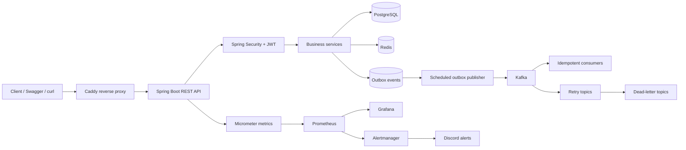
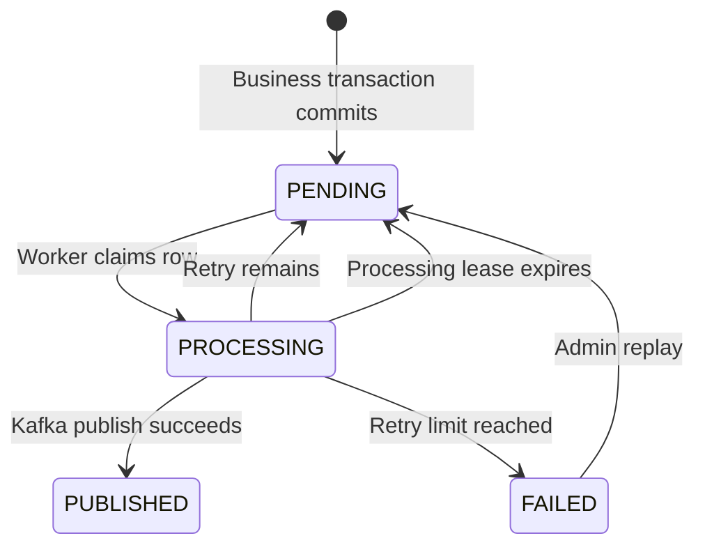

# Spring Boot E-Commerce Backend

[](https://github.com/ravan-chuang/spring-boot-ecommerce-backend/actions/workflows/ci.yml)
[](https://openjdk.org/)
[](https://spring.io/projects/spring-boot)
[](LICENSE)

A production-oriented e-commerce backend focused on reliability, distributed systems, security, concurrency correctness, observability, and automated quality—not only CRUD APIs.

The system combines JWT authentication, refresh-token rotation, PostgreSQL, Redis, Kafka, a transactional outbox, idempotent processing, Prometheus/Grafana monitoring, Testcontainers, and production-style Docker networking.

## Why This Project

Typical portfolio backends stop at REST endpoints and database persistence. This project also demonstrates how a backend handles:

- durable event publication without an unsafe database/Kafka dual write;
- duplicate HTTP requests and at-least-once message delivery;
- concurrent payment and inventory updates;
- retry exhaustion, dead-letter handling, and operator replay;
- short-lived access tokens and revocable multi-device sessions;
- metrics, alerting, failure simulation, and capacity testing;
- reproducible integration tests against real infrastructure.

## Verified Engineering Baseline

| Area | Current baseline |
|---|---|
| Automated tests | 66 passing, 0 failures, 0 errors |
| CI | GitHub Actions runs `clean verify` on pushes and pull requests |
| Quality | JaCoCo coverage gate enforced by Maven |
| Integration infrastructure | PostgreSQL, Redis, and Kafka through Testcontainers |
| Database evolution | 8 versioned Flyway migrations |
| Delivery | Local and production-style Docker Compose configurations |
| Performance evidence | Reproducible k6 scenarios and a documented local baseline |

## Architecture


```mermaid
flowchart LR
    Client[Client / Swagger / curl] --> Proxy[Caddy reverse proxy]
    Proxy --> API[Spring Boot REST API]
    API --> Security[Spring Security + JWT]
    Security --> Services[Business services]

    Services --> PostgreSQL[(PostgreSQL)]
    Services --> Redis[(Redis)]
    Services --> Outbox[(Outbox events)]

    Outbox --> Publisher[Scheduled outbox publisher]
    Publisher --> Kafka[Kafka]
    Kafka --> Consumers[Idempotent consumers]
    Kafka --> Retry[Retry topics]
    Retry --> DLT[Dead-letter topics]

    API --> Metrics[Micrometer metrics]
    Metrics --> Prometheus[Prometheus]
    Prometheus --> Grafana[Grafana]
    Prometheus --> Alertmanager[Alertmanager]
    Alertmanager --> Discord[Discord alerts]
```

The codebase separates controllers, security, business services, persistence, messaging, and monitoring. Business state and outbound events share a PostgreSQL transaction; Kafka publication and consumer side effects are independently recoverable.

## Core Engineering Capabilities

### Security and Session Management

- Stateless Spring Security with JWT access tokens.
- 15-minute access-token lifetime.
- Opaque refresh tokens with a 30-day lifetime; only SHA-256 token hashes are stored.
- Refresh-token rotation on every refresh operation.
- Multi-device sessions with session listing, single-session revocation, and logout-all.
- BCrypt password hashing.
- `USER` / `ADMIN` role authorization and resource ownership checks.
- Authentication audit logs and suspicious-login metrics.

### Reliability and Distributed Messaging

- Transactional Outbox for atomic business updates and event creation.
- PostgreSQL `FOR UPDATE SKIP LOCKED` claiming for safe multi-worker publication.
- Processing leases that recover events abandoned by interrupted publishers.
- Bounded retry governance with terminal `FAILED` state.
- Admin inspection and replay of failed outbox events.
- Kafka retry topics and dead-letter topics.
- Idempotent consumers backed by persisted processed-event records.
- Scheduled retention cleanup for processed-event and audit data.

### Data Consistency and Concurrency

- Payment idempotency through the `Idempotency-Key` request header.
- Database locking ensures concurrent requests with the same key create one payment.
- Optimistic locking protects product stock from lost updates.
- Transaction boundaries coordinate order, payment, inventory, and outbox changes.
- Integration tests verify concurrent payment, outbox-worker cooperation, and duplicate-message handling.

### Observability and Operations

- Spring Boot Actuator and Micrometer instrumentation.
- Prometheus scraping and alert rules.
- Provisioned Grafana dashboards for application, JVM, HTTP, and outbox behavior.
- Alertmanager routing with optional Discord notifications.
- Operational metrics for authentication failures and outbox states.
- Reproducible Kafka outage/recovery and suspicious-login incident workflows.
- k6 load, stress, soak, arrival-rate, and payment-idempotency scenarios.

## Transactional Outbox Lifecycle


```mermaid
stateDiagram-v2
    [*] --> PENDING: Business transaction commits
    PENDING --> PROCESSING: Worker claims row
    PROCESSING --> PUBLISHED: Kafka publish succeeds
    PROCESSING --> PENDING: Retry remains
    PROCESSING --> FAILED: Retry limit reached
    FAILED --> PENDING: Admin replay
    PROCESSING --> PENDING: Processing lease expires
```

Order and payment changes create their corresponding outbox records in the same database transaction:

```text
business data + PENDING outbox event
                ↓ one PostgreSQL commit
scheduled publisher claims event
                ↓
Kafka publish → PUBLISHED
       or
retry / FAILED → operator inspection and replay
```

Current domain topics include `order-created` and `payment-paid`.

## Technology Stack

| Area | Technologies |
|---|---|
| Language and framework | Java 25, Spring Boot 4.1.0, Maven Wrapper |
| API and security | Spring Web MVC, Spring Security, JWT, Bean Validation, OpenAPI/Swagger |
| Persistence | PostgreSQL 16, Spring Data JPA, Hibernate, Flyway |
| Cache and messaging | Redis 7, Apache Kafka 4.1.2, Spring Kafka |
| Reliability patterns | Transactional Outbox, retry topics, DLT, idempotent consumers |
| Observability | Actuator, Micrometer, Prometheus, Grafana, Alertmanager |
| Testing | JUnit, MockMvc, Testcontainers, JaCoCo, k6 |
| Delivery | Docker, Docker Compose, Caddy, GitHub Actions |

## API Overview

### Authentication

| Method | Endpoint | Access |
|---|---|---|
| `POST` | `/api/auth/register` | Public |
| `POST` | `/api/auth/login` | Public |
| `POST` | `/api/auth/refresh` | Public |
| `POST` | `/api/auth/logout` | Public |
| `GET` | `/api/auth/sessions` | Authenticated |
| `DELETE` | `/api/auth/sessions/{sessionId}` | Authenticated |
| `POST` | `/api/auth/sessions/logout-all` | Authenticated |

### Commerce

| Resource | Representative endpoints | Access |
|---|---|---|
| Products | `GET /api/products`, `GET /api/products/{id}` | Public |
| Product administration | `POST`, `PUT`, `DELETE /api/products/**` | Admin |
| Cart | `/api/users/{userId}/cart/**` | Owner or admin |
| Orders | `/api/users/{userId}/orders`, `/api/orders/{orderId}` | Owner or admin |
| Payments | `POST /api/orders/{orderId}/payments` | Owner or admin |
| Failed outbox events | `GET /api/admin/outbox/failed` | Admin |
| Outbox replay | `POST /api/admin/outbox/{eventId}/replay` | Admin |

Payment creation expects an `Idempotency-Key` header. Protected endpoints expect `Authorization: Bearer <access-token>`.

### Operational Endpoints

| Endpoint | Access |
|---|---|
| `/actuator/health` | Public |
| `/actuator/info` | Public |
| `/actuator/prometheus` | Public for local Prometheus scraping |
| `/actuator/metrics/**` | Admin |
| `/swagger-ui/index.html` | Public |
| `/v3/api-docs` | Public |

## Quick Start with Docker Compose

### Prerequisites

- Docker with Docker Compose v2
- Git

### 1. Configure the environment

```bash
git clone https://github.com/ravan-chuang/spring-boot-ecommerce-backend.git
cd spring-boot-ecommerce-backend
cp .env.example .env
```

Replace every placeholder in `.env`, especially `POSTGRES_PASSWORD`, `DB_PASSWORD`, `JWT_SECRET`, and `GRAFANA_ADMIN_PASSWORD`. Generate a JWT secret with:

```bash
openssl rand -base64 64
```

Never commit `.env` or real credentials.

### 2. Start the complete local stack

```bash
docker compose up --build -d
docker compose ps
```

Default local URLs:

| Service | URL |
|---|---|
| Application | http://localhost:8080 |
| Swagger UI | http://localhost:8080/swagger-ui/index.html |
| Health | http://localhost:8080/actuator/health |
| Prometheus | http://localhost:9090 |
| Grafana | http://localhost:3000 |
| Alertmanager | http://localhost:9093 |

View application logs:

```bash
docker compose logs -f app
```

Stop the stack while preserving volumes:

```bash
docker compose down
```

To also remove local database and Grafana volumes, use `docker compose down -v` only when the data is no longer needed.

## Local Application Development

Requirements: JDK 25 and Docker.

Start only the infrastructure services:

```bash
docker compose up -d postgres redis kafka
```

Export values matching your `.env`, then run the application:

```bash
export DB_URL=jdbc:postgresql://localhost:5433/spring_boot_lab
export DB_USERNAME=<your-postgres-user>
export DB_PASSWORD=<your-postgres-password>
export REDIS_HOST=localhost
export REDIS_PORT=6379
export KAFKA_BOOTSTRAP_SERVERS=localhost:9092
export JWT_SECRET=<your-generated-secret>

./mvnw spring-boot:run
```

Flyway applies the schema automatically. Hibernate is configured with `ddl-auto=validate`, so schema drift fails fast instead of silently changing the database.

## Testing and Quality Gates

Run the complete verification lifecycle:

```bash
./mvnw clean verify
```

This executes unit and integration tests, generates the JaCoCo report, and enforces the configured coverage threshold. Reports are written to:

- `target/surefire-reports/`
- `target/site/jacoco/index.html`

The suite covers authentication and token rotation, authorization, order flow, payment idempotency, Kafka retry/DLT behavior, consumer idempotency, outbox claiming and recovery, retention cleanup, metrics, and exception handling.

CI repeats `./mvnw clean verify` on pushes to `main` and on pull requests, then uploads test and coverage reports as workflow artifacts.

## Performance Testing

The `load-tests/` directory contains reproducible k6 scenarios. Example:

```bash
k6 run load-tests/catalog-read.js
```

Documented local catalog-read baseline (MacBook Pro M3 Max, Docker Compose, peak 50 virtual users):

| Metric | Result |
|---|---:|
| Requests | 9,544 |
| Average throughput | 79.44 req/s |
| Average latency | 9.92 ms |
| P95 latency | 17.93 ms |
| P99 latency | 20.12 ms |
| Failed requests | 0.00% |

These results are a reproducible local baseline, not a production capacity claim. The workload includes a 300 ms think time and is intentionally rate-limited. See [`reports/performance-baseline.md`](reports/performance-baseline.md) for the test profile and interpretation.

## Production-Style Deployment

The production Compose overlay removes direct host exposure for PostgreSQL, Redis, Kafka, the application, and monitoring services. Caddy is the public entry point.

```bash
docker compose -f docker-compose.yml -f docker-compose.prod.yml up --build -d
```

Set `CADDY_SITE_ADDRESS` in `.env` to `http://localhost` for local evaluation or to a real domain for Caddy-managed HTTPS. The production Spring profile disables SQL logging, limits health details, and uses conservative Kafka timeout/retry settings.

This repository demonstrates production-oriented configuration, but real deployment still requires a managed secret store, TLS/domain configuration, backup and restore procedures, infrastructure hardening, and environment-specific operational review.

## Project Structure

```text
.
├── .github/workflows/ci.yml        # Build, tests, coverage, artifacts
├── infrastructure/caddy/           # Reverse-proxy configuration
├── load-tests/                     # k6 load and concurrency scenarios
├── observability/
│   ├── alertmanager/               # Notification routing
│   ├── grafana/                    # Provisioned dashboards/data sources
│   └── prometheus/                 # Scraping and alert rules
├── reports/                        # Reproducible performance evidence
├── src/main/java/                  # API, security, services, persistence, messaging
├── src/main/resources/
│   └── db/migration/               # Flyway schema history
├── src/test/                       # Unit and infrastructure-backed integration tests
├── docker-compose.yml              # Complete local stack
├── docker-compose.prod.yml         # Private-network production overlay
├── Dockerfile
└── pom.xml
```

## Failure Scenarios Demonstrated

The project is designed to make failure behavior inspectable rather than implicit:

1. **Kafka unavailable:** the outbox preserves committed events and retries publication.
2. **Retry exhaustion:** the event becomes `FAILED`, appears in admin inspection, and can be replayed.
3. **Publisher interruption:** an expired processing lease returns the event to recoverable work.
4. **Duplicate Kafka delivery:** a persisted processed-event key prevents duplicate side effects.
5. **Repeated payment request:** the idempotency key returns one logical payment result.
6. **Concurrent stock updates:** optimistic locking detects conflicting writes.
7. **Suspicious login failures:** authentication metrics feed Prometheus alert evaluation.

## Engineering Scope and Limitations

This is a portfolio system and learning environment, not a hosted commercial payment platform. It intentionally demonstrates backend engineering patterns with a compact e-commerce domain.

Current boundaries include:

- no integration with a real payment provider;
- single-node local Kafka and database defaults;
- no Kubernetes, managed cloud services, or multi-region deployment;
- load-test evidence is machine- and workload-specific;
- production secret management and backup automation remain deployment responsibilities.

## Roadmap

- Add contract and end-to-end API tests.
- Introduce OpenTelemetry distributed tracing.
- Add backup/restore drills and disaster-recovery documentation.
- Validate multi-instance application behavior under longer soak tests.
- Add a real payment-provider sandbox behind an adapter interface.
- Package deployment manifests for a managed container platform.

## License

Distributed under the [MIT License](LICENSE).
