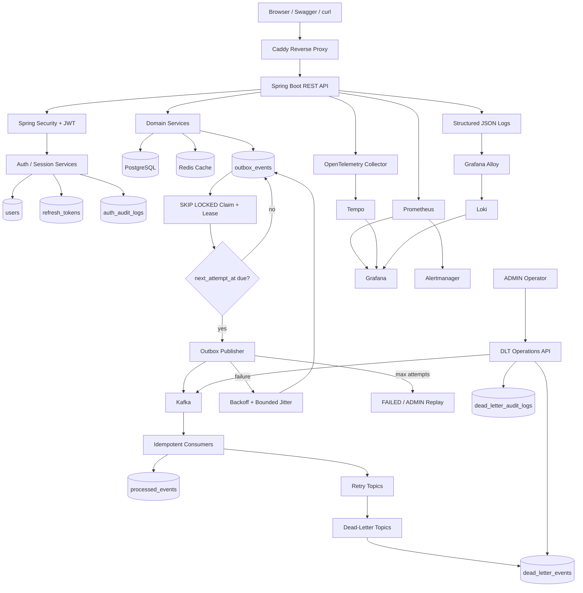

# Spring Boot E-Commerce Backend

[](https://github.com/ravan-chuang/spring-boot-ecommerce-backend/actions/workflows/ci.yml)

A production-minded, distributed event-driven e-commerce backend built with Java 25, Spring Boot 4.1.0, PostgreSQL, Redis, and Kafka. The system combines transactional correctness, secure session management, durable event delivery, governed dead-letter recovery, observability, and executable reliability verification.

This is intentionally more than a CRUD project. It demonstrates how a backend contains the database/Kafka dual-write problem, coordinates concurrent workers, rejects duplicate payment requests, recovers from broker outages, preserves operator audit history, and verifies backup restoration against a disposable PostgreSQL database.

**Current verified release:** `v1.3.0-phase21-reliability`  
**Merged milestone:** PR #27, Phase 2.1 reliability verification  
**Verification date:** 2026-08-07

---

## Highlights

- JWT access tokens with opaque refresh-token rotation, revocation, and multi-device session management
- USER / ADMIN authorization, self-service ownership checks, and deny-by-default route handling
- Payment idempotency with database uniqueness, SHA-256 request fingerprints, persisted replay metadata, response snapshot data, and expiry
- Transactional Outbox with `FOR UPDATE SKIP LOCKED`, processing leases, `next_attempt_at`, exponential backoff, bounded jitter, terminal `FAILED`, and ADMIN replay
- Kafka retry topics, idempotent consumers, persisted dead-letter intake, quarantine, audited replay, and replay-lease recovery
- End-to-end correlation IDs across HTTP, MDC, outbox rows, Kafka headers, consumers, DLT evidence, structured logs, and traces
- OpenTelemetry, Prometheus, Grafana, Tempo, Loki, Alloy, Alertmanager, SLO recording rules, and runbook-linked alerts
- Executed Kafka outage, Outbox backlog/recovery, failed-login, and PostgreSQL backup/restore drills
- 146 automated tests with 0 failures, 0 errors, and 0 skipped tests
- JaCoCo instruction coverage of 89.78% and branch coverage of 73.63%, both above the committed regression baseline
- Flyway V1-V11 validated on PostgreSQL 16
- GitHub Actions CI and CodeQL verification, Dependabot maintenance, and release tag `v1.3.0-phase21-reliability`
- Docker Compose delivery with health checks, dependency readiness, graceful shutdown, and a Caddy production-style edge

---

## Tech Stack

| Area | Technologies |
|---|---|
| Language / Framework | Java 25, Spring Boot 4 |
| API / Security | Spring Web, Spring Security, JWT, Swagger / OpenAPI |
| Persistence | PostgreSQL, Spring Data JPA, Hibernate, Flyway |
| Cache / Messaging | Redis, Apache Kafka, Spring Kafka |
| Reliability | Transactional Outbox, retry topics, persisted DLT operations, idempotent consumers |
| Observability | Actuator, Micrometer, OpenTelemetry, Prometheus, Grafana, Tempo, Loki, Alloy, Alertmanager |
| Testing | JUnit, MockMvc, Testcontainers |
| Delivery | Docker, Docker Compose, GitHub Actions, Maven |

---

## Architecture


```mermaid
flowchart TD
    Client[Browser / Swagger / curl] --> Caddy[Caddy Reverse Proxy]
    Caddy --> API[Spring Boot REST API]
    API --> Security[Spring Security + JWT]
    Security --> Auth[Auth / Session Services]
    Auth --> Users[(users)]
    Auth --> RefreshTokens[(refresh_tokens)]
    Auth --> AuthAudit[(auth_audit_logs)]

    API --> Domain[Domain Services]
    Domain --> PostgreSQL[(PostgreSQL)]
    Domain --> Redis[(Redis Cache)]
    Domain --> Outbox[(outbox_events)]

    Outbox --> Claim[SKIP LOCKED Claim + Lease]
    Claim --> Due{next_attempt_at due?}
    Due -->|yes| Publisher[Outbox Publisher]
    Due -->|no| Outbox
    Publisher --> Kafka[Kafka]
    Publisher -->|failure| RetryPolicy[Backoff + Bounded Jitter]
    RetryPolicy --> Outbox
    Publisher -->|max attempts| Failed[FAILED / ADMIN Replay]

    Kafka --> Consumer[Idempotent Consumers]
    Consumer --> Processed[(processed_events)]
    Consumer --> RetryTopics[Retry Topics]
    RetryTopics --> DLT[Dead-Letter Topics]
    DLT --> DLTStore[(dead_letter_events)]
    Operator[ADMIN Operator] --> DLTAPI[DLT Operations API]
    DLTAPI --> DLTStore
    DLTAPI --> Kafka
    DLTAPI --> DLTAudit[(dead_letter_audit_logs)]

    API --> Prometheus[Prometheus]
    API --> OTel[OpenTelemetry Collector]
    API --> JSONLogs[Structured JSON Logs]
    OTel --> Tempo[Tempo]
    JSONLogs --> Alloy[Grafana Alloy]
    Alloy --> Loki[Loki]
    Prometheus --> Grafana[Grafana]
    Tempo --> Grafana
    Loki --> Grafana
    Prometheus --> Alertmanager[Alertmanager]
```

### Distributed-system scope

The project is accurately described as a **small-scale distributed event-driven backend system**. The application, PostgreSQL, Redis, Kafka, and telemetry services run as separate networked processes and exercise real distributed-systems concerns: partial failure, at-least-once delivery, duplicate processing, retry scheduling, durable coordination, idempotency, correlation, and recovery.

The current deployment is still a **single-host Docker Compose topology** with one application instance, one Kafka broker, one PostgreSQL node, and one Redis node. It is production-minded and distribution-aware, but it is not yet a highly available multi-node production platform.

---

## Core Features

### Authentication, Refresh Tokens, and Session Management

The project uses short-lived JWT access tokens and long-lived opaque refresh tokens.

```text
Access token
→ JWT
→ 15-minute lifetime
→ sent in Authorization: Bearer <token>

Refresh token
→ cryptographically random opaque token
→ 30-day lifetime
→ only SHA-256 hash is stored in PostgreSQL
→ rotated on refresh
→ can be revoked by logout or session management APIs
```

### Authentication flow

```text
Register / Login
→ accessToken + refreshToken

Refresh
→ validate refresh token
→ revoke old refresh token
→ create replacement refresh token
→ return new accessToken + refreshToken

Logout
→ revoke supplied refresh token

Logout one session
→ revoke every active refresh token in that session chain

Logout all sessions
→ revoke all active refresh tokens for the current user
```

### Auth APIs

```text
POST   /api/auth/register                    Public
POST   /api/auth/login                       Public
POST   /api/auth/refresh                     Public
POST   /api/auth/logout                      Public

GET    /api/auth/sessions                    Authenticated
DELETE /api/auth/sessions/{sessionId}        Authenticated
POST   /api/auth/sessions/logout-all         Authenticated
```

### Session tracking

Each refresh-token session records:

```text
sessionId
deviceName
ipAddress
createdAt
lastUsedAt
expiresAt
```

Refresh-token rotation keeps the same `sessionId`, so token replacement still represents the same device session.

### Authorization rules

```text
GET    /api/products/**                      Public
POST   /api/products                         ADMIN only
PUT    /api/products/**                      ADMIN only
DELETE /api/products/**                      ADMIN only

/api/users/{userId}/cart/**                  User owner or ADMIN
/api/users/{userId}/orders/**                User owner or ADMIN
/api/orders/{orderId}/payments               Order owner or ADMIN

GET    /api/admin/outbox/failed              ADMIN only
POST   /api/admin/outbox/{eventId}/replay    ADMIN only

GET    /api/admin/dlt/events                 ADMIN only
GET    /api/admin/dlt/events/{eventId}       ADMIN only
GET    /api/admin/dlt/events/{eventId}/audit ADMIN only
POST   /api/admin/dlt/events/{eventId}/quarantine ADMIN only
POST   /api/admin/dlt/events/{eventId}/replay     ADMIN only

GET    /actuator/health                      Public
GET    /actuator/info                        Public
GET    /actuator/prometheus                  Public for local Prometheus scraping
GET    /actuator/metrics/**                  ADMIN only
```

---

## Transactional Outbox and Kafka Delivery

Order and payment changes must not commit independently from their outbound Kafka events. The project uses a Transactional Outbox so the business state and durable event intent share one PostgreSQL transaction.

```text
Create Order / Pay Order
→ persist business data
→ persist PENDING outbox event in the same PostgreSQL transaction
→ commit once
→ publisher claims only due events
→ publish synchronously and wait for Kafka acknowledgement
→ mark PUBLISHED
```

### Event topics

```text
order-created
payment-paid
```

### Outbox states and scheduling

```text
PENDING      Durable event waiting for its next eligible attempt
PROCESSING   Claimed by one publisher instance under a processing lease
PUBLISHED    Kafka acknowledged the record
FAILED       Maximum attempts reached; operator action required
```

Flyway V11 adds `next_attempt_at` and a partial pending-event index:

```sql
CREATE INDEX idx_outbox_events_pending_next_attempt
ON outbox_events (next_attempt_at, created_at)
WHERE status = 'PENDING';
```

The claim query selects only events whose retry time is due. Failed sends are returned to `PENDING` with a calculated next attempt:

```text
base delay × 2^(retry_count)
→ capped at configured maximum
→ randomized by bounded jitter
→ stored in next_attempt_at
```

Default configuration:

```properties
outbox.publisher.retry-base-delay-seconds=5
outbox.publisher.retry-max-delay-seconds=300
outbox.publisher.retry-jitter-factor=0.20
```

### Multi-instance-safe claiming

The publisher uses PostgreSQL row locking:

```sql
SELECT ...
FROM outbox_events
WHERE status = 'PENDING'
  AND (next_attempt_at IS NULL OR next_attempt_at <= :now)
ORDER BY next_attempt_at, created_at
FOR UPDATE SKIP LOCKED
LIMIT :limit;
```

This allows cooperating publisher instances to claim separate due events without overlapping ownership. A processing lease returns abandoned `PROCESSING` records to `PENDING` after an interrupted worker.

### Failed-event replay

ADMIN users can inspect terminal events and return them to immediate eligibility:

```text
GET  /api/admin/outbox/failed
POST /api/admin/outbox/{eventId}/replay
```

Replay behavior:

```text
FAILED
→ PENDING
→ retry_count reset
→ last_error cleared
→ next_attempt_at reset to immediate eligibility
→ publisher retries Kafka delivery
```

### Verified failure behavior

The executed reliability drill stopped Kafka, inserted synthetic Outbox records, observed a claimed record remain `PROCESSING` while the synchronous producer waited for failure, and then confirmed a scheduled retry after the producer timeout. During the same outage, 54 pending events were observed. After Kafka recovery, 55 synthetic events were published and the backlog drained.

---

## Kafka Retry, DLT, and Consumer Idempotency

### Consumer retry policy

Malformed or temporarily unprocessable messages use non-blocking retry topics:

```text
Initial failure
→ retry after 1 second
→ retry after 2 seconds
→ retry after 4 seconds
→ dead-letter topic
```

### Idempotent consumers

Kafka provides at-least-once delivery semantics, so duplicate delivery is possible.

The outbox publisher attaches an event header:

```text
outbox-event-id: <UUID>
```

Consumers use this ID with the consumer name as a deduplication key:

```text
processed_events
(event_id, consumer_name)
```

Processing flow:

```text
Kafka event arrives
→ insert processed-event marker
→ first insert succeeds: run business side effect
→ duplicate insert conflicts: skip duplicate delivery
```

The marker and business side effect run in one database transaction:

```text
business action succeeds
→ marker commits

business action fails
→ transaction rolls back
→ marker is removed
→ retry can safely process again
```

The `ORDER_CREATED` consumer writes an auditable side effect to:

```text
order_event_audit
```

Verified behavior:

```text
same event delivered twice
→ processed_events contains 1 row
→ order_event_audit contains 1 row
→ duplicate side effect is prevented
```

### Governed dead-letter operations

Terminal Kafka records are not left as broker-only artifacts. The DLT handler persists bounded operational evidence in PostgreSQL:

```text
dead_letter_events
  DLT and original topic / partition / offset
  message key and payload
  bounded Base64-encoded Kafka headers
  outbox event ID and correlation ID
  exception class and message
  operator state, timestamps, actor IDs, and replay attempts

dead_letter_audit_logs
  action
  actor ID and email
  operator reason / outcome
  timestamp
```

The unique DLT coordinate prevents duplicate intake, and JPA optimistic versioning plus pessimistic transition locks protect concurrent operator actions.

```text
RECEIVED
  -> QUARANTINED       explicit ADMIN review with required reason
  -> REPLAYING         database reservation before Kafka send
  -> REPLAYED          Kafka acknowledgement and audited completion

REPLAYING
  -> QUARANTINED       send failure or expired 60-second replay lease
```

Replay preserves the original topic, partition, key, payload, outbox-event ID, and correlation ID. A failed send returns the record to quarantine rather than leaving it stuck in an ambiguous state.

```text
GET  /api/admin/dlt/events?status=RECEIVED&page=0&size=20
GET  /api/admin/dlt/events/{eventId}
GET  /api/admin/dlt/events/{eventId}/audit
POST /api/admin/dlt/events/{eventId}/quarantine
POST /api/admin/dlt/events/{eventId}/replay
```

Operator procedures are documented in `observability/runbooks/dlt-operations.md`.

---

## Payment Idempotency and Stock Consistency

### Payment idempotency

The payment endpoint requires an `Idempotency-Key`. PostgreSQL enforces one payment per order and one replay record per `(idempotency_key, request_path)`.

Each replay record stores:

- a SHA-256 request fingerprint;
- the request path and idempotency key;
- response status and payment reference;
- persisted response snapshot metadata;
- a 24-hour expiry timestamp.

Reusing the same key for a different request is rejected. Concurrent duplicate submissions resolve to one logical payment and one replay record.

### Order state and stock consistency

- Product stock uses JPA optimistic locking.
- Payment obtains a pessimistic lock on the order before changing `PENDING` to `PAID`.
- Cancellation uses the same order lock, restores stock, and changes `PENDING` to `CANCELLED`.
- Database uniqueness prevents duplicate payment rows.

The repository contains payment concurrency and terminal-state conflict coverage. A dedicated high-iteration cancel-versus-pay race drill remains a useful additional hardening item before claiming production-proven behavior under sustained contention.

---

## Flyway Schema Migrations

Flyway manages all PostgreSQL schema changes, while Hibernate uses `ddl-auto=validate`.

```text
V1__init_schema.sql
V2__create_outbox_events.sql
V3__add_outbox_processing_lease.sql
V4__create_processed_events.sql
V5__create_order_event_audit.sql
V6__create_refresh_tokens.sql
V7__add_refresh_token_sessions.sql
V8__create_auth_audit_logs.sql
V9__harden_payment_idempotency.sql
V10__create_dead_letter_operations.sql
V11__add_outbox_retry_schedule.sql
```

V11 introduces:

```text
outbox_events.next_attempt_at
idx_outbox_events_pending_next_attempt
```

The migration was applied against the running PostgreSQL 16 Compose database, and the disposable restore drill independently confirmed Flyway V1-V11, the new column, and the partial pending-retry index.

---

## Authentication Audit Logs and Security Monitoring

Authentication events are stored in:

```text
auth_audit_logs
```

Recorded fields include:

```text
user_id
event_type
outcome
ip_address
device_name
details
created_at
```

Audited actions include:

```text
register
login
refresh
logout
session_revoke
sessions_revoke_all
```

Failed auth attempts use an independent transaction, so an audit record remains persisted even when the API request returns an error.

### Authentication metrics

Micrometer exports:

```text
auth.events{action="login",outcome="success"}
auth.events{action="login",outcome="failure"}
auth.events{action="refresh",outcome="success"}
auth.events{action="refresh",outcome="failure"}
auth.events{action="logout",outcome="success"}
auth.events{action="session_revoke",outcome="success"}
auth.events{action="sessions_revoke_all",outcome="success"}
```

Prometheus exposes these as:

```text
auth_events_total
```

Example query:

```promql
increase(auth_events_total{action="login",outcome="failure"}[5m])
```

---

## Observability

### Actuator endpoints

```text
/actuator/health
/actuator/info
/actuator/prometheus
/actuator/metrics/**
```

### Correlation, traces, and structured logs

Every HTTP request receives an `X-Correlation-ID` response header. A safe caller-supplied value is reused; invalid or missing values are replaced with a UUID. The same identifier is persisted on outbox records and propagated through Kafka with the `correlation-id` header.

```text
HTTP X-Correlation-ID
  -> MDC correlationId
  -> outbox_events.correlation_id
  -> Kafka correlation-id header
  -> consumer MDC
  -> dead_letter_events.correlation_id
```

The production profile enables the Spring Boot OpenTelemetry starter and exports sampled OTLP/HTTP traces to the OpenTelemetry Collector, which batches and sends them to Tempo. The default production sample probability is 10% and is configurable with `TRACING_SAMPLING_PROBABILITY`.

Production console logging uses Spring Boot's Logstash-compatible structured JSON. MDC fields, including `traceId`, `spanId`, and `correlationId`, are available for cross-navigation between Grafana logs and traces. Payloads are intentionally excluded from normal consumer and DLT logs.

```text
Application traces -> OpenTelemetry Collector -> Tempo -> Grafana
Container JSON logs -> Grafana Alloy -> Loki -> Grafana
Application metrics -> Prometheus -> Grafana / Alertmanager
```

The Docker socket mounted into Alloy is appropriate only for this controlled single-host Compose environment. A production orchestrator should use a narrower log collection integration and platform-native access controls.

### Outbox metrics

```text
outbox.events{status=PENDING}
outbox.events{status=PROCESSING}
outbox.events{status=FAILED}

outbox.publish.success
outbox.publish.failure
outbox.events.claimed
outbox.processing.recovered
```

Prometheus names:

```text
outbox_events
outbox_publish_success_total
outbox_publish_failure_total
outbox_events_claimed_total
outbox_processing_recovered_total
```

### Dead-letter metrics

```text
dlt_events{status="RECEIVED|QUARANTINED|REPLAYING|REPLAYED"}
dlt_captured_total
dlt_quarantined_total
dlt_replay_success_total
dlt_replay_failure_total
dlt_replay_recovered_total
```

### Service-level objectives

Prometheus loads seven recording rules from `observability/prometheus/slo-rules.yml`. The current portfolio objectives are:

| Indicator | Objective | Window / trigger |
|---|---:|---|
| HTTP availability | 99.5% | Rolling 30 days; non-5xx / all requests |
| HTTP latency | P95 <= 750 ms | Rolling 5 minutes |
| DLT review | No RECEIVED record older than 15 minutes | Continuous |
| Replay lease | No REPLAYING record beyond two 60-second leases | Continuous |

Multi-window burn-rate alerts use 14.4x fast-burn and 6x slow-burn thresholds. The full definition and operating policy are in `observability/slo/README.md`.

### Grafana dashboards

Grafana is provisioned automatically with Prometheus, Loki, and Tempo data sources plus two dashboards:

```text
observability/grafana/dashboards/outbox-dashboard.json
observability/grafana/dashboards/performance-dashboard.json
```

**Reliability & Security**

```text
Outbox Pending Events
Outbox Processing Events
Outbox Failed Events
Outbox Publish Rate
Outbox Worker Activity

Login Successes — Last 30m
Login Failures — Last 30m
Authentication Activity Rate
Session Security Actions — Last 30m
```

**Performance & Capacity**

```text
Catalog Request Rate
Catalog 5xx Error Rate
Catalog Latency — P95 / P99
JVM Heap Usage
Application CPU Usage
JVM Live Threads
HikariCP Connections
```

Grafana Explore can pivot from a structured log `traceId` to the matching Tempo trace. Tempo trace-to-logs navigation uses the provisioned Loki data source.

### Performance and capacity validation

The repository includes reproducible k6 scripts for the catalog read path:

```text
load-tests/catalog-read.js
load-tests/catalog-stress.js
load-tests/catalog-2_5k-soak.js
reports/performance-baseline.md
```

#### Verified local soak test

Endpoint: `GET /api/products`

| Metric | Result |
|---|---:|
| Load profile | 2,500 req/s for 5 minutes |
| Total requests | 750,000 |
| Achieved throughput | 2,499.91 req/s |
| P95 latency | 0.84 ms |
| P99 latency | 1.11 ms |
| Client-side request failure rate | 0.07% |
| Dropped iterations | 0 |
| Observed application-side 5xx | None |

During the soak test, Grafana showed stable JVM heap usage, process CPU around 4–5%, no HikariCP pending connections, low active database-connection usage, and stable JVM thread counts.

Run the local soak test:

```bash
docker run --rm \
  -e BASE_URL=http://host.docker.internal:8080 \
  -v "$PWD/load-tests:/scripts:ro" \
  grafana/k6 run /scripts/catalog-2_5k-soak.js
```

> This benchmark was executed locally through Docker Compose on macOS. It is not a cloud benchmark, production SLA, or production-capacity guarantee.

### Alerting

Prometheus evaluates alert rules. Alertmanager routes alerts to Discord.

```text
OutboxFailedEvents
OutboxPublishFailuresDetected
OutboxPendingBacklog
SpringBootApplicationDown
ExcessiveLoginFailures
DeadLetterEventsAwaitingReview
DeadLetterReplayLeaseStuck
DeadLetterReplayFailuresDetected
AvailabilityErrorBudgetFastBurn
AvailabilityErrorBudgetSlowBurn
HttpLatencyP95High
```

There are 11 validated alert rules. Availability alerts are tied to error-budget consumption, and application, outbox, DLT, and SLO alerts include repository runbook URLs.

`ExcessiveLoginFailures` fires when at least five failed logins occur during a five-minute window and the condition remains true for one minute.

```promql
increase(auth_events_total{action="login",outcome="failure"}[5m]) >= 5
```

> `increase()` may display a non-integer value because Prometheus extrapolates counter increases across the selected time window. This is expected.

### Verified incident workflows

The repository now includes `scripts/run_reliability_drills.sh`, which creates timestamped evidence under an ignored `verification/reliability_drills_*` directory and performs bounded cleanup.

#### 1. Kafka outage and Outbox retry scheduling

```text
Kafka stopped
→ five synthetic Outbox events inserted
→ events claimed under a processing lease
→ synchronous Kafka send fails after producer timeout
→ at least one event returns to PENDING
→ retry_count increments
→ next_attempt_at is scheduled by backoff + jitter
```

Verified result:

```text
Kafka outage drill: PASS
Kafka events with scheduled retry: 1
```

#### 2. Outbox backlog and recovery

```text
Kafka remains unavailable
→ 50 additional synthetic events inserted
→ backlog remains durable in PostgreSQL
→ Kafka restarts
→ publisher drains due records
```

Verified result:

```text
Pending events observed during outage: 54
Events published after recovery: 55
Backlog drained after recovery
```

#### 3. Suspicious failed-login activity

```text
50 invalid login attempts
→ HTTP failure responses captured
→ auth_audit_logs increases by 50
→ authentication metrics and alert rules remain queryable
```

Verified result:

```text
Login attack drill: PASS
Failed-login audit increase: 50
Application final health: healthy
```

These are controlled local reliability drills, not claims of multi-region resilience or commercial production availability.

### Local observability URLs

Development Compose mode exposes the following host ports:

```text
Swagger UI:     http://localhost:8080/swagger-ui/index.html
Prometheus:     http://localhost:9090
Grafana:        http://localhost:3000
Alertmanager:   http://localhost:9093
```

With the production Compose overlay, access the API and Swagger through Caddy instead:

```text
Health:         http://localhost/actuator/health
Swagger UI:     http://localhost/swagger-ui/index.html
```

Prometheus, Grafana, Alertmanager, OpenTelemetry Collector, Tempo, Loki, and Alloy remain private in the production-style stack.

Local Grafana credentials:

```text
username: admin
password: admin
```

For real deployment, do not publicly expose Prometheus, Grafana, Alertmanager, or `/actuator/prometheus`. Use private networking, a management network, IAM, HTTPS, and secret management.

---


## Production Deployment Preparation

The repository includes a production Docker Compose overlay and a Caddy reverse proxy.

```text
Internet
→ Caddy :80 / :443
→ Spring Boot application on the Docker network

Private Docker network
→ PostgreSQL
→ Redis
→ Kafka
→ Prometheus
→ Grafana
→ Alertmanager
→ OpenTelemetry Collector
→ Tempo
→ Loki
→ Grafana Alloy
```

### Production security posture

When starting with `docker-compose.yml` plus `docker-compose.prod.yml`:

```text
Caddy                 Public :80 / :443
Spring Boot app       Internal only
PostgreSQL            Internal only
Redis                 Internal only
Kafka                 Internal only
Prometheus            Internal only
Grafana               Internal only
Alertmanager          Internal only
OpenTelemetry         Internal only
Tempo                 Internal only
Loki                  Internal only
Grafana Alloy         Internal only
```

The production overlay removes host-port publishing for internal services. Caddy is the only public entry point.

Caddy blocks public access to sensitive metric endpoints:

```text
/actuator/prometheus  → 404 from the public reverse proxy
/actuator/metrics/**  → not intended for public exposure
```

Prometheus still scrapes the application through the private Docker network.

### Environment configuration

Real secrets are injected through a local `.env` file and are not tracked by Git.

```text
.env                   Ignored by Git; contains real local / deployment values
.env.example           Tracked template with required variable names
observability/secrets/ Ignored by Git; contains local Alertmanager webhook secret
```

Required values include:

```text
POSTGRES_PASSWORD
DB_PASSWORD
JWT_SECRET
GRAFANA_ADMIN_PASSWORD
OTEL_ENABLED
OTEL_EXPORTER_OTLP_TRACES_ENDPOINT
TRACING_SAMPLING_PROBABILITY
```

`JWT_SECRET` must be Base64-compatible because the application decodes it as a Base64 key.

Generate a suitable value:

```bash
openssl rand -base64 64 | tr -d '\n'
```

### Start the production-style local stack

```bash
docker compose \
  -f docker-compose.yml \
  -f docker-compose.prod.yml \
  --env-file .env \
  up -d --build
```

Verify the reverse proxy and health endpoint:

```bash
curl -i http://localhost/actuator/health
```

Expected indicators:

```text
HTTP/1.1 200 OK
Via: 1.1 Caddy
"status":"UP"
```

### Temporary public demo with Cloudflare Quick Tunnel

For short-lived portfolio demonstrations, expose the locally running Caddy endpoint through Cloudflare Quick Tunnel:

```bash
cloudflared tunnel --url http://127.0.0.1:80
```

The command prints a temporary `trycloudflare.com` URL. It can demonstrate:

```text
/actuator/health
/swagger-ui/index.html
```

Quick Tunnel is for temporary demos only:

```text
- URL changes every time the tunnel is restarted
- Tunnel stops when cloudflared exits, the Mac sleeps, or the network disconnects
- Do not publish a temporary URL in the README or resume
- Do not treat it as production hosting
```

For persistent hosting, use a real domain, named Cloudflare Tunnel or cloud VM, HTTPS, private observability networking, and external secret management.

---

## Spring Profiles

```text
application.properties
→ shared configuration

application-local.properties
→ fast failure settings for local alert demos

application-prod.properties
→ conservative Kafka retry and timeout settings

src/test/resources/application.properties
→ test profile defaults
```

The Docker Compose app service defaults to the local profile:

```yaml
SPRING_PROFILES_ACTIVE: ${SPRING_PROFILES_ACTIVE:-local}
```

Start with production settings:

```bash
SPRING_PROFILES_ACTIVE=prod docker compose up -d --build app
```

---

## Docker Compose

The full local stack includes:

```text
Spring Boot application
PostgreSQL
Redis
Kafka
Prometheus
Grafana
Alertmanager
OpenTelemetry Collector
Tempo
Loki
Grafana Alloy
Caddy reverse proxy (production overlay)
```

Start development Compose mode:

```bash
docker compose up -d --build
```

Start production-style Compose mode:

```bash
docker compose   -f docker-compose.yml   -f docker-compose.prod.yml   --env-file .env   up -d --build
```

Stop:

```bash
docker compose down
```

Kafka listeners:

```text
Host machine:                localhost:9092
Spring Boot container:       kafka:29092
```

PostgreSQL, Redis, Kafka, and the application have Compose health checks. Dependency startup uses health conditions, and the application uses graceful shutdown with a 30-second shutdown-phase timeout.

### Operational drills and runbooks

```text
scripts/postgres_backup.sh
scripts/postgres_restore_verify.sh
scripts/run_reliability_drills.sh
scripts/privacy_retention_check.sh
scripts/secret_rotation_check.sh

observability/runbooks/application-down.md
observability/runbooks/outbox-failure.md
observability/runbooks/dlt-operations.md
observability/runbooks/high-error-rate.md
observability/runbooks/backup-restore.md
observability/runbooks/secret-rotation.md
observability/runbooks/privacy-retention.md
```

The executed PostgreSQL drill produced a custom-format backup, verified its SHA-256 checksum, restored it into `spring_boot_lab_phase21_restore_verify`, and checked:

- Flyway V1-V11 history;
- row counts for users, orders, payments, Outbox, authentication audit, and DLT tables;
- `next_attempt_at` type and nullability;
- `idx_outbox_events_pending_next_attempt`;
- DLT, audit, and idempotency primary, foreign-key, and unique constraints.

The disposable database was removed by the cleanup trap. Backup artifacts remain ignored under `backups/`. This verifies restore mechanics in the local Compose environment; it does not establish a production RPO or RTO.

The reliability script performs Kafka outage, Outbox backlog/recovery, and failed-login drills, captures evidence, verifies final health, restarts Kafka during cleanup, and deletes synthetic records.

---

## Local Development

Start infrastructure and application:

```bash
docker compose up -d postgres redis kafka
./mvnw spring-boot:run
```

Open Swagger:

```text
http://localhost:8080/swagger-ui/index.html
```

Reset local data and rerun migrations:

```bash
docker compose down -v
docker compose up -d
```

---

## Testing

The suite uses Testcontainers with real PostgreSQL, Redis, and Kafka infrastructure.

Run the complete verification lifecycle:

```bash
./mvnw --batch-mode --no-transfer-progress clean verify
python3 scripts/coverage_baseline.py
docker compose config --quiet
git diff --check
```

Verified result on 2026-08-07:

```text
Tests run: 146, Failures: 0, Errors: 0, Skipped: 0
BUILD SUCCESS
Coverage baseline check passed
```

| Evidence | Result |
|---|---:|
| Automated tests | 146 passed |
| Test failures / errors / skipped | 0 / 0 / 0 |
| Instruction coverage | 89.78% |
| Branch coverage | 73.63% |
| JaCoCo gate | Instruction >= 70%, branch >= 50% |
| Regression baseline | 81.48% instruction, 68.29% branch; maximum 0.50-point drop |
| Flyway | V1-V11 applied and validated |
| PostgreSQL restore verification | Passed against a disposable database |
| Kafka outage drill | Passed |
| Outbox backlog/recovery drill | Passed |
| Failed-login drill | Passed |
| Docker Compose model | `docker compose config --quiet` passed |
| Secret-pattern scan | No findings in the checked repository scope |
| CI / CodeQL | Passed on the Phase 2.1 branch before merge |

New Phase 2.1 behavioral coverage includes:

- exponential backoff growth;
- bounded jitter;
- maximum-delay capping;
- immediate first-attempt eligibility;
- replay resetting an event for immediate processing;
- due-time filtering in the claim query;
- concurrent non-overlapping claims with `SKIP LOCKED`;
- retry scheduling after Kafka publication failure;
- transition to `FAILED` after maximum attempts;
- Flyway V11 runtime migration;
- executed incident and restore drills.

The broader suite also covers authentication, authorization, session rotation, payment idempotency, stock locking, Kafka retry-to-DLT behavior, governed DLT operations, consumer deduplication, retention, correlation propagation, metrics authorization, and application startup.

For Docker Desktop on macOS:

```bash
export DOCKER_HOST=unix://$HOME/.docker/run/docker.sock
```

The repository also includes `src/test/resources/docker-java.properties` for a compatible Docker Java API version.

---

## Example API Flow

```text
Register / Login
→ Authorize Swagger with accessToken
→ ADMIN creates product
→ USER adds product to cart
→ USER creates order
→ USER pays with Idempotency-Key
→ Outbox publishes Kafka events
```

Example login request:

```bash
curl -X POST http://localhost:8080/api/auth/login \
  -H "Content-Type: application/json" \
  -d '{
    "email": "demo-user@example.com",
    "password": "password123"
  }'
```

The response returns:

```json
{
  "status": 200,
  "message": "Login successfully",
  "data": {
    "accessToken": "<JWT_ACCESS_TOKEN>",
    "refreshToken": "<OPAQUE_REFRESH_TOKEN>",
    "tokenType": "Bearer",
    "userId": 1,
    "email": "demo-user@example.com",
    "role": "USER"
  }
}
```

Use the access token with:

```http
Authorization: Bearer <JWT_ACCESS_TOKEN>
```

Refresh:

```bash
curl -X POST http://localhost:8080/api/auth/refresh \
  -H "Content-Type: application/json" \
  -d '{
    "refreshToken": "<OPAQUE_REFRESH_TOKEN>"
  }'
```

---

## Project Structure

```text
src/main/java/com/ravan/SpringBootLab
├── controller
├── service
├── repository
├── model
├── dto
├── security
├── observability
└── config

src/main/resources
├── application.properties
├── application-local.properties
├── application-prod.properties
└── db/migration

observability
├── prometheus
├── grafana
├── alertmanager
├── otel-collector
├── tempo
├── loki
├── alloy
├── slo
├── runbooks
└── secrets                 # ignored by Git

scripts
├── postgres_backup.sh
├── postgres_restore_verify.sh
├── privacy_retention_check.sh
└── secret_rotation_check.sh

load-tests
├── catalog-read.js
├── catalog-stress.js
└── catalog-2_5k-soak.js

reports
└── performance-baseline.md

infrastructure
└── caddy
    └── Caddyfile

.env.example                # tracked environment template
docker-compose.prod.yml     # production Compose overlay
```

---

## Engineering Concepts Practiced

- REST API design, layered architecture, and deny-by-default authorization
- JWT access control, opaque refresh-token rotation, revocation, and multi-device sessions
- PostgreSQL transactions, pessimistic and optimistic locking, and Flyway migration discipline
- Payment idempotency, request fingerprinting, replay metadata, response snapshots, and expiry
- Redis caching
- Kafka event-driven delivery, retry topics, dead-letter topics, and at-least-once semantics
- Transactional Outbox, due-time scheduling, exponential backoff, bounded jitter, leases, and terminal failure governance
- Multi-worker coordination with `FOR UPDATE SKIP LOCKED`
- Idempotent consumers with transactionally persisted processed-event markers
- Persisted DLT state machines, operator authorization, audit trails, replay reservations, and lease recovery
- Correlation IDs, MDC hygiene, structured JSON logging, and OpenTelemetry tracing
- Prometheus metrics, SLI recording rules, error-budget alerts, Grafana dashboards, Loki, Tempo, and Alloy
- Failure injection, backlog recovery, failed-login auditing, and backup/restore verification
- Testcontainers integration testing, JaCoCo regression gates, CI, CodeQL, and release tagging
- Evidence boundaries that distinguish local verification from production-proven capability

---

## Future Improvements

- Kubernetes Deployment, Service, Ingress, HPA, PodDisruptionBudget, and rolling-update verification
- Multiple Spring Boot instances with load balancing and failover testing
- Three-broker Kafka or a managed replicated Kafka service
- PostgreSQL replication, automated failover, connection pooling, and documented RPO/RTO
- Redis Sentinel, Redis Cluster, or a managed cache service
- Infrastructure as code for cloud networking, compute, IAM, secrets, DNS, and observability
- External secret manager, workload identity, image scanning, and SBOM generation
- Real payment-provider sandbox integration, signed webhooks, and reconciliation
- Rate limiting, temporary account lockout, password reset, email verification, and MFA
- Dedicated repeated cancel-versus-pay race testing under real PostgreSQL contention
- Representative write-path, million-event Kafka, soak, and recovery-throughput benchmarks
- Approved lifecycle and erasure policies for DLT, audit, Outbox, refresh-token, and idempotency data
- Production telemetry sampling, retention, cost controls, and alert tuning
- Long-running external synthetic checks, incident postmortems, MTTR evidence, and error-budget review

---

## Project Quality Status

### Continuous Integration

- GitHub Actions CI with `push`, `pull_request`, and `workflow_dispatch`
- Maven `clean verify`
- Testcontainers integration tests
- JaCoCo HTML/XML reports and committed coverage regression baseline
- Surefire and JaCoCo workflow artifacts
- CodeQL Java/Kotlin `security-extended` analysis
- Dependabot maintenance

### Current verified baseline

| Metric | Status |
|---|---:|
| Release | **v1.3.0-phase21-reliability** |
| Unit + integration tests | **146** |
| Failures / errors / skipped | **0 / 0 / 0** |
| Instruction coverage | **89.78%** |
| Branch coverage | **73.63%** |
| Coverage gate | **Instruction >= 70%, Branch >= 50%** |
| Coverage regression baseline | **Passed** |
| Flyway | **V1-V11 validated** |
| Reliability incident drills | **Passed** |
| PostgreSQL backup/restore drill | **Passed** |
| Local `clean verify` | **Passing** |
| Phase 2.1 branch CI / CodeQL | **Passing** |

Coverage is treated as a regression signal, while lock behavior, retry timing, failure recovery, deduplication, authorization, and restore evidence provide the stronger correctness argument.

---

## Repository Engineering Practices

- Pull-request based development and squash merges
- Conventional commit messages and milestone release tags
- GitHub Actions CI, CodeQL, Dependabot, and manual verification dispatch
- JaCoCo quality gates and coverage regression checks
- Testcontainers integration testing against real infrastructure
- Docker Compose development and production-style overlays
- Versioned Prometheus, Grafana, OpenTelemetry, Tempo, Loki, Alloy, and runbook configuration
- Guarded backup/restore and reliability drill scripts
- Tracked-secret checks and ignored runtime evidence / backup artifacts
- Explicit distinction between verified capability and production boundary
- MIT License

Cloud infrastructure as code is a planned next phase; the current repository uses versioned Compose and observability configuration but does not yet contain a complete Terraform or Pulumi deployment.

---

## Roadmap

### Completed: Phase 1 - P0 hardening

- Protected legacy user CRUD with ADMIN / self-service rules
- Added anonymous, cross-user, and role-boundary verification
- Hardened payment idempotency with uniqueness, fingerprinting, replay metadata, response data, and expiry
- Preserved order-state correctness with shared locking and concurrency coverage
- Maintained a passing coverage regression baseline

### Completed: Phase 2 and Phase 2.1 - event operations and reliability

- Governed DLT query, quarantine, replay, operator audit, metrics, and lease recovery
- Correlation IDs, structured logging, OpenTelemetry, Tempo, Loki, and Alloy
- `next_attempt_at`, exponential backoff, bounded jitter, and due-time claim filtering
- Kafka outage, Outbox backlog/recovery, and failed-login drills
- Executed PostgreSQL backup/checksum/disposable-restore verification
- 146 passing tests, Flyway V1-V11, CI, CodeQL, PR #27 merge, and release tag `v1.3.0-phase21-reliability`

### Next: Phase 3 - cloud-native and highly available delivery

1. Kubernetes deployment with rolling updates, health gates, autoscaling, and rollback evidence.
2. Infrastructure as code and a verified cloud deployment behind domain TLS.
3. Replicated or managed PostgreSQL, Kafka, and Redis topology with failover drills.
4. Large-scale write-path, Kafka throughput, recovery, and soak benchmarks.
5. SRE operating evidence: RPO/RTO, MTTR, postmortems, error-budget review, and scheduled restore drills.
6. Real payment-provider sandbox integration, signed webhooks, and reconciliation.
7. Managed secrets, IAM, SBOM, image scanning, retention automation, and privacy controls.

## License

MIT License.
