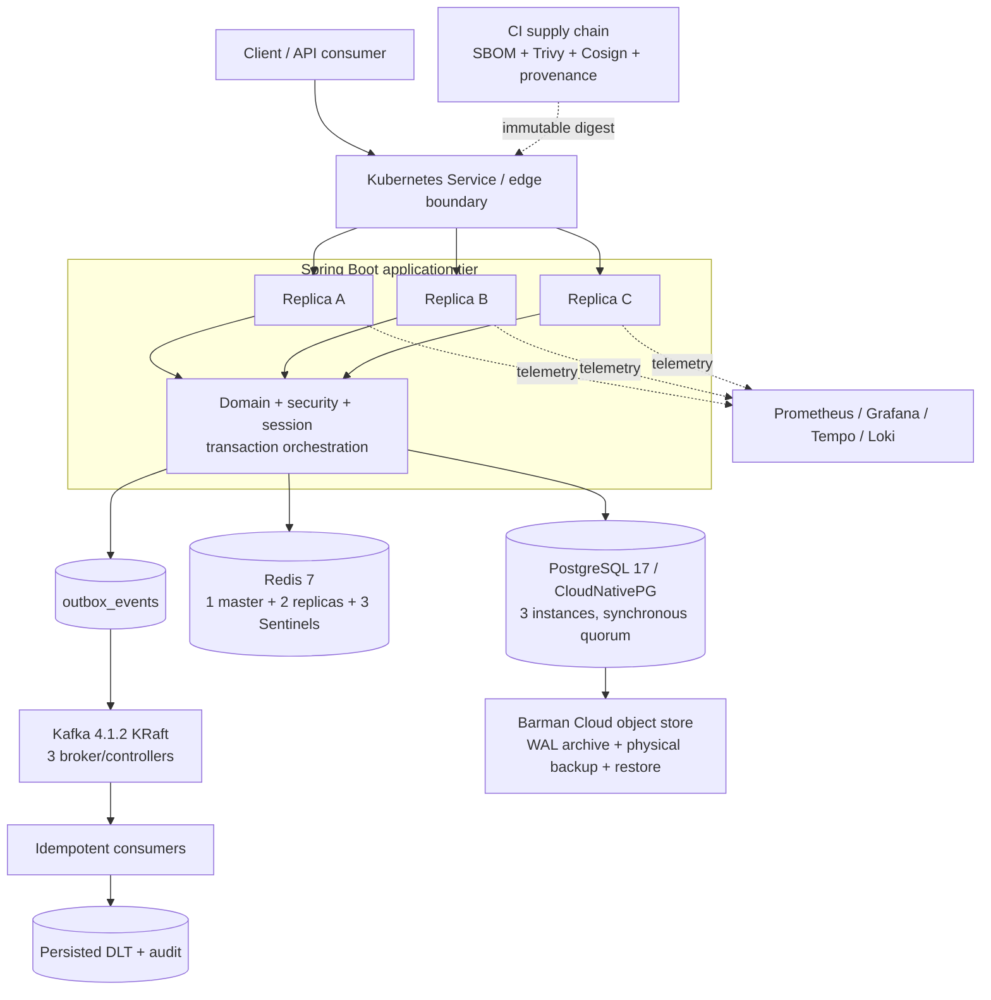
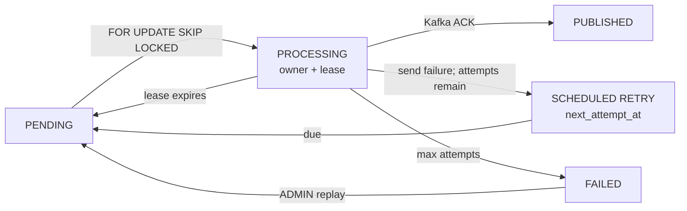

# Spring Boot E-Commerce Backend

[](https://github.com/ravan-chuang/spring-boot-ecommerce-backend/actions/workflows/ci.yml)

A production-minded distributed event-driven commerce backend built with **Java 25**, **Spring Boot 4.1.0**, **PostgreSQL 17**, **Redis 7**, **Apache Kafka 4.1.2**, and **Kubernetes 1.36.1**. The project is engineered around transaction correctness, idempotency, durable event delivery, stateful failover, observability, deployment recovery, and evidence-backed reliability claims.

The current milestone has moved materially beyond an application-only HA demo. In the local multi-worker kind environment, the repository now verifies a **three-replica Spring Boot tier**, **CloudNativePG PostgreSQL HA with physical backup/restore**, **three-node Kafka KRaft**, **Redis replication with Sentinel failover**, and a **software supply-chain pipeline with SBOMs, vulnerability gates, keyless signing, provenance, and digest-pinned promotion**.

The boundary remains explicit: these results demonstrate **local failure-recovery mechanics under the tested scenarios**, not cloud multi-zone production availability. The kind control plane remains single-node; persistent storage and object storage are local; Redis replication is asynchronous; external secrets/workload identity and verified cloud/IaC delivery are not yet established; historical production SLO/RPO/RTO attainment is not claimed.

**Current verified release:** `v1.9.0-phase7-supply-chain`
**Current main commit:** `6230e8c`
**Latest merged milestone:** PR #33 - software supply-chain security controls
**Verification date:** 2026-08-09

---

## Current Engineering Position

| Area | Current verified state | Claim boundary |
|---|---|---|
| Spring Boot application tier | 3 replicas; HPA 3-8; rolling update; PDB; multi-worker recovery | Local application-tier availability engineering |
| PostgreSQL | CloudNativePG, 3 instances, synchronous quorum; hard-primary failover; physical backup and independent restore | One primary-node failure and tested local restore path; not multi-zone DR |
| Kafka | 3 KRaft broker/controllers; RF=3; `min.insync.replicas=2`; one broker/node failure drill | Tested one-node failure; not two-node or multi-region tolerance |
| Redis | 1 master + 2 replicas; 3 Sentinels; automatic master failover and topology convergence | Async replication; no general zero-RPO claim |
| Supply chain | CycloneDX SBOM, Trivy gates, GHCR digest, Cosign OIDC signing, provenance, image SBOM, digest deploy helper | No cluster admission enforcement or runtime signature policy yet |
| Kubernetes platform | 1 kind control-plane + 3 workers | Worker failure domains tested; control plane still a SPOF |
| Production cloud | Not verified | No production HA/SLA claim |

---

## Engineering Highlights

- **146 automated tests** passing with no failures, errors, or skips in the latest regression runs.
- Payment idempotency with PostgreSQL uniqueness, SHA-256 request fingerprints, pessimistic order locking, replay metadata, and concurrency verification.
- Transactional Outbox with `FOR UPDATE SKIP LOCKED`, processing ownership, leases, due-time retry scheduling, bounded jitter, terminal `FAILED`, and operator replay.
- Kafka at-least-once consumer safety with transactionally persisted deduplication markers and governed DLT recovery.
- Correlation IDs propagated across HTTP, MDC, PostgreSQL, Outbox, Kafka headers, consumers, DLT evidence, structured logs, and traces.
- Prometheus, Grafana, Tempo, Loki, Alloy, Alertmanager, SLO recording rules, alerts, and runbooks.
- Flyway **V1-V11** validated; Hibernate validates the schema rather than mutating it.
- Kubernetes application baseline: **3/3 Ready**, CPU HPA **3 -> 6 -> 8 -> 6 -> 4 -> 3**, zero-unavailable rolling updates, and controlled drain verification.
- Multi-replica Outbox drill: **90 synthetic events**, **30/30/30 claims**, **90 Kafka records**, no observed duplicates or missing records under the tested workload.
- Hard worker loss: full three-replica application capacity restored at approximately **T+94s**; transient transport failures were preserved as a negative finding rather than hidden.
- PostgreSQL hard-primary failure: client-visible write **RTO ~51.5s**; **0 acknowledged transactions lost** in the captured reconciliation.
- PostgreSQL DR path: WAL archiving, physical base backup, object-store catalog, independent restore cluster, and restored application data verified; local restore cluster healthy in approximately **49s**.
- Kafka hard broker/node failure: KRaft quorum survived, leaders moved, producer retried transient metadata errors, all 6 partitions returned to ISR=3, and **0 captured acknowledged messages were missing** after recovery.
- Redis master-node failure: Sentinel quorum survived, a replica was promoted, pre-failure data remained readable, post-promotion writes succeeded, and the recovered former master rejoined as a replica.
- Supply-chain workflow: application SBOM, filesystem/image vulnerability gates, immutable GHCR digest, Cosign keyless OIDC signing, image SBOM, GitHub build provenance, and digest-pinned deployment helper.

> **Coverage note:** the previously recorded JaCoCo snapshot was 89.78% instruction / 73.63% branch coverage. That percentage predates later HA and supply-chain phases and should not be presented as a release-current coverage figure until regenerated.

---

## Technology Stack

| Area | Technologies / mechanisms |
|---|---|
| Language / framework | Java 25, Spring Boot 4.1.0 |
| API / security | Spring MVC, Spring Security, JWT, opaque refresh tokens, Swagger / OpenAPI |
| Persistence | PostgreSQL 17, CloudNativePG, Spring Data JPA, Hibernate, Flyway |
| Cache | Redis 7 replication + Sentinel |
| Messaging | Apache Kafka 4.1.2, KRaft, Spring Kafka |
| Reliability | Transactional Outbox, processing lease, retry scheduling, idempotent consumer, persisted DLT governance |
| Observability | Actuator, Micrometer, OpenTelemetry, Prometheus, Grafana, Tempo, Loki, Alloy, Alertmanager |
| Testing | JUnit, MockMvc, Testcontainers, concurrency, backup/restore, failure and reconciliation drills |
| Containers | Multi-stage Docker build, Docker Compose |
| Orchestration | Kubernetes Deployment/StatefulSet, Service, probes, HPA, PDB, topology spread, anti-affinity |
| Local platform | kind, Kubernetes 1.36.1, 1 control-plane + 3 workers |
| Supply chain | GitHub Actions, CodeQL, CycloneDX, Trivy, GHCR, Cosign, OIDC, provenance attestation |

---

## Current Architecture


```mermaid
%%{init: {"flowchart": {"curve": "basis", "nodeSpacing": 26, "rankSpacing": 34}}}%%
flowchart TB
    Client[Client / API consumer] --> Service[Kubernetes Service / edge boundary]
    Supply[CI supply chain\nSBOM + Trivy + Cosign + provenance] -. immutable digest .-> Service

    subgraph App[Spring Boot application tier]
      A[Replica A]
      B[Replica B]
      C[Replica C]
      Domain[Domain + security + session\ntransaction orchestration]
      A --> Domain
      B --> Domain
      C --> Domain
    end

    Service --> A
    Service --> B
    Service --> C

    Domain --> PG[(PostgreSQL 17 / CloudNativePG\n3 instances, synchronous quorum)]
    Domain --> Redis[(Redis 7\n1 master + 2 replicas + 3 Sentinels)]
    Domain --> Outbox[(outbox_events)]

    Outbox --> Kafka[Kafka 4.1.2 KRaft\n3 broker/controllers]
    Kafka --> Consumer[Idempotent consumers]
    Consumer --> DLT[(Persisted DLT + audit)]

    PG --> Backup[Barman Cloud object store\nWAL archive + physical backup + restore]

    A -. telemetry .-> Obs[Prometheus / Grafana / Tempo / Loki]
    B -. telemetry .-> Obs
    C -. telemetry .-> Obs
```

### Availability boundary

```text
Application tier:  3 replicas; HPA 3-8; PDB; multi-worker recovery verified
PostgreSQL:        3 CloudNativePG instances; local synchronous failover + restore verified
Kafka:             3 KRaft broker/controllers; RF=3 / min ISR=2 test topic
Redis:             1 master + 2 replicas; 3 Sentinels; single-master-node failover verified
Kubernetes API:    1 kind control-plane
Storage:           local PVs + local MinIO object store
Cloud/IaC:         not yet verified
```

The architecture is now substantially more resilient than the Phase 3.3 baseline, but **local HA is not equivalent to production multi-zone durability**.

---

## Domain Transactions and Idempotency

### Commerce invariants

- Product detail reads use Redis; product mutations evict cached detail entries.
- Product stock uses optimistic locking through JPA `@Version`.
- Cart contents are not inventory reservations; checkout revalidates stock inside the order transaction.
- Order-item name, unit price, and subtotal snapshots preserve purchase-time evidence.
- Order creation, stock deduction, cart deletion, and `ORDER_CREATED` Outbox insertion commit atomically.
- Cancellation accepts only `PENDING`, restores stock, and shares the same pessimistic order lock used by payment.

### Payment idempotency

```text
Idempotency-Key + request path
        -> SHA-256 request fingerprint
        -> SELECT order FOR UPDATE
        -> replay lookup again under lock
        -> validate PENDING + no existing payment
        -> persist payment + replay metadata + response snapshot
        -> order = PAID + PAYMENT_PAID Outbox event
        -> one PostgreSQL commit
```

Database constraints protect one payment per order and one replay identity per `(idempotency_key, request_path)`. Reusing a key with a different request fingerprint is rejected.

---

## Transactional Outbox and Consumer Safety


```mermaid
%%{init: {"flowchart": {"curve": "basis"}}}%%
flowchart LR
    P[PENDING] -->|FOR UPDATE SKIP LOCKED| X[PROCESSING\nowner + lease]
    X -->|Kafka ACK| D[PUBLISHED]
    X -->|send failure; attempts remain| R[SCHEDULED RETRY\nnext_attempt_at]
    R -->|due| P
    X -->|lease expires| P
    X -->|max attempts| F[FAILED]
    F -->|ADMIN replay| P
```

Consumers treat duplicate Kafka delivery as expected. `(event_id, consumer_name)` is persisted with the side effect in one transaction; duplicate insertion skips the effect, and failed side effects roll back both the effect and dedup marker.

Persisted DLT evidence supports quarantine, replay reservation, original-destination preservation, audit history, retry recovery, and operator accountability.

---

## Kubernetes Application-Tier Availability

The application Deployment retains the Phase 3/3.3 controls:

- 3 replicas;
- HPA 3-8 at 60% CPU target;
- `maxUnavailable: 0`, `maxSurge: 1`;
- startup/readiness/liveness probes;
- `PodDisruptionBudget minAvailable: 2`;
- topology spread with `maxSkew: 1` and degraded-capacity scheduling fallback;
- preferred anti-affinity;
- shortened NotReady/Unreachable `NoExecute` tolerations for failure experiments.

### Hard worker failure evidence

| Observation | Result |
|---|---:|
| Total trace attempts | 458 |
| HTTP 200 | 424 |
| Transport failures | 34 |
| Application-generated HTTP 5xx | 0 |
| Last observed transport failure | ~T+40s |
| Node Ready -> Unknown | ~T+48s |
| Replacement Pod created | ~T+78s |
| Replacement Ready / EndpointSlice convergence | ~T+94s |
| Final Deployment | 3/3 Ready |

This proves automatic recovery in the tested environment. It **does not** prove zero-downtime continuity under abrupt worker loss, and the request-count ratio is not used as a production availability SLI.

---

## Phase 4 - PostgreSQL HA and Disaster-Recovery Validation

CloudNativePG replaced the earlier single PostgreSQL Pod with a 3-instance PostgreSQL 17 topology.

### HA result

- 1 primary + 2 standby candidates.
- `synchronous_commit=on` with quorum-style synchronous durability requiring one standby acknowledgement.
- Hard loss of the worker hosting the primary.
- Old primary: `postgres-ha-1`.
- Promoted primary: `postgres-ha-2`.
- Client-visible write RTO: **51.543s**.
- Failure-injection-to-recovered-commit: **52.468s**.
- Captured committed acknowledgements: 72.
- Acknowledged writes missing after failover: **0**.
- Final cluster: 3/3 healthy.

**Interpretation:** observed RPO is zero only for writes that had a captured successful client acknowledgement in this experiment.

### Backup and restore result

- Barman Cloud plugin integrated with an S3-compatible MinIO object store.
- WAL archiving verified, including forced WAL switch.
- Online physical base backup completed.
- Backup artifacts and catalog confirmed in object storage.
- Independent `postgres-ha-restore` cluster bootstrapped from the backup.
- Restored database was queryable.
- `phase4_primary_failover_probe` restored with **3,864 rows**.
- Local restore-cluster creation to healthy state: approximately **49s**.

The backup path is recoverable under the tested local environment. Remote-region durability, KMS/encryption behavior, multi-region failover, and large-dataset restore performance remain unverified.

---

## Phase 5 - Kafka KRaft High Availability

The Kafka deployment now uses **3 Kafka 4.1.2 nodes**, each acting as broker and controller, spread across worker nodes.

The HA validation topic used:

- 6 partitions;
- replication factor 3;
- `min.insync.replicas=2`.

A worker hosting one broker was stopped during continuous producer traffic.

Observed behavior:

- KRaft quorum survived.
- Controller leadership changed.
- Partition leaders moved to surviving brokers.
- Affected partitions continued with ISR=2.
- Producer observed transient `NOT_LEADER_OR_FOLLOWER` responses, refreshed metadata, and retried.
- No terminal producer send error was recorded in the captured acknowledgement window.
- Failed broker rejoined after node recovery.
- All 6 partitions returned to ISR=3.
- Final KRaft follower lag returned to zero.

### Message reconciliation

| Evidence | Result |
|---|---:|
| Captured producer ACK records | 3,733 |
| Unique captured ACK values | 3,733 |
| Consumed records after recovery | 6,337 |
| Captured ACKed values missing from Kafka | 0 |

**Observed RPO = 0 acknowledged messages lost** for the captured acknowledgement set. This is not a universal zero-loss guarantee across arbitrary failure modes.

---

## Phase 6 - Redis Sentinel High Availability

The previous single Redis instance has been replaced with:

- 3 Redis data nodes: 1 master + 2 replicas in steady state;
- 3 Redis Sentinel instances;
- Sentinel quorum = 2;
- persistent Redis storage;
- Spring Boot Sentinel-based master discovery;
- explicit Redis connection and command timeouts.

A hard failure removed the worker hosting the active master.

Observed behavior:

- surviving Sentinels retained quorum;
- Sentinel reported a new master by approximately **T+18s** after the recorded node stop;
- pre-failure replicated data remained readable;
- post-promotion writes succeeded;
- the surviving replica followed the new master;
- the old node returned and the former master rejoined as a replica;
- the final topology converged to one master and two replicas;
- post-failover data was readable from all Redis nodes;
- targeted application Redis/Lettuce error scan found no failover-related error in the collected logs.

Because Redis replication is asynchronous, this experiment does **not** claim a general zero-RPO guarantee for writes immediately preceding failure.

---

## Phase 7 - Software Supply-Chain Security

The repository now has a dedicated GitHub Actions supply-chain workflow that performs:

1. Java 25 regression tests.
2. CycloneDX application SBOM generation.
3. Trivy filesystem vulnerability scan with HIGH/CRITICAL gating.
4. Container build.
5. Trivy image vulnerability scan with HIGH/CRITICAL gating.
6. GHCR image publishing by immutable digest on non-PR runs.
7. Cosign keyless signing using GitHub OIDC.
8. Container image SBOM generation.
9. GitHub build provenance attestation.
10. Immutable digest recording and a helper for `image@sha256:...` Kubernetes deployment.

PR #33 completed with CI, CodeQL, and Supply Chain Security checks passing before merge.

### Supply-chain boundary

Not yet established:

- Kubernetes admission rejection of unsigned images;
- runtime signature verification;
- organization-wide signing policy;
- cloud workload identity validation;
- registry retention guarantees;
- reproducible builds;
- full SLSA Build Level 3 compliance.

---

## Observability, SLOs, and Runbooks

| Signal | Implementation | Operational use |
|---|---|---|
| Correlation | HTTP -> MDC -> Outbox -> Kafka -> DLT | follow one transaction across boundaries |
| HTTP | Actuator + Micrometer histograms | latency, error, and burn-rate diagnosis |
| Outbox | state gauges + success/failure counters | backlog, retry, terminal failure |
| DLT | state gauges + action counters | review, replay, lease recovery |
| Auth | action/outcome metrics + database audit | rejected-login evidence |
| Traces | OpenTelemetry Collector -> Tempo | distributed timing and trace search |
| Logs | JSON -> Alloy -> Loki | incident query and correlation |
| Alerts | Prometheus rules -> Alertmanager | runbook-linked response |

Service objectives remain engineering objectives rather than claims of historical production attainment.

---

## Testing and Performance Evidence

### Regression

- Current suite: **146 tests**.
- Latest cited run: 146 passed, 0 failures, 0 errors, 0 skipped.
- CodeQL and CI are used as merge gates on recent milestones.

### Local performance profiles

| Profile | Evidence |
|---|---|
| Catalog read | 9,544 requests; 79.44 req/s; avg 9.92 ms; P95 17.93 ms; P99 20.12 ms; 0% failed |
| High-rate soak | 5 min @ 2,500 req/s; 750,000 requests; 2,499.91 req/s; P95 0.84 ms; P99 1.11 ms; 0.07% client failures; no observed app 5xx |
| Payment idempotency | 30 concurrent requests; 100% HTTP success; 1 payment row; 1 idempotency row; 0 duplicates |

These are reproducible local profiles, not production capacity or SLA guarantees.

---

## Release History

| Release | Milestone |
|---|---|
| `v1.1.0-phase1-hardening` | application hardening |
| `v1.2.0-phase2-observability` | observability stack |
| `v1.3.0-phase21-reliability` | reliability controls |
| `v1.4.0-phase3-kubernetes` | Kubernetes multi-replica baseline |
| `v1.5.0-phase33-multinode-ha` | multi-node app-tier recovery |
| `v1.6.0-phase4-postgresql-dr` | PostgreSQL HA + physical backup/restore |
| `v1.7.0-phase5-kafka-ha` | Kafka KRaft broker-failure validation |
| `v1.8.0-phase6-redis-ha` | Redis Sentinel failover validation |
| `v1.9.0-phase7-supply-chain` | software supply-chain security |

---

## Remaining Production Boundaries

### Highest priority

- External secret manager, workload identity, rotation policy, and end-to-end secret scanning.
- Managed or multi-control-plane Kubernetes before any control-plane availability claim.
- Verified cloud/IaC deployment: IAM, networking, TLS, ingress/load balancer, DNS, rollback, and external synthetic monitoring.
- Remote/off-host production backup policy and repeated measured RPO/RTO exercises.
- Production CNI/LB failure-path testing and time-weighted availability measurement.

### Product and security hardening

- Real payment-provider sandbox adapter, signed webhooks, provider reconciliation, and provider-side idempotency.
- Rate limiting, lockout/abuse controls, MFA and additional identity recovery flows.
- Kubernetes admission policy for signed images and runtime artifact verification.
- Retention/erasure automation and telemetry cost/retention budgets.
- High-iteration cancel-vs-pay contention evidence.

---

## Engineering Assessment

Under strict industry review, the repository is best described as **advanced student-level / strong junior backend-platform engineering evidence**, with several areas showing **early mid-level reliability reasoning**: transactional boundary design, failure injection, acknowledgement/data reconciliation, stateful failover validation, negative-result preservation, and supply-chain controls.

It is not equivalent to production mid-level ownership yet. That would require verified cloud delivery, multi-zone failure domains, external secret/workload identity, live traffic, repeated production-like incident drills, production SLO/error-budget operation, cost controls, and real third-party integration ownership.

The project is intentionally documented to preserve that distinction.
