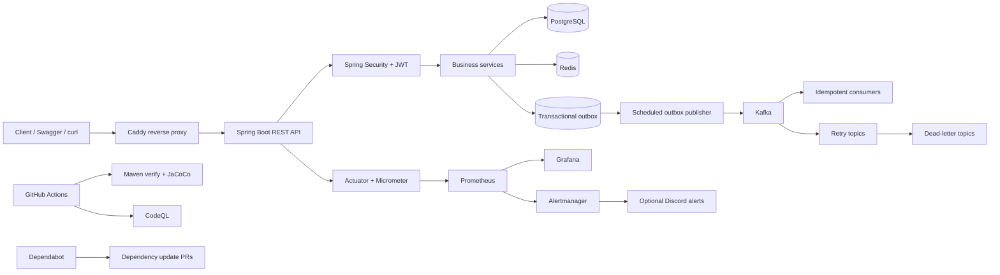
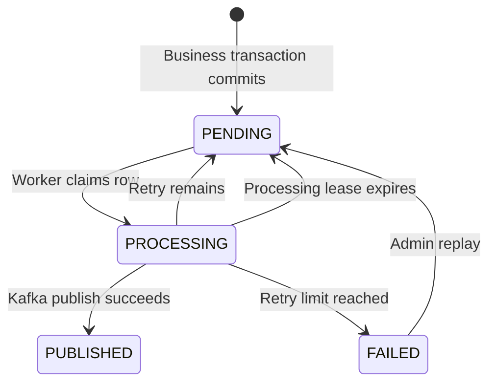

# Spring Boot E-Commerce Backend

[](https://github.com/ravan-chuang/spring-boot-ecommerce-backend/actions/workflows/ci.yml)
[](https://github.com/ravan-chuang/spring-boot-ecommerce-backend/actions/workflows/codeql.yml)
[](https://openjdk.org/)
[](https://spring.io/projects/spring-boot)
[](LICENSE)

A production-oriented e-commerce backend built to demonstrate reliability, distributed-system correctness, security, observability, concurrency control, and automated quality enforcement - not only CRUD endpoints.

The repository combines Spring Security, JWT and refresh-token rotation, PostgreSQL, Redis, Kafka, a transactional outbox, idempotent processing, Testcontainers, Prometheus/Grafana monitoring, Docker Compose, CodeQL, Dependabot, and GitHub Actions.

## Project Positioning

This is a portfolio and engineering-lab system, not a hosted commercial payment platform. Its value is the implementation and verification of backend failure-handling patterns that ordinary student CRUD projects usually omit:

- atomic business updates and durable event creation without a database/Kafka dual-write gap;
- safe processing under duplicate HTTP requests and at-least-once Kafka delivery;
- concurrency control for payments, stock, and outbox workers;
- retry exhaustion, dead-letter handling, operator inspection, and replay;
- revocable multi-device authentication sessions;
- observable failure states, alerting, and reproducible load tests;
- infrastructure-backed integration testing and mandatory CI quality gates.

## Verified Engineering Baseline

| Area | Verified baseline |
|---|---|
| Automated tests | 66 passing, 0 failures, 0 errors in the verified full build |
| Build verification | Maven Wrapper executes `clean verify` |
| Continuous integration | GitHub Actions validates pushes and pull requests |
| Code security | CodeQL scans Java code on repository events and schedule |
| Dependency maintenance | Dependabot manages Maven and GitHub Actions updates with a Testcontainers major-version guard |
| Coverage enforcement | JaCoCo report, Maven coverage gate, and Coverage Baseline regression protection |
| Integration infrastructure | PostgreSQL, Redis, and Kafka through Testcontainers |
| Database evolution | 8 versioned Flyway migrations |
| Delivery | Local and production-style Docker Compose configurations |
| Performance evidence | Reproducible k6 scenarios with a documented local baseline |
| Cloud deployment | OCI VCN, public subnet, internet gateway, NSG, public IP, and VM provisioned; application deployment remains in progress |

## Architecture


```mermaid
flowchart LR
    Client[Client / Swagger / curl] --> Proxy[Caddy reverse proxy]
    Proxy --> API[Spring Boot REST API]
    API --> Security[Spring Security + JWT]
    Security --> Services[Business services]

    Services --> PostgreSQL[(PostgreSQL)]
    Services --> Redis[(Redis)]
    Services --> Outbox[(Transactional outbox)]

    Outbox --> Publisher[Scheduled outbox publisher]
    Publisher --> Kafka[Kafka]
    Kafka --> Consumers[Idempotent consumers]
    Kafka --> Retry[Retry topics]
    Retry --> DLT[Dead-letter topics]

    API --> Metrics[Actuator + Micrometer]
    Metrics --> Prometheus[Prometheus]
    Prometheus --> Grafana[Grafana]
    Prometheus --> Alertmanager[Alertmanager]
    Alertmanager --> Discord[Optional Discord alerts]

    CI[GitHub Actions] --> Verify[Maven verify + JaCoCo]
    CI --> CodeQL[CodeQL]
    Dependabot[Dependabot] --> PRs[Dependency update PRs]
```

The codebase separates controllers, security, business services, persistence, messaging, and operations. Business state and outbound events share one PostgreSQL transaction; Kafka publication and consumer side effects remain independently recoverable.

## Engineering Capabilities

### Security and Session Management

- Stateless Spring Security with JWT access tokens.
- 15-minute access-token lifetime.
- Opaque refresh tokens with a 30-day lifetime; only SHA-256 token hashes are persisted.
- Refresh-token rotation on every refresh operation.
- Multi-device session listing, individual revocation, logout, and logout-all.
- BCrypt password hashing.
- `USER` / `ADMIN` authorization and resource-ownership validation.
- Authentication audit records and suspicious-login metrics.

### Reliability and Distributed Messaging

- Transactional Outbox for atomic business changes and event creation.
- PostgreSQL `FOR UPDATE SKIP LOCKED` claiming for safe multi-worker publication.
- Processing leases to recover work abandoned by interrupted publishers.
- Bounded retries with a terminal `FAILED` state.
- Admin inspection and replay of failed outbox events.
- Kafka retry topics and dead-letter topics.
- Persisted processed-event records for consumer idempotency.
- Scheduled retention cleanup for processed-event and audit data.

### Data Consistency and Concurrency

- Payment idempotency through the `Idempotency-Key` request header.
- Database-backed uniqueness and locking so concurrent requests using one key produce one logical payment.
- Optimistic locking to detect conflicting product-stock updates.
- Explicit transaction boundaries across order, payment, inventory, and outbox changes.
- Integration tests covering concurrent payment requests, cooperating outbox workers, and duplicate-message handling.

### Observability and Operations

- Spring Boot Actuator and Micrometer instrumentation.
- Prometheus scraping and alert rules.
- Provisioned Grafana dashboards for application, JVM, HTTP, and outbox behavior.
- Alertmanager routing with optional Discord notifications.
- Operational metrics for authentication failures and outbox lifecycle states.
- Reproducible Kafka outage/recovery and suspicious-login incident workflows.
- k6 load, stress, soak, arrival-rate, and payment-idempotency scenarios.

## Transactional Outbox Lifecycle


```mermaid
stateDiagram-v2
    [*] --> PENDING: Business transaction commits
    PENDING --> PROCESSING: Worker claims row
    PROCESSING --> PUBLISHED: Kafka publish succeeds
    PROCESSING --> PENDING: Retry remains
    PROCESSING --> FAILED: Retry limit reached
    FAILED --> PENDING: Admin replay
    PROCESSING --> PENDING: Processing lease expires
```

```text
business data + PENDING outbox event
                | one PostgreSQL commit
                v
scheduled publisher claims event
                |
                +--> Kafka publish succeeds --> PUBLISHED
                |
                +--> retry remains ----------> PENDING
                |
                +--> retry exhausted --------> FAILED --> admin replay
```

Current domain topics include `order-created` and `payment-paid`.

## Technology Stack

| Area | Technologies |
|---|---|
| Language and framework | Java 25, Spring Boot 4.1.0, Maven Wrapper |
| API and security | Spring Web MVC, Spring Security, JWT, Bean Validation, OpenAPI/Swagger |
| Persistence | PostgreSQL 16, Spring Data JPA, Hibernate, Flyway |
| Cache and messaging | Redis 7, Apache Kafka, Spring Kafka |
| Reliability patterns | Transactional Outbox, retry topics, DLT, idempotent consumers, leases |
| Observability | Actuator, Micrometer, Prometheus, Grafana, Alertmanager |
| Testing | JUnit, MockMvc, Testcontainers, JaCoCo, k6 |
| Delivery and governance | Docker, Docker Compose, Caddy, GitHub Actions, CodeQL, Dependabot |
| Cloud work | Oracle Cloud Infrastructure networking and VM provisioning in Tokyo region |

## API Overview

### Authentication

| Method | Endpoint | Access |
|---|---|---|
| `POST` | `/api/auth/register` | Public |
| `POST` | `/api/auth/login` | Public |
| `POST` | `/api/auth/refresh` | Public |
| `POST` | `/api/auth/logout` | Public |
| `GET` | `/api/auth/sessions` | Authenticated |
| `DELETE` | `/api/auth/sessions/{sessionId}` | Authenticated |
| `POST` | `/api/auth/sessions/logout-all` | Authenticated |

### Commerce and Operations

| Resource | Representative endpoints | Access |
|---|---|---|
| Products | `GET /api/products`, `GET /api/products/{id}` | Public |
| Product administration | `POST`, `PUT`, `DELETE /api/products/**` | Admin |
| Cart | `/api/users/{userId}/cart/**` | Owner or admin |
| Orders | `/api/users/{userId}/orders`, `/api/orders/{orderId}` | Owner or admin |
| Payments | `POST /api/orders/{orderId}/payments` | Owner or admin |
| Failed outbox events | `GET /api/admin/outbox/failed` | Admin |
| Outbox replay | `POST /api/admin/outbox/{eventId}/replay` | Admin |

Payment creation expects an `Idempotency-Key` header. Protected endpoints expect `Authorization: Bearer <access-token>`.

### Operational Endpoints

| Endpoint | Intended access |
|---|---|
| `/actuator/health` | Public health probe |
| `/actuator/info` | Public application information |
| `/actuator/prometheus` | Monitoring network / local Prometheus |
| `/actuator/metrics/**` | Admin |
| `/swagger-ui/index.html` | Development and evaluation |
| `/v3/api-docs` | Development and evaluation |

Production deployments should restrict monitoring and documentation endpoints according to environment policy.

## Quick Start with Docker Compose

### Prerequisites

- Docker with Docker Compose v2
- Git

```bash
git clone https://github.com/ravan-chuang/spring-boot-ecommerce-backend.git
cd spring-boot-ecommerce-backend
cp .env.example .env
```

Replace every placeholder in `.env`, especially `POSTGRES_PASSWORD`, `DB_PASSWORD`, `JWT_SECRET`, and `GRAFANA_ADMIN_PASSWORD`.

```bash
openssl rand -base64 64
```

Never commit `.env`, private keys, access tokens, or real credentials.

Start the full local stack:

```bash
docker compose up --build -d
docker compose ps
```

| Service | Default local URL |
|---|---|
| Application | http://localhost:8080 |
| Swagger UI | http://localhost:8080/swagger-ui/index.html |
| Health | http://localhost:8080/actuator/health |
| Prometheus | http://localhost:9090 |
| Grafana | http://localhost:3000 |
| Alertmanager | http://localhost:9093 |

```bash
docker compose logs -f app
docker compose down
```

Use `docker compose down -v` only when persistent local data is no longer needed.

## Local Application Development

Requirements: JDK 25 and Docker.

```bash
docker compose up -d postgres redis kafka

export DB_URL=jdbc:postgresql://localhost:5433/spring_boot_lab
export DB_USERNAME=<your-postgres-user>
export DB_PASSWORD=<your-postgres-password>
export REDIS_HOST=localhost
export REDIS_PORT=6379
export KAFKA_BOOTSTRAP_SERVERS=localhost:9092
export JWT_SECRET=<your-generated-secret>

./mvnw spring-boot:run
```

Flyway applies the schema automatically. Hibernate uses `ddl-auto=validate`, so schema drift fails fast rather than silently changing the database.

## Testing, CI, and Repository Governance

Coverage quality is managed through:

- JaCoCo coverage reports
- Coverage Baseline regression tracking
- Maven coverage gate enforcement
- Pull-request coverage verification


```bash
./mvnw clean verify
```

The verification lifecycle executes unit and integration tests, generates JaCoCo reports, compares coverage against the established Coverage Baseline to detect regressions, and applies the configured coverage gate. Reports are written to:

- `target/surefire-reports/`
- `target/site/jacoco/index.html`

The suite covers authentication and token rotation, authorization, order flow, payment idempotency, Kafka retry/DLT behavior, consumer idempotency, outbox claiming and recovery, retention cleanup, metrics, exception handling, and concurrency behavior.

Repository controls include:

- CI on pushes and pull requests;
- uploaded test and coverage artifacts;
- CodeQL Java scanning;
- weekly Maven and GitHub Actions updates through Dependabot;
- deliberate deferral of breaking Testcontainers major upgrades to a dedicated migration;
- pull-request-based changes with green checks before merge.

## Performance Evidence

The `load-tests/` directory contains reproducible k6 scenarios.

```bash
k6 run load-tests/catalog-read.js
```

Documented local catalog-read baseline (MacBook Pro M3 Max, Docker Compose, peak 50 virtual users):

| Metric | Result |
|---|---:|
| Requests | 9,544 |
| Average throughput | 79.44 req/s |
| Average latency | 9.92 ms |
| P95 latency | 17.93 ms |
| P99 latency | 20.12 ms |
| Failed requests | 0.00% |

These measurements are a reproducible local baseline, not a production-capacity claim. See [`reports/performance-baseline.md`](reports/performance-baseline.md) for the workload profile and interpretation.

## Deployment Model and OCI Status

The production Compose overlay removes direct host exposure for PostgreSQL, Redis, Kafka, the application, and monitoring services. Caddy is intended to be the only public entry point.

```bash
docker compose -f docker-compose.yml -f docker-compose.prod.yml up --build -d
```

Set `CADDY_SITE_ADDRESS` to `http://localhost` for local evaluation or to a real domain for Caddy-managed HTTPS.

### OCI work completed

- Tokyo-region VCN created.
- Regional public subnet created.
- Internet gateway and default route configured.
- Network security group attached to the VM.
- Ingress rules configured for SSH, HTTP, HTTPS, and the temporary application port.
- Public IPv4 address assigned.
- SSH key pair generated and stored locally.

### OCI work still in progress

The current cloud VM is an Oracle Linux 9 `VM.Standard.E2.1.Micro` instance with 1 GB RAM, not the originally intended Ubuntu/Ampere configuration. The network path to TCP port 22 is reachable, but SSH currently times out during banner exchange before authentication. Therefore:

- the application has **not** yet been deployed to OCI;
- the public IP is **not** a live product endpoint;
- the current 1 GB VM is insufficient for the complete application, database, Kafka, and observability stack;
- the next cloud milestone is to repair or replace the VM, verify SSH access, then deploy a resource-budgeted stack.

Do not describe the repository as cloud-hosted until an external health check and deployment evidence are committed.

## Project Structure

```text
.
├── .github/
│   ├── dependabot.yml
│   └── workflows/
│       ├── ci.yml
│       └── codeql.yml
├── infrastructure/caddy/
├── load-tests/
├── observability/
│   ├── alertmanager/
│   ├── grafana/
│   └── prometheus/
├── reports/
├── src/main/java/
├── src/main/resources/db/migration/
├── src/test/
├── docker-compose.yml
├── docker-compose.prod.yml
├── Dockerfile
└── pom.xml
```

## Failure Scenarios Demonstrated

1. **Kafka unavailable:** committed outbox events remain durable and are retried.
2. **Retry exhaustion:** the event becomes `FAILED`, is inspectable, and can be replayed.
3. **Publisher interruption:** an expired lease returns the event to recoverable work.
4. **Duplicate Kafka delivery:** a persisted processed-event key prevents duplicate side effects.
5. **Repeated or concurrent payment request:** one idempotency key produces one logical payment.
6. **Concurrent stock updates:** optimistic locking exposes conflicting writes.
7. **Suspicious login failures:** authentication metrics can trigger Prometheus alerts.
8. **Dependency-breaking update:** CI catches incompatible dependency changes before merge.

## Scope and Limitations

Current boundaries include:

- no real payment-provider integration;
- single-node local Kafka and database defaults;
- no verified multi-instance or multi-region deployment;
- no managed secret store;
- no automated backup/restore drill;
- load-test evidence is machine- and workload-specific;
- OCI infrastructure exists, but application deployment is not yet verified.

## Roadmap

1. Replace or repair the OCI VM and establish stable SSH access.
2. Deploy a resource-budgeted production Compose stack and publish an external health check.
3. Add a domain, HTTPS, and restricted ingress rules; remove direct public exposure of port `8080`.
4. Add GitHub Actions deployment with environment protection and rollback.
5. Add OpenTelemetry tracing and correlation IDs.
6. Add backup/restore drills and recovery documentation.
7. Add contract and end-to-end API tests.
8. Validate multi-instance behavior with longer soak and failure-injection tests.
9. Add a payment-provider sandbox behind an adapter interface.

## License

Distributed under the [MIT License](LICENSE).
