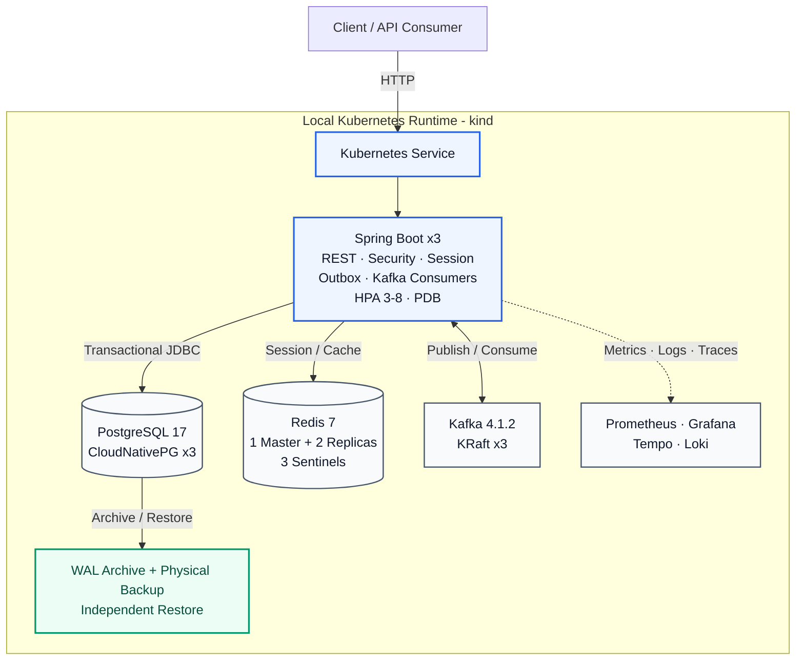
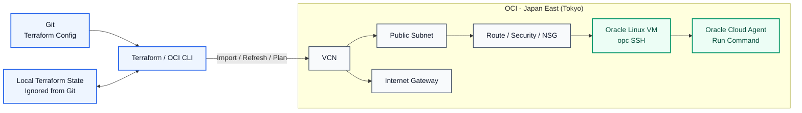
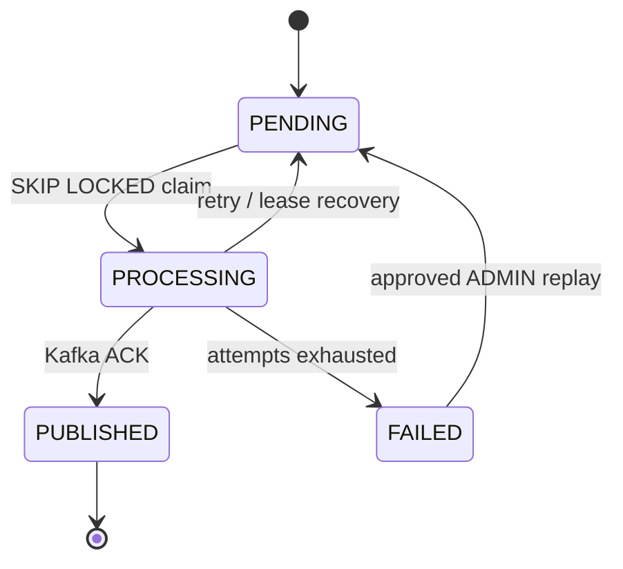

# Spring Boot E-Commerce Backend

[](https://github.com/ravan-chuang/spring-boot-ecommerce-backend/actions/workflows/ci.yml)

A production-minded, event-driven commerce backend built with **Java 25**, **Spring Boot 4.1.0**, **PostgreSQL 17**, **Redis 7**, **Apache Kafka 4.1.2**, **Kubernetes 1.36.1**, and **Terraform on Oracle Cloud Infrastructure**.

The engineering focus is end-to-end correctness and recoverability: transactional state changes, idempotent commands, durable event delivery, stateful failover, observability, software supply-chain provenance, and reproducible cloud infrastructure.

> **Current repository state - verified 2026-08-10**
> `main`: **`67d2cf9`**
> Phase 8 tag: **`phase8-oci-iac`** -> **`ed626cb`**
> Final main workflows: **CI PASS · CodeQL PASS · Supply Chain Security PASS**

The repository currently verifies:

- a **3-replica Spring Boot application tier** with HPA and Kubernetes recovery controls;
- **CloudNativePG PostgreSQL HA**, synchronous failover, WAL archiving, physical backup, and independent restore;
- **3-node Kafka KRaft** with broker failure and acknowledgement-to-record reconciliation;
- **Redis replication + Sentinel** with automatic master failover;
- **SBOM, Trivy, immutable GHCR digest, Cosign OIDC signing, image SBOM, and provenance attestation**;
- **OCI brownfield Infrastructure as Code**, where existing network and compute resources were adopted into Terraform and reconciled to **zero drift**;
- verified **SSH, Oracle Cloud Agent, OCI Run Command, IAM dynamic-group policy, and controlled reboot recovery**.

The claim boundary is equally important: this is **not yet production-proven multi-zone HA**. The local kind control-plane, local stateful storage/object-store failure domains, external secrets/workload identity, production traffic, historical SLO/RPO/RTO attainment, and managed multi-zone application delivery are not claimed.

---

## Engineering Baseline

| Area | Current verified state |
|---|---|
| Main | `67d2cf9` |
| Phase 8 milestone | `phase8-oci-iac` -> `ed626cb` |
| Automated regression | **146 passed / 0 failed / 0 errors / 0 skipped** |
| Application | 3 replicas; HPA 3-8 |
| Kubernetes | kind v1.36.1; 1 control-plane + 3 workers |
| PostgreSQL | PostgreSQL 17; CloudNativePG x3 |
| Kafka | Kafka 4.1.2; KRaft x3 |
| Redis | 3 data nodes + 3 Sentinels |
| Flyway | V1-V11 validated |
| Supply chain | CycloneDX + Trivy + GHCR + Cosign OIDC + provenance |
| OCI | Tokyo-region dev VM + adopted network resources |
| Terraform | `fmt` PASS · `validate` PASS · final plan **No changes** |
| GitHub Actions | CI PASS · CodeQL PASS · Supply Chain Security PASS |
| Dependabot | 0 open Dependabot PRs at final verification |

> **Coverage note:** the historical JaCoCo snapshot is **89.78% instruction / 73.63% branch**. It predates later HA, supply-chain, and Phase 8 work and is not presented as release-current coverage.

---

## System Architecture

### Runtime Deployment View


```mermaid
flowchart TB
    Client["Client / API Consumer"]

    subgraph K8s["Local Kubernetes Runtime - kind"]
        Service["Kubernetes Service"]
        App["Spring Boot x3<br/>REST · Security · Session<br/>Outbox · Kafka Consumers<br/>HPA 3-8 · PDB"]

        PG[("PostgreSQL 17<br/>CloudNativePG x3")]
        Redis[("Redis 7<br/>1 Master + 2 Replicas<br/>3 Sentinels")]
        Kafka["Kafka 4.1.2<br/>KRaft x3"]
        Backup["WAL Archive + Physical Backup<br/>Independent Restore"]
        Obs["Prometheus · Grafana<br/>Tempo · Loki"]
    end

    Client -->|HTTP| Service --> App
    App -->|Transactional JDBC| PG
    App -->|Session / Cache| Redis
    App <-->|Publish / Consume| Kafka
    App -.->|Metrics · Logs · Traces| Obs
    PG -->|Archive / Restore| Backup

    classDef app fill:#eef5ff,stroke:#2563eb,stroke-width:2px,color:#0f172a;
    classDef state fill:#f8fafc,stroke:#475569,stroke-width:1.5px,color:#0f172a;
    classDef recover fill:#ecfdf5,stroke:#059669,stroke-width:2px,color:#064e3b;
    class Service,App app;
    class PG,Redis,Kafka,Obs state;
    class Backup recover;
```

### OCI / Terraform View


```mermaid
flowchart LR
    Repo["Git<br/>Terraform Config"]
    TF["Terraform / OCI CLI"]
    State["Local Terraform State<br/>Ignored from Git"]

    subgraph OCI["OCI - Japan East (Tokyo)"]
        VCN["VCN"]
        Subnet["Public Subnet"]
        IGW["Internet Gateway"]
        NSG["Route / Security / NSG"]
        VM["Oracle Linux VM<br/>opc SSH"]
        Agent["Oracle Cloud Agent<br/>Run Command"]
    end

    Repo --> TF
    State <--> TF
    TF -->|Import / Refresh / Plan| VCN
    VCN --> Subnet
    VCN --> IGW
    Subnet --> NSG --> VM --> Agent

    classDef control fill:#eef5ff,stroke:#2563eb,stroke-width:2px,color:#0f172a;
    classDef cloud fill:#f8fafc,stroke:#475569,stroke-width:1.5px,color:#0f172a;
    classDef ok fill:#ecfdf5,stroke:#059669,stroke-width:2px,color:#064e3b;
    class Repo,TF,State control;
    class VCN,Subnet,IGW,NSG cloud;
    class VM,Agent ok;
```

---

## Engineering Highlights

- Payment idempotency using **SHA-256 request fingerprints**, PostgreSQL uniqueness, pessimistic order locking, persisted replay metadata, and response snapshots.
- Transactional Outbox using **`FOR UPDATE SKIP LOCKED`**, processing ownership, leases, retry scheduling, terminal failure, and controlled replay.
- Idempotent Kafka consumers with transactionally persisted deduplication markers.
- Persisted DLT governance with quarantine, replay reservation, audit history, and lease recovery.
- Correlation propagation across HTTP, MDC, PostgreSQL, Outbox, Kafka, consumers, DLT, logs, and traces.
- Prometheus, Grafana, Tempo, Loki, Alloy, Alertmanager, SLO rules, and runbooks.
- Flyway **V1-V11** with Hibernate schema validation.
- Kubernetes HPA path verified: **3 -> 6 -> 8 -> 6 -> 4 -> 3**.
- Multi-replica Outbox drill: **90 events, 30/30/30 claims, 90 Kafka records, no observed duplicate/missing records**.
- Hard worker loss: application returned to **3/3 Ready ~T+94s**; transient transport failures were preserved as a negative finding.
- PostgreSQL primary failure: client-visible write **RTO 51.543s** with **0 captured acknowledged writes missing** after failover.
- PostgreSQL restore: **3,864 probe rows** recovered; independent local restore cluster healthy in approximately **49s**.
- Kafka broker/node failure: **3,733 captured ACK values**, **0 missing** after recovery; all 6 partitions returned to ISR=3.
- Redis Sentinel failover: new master observed approximately **T+18s**; checked data survived and post-promotion writes succeeded.
- Supply-chain pipeline: application SBOM, Trivy gates, immutable image digest, Cosign OIDC signing, image SBOM, provenance attestation.
- Phase 8 OCI: existing cloud resources adopted into Terraform with final **zero-drift** plan.
- OCI Run Command: final smoke test **ACKED / SUCCEEDED / exit 0**.
- Controlled OCI restart restored SSH and cloud-agent operation; final guest health verified.

---

## Technology Stack

| Area | Technologies / mechanisms |
|---|---|
| Language / framework | Java 25, Spring Boot 4.1.0 |
| API / security | Spring MVC, Spring Security, JWT, opaque refresh tokens, OpenAPI |
| Persistence | PostgreSQL 17, CloudNativePG, JPA, Hibernate, Flyway |
| Cache | Redis 7 replication + Sentinel |
| Messaging | Kafka 4.1.2, KRaft, Spring Kafka |
| Reliability | Transactional Outbox, leases, retry scheduling, idempotent consumers, persisted DLT |
| Observability | Actuator, Micrometer, OpenTelemetry, Prometheus, Grafana, Tempo, Loki, Alloy, Alertmanager |
| Testing | JUnit, MockMvc, Testcontainers, concurrency and failure drills |
| Containers | Docker, Docker Compose |
| Orchestration | Kubernetes, HPA, PDB, probes, topology spread |
| Local platform | kind 1 control-plane + 3 workers |
| Cloud / IaC | OCI, Terraform, OCI CLI |
| Supply chain | GitHub Actions, CodeQL, CycloneDX, Trivy, GHCR, Cosign, OIDC, provenance |

---

## Transaction Correctness

### Commerce invariants

- Product reads use Redis with explicit mutation eviction.
- Product stock uses optimistic locking via JPA `@Version`.
- Cart is not inventory reservation; checkout revalidates stock inside the transaction.
- Order-item snapshots preserve purchase-time name, unit price, and subtotal.
- Order creation, stock deduction, cart deletion, and `ORDER_CREATED` Outbox insertion commit atomically.
- Payment and cancellation serialize terminal transitions through the same pessimistic order lock.

### Payment idempotency

```text
Idempotency-Key + request path
-> SHA-256 request fingerprint
-> SELECT order FOR UPDATE
-> replay lookup under lock
-> validate PENDING + no payment
-> persist payment + replay metadata + response snapshot
-> order = PAID
-> persist PAYMENT_PAID Outbox event
-> one PostgreSQL commit
```

---

## Transactional Outbox


```mermaid
stateDiagram-v2
    [*] --> PENDING
    PENDING --> PROCESSING: SKIP LOCKED claim
    PROCESSING --> PUBLISHED: Kafka ACK
    PROCESSING --> PENDING: retry / lease recovery
    PROCESSING --> FAILED: attempts exhausted
    FAILED --> PENDING: approved ADMIN replay
    PUBLISHED --> [*]
```

Business state and event intent commit together in PostgreSQL. Kafka publication occurs after commit, while ownership, retry timing, terminal failure, and replay eligibility remain durable database state.

---

## Kubernetes Failure Evidence

| Observation | Result |
|---|---:|
| Total hard-worker-loss trace attempts | 458 |
| HTTP 200 | 424 |
| Transport failures | 34 |
| Application HTTP 5xx | 0 |
| Last transport failure | ~T+40s |
| Replacement Pod created | ~T+78s |
| Full 3/3 capacity | ~T+94s |

**Conclusion:** self-healing passed; zero-downtime hard-failure continuity did not.

---

## PostgreSQL HA / DR

### Primary failover

- CloudNativePG, 3 PostgreSQL 17 instances.
- synchronous commit with one-standby acknowledgement.
- `postgres-ha-1` primary lost.
- `postgres-ha-2` promoted.
- client-visible write RTO: **51.543s**.
- captured acknowledged commits: 72.
- missing captured acknowledged writes: **0**.
- final cluster: 3/3 healthy.

### Backup / restore

- continuous WAL archiving.
- physical base backup.
- S3-compatible MinIO catalog.
- independent restore cluster.
- restored probe table: **3,864 rows**.
- local restore cluster healthy in approximately **49s**.

The result is local recovery evidence, not multi-zone DR proof.

---

## Kafka KRaft HA

Validation topic:

- 6 partitions.
- RF=3.
- `min.insync.replicas=2`.

During one broker/node loss, quorum survived, leaders moved, ISR degraded to 2 where affected, producer metadata retry recovered publication, and all partitions returned to ISR=3.

| Reconciliation evidence | Result |
|---|---:|
| Captured ACK records | 3,733 |
| Unique captured ACK values | 3,733 |
| Records consumed after recovery | 6,337 |
| Captured ACK values missing | **0** |

Observed RPO = 0 applies only to the captured acknowledgement set.

---

## Redis Sentinel HA

- 3 Redis data nodes.
- 1 master + 2 replicas.
- 3 Sentinels; quorum 2.
- Spring Boot/Lettuce uses Sentinel discovery.
- hard active-master loss.
- new master observed approximately **T+18s**.
- checked pre-failure data remained readable.
- post-promotion writes succeeded.
- former master rejoined as replica.
- final topology returned to 1 master + 2 replicas.

Redis replication is asynchronous; no general zero-RPO claim is made.

---

## Software Supply-Chain Security


```mermaid
flowchart LR
    Source["Commit / PR"] --> Tests["Tests"]
    Tests --> SBOM["CycloneDX SBOM"]
    SBOM --> Scan["Trivy Gates"]
    Scan --> Build["Image Build"]
    Build --> Digest["GHCR Digest"]
    Digest --> Sign["Cosign OIDC"]
    Sign --> Provenance["Image SBOM + Provenance"]
    Provenance --> Promote["Digest-pinned Promotion"]

    classDef ok fill:#ecfdf5,stroke:#059669,stroke-width:2px,color:#064e3b;
    classDef gate fill:#fff7ed,stroke:#d97706,stroke-width:2px,color:#7c2d12;
    class Tests,SBOM,Digest,Sign,Provenance,Promote ok;
    class Scan gate;
```

The latest post-merge Supply Chain Security workflow completed successfully, including test execution, application SBOM, filesystem scanning, immutable image build/push, Cosign OIDC signing, image SBOM, provenance attestation, and evidence upload.

**Boundary:** no Kubernetes admission rejection of unsigned images or runtime signature enforcement yet.

---

## Phase 8 - OCI Brownfield IaC

Phase 8 adopted the already-running OCI dev environment into Terraform instead of replacing it.

### Adopted resources

- VCN.
- public subnet.
- internet gateway.
- route table.
- default security list.
- two NSGs.
- NSG security rules.
- compute instance.

### Operational verification

- instance `RUNNING`.
- TCP/22 reachable.
- OpenSSH banner verified.
- public-key SSH authentication verified with user `opc`.
- `sshd` active.
- Oracle Cloud Agent active.
- Run Command plugin active.
- IAM dynamic group and policy configured.
- final Run Command: **ACKED / SUCCEEDED / exit code 0**.
- controlled restart recovery completed.
- guest CPU, memory, disk, SSH and cloud-agent health checked.

### Terraform verification

```text
terraform fmt -check     PASS
terraform validate       PASS
terraform plan           No changes
```

Terraform state and private credentials are not tracked in Git. The provider lock file is committed.

---

## Testing and Local Performance

Current cited regression: **146 passed / 0 failed / 0 errors / 0 skipped**.

| Profile | Evidence |
|---|---|
| Catalog read | 9,544 requests; 79.44 req/s; avg 9.92 ms; P95 17.93 ms; P99 20.12 ms; 0% failed |
| High-rate soak | 5 min @ 2,500 req/s; 750,000 requests; 2,499.91 req/s; P95 0.84 ms; P99 1.11 ms; 0.07% client failures; no observed app 5xx |
| Payment idempotency | 30 concurrent requests; 100% HTTP success; 1 payment row; 1 idempotency row; 0 duplicates |

These are reproducible **local** profiles, not production capacity or SLA guarantees.

---

## Milestone History

| Milestone | Scope |
|---|---|
| `v1.1.0-phase1-hardening` | application hardening |
| `v1.2.0-phase2-observability` | observability |
| `v1.3.0-phase21-reliability` | reliability controls |
| `v1.4.0-phase3-kubernetes` | Kubernetes multi-replica baseline |
| `v1.5.0-phase33-multinode-ha` | application worker recovery |
| `v1.6.0-phase4-postgresql-dr` | PostgreSQL HA + restore |
| `v1.7.0-phase5-kafka-ha` | Kafka KRaft HA |
| `v1.8.0-phase6-redis-ha` | Redis Sentinel HA |
| `v1.9.0-phase7-supply-chain` | software supply-chain security |
| `phase8-oci-iac` | OCI brownfield Terraform adoption |

---

## Remaining Production Boundaries

Highest-priority next work:

1. **Remote Terraform state + locking** before team or production IaC use.
2. **External secrets + workload identity** and rotation policy.
3. **Managed multi-zone cloud application deployment** rather than only a standalone OCI dev VM.
4. **TLS, load balancer/ingress, DNS, and external synthetic SLI**.
5. **Off-host production backup policy** and repeated RPO/RTO drills.
6. **Signed-image admission enforcement**.
7. **Real payment-provider sandbox** with signed webhooks and reconciliation.
8. **Write/event-heavy soak tests and correlated failure drills**.
9. **Regenerate release-current coverage**.
10. Upgrade remaining GitHub Docker actions that still target the deprecated Node.js 20 action runtime.

---

## Engineering Assessment

Under strict industry review, this repository is best described as **advanced student / strong junior backend-platform engineering evidence**, with **early mid-level reasoning** in selected areas:

- transaction and idempotency boundaries;
- durable event state machines;
- distributed failure analysis;
- acknowledgement-to-durable-state reconciliation;
- restore-based DR validation;
- negative-result preservation;
- supply-chain provenance;
- brownfield Terraform adoption and zero-drift reconciliation.

It is **not** equivalent to production-proven senior engineering. The remaining gap is primarily real production ownership: managed failure domains, identity/secrets, live traffic and incidents, SLO/error-budget history, cost controls, and external integration ownership.
