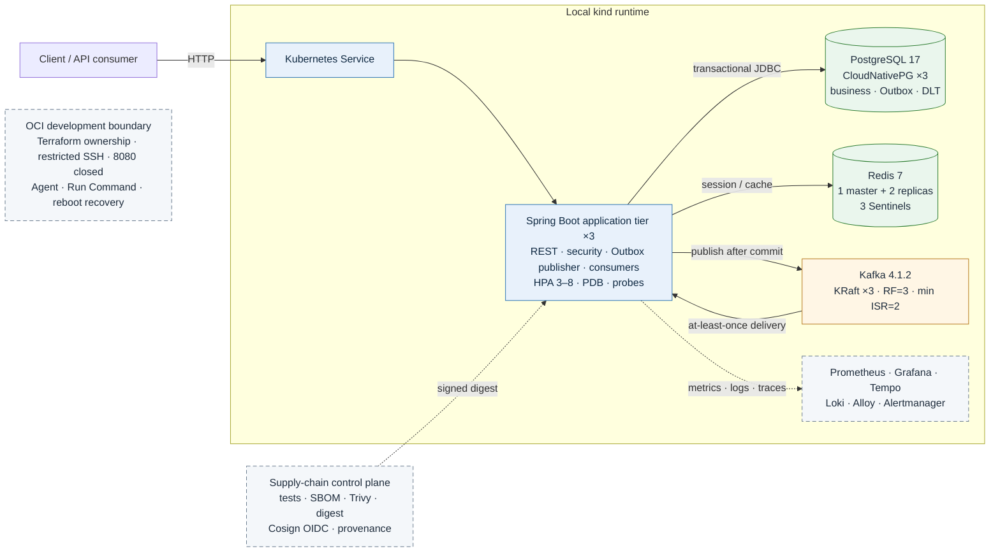
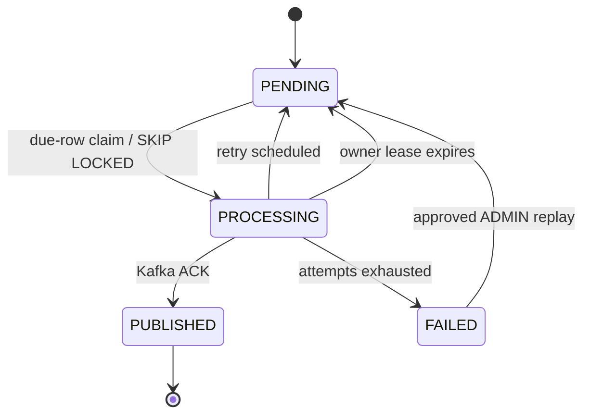
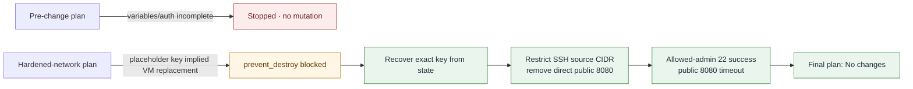
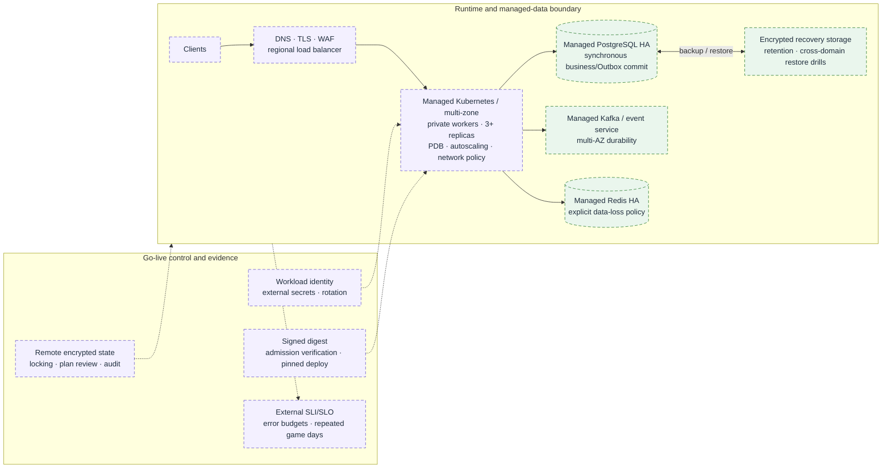

# Spring Boot E-Commerce Backend — System Architecture & Engineering Summary

> **Evidence-led engineering review**  
> Repository review date: **2026-08-15**  
> Current repository HEAD: **`45899b8`**  
> Current milestone tag: **`phase9-recovery-complete`**  
> Latest independently verified application source: **`ff5e527`**

## Executive position

This repository is a production-minded, event-driven commerce backend built with **Java 25** and **Spring Boot 4.1.0**. Its engineering value comes from explicit correctness and recovery boundaries across database transactions, command idempotency, asynchronous delivery, multi-replica coordination, failure injection, artifact identity, and brownfield cloud infrastructure ownership.

The current portfolio should be described as:

> A locally verified distributed backend with transactional correctness, recoverable asynchronous delivery, local application/stateful failure drills, a signed artifact path, and a reconciled OCI development boundary. It is not a production-proven multi-zone application or data platform.

The evidence supports an **advanced student / strong junior backend-platform profile**, with selected **early mid-level reasoning** in transaction boundaries, durable state machines, acknowledgement reconciliation, independent restore validation, negative-result preservation, supply-chain provenance, brownfield IaC, and safe change control.

## 1. Baseline and evidence policy

### 1.1 Repository versus application-verification baseline

Two commit references are intentionally retained:

| Reference | Scope | Allowed claim |
|---|---|---|
| `45899b8` | Current repository HEAD; Phase 9 Terraform and verification evidence | Current source/configuration and retained Phase 9 state |
| `ff5e527` | Latest independent clean-clone application verification | 172 tests and JaCoCo results below |

The diff from `ff5e527` to current HEAD is limited to documentation, OCI Terraform, and retained verification evidence. No newer application-test result is substituted for the verified `ff5e527` baseline.

```text
Verified command: ./mvnw clean verify
Source:           ff5e527261fd3ccdf3098151375c13264f5afef2
Tests:            172 passed / 0 failed / 0 errors / 0 skipped
Build time:       49.278 s
JaCoCo:           92.55% instruction / 82.75% branch
Classes:          112 analyzed
Hard gate:        85% instruction / 75% branch — PASS
```

### 1.2 Evidence classes

| Evidence class | What qualifies | Wording discipline |
|---|---|---|
| Implemented | Version-controlled code, migration, manifest, workflow, rule, or Terraform declaration | “Implemented” or “configured” |
| Verified | Executed behavior with retained evidence | “Verified under the tested conditions” |
| Observed | Workload- and failure-domain-specific measurement | State the result and its boundary together |
| Proposed / not claimed | Target architecture or untested failure domain | “Proposed,” “open,” or “not implemented” |

This policy prevents configuration from being presented as runtime proof, a single-fault drill from being generalized to broader failure domains, and unreconciled counts from being labeled zero loss.

### 1.3 Version scope

| Area | Verified or configured scope | Interpretation |
|---|---|---|
| Java / Spring | Java 25; Spring Boot 4.1.0 | Current application baseline |
| PostgreSQL | 16 in Compose/Testcontainers; 17 in CloudNativePG | HA/restore evidence belongs to PostgreSQL 17 |
| Kafka | 4.1.0 in Testcontainers; 4.1.2 in Compose/Kubernetes | Version scopes are explicit and not interchangeable |
| Redis | Redis 7 | Three data nodes plus three Sentinels in the HA drill |
| Kubernetes | kind 1.36.1 | One control-plane and three workers; local failure domain |
| Flyway | V1–V11 | Hibernate validates the schema; Open Session in View is disabled |
| Terraform / OCI | Brownfield development environment | Network/security/VM ownership, not full application deployment |

### 1.4 Coverage interpretation

| Coverage fact | Instruction | Branch | Interpretation |
|---|---:|---:|---|
| Latest verified application baseline | **92.55%** | **82.75%** | Clean-clone rerun at `ff5e527` |
| Historical Phase 2.1 snapshot | 89.78% | 73.63% | Historical evidence only |
| Maven hard gate | 85.00% | 75.00% | Bundle minimum; latest verified run passed |
| Regression reference | 81.4756% | 68.2927% | Secondary baseline; maximum absolute drop `0.005` |

These are four distinct facts. The historical snapshot and thresholds are not relabeled as current measured coverage.

## 2. As-built system architecture



### 2.1 Correctness boundary

The PostgreSQL commit is the critical correctness boundary. Commerce state and outbound event intent become durable in the same transaction. Publication to Kafka occurs after commit and remains at-least-once. Redis is an acceleration/session dependency, not the source of record.

At-least-once delivery makes consumer idempotency and persisted terminal-message governance explicit design requirements rather than optional retry behavior.

### 2.2 Deployment boundary

The supply-chain and OCI paths are separate control planes. The repository does not establish a deployment edge from the OCI VM to the complete local Kubernetes/stateful runtime.

| Layer | Verified topology or behavior | Production boundary |
|---|---|---|
| Application | 3 replicas; HPA 3–8; PDB; probes; topology spread; worker recovery | Hard worker loss caused transient transport failures |
| PostgreSQL | CloudNativePG ×3; synchronous failover; physical backup and independent restore | Local PV/object-store failure domains; no multi-zone DR proof |
| Kafka | 3 KRaft broker/controllers; RF=3 / min ISR=2; one-node drill | No correlated two-node, zone, or region proof |
| Redis | 1 master + 2 replicas; 3 Sentinels | Async replication; no general zero-RPO guarantee |
| Kubernetes | kind with 1 control-plane + 3 workers | Control-plane SPOF and local CNI/data plane |
| Supply chain | Signed/attested immutable image workflow | No admission-time signature rejection |
| OCI | Brownfield network/security/VM ownership and recovery | Not a managed application/data platform deployment |

## 3. Transaction correctness and durable delivery

### 3.1 Commerce invariants

- Product stock uses JPA optimistic locking through `@Version`.
- Cart contents are not reservations; checkout revalidates inventory within the order transaction.
- Order-item snapshots preserve purchase-time name, price, and subtotal.
- Order creation, stock deduction, cart deletion, and `ORDER_CREATED` Outbox insertion commit atomically.
- Payment and cancellation serialize terminal transitions through the same pessimistic order lock.
- Production contains one checkout workflow; the slow endpoint, duplicated workflow, and `Thread.sleep` calls were removed from `src/main/java`.
- `OrderProcessingDelay` keeps timing controllable in tests, while production uses `NoOpOrderProcessingDelay`.

### 3.2 Payment idempotency

```text
Idempotency-Key + request path
→ normalize command identity and compute SHA-256 request fingerprint
→ SELECT order FOR UPDATE
→ replay lookup while holding the order lock
→ validate PENDING and absence of prior payment
→ persist payment, replay metadata, and response snapshot
→ update order to PAID and insert PAYMENT_PAID Outbox event
→ one PostgreSQL commit
```

| Invariant | Mechanism | Failure contained |
|---|---|---|
| One payment per order | Database uniqueness + pessimistic order lock | Concurrent duplicate payment creation |
| Same key means same logical request | Request fingerprint + stored response snapshot | Key reuse with a different payload |
| Serialized terminal state | `SELECT ... FOR UPDATE` | Pay-versus-cancel race |

### 3.3 Transactional Outbox lifecycle



Competing publishers use `FOR UPDATE SKIP LOCKED`. Ownership, retry timing, terminal failure, and replay eligibility are durable database state.

The executed three-replica drill observed:

- 90 synthetic Outbox events;
- claim distribution **30 / 30 / 30**;
- 90 PostgreSQL rows in `PUBLISHED`;
- 90 valid unique Kafka sequences;
- **0 duplicate, missing, unexpected, or parse-error values**.

This demonstrates cooperative non-overlapping work under the tested workload. It does not establish global exactly-once delivery or universal fairness.

### 3.4 Consumer and DLT safety

Consumers persist `(event_id, consumer_name)` with the business side effect in one transaction. Duplicate delivery becomes a unique-conflict skip; a failed side effect rolls back the marker so delivery remains retry-safe.

Persisted DLT governance includes quarantine, replay reservation, original-destination preservation, audit history, and lease recovery. Terminal-message handling is durable operational state rather than an in-memory loop.

## 4. Application and stateful reliability

### 4.1 Kubernetes controls

- 3 baseline replicas.
- HPA min 3 / max 8; average CPU target 60%.
- Executed HPA path: `3 → 6 → 8 → 6 → 4 → 3`.
- PDB `minAvailable: 2`.
- Rolling update `maxUnavailable: 0`, `maxSurge: 1`.
- Startup, readiness, and liveness probes.
- Topology spread `maxSkew: 1` and preferred anti-affinity.
- 30-second NotReady/Unreachable `NoExecute` tolerations in the worker-loss drill.

### 4.2 Abrupt worker loss

| Observation | Result |
|---|---:|
| Client traces | 458 |
| HTTP 200 | 424 |
| Transport failures (`HTTP 000`) | 34 |
| Application-generated HTTP 5xx | 0 |
| Last observed transport failure | about T+40 s |
| Replacement Pod created | about T+78 s |
| Full 3/3 Ready and EndpointSlice convergence | about T+94 s |

**Conclusion:** self-healing passed. Zero-downtime hard-failure continuity did not. The 424/458 ratio is not promoted to a production availability SLI because the timing, timeout behavior, and local failure domain were experiment-specific.

### 4.3 PostgreSQL primary failover

CloudNativePG ran three PostgreSQL 17 instances with synchronous acknowledgement requiring one standby.

| Evidence | Observed result |
|---|---|
| Fault | Hard loss of the worker hosting the primary |
| Client-visible write RTO | **51.543 s** |
| Failure injection to first recovered commit | **52.468 s** |
| Captured successful ACK commits | 72 |
| Captured ACK writes missing after failover | **0** |
| Final topology | 3/3 healthy |

Observed RPO=0 applies only to the captured successful acknowledgement set.

Normal-operation synchronous write latency was measured separately over 200 writes: mean 22.380 ms, median 22.145 ms, P95 23.939 ms, P99 33.732 ms, minimum 19.202 ms, maximum 52.201 ms.

### 4.4 PostgreSQL backup and restore

The verified path covered continuous WAL archiving, a plugin-based physical base backup, retained object-store artifacts, and an independent restore cluster. The restored application probe table contained **3,864 rows**, and the local restore cluster became healthy in approximately **49 s**.

An initial restore failed because the recovery plugin resolved the wrong backup-server identity. The corrected source restored successfully. Preserving this failure is important: backup creation alone is not proof of recoverability.

### 4.5 Kafka KRaft broker/node failure

The tested topology used three broker/controllers, six partitions, replication factor 3, and `min.insync.replicas=2`.

| Reconciliation evidence | Result |
|---|---:|
| Captured producer ACK values | 3,733 |
| Unique captured ACK values | 3,733 |
| Records consumed after recovery | 6,337 |
| Captured ACK values missing | **0** |
| Final partition state | All 6 partitions returned to ISR=3 |

The result is one-node failure evidence, not a correlated two-node or universal zero-loss guarantee.

### 4.6 Redis Sentinel master failure

The steady state was one master, two replicas, and three Sentinels with quorum 2. After active-master loss, a new master was observed at approximately **T+18 s**. Checked pre-failure data remained readable, post-promotion writes succeeded, and the former master rejoined as a replica.

Redis replication remains asynchronous. The drill validates checked-data survival and promotion mechanics; it does not establish general zero-RPO behavior.

### 4.7 Interpretation discipline

Node detection, controller action, replacement creation, Pod readiness, EndpointSlice convergence, client-visible recovery, and durable-state reconciliation are different dimensions. A single MTTR number would erase important failure semantics.

All stateful results are local, single-fault observations. One measured recovery time is evidence of mechanism behavior, not a production RTO distribution or availability SLO.

## 5. Observability and operations

| Signal | Implementation | Operational purpose |
|---|---|---|
| Correlation | HTTP → MDC → Outbox → Kafka → consumer → DLT | Cross-boundary transaction traceability |
| Metrics | Actuator, Micrometer, Prometheus | Rates, latency, failures, durable-state conditions |
| Traces | OpenTelemetry Collector → Tempo | Distributed timing and dependency analysis |
| Logs | JSON → Alloy → Loki | Structured incident queries |
| Alerts | Prometheus rules → Alertmanager | Runbook-linked response |
| Dashboards | Grafana | Operating visibility |
| OCI telemetry | Oracle Cloud Agent | Development VM CPU/memory evidence |

Runbooks cover application down, Outbox backlog/failure, DLT operations, PostgreSQL backup/restore, privacy retention, and secret rotation. Current SLOs are engineering definitions; no production history proves SLO or error-budget attainment.

## 6. Software-supply-chain trust path


The repository binds source and tests to an application SBOM, filesystem and image vulnerability gates, immutable image identity, OIDC-backed signing, an image SBOM, and provenance.

The missing enforcement point is cluster admission. The workflow can produce a signed artifact, but Kubernetes does not reject unsigned or unverified digests at deployment time.

## 7. OCI brownfield IaC and Phase 9 change control

### 7.1 Phase 8 ownership boundary

Terraform adopted the existing development environment instead of replacing it. It represents:

- VCN and public subnet;
- internet gateway and route table;
- default security list;
- two NSGs and their rules;
- the existing `VM.Standard.E2.1.Micro` compute instance in Tokyo.

Adopted resources use `prevent_destroy`. The provider lock file is committed; Terraform state and credentials are ignored from Git. State remains local and does not provide remote encryption, locking, backup, or team plan review.

### 7.2 Phase 9 network hardening



The initial plan attempt retained authentication and missing-variable failure evidence; no apply occurred. A later plan attempted compute replacement because an abbreviated SSH key changed instance metadata. `prevent_destroy` blocked the destructive plan, the exact key was recovered from state, and the plan was regenerated.

The approved sanitized plan reported **0 add / 2 change / 1 destroy**. The destroyed object was the direct TCP/8080 ingress rule. The compute instance was not replaced. Post-apply evidence shows:

- allowed-admin TCP/22 connection succeeded;
- public TCP/8080 connection timed out after approximately 5 s;
- post-apply plan: `No changes`;
- final plan: `No changes`.

Public TCP/80 and TCP/443 rules remain configured. This is not yet proof of a production TLS/load-balancer/WAF edge or external availability.

### 7.3 Phase 9 runtime incident and recovery

During hardening verification, TCP/22 remained reachable while SSH stalled during banner exchange and OCI Run Command remained accepted/visible for an extended period. Serial-console output reported:

```text
systemd-journald: Failed to open runtime journal: No space left on device
```

A power cycle restored SSH protocol responsiveness and Run Command execution. Post-reboot evidence showed `/run` at 3% block use and 1% inode use, root at 19% use, and swap unused.

Because the VM did not retain a persistent systemd journal, the exact pre-reboot exhausted resource cannot be proven. Transient runtime-journal or `/run` exhaustion is the most consistent explanation, but it remains a **probable root cause**, not a confirmed one. No retained evidence connects the incident to the OCI network rule changes.

Final acceptance captured on **2026-08-15 04:04:33 UTC** reported:

| Acceptance check | Result |
|---|---|
| Controlled reboot | PASS |
| Post-reboot SSH | PASS |
| Post-reboot LVM mounts | PASS |
| Oracle Cloud Agent | PASS |
| `sshd` / `oracle-cloud-agent` | Active |
| Failed systemd units | 0 |
| Live legacy `ocivolume` references | None |
| Live `crashkernel=` references | None |

The remaining `auditd` sendmail warning was retained as non-blocking.

### 7.4 Current OCI boundary

Phase 8/9 proves brownfield ownership, safe network-rule change control, restricted management access, zero-drift reconciliation, and one VM recovery acceptance. It does not prove that the complete Spring Boot/Kubernetes/data platform runs on OCI.

## 8. Performance evidence quality

| Profile | Recorded result | Evidence quality | Boundary |
|---|---|---|---|
| Maven verification | 172/0/0/0; 49.278 s; 112 classes | Direct clean-clone rerun at `ff5e527` | Automated verification, not runtime capacity |
| Catalog read baseline | 9,544 requests; 79.44 req/s; average 9.92 ms; P95 17.93 ms; P99 20.12 ms; 0% failed | Saved `reports/performance-baseline.md` | Local Docker Compose; 300 ms think time |
| High-rate catalog soak | 5 min @ 2,500 req/s; 750,000 requests; P95 0.84 ms; P99 1.11 ms; 0.07% client failures; no observed app 5xx | Documented result; raw k6 summary not retained | Not production capacity or SLA |
| Payment idempotency drill | 30 concurrent requests; 100% HTTP success; 1 payment; 1 idempotency row; 0 duplicates | Documented k6 result; automated suite separately tests 8-way concurrency | Local command-deduplication evidence |

The saved catalog baseline is directly traceable to a repository report. Existing load scripts support reproduction but do not substitute for preserved result artifacts.

## 9. Proposed production reference architecture — not implemented



The target preserves the strongest current invariants—single-database business/Outbox commit, command idempotency, consumer safety, and immutable artifact identity—while changing failure domains, identity, edge exposure, infrastructure state, and operating evidence.

## 10. Current risk register and next evidence

| Priority | Current boundary | Required next evidence |
|---|---|---|
| P0 | Environment/local-secret dependence | External secret manager, workload identity, rotation, and policy tests |
| P0 | Terraform state remains local | Remote encrypted state, locking, backup, and reviewed team plans |
| P1 | Public edge is not a production TLS/LB/WAF design | Controlled edge path, certificate lifecycle, external synthetic validation |
| P1 | Local kind and local stateful failure domains | Managed multi-zone runtime and data services |
| P1 | Abrupt worker loss caused transport failures | Real CNI/load-balancer behavior and time-weighted external SLI |
| P1 | Redis uses asynchronous replication | Explicit data-loss policy and recovery-objective validation |
| P1 | Signing stops before admission | Reject unsigned/unverified digests at cluster entry |
| P1 | Payment provider is simulated | Sandbox adapter, signed webhooks, reconciliation, provider idempotency |
| P1 | SpringDoc exposure is not production-profile controlled | Disable or protect API docs/UI in production |
| P2 | Performance evidence is read-heavy and partly documentation-only | Saved write/event-heavy soak, retry-storm, saturation, and correlated-failure evidence |
| P2 | Recovery measurements are single observations | Repeated failover/restore drills and RTO/RPO distributions |
| P2 | Phase 9 runtime-space cause is probable | Persistent journaling, resource metrics, recurrence testing, and confirmed causal evidence |

The former Phase 8 P0 actions “close direct 8080” and “restrict SSH” are complete as of Phase 9 and are not left in the future-work list.

## 11. Senior engineering assessment

### Strong evidence

- Reliability claims are tied to executed evidence rather than manifest presence.
- PostgreSQL and Kafka durability results reconcile captured client acknowledgements against recovered durable state.
- Backup validation includes an independent restore and application-owned data.
- Redis documentation preserves asynchronous-replication limitations.
- Transactional Outbox and DLT handling are durable operational state machines.
- Kubernetes failure analysis separates transport failure, controller recovery, readiness, endpoint convergence, and restored capacity.
- Supply-chain controls extend evidence from runtime correctness to artifact identity and provenance.
- OCI work demonstrates brownfield adoption and a safe `prevent_destroy` block against unintended compute replacement.
- Failed restore, plan, Run Command, and runtime-space outcomes are retained with explicit uncertainty.
- Phase 9 closes the earlier direct-8080 and unrestricted-SSH findings, then reconciles to zero drift.

### Current level

The repository supports an **advanced student / strong junior backend-platform assessment**. Early mid-level reasoning is visible in distributed-failure modeling, transaction boundaries, durable-state reconciliation, restore-based validation, operational evidence collection, supply-chain provenance, and infrastructure ownership.

It should not be represented as production-proven senior engineering until it demonstrates managed multi-zone operation, workload identity and secrets, remote state/team workflows, live traffic and incidents, historical SLO/error-budget ownership, cost governance, and real third-party integration responsibility.

## 12. Primary evidence ledger

| Milestone / area | Repository evidence | Primary verified point |
|---|---|---|
| Application baseline | `pom.xml`; clean verification at `ff5e527` | 172 tests; 92.55% instruction; 82.75% branch |
| Phase 2.1 | `verification/phase21_reliability_verification.md` | Historical coverage, reliability drills, alert evidence |
| Phase 3 / 3.3 | `verification/phase3/*.md` | HPA, 90-event Outbox concurrency, hard-worker recovery |
| Phase 4 | `verification/phase4/*.md` and restore artifacts | CNPG failover, 51.543 s RTO, 3,864-row restore |
| Phase 5 | `verification/phase5/message_reconciliation.txt` | 3,733 ACK values reconciled with 0 missing |
| Phase 6 | `verification/phase6/redis_ha_failover_verification.md` | Sentinel promotion around T+18 s and topology recovery |
| Phase 7 | `verification/phase7/software_supply_chain_security.md`; workflow YAML | SBOM, Trivy, digest, signing, provenance |
| Phase 8 | `infra/terraform/oci`; `verification/phase8/*` | Brownfield adoption, SSH/Agent/Run Command, zero drift |
| Phase 9 network | `verification/phase9/network/*` | Restricted SSH, 8080 negative test, safe plan/apply, zero drift |
| Phase 9 recovery | `verification/phase9/recovery/final-acceptance.txt` | Controlled reboot, SSH/LVM/Agent PASS, 0 failed units |
| Performance | `reports/performance-baseline.md`; `load-tests/*.js` | Saved catalog baseline plus reproducible workload definitions |

## Final engineering position

This repository is no longer accurately described as a CRUD sample. It is an evidence-driven backend/platform engineering portfolio spanning:

```text
transaction correctness
→ durable asynchronous delivery
→ application recovery
→ stateful failover and independent restore
→ observability and operational playbooks
→ artifact identity and provenance
→ OCI brownfield ownership, hardening, and VM recovery
```

Its most professional characteristic is the discipline of requiring runtime evidence, reconciliation, recovery validation, and explicit claim boundaries before asserting reliability.

