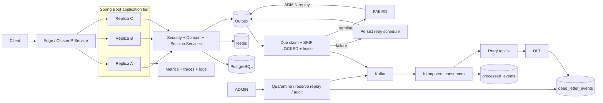

# Spring Boot E-Commerce Backend - System Architecture and Engineering Summary

## Executive Summary

This repository is a production-minded distributed event-driven backend built with Java 25 and Spring Boot 4.1.0. Its engineering value is not the number of frameworks used; it is the way transactional correctness, idempotency, asynchronous delivery, failure recovery, observability, and deployment behavior are tied to durable state and explicit verification evidence.

The current release, `v1.5.0-phase33-multinode-ha`, represents a material step beyond the previous single-instance topology. The Spring Boot application tier has been verified with three Kubernetes replicas, health probes, zero-unavailable rolling updates, CPU-based HPA, multi-replica Outbox processing, topology-aware placement across three worker nodes, a PodDisruptionBudget, controlled node drain, and abrupt worker-node failure experiments.

The latest evidence supports the following precise classification:

> **Application-tier high-availability engineering and automatic recovery are verified in a local multi-node Kubernetes environment. End-to-end production HA is not yet established because PostgreSQL, Redis, Kafka, and the kind control-plane remain single-instance failure domains, and abrupt worker loss produced transient client transport errors before dataplane convergence.**

From a senior engineering review perspective, this is advanced student-level / strong junior backend and platform evidence. Several areas - especially Outbox concurrency, Kubernetes failure modeling, and evidence discipline - demonstrate early mid-level reasoning, but the project does not yet substitute for production ownership of replicated stateful services, cloud infrastructure, live traffic, or real incidents.

## Current Verified Release

| Item | Current state |
|---|---|
| Release | `v1.5.0-phase33-multinode-ha` |
| Latest merged milestone | PR #29 - multi-node Kubernetes failure recovery |
| Kubernetes baseline milestone | PR #28 - multi-replica deployment and autoscaling |
| Main commit | `f48a7158365b120dcd5f915d7a36b919b9f3a649` |
| Verification date | 2026-08-08 |
| Automated tests | 146 passed; 0 failed; 0 errors; 0 skipped |
| Flyway | V1-V11 validated |
| Last recorded JaCoCo report | 89.78% instruction / 73.63% branch before Phase 3 additions |
| Application baseline | 3 Spring Boot replicas |
| HPA | CPU target 60%; 3-8 replicas; verified scale-out and scale-down |
| Multi-node topology | 1 kind control-plane + 3 worker nodes |
| PDB | `minAvailable: 2` |
| Rolling update | `maxUnavailable: 0`, `maxSurge: 1` |
| Node-loss tolerations | NotReady and Unreachable `NoExecute` for 30 seconds |

### Evidence policy

The project distinguishes four evidence classes:

1. **Automated behavior** - unit, integration, Testcontainers, controller, concurrency, migration, and application-context tests.
2. **Executed local runtime drills** - broker outage, restore, HPA load, Pod deletion, rolling update, drain, and hard worker loss.
3. **Configured but not production-proven controls** - local Kubernetes manifests, SLO definitions, runbooks, PDB, resource limits, and observability configuration.
4. **Known gaps** - replicated stateful services, multi-control-plane Kubernetes, cloud/IaC, external load balancing, managed secrets, and real production traffic.

Configuration alone is not presented as proof.

## System Classification and Deployment Modes

The repository qualifies as a distributed event-driven backend because the application, database, cache, broker, and telemetry components communicate over network boundaries and must tolerate partial failure, delayed recovery, duplicate delivery, concurrent processing, and independently unavailable dependencies.

The project now has two meaningful operating topologies.

### Docker Compose operating stack

The Compose deployment remains the complete local operating environment for Caddy, PostgreSQL, Redis, Kafka, Spring Boot, Prometheus, Alertmanager, Grafana, OpenTelemetry Collector, Tempo, Loki, and Alloy. It is useful for full observability and dependency-recovery drills but remains one-host infrastructure.

### Kubernetes application tier

Phase 3 introduced a three-replica Spring Boot Deployment behind a ClusterIP Service, resource controls, startup/readiness/liveness probes, zero-unavailable rolling updates, and CPU HPA. Phase 3.3 then moved failure analysis to a kind cluster with one control-plane and three workers.

Current availability boundary:

| Component | Current topology | Verified behavior | Remaining boundary |
|---|---|---|---|
| Spring Boot | 3 replicas | rolling update, HPA, Pod replacement, drain, hard-node recovery | hard node loss still exposed transient transport failures |
| PostgreSQL | 1 Pod / node, RWO PVC | health, migrations, backup/restore | no replica/failover; primary system SPOF |
| Redis | 1 Pod | health | no Sentinel/Cluster or managed failover |
| Kafka | 1 KRaft broker/controller | Outbox publish/recovery | no broker replication or controller quorum |
| Kubernetes control-plane | 1 kind node | local orchestration | control-plane SPOF; not multi-zone |

## Architecture



PostgreSQL remains the source of truth for commerce state, session credentials, idempotency metadata, Outbox delivery state, consumer deduplication, authentication audit, DLT state, and operator history.

## Engineering Contributions

### 1. Authentication, Authorization, and Session Security

- HMAC JWT access tokens with a short default lifetime.
- Opaque refresh tokens generated from secure randomness; only SHA-256 hashes are stored.
- Refresh rotation and predecessor revocation.
- Stable session identifiers supporting multi-device listing and revocation.
- BCrypt password hashing.
- USER / ADMIN authorization and resource-ownership checks.
- ADMIN-only Outbox and DLT operations.
- Deny-by-default unmatched request policy.
- Authentication audit records and Micrometer action/outcome metrics.
- Failed-login audit persistence independent of the failed request transaction.

Remaining identity work includes rate limiting, temporary lockout, MFA, password reset, email verification, trusted proxy policy, managed secrets, and stronger access-token revocation options.

### 2. Commerce Transaction Correctness

- Product CRUD with Redis-backed detail cache and invalidation.
- Product stock optimistic locking.
- Checkout stock revalidation inside the database transaction.
- Purchase-time order item snapshots.
- Order creation, stock deduction, cart deletion, and `ORDER_CREATED` Outbox insertion in one commit.
- Payment and cancellation share a pessimistic lock on the order to serialize terminal transitions.
- PostgreSQL uniqueness protects one payment per order.

A dedicated high-iteration cancel-versus-pay contention archive remains a useful hardening item.

### 3. Payment Idempotency

Payment idempotency combines several independent layers rather than relying on an application memory cache:

```text
required Idempotency-Key
+ unique (idempotency_key, request_path)
+ SHA-256 request fingerprint
+ pessimistic order lock
+ second replay lookup under lock
+ persisted response metadata
+ one-payment-per-order uniqueness
```

Concurrent duplicate requests have been verified to resolve to one logical payment and one replay record.

### 4. Transactional Outbox

Business state and the outbound event share one PostgreSQL transaction. Publisher behavior includes:

- `PENDING -> PROCESSING -> PUBLISHED` lifecycle;
- terminal `FAILED` state;
- `processing_by` and `processing_at` ownership;
- recoverable processing lease;
- due-time filter through `next_attempt_at`;
- exponential backoff, delay cap, and bounded jitter;
- synchronous Kafka acknowledgement before marking `PUBLISHED`;
- ADMIN failed-event inspection and replay.

The multi-replica claim query uses `FOR UPDATE SKIP LOCKED` so concurrent publisher instances can claim different rows without blocking on rows already owned by another transaction.

### 5. Multi-Replica Outbox Verification

The Phase 3 drill inserted 90 synthetic Outbox events while three Spring Boot replicas published concurrently.

Observed result:

| Evidence | Result |
|---|---:|
| Synthetic Outbox rows | 90 |
| Published rows | 90 |
| Claims on replica 1 | 30 |
| Claims on replica 2 | 30 |
| Claims on replica 3 | 30 |
| Kafka records observed | 90 |
| Distinct sequence IDs | 90 |
| Retry count | 0 |
| Observable duplicates | 0 |
| Missing records | 0 |

This verifies concurrent coordination under the tested conditions. It does not establish globally exactly-once semantics, and the equal work split is not a contractual fairness guarantee.

### 6. Consumer Idempotency and DLT Governance

Consumers persist `(event_id, consumer_name)` and the business side effect in one transaction. Duplicate delivery is skipped; failed side effects roll back the marker so retries remain valid.

Terminal records enter a persisted DLT lifecycle:

```text
RECEIVED -> QUARANTINED -> REPLAYING -> REPLAYED
                         -> QUARANTINED on send failure
REPLAYING -> QUARANTINED on expired replay lease
```

Controls include DLT coordinate deduplication, operator reason, pessimistic transition control, optimistic versioning, replay reservation before send, original destination preservation, audit history, metrics, and lease recovery.

### 7. Correlation and Observability

- `X-Correlation-ID` validation and normalization.
- Correlation propagation to MDC, Outbox, Kafka, consumers, and DLT evidence.
- JSON logs with trace/span/correlation identifiers.
- OpenTelemetry Collector and Tempo.
- Prometheus, Grafana, Alertmanager, Loki, and Alloy.
- Recording rules and alerts for HTTP, Outbox, DLT, and authentication conditions.
- Runbooks for application down, Outbox failure, DLT operations, high error rate, backup/restore, secret rotation, and privacy/retention.

SLO definitions are engineering objectives, not historical claims of production attainment.

## Kubernetes Phase 3 Baseline

### Three-replica Deployment

The base application Deployment configures:

- three replicas;
- `maxUnavailable: 0`, `maxSurge: 1`;
- startup, readiness, and liveness probes;
- resource requests of 200m CPU and 384Mi memory per application Pod;
- limits of one CPU and 1Gi memory;
- 40-second termination grace period and pre-stop delay;
- ClusterIP Service;
- local ConfigMap plus gitignored Secret with tracked example templates.

### Self-healing and rolling updates

A manually deleted application Pod was replaced by the Deployment controller. Repeated rollout verification showed the Service remained available while new Pods crossed readiness gates before old Pods were removed.

### HPA

The CPU HPA targets 60% utilization relative to Pod requests, with a 3-8 replica range.

Observed:

```text
scale-out: 3 -> 6 -> 8
scale-down: 8 -> 6 -> 4 -> 3
```

Peak observed utilization reached 172%. The HPA reached its configured maximum and later returned to the minimum after the 120-second scale-down stabilization logic.

The metrics-server dependency was installed in the verification cluster but is not currently lifecycle-managed by the repository.

## Kubernetes Phase 3.3 Multi-Node Hardening

### Cluster topology

- kind v0.32.0.
- Kubernetes v1.36.1.
- one control-plane node.
- three worker nodes.
- three Spring Boot replicas.

### Scheduling design

The final HA Deployment uses:

- topology spread `maxSkew: 1` by hostname;
- `ScheduleAnyway` fallback;
- preferred Pod anti-affinity with weight 100;
- 30-second NotReady/Unreachable NoExecute tolerations.

The chosen policy is intentionally a trade-off. Strict `DoNotSchedule` initially made a replica Pending when the available topology could not satisfy the spread rule. The final policy strongly prefers fault-domain separation in steady state but allows co-location when capacity is degraded.

Three repeated rollouts after the final tuning reached one application replica per worker in steady state.

### PodDisruptionBudget

`minAvailable: 2` protects planned evictions. During a controlled drain, the PDB prevented unsafe eviction until replacement capacity was available. The drain completed successfully and the HTTP probe remained successful.

The PDB is not a hard-failure mechanism; abrupt node disappearance bypasses voluntary eviction semantics.

## Hard Node Failure Experiment

The final worker-loss experiment abruptly stopped one worker with Docker while the HTTP client remained on a different worker. Instance-level responses were traced through a local/HA-only `/internal/instance` endpoint.

### Client-visible evidence

| Metric | Observation |
|---|---:|
| Total trace attempts | 458 |
| HTTP 200 | 424 |
| Transport failures | 34 |
| Application-generated HTTP 5xx | 0 |
| First transport failure | T+0s |
| Last observed transport failure | ~T+40s |
| First success after last failure | ~T+41s |

Successful responses were interleaved with transport failures. Therefore this is an **intermittent failure window**, not a claim of 40 seconds continuous outage.

The count ratio also should not be used as an availability percentage because timeout requests consumed roughly one second while successful requests completed in milliseconds. A production SLI must be time-weighted and collected by an external or ingress-level monitor.

### Recovery timeline

```text
T+0s    worker container stopped
T+48s   Node Ready transitioned to Unknown
T+78s   replacement Pod created
T+94s   replacement Pod became Ready
T+94s   EndpointSlice last-change timestamp
T+94s   full 3/3 application capacity restored
```

The replacement Pod required approximately 16 seconds from creation to Ready.

### Interpretation

The experiment verifies automatic application recovery but explicitly fails a zero-downtime hard-node-loss claim. It demonstrates why multiple recovery dimensions must be separated:

- client-visible transport behavior;
- node health detection;
- eviction timing;
- ReplicaSet replacement;
- Pod startup/readiness;
- EndpointSlice convergence;
- full replica restoration.

Collapsing these into one MTTR number would hide useful failure behavior.

## Reliability and Recovery Drills

### Kafka outage and Outbox scheduled retry

- Kafka stopped.
- Synthetic events inserted.
- Publisher entered processing and then persisted scheduled retry after producer failure.
- Result: PASS.

### Backlog and broker recovery

- 50 additional events inserted during outage.
- 54 pending events observed.
- Kafka restarted.
- 55 synthetic events published and backlog drained.
- Result: PASS.

### Failed-login audit

- 50 invalid logins generated.
- Authentication audit count increased by 50.
- Result: PASS.

### PostgreSQL backup and restore

- Custom-format backup.
- SHA-256 checksum validation.
- Disposable restore database.
- Flyway V1-V11, data, V11 index, and key constraints verified.
- Result: PASS.

### Kubernetes operations

- Pod self-healing: PASS.
- Zero-unavailable rolling update: PASS under tested conditions.
- HPA scale-out and scale-down: PASS.
- Multi-replica Outbox concurrency: PASS.
- Controlled worker drain: PASS.
- Abrupt worker loss: automatic recovery PASS; zero-downtime continuity NOT demonstrated.

## Test and Quality Evidence

The current 146-test suite covers unit, controller, service, database, cache, Kafka, retry, DLT, security, concurrency, migration, retention, and application-context behavior.

No tests were skipped in the final Phase 3.3 run.

The last published coverage percentages are the Phase 2.1 values:

- 89.78% instruction coverage.
- 73.63% branch coverage.
- regression baseline 81.48% instruction / 68.29% branch.

Because Phase 3.3 added an instance diagnostic controller and profile-specific behavior, exact coverage should be regenerated before publishing a new percentage as a Phase 3.3 metric.

Coverage is treated as a change-detection tool. Higher-value evidence is the verified behavior of locking, duplicate handling, retry timing, state transitions, broker recovery, replica coordination, scheduling, and node failure.

## Performance Evidence

### Catalog read baseline

- 9,544 requests.
- 79.44 req/s average throughput.
- 9.92 ms average latency.
- P95 17.93 ms; P99 20.12 ms.
- 0% failed requests.

### High-rate local soak

- five minutes at 2,500 req/s.
- 750,000 requests.
- 2,499.91 req/s achieved.
- P95 0.84 ms; P99 1.11 ms.
- 0.07% client-side failure rate.
- no observed application-side 5xx.

### Payment idempotency

- 30 concurrent requests.
- 100% HTTP success.
- one payment row.
- one idempotency row.
- zero duplicate payments.

These are local benchmark profiles, not production capacity guarantees.

## Delivery and Repository Governance

- Maven Wrapper and Java 25.
- Multi-stage Dockerfile with JRE runtime.
- Docker Compose full operating stack.
- Kubernetes base and HA manifests.
- Gitignored local secret manifests and tracked example secrets.
- GitHub Actions CI, CodeQL, Dependabot, and release tags.
- `git diff --check` and staged secret-pattern checks used before Phase 3 merges.
- PR #28 squash merged and tagged `v1.4.0-phase3-kubernetes`.
- PR #29 squash merged and tagged `v1.5.0-phase33-multinode-ha`.
- Verification reports committed under `verification/phase3/`.

The HA manifest currently references a local verification image tag loaded directly into kind. A production delivery process should move to immutable registry digests, SBOM/provenance, vulnerability scanning, signing, and environment promotion by digest.

## Production Risk Register

| Priority | Risk / boundary | Required action |
|---|---|---|
| P0 | Single PostgreSQL instance and local RWO storage | managed HA PostgreSQL or operator replication, failover, off-host backup, timed restore |
| P0 | Single Kafka broker/controller | multi-broker KRaft, replication/ISR design, broker and controller failure drills |
| P0 | Local file/environment secrets | external secret manager, workload identity, rotation, scanning |
| P1 | Single Redis instance | managed Redis or Sentinel/Cluster based on cache durability requirements |
| P1 | Single kind control-plane | managed/multi-control-plane Kubernetes before production HA claim |
| P1 | Hard node loss caused transient transport failure | production CNI/LB test, external synthetic SLI, multi-zone failure drills |
| P1 | No cloud/IaC deployment evidence | Terraform/Pulumi, IAM, network, TLS, ingress/LB, rollback and external checks |
| P1 | Locally loaded image tag | immutable registry digest, SBOM, scan, signature/provenance |
| P1 | Simulated payment provider | sandbox adapter, signed webhook, reconciliation |
| P1 | No production RPO/RTO | backup policy, restore cadence, RPO/RTO measurement and disaster recovery |
| P2 | Rate limit / lockout / MFA absent | abuse controls and security tests |
| P2 | Retention and erasure partial | automated lifecycle and privacy erasure |
| P2 | Telemetry cost not tuned | sampling and retention budget |
| P2 | Cancel/pay stress archive incomplete | high-iteration PostgreSQL contention drill |

## Professional Assessment

The strongest engineering evidence is the integration of mechanisms that are usually shown separately:

- the Outbox has durable intent, row-level concurrency, ownership, lease recovery, scheduled retry, terminal state, replay, metrics, broker-outage evidence, and multi-replica runtime verification;
- DLT handling has persisted broker evidence, state transitions, concurrency controls, replay reservation, audit, metrics, and recovery;
- payment idempotency combines database constraints, fingerprints, locking, replay state, and concurrency tests;
- consumer idempotency uses transactionally persisted markers instead of process-local memory;
- observability links HTTP, database, Kafka, logs, traces, and dead-letter evidence;
- Kubernetes evidence progresses from manifests to controller behavior, autoscaling, planned disruption, hard node loss, per-instance traces, and explicit negative findings.

Recommended portfolio positioning:

> A production-minded distributed event-driven e-commerce backend that demonstrates transactional consistency, at-least-once safety, governed recovery, observability, Kubernetes application-tier scaling, multi-replica coordination, and evidence-based failure engineering.

This is strong evidence for backend, Java, platform, DevOps/SRE, and event-driven systems internships or junior roles. It should not be described as production-proven multi-zone infrastructure until the stateful tier, control plane, cloud networking, secrets, external monitoring, and operational ownership are upgraded and verified.

## Prioritized Next Phase

### Phase 4 - stateful high availability

1. **PostgreSQL first:** deploy a replicated or managed HA topology; validate primary loss, failover, connection-pool recovery, transaction correctness, backup/restore, RPO, and RTO.
2. **Kafka next:** move to multi-broker KRaft; validate replication factor, min ISR, broker/controller loss, producer behavior, Outbox backlog and recovery, and consumer continuity.
3. **Redis:** adopt managed failover or Sentinel/Cluster according to cache semantics and validate stale-cache and failover behavior.
4. Re-run multi-node application failure drills while all stateful dependencies can also survive one worker loss.

### Phase 5 - production delivery and operations

1. Cloud IaC, managed Kubernetes or production-like cluster, IAM, DNS, TLS, ingress/load balancer, NetworkPolicy, and external secrets.
2. Registry digest promotion, SBOM, provenance/signatures, image scanning, and rollback.
3. External synthetic availability and latency measurement using time-weighted SLIs.
4. Long-duration write-heavy and event-heavy benchmarks, retry storms, recovery throughput, and capacity saturation tests.
5. Incident timelines, postmortems, error-budget review, production backup cadence, and disaster-recovery practice.
6. Real payment sandbox, signed webhooks, reconciliation, retention automation, and dedicated terminal-state race verification.
