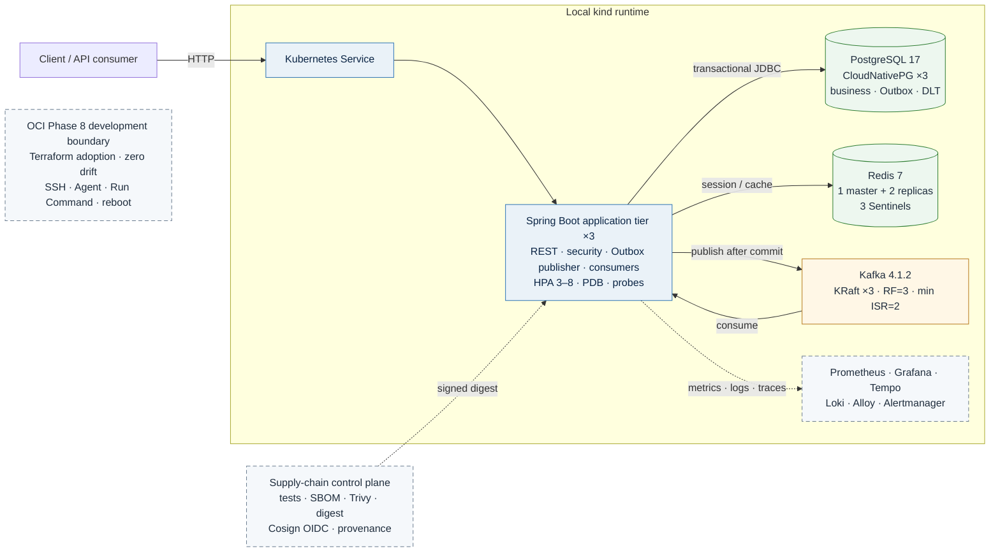
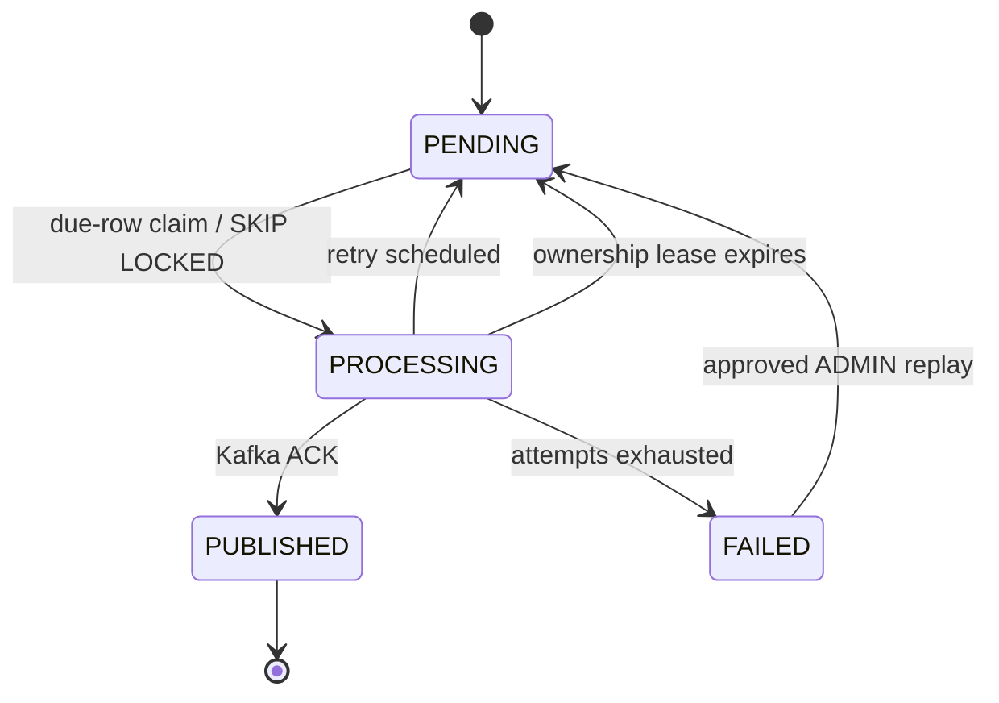
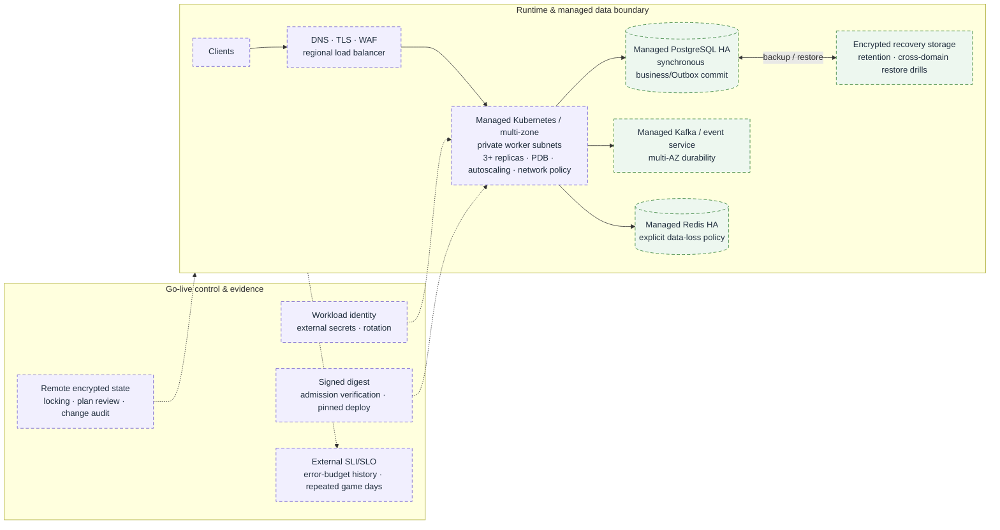

# Spring Boot E-Commerce Backend — System Architecture & Engineering Summary

> **Evidence-led engineering review**
> Verification date: **2026-08-10**
> Phase 8 documentation baseline: **`929bee0`**
> Phase 8 OCI milestone: **`phase8-oci-iac` → `ed626cb`**
> Phase 8 final documentation: **`phase8-docs-final` → `929bee0`**

## Executive position

This repository is a production-minded, event-driven commerce backend built with **Java 25** and **Spring Boot 4.1.0**. Its engineering value is not the number of technologies present, but the explicit preservation of correctness and recovery boundaries across PostgreSQL transactions, command idempotency, asynchronous delivery, replica coordination, failure injection, artifact promotion, and cloud-infrastructure ownership.

The project uses four evidence categories:

- **Implemented** — a mechanism or control exists in repository-backed code or configuration.
- **Verified** — the corresponding behavior was executed and evidence was captured.
- **Observed** — a measurement applies only to the stated experiment and workload.
- **Proposed / not claimed** — the repository has not established production-equivalent proof.

The accurate current classification is:

> A locally verified distributed backend with transactional correctness, recoverable asynchronous delivery, local application/stateful failure drills, an artifact-trust pipeline, and a reproducible OCI brownfield IaC boundary. It is not yet a production-proven multi-zone application or data platform.

Under strict industry review, the evidence supports an **advanced student / strong junior backend-platform profile**, with selected **early mid-level reasoning** in transaction boundaries, durable state machines, acknowledgement reconciliation, restore validation, negative-result preservation, software-supply-chain provenance, and brownfield infrastructure adoption.

---

## 1. Current verified baseline

### 1.1 Repository and automated verification

An independent clean clone of `main` completed:

```text
./mvnw clean verify

Tests:      146 passed / 0 failed / 0 errors / 0 skipped
Build time: 49.896 s
JaCoCo:     89.54% instruction / 73.63% branch
Classes:    111 analyzed
```

The Phase 8 documentation baseline is preserved by `phase8-docs-final` at `929bee0`, while the OCI infrastructure milestone is preserved by `phase8-oci-iac` at `ed626cb`. These immutable tags are used as the evidence baselines instead of hard-coding a moving `main` HEAD into the document.

### 1.2 Version scope

| Area | Verified scope | Interpretation |
|---|---|---|
| Java / Spring | Java 25; Spring Boot 4.1.0 | Current application baseline |
| PostgreSQL | 16 in Compose/Testcontainers; 17 in CloudNativePG | HA and restore evidence belongs to PostgreSQL 17 |
| Kafka | 4.1.0 in Testcontainers; 4.1.2 in Compose/Kubernetes | Version scopes must remain explicit |
| Redis | Redis 7 | Three data nodes plus three Sentinels in the HA drill |
| Kubernetes | kind 1.36.1 | One control-plane and three workers; local failure domain |
| Flyway | V1–V11 | Hibernate validates; Open Session in View disabled |
| Terraform / OCI | Brownfield development environment | Network/security/VM ownership, not full application deployment |

### 1.3 Coverage interpretation

| Coverage fact | Instruction | Branch | Allowed wording |
|---|---:|---:|---|
| Current clean verification | **89.54%** | **73.63%** | Current rerun used in this document |
| Historical Phase 2.1 snapshot | 89.78% | 73.63% | Historical evidence only |
| CI regression floor | 81.4756% | 68.2927% | Minimum baseline; maximum allowed drop `0.005` |

These are three different facts. The historical snapshot and CI threshold are not substituted for release-current coverage.

---

## 2. Evidence model

| Evidence class | What qualifies | Allowed claim |
|---|---|---|
| Current automated verification | Clean-clone Maven verification, Testcontainers, integration/concurrency tests, generated JaCoCo | Verified on `main` at the stated date |
| Executed runtime drill | HPA, worker/primary/broker/master loss, restore, OCI Run Command, controlled reboot | Verified under the tested conditions |
| Durability reconciliation | Captured successful client acknowledgements compared with recovered durable state | Observed RPO for that captured set |
| Configured control | PDB/HPA, retries, SLO rules, IAM, signing, Terraform declarations | Implemented or configured; not proof by itself |
| Known boundary or proposal | Untested failure domain or recommended production architecture | Explicitly not claimed / not implemented |

This evidence policy prevents three common errors: treating configuration as runtime proof, generalizing a single-fault drill to a broader failure domain, and calling an unreconciled message count “zero loss.”

---

## 3. As-built system architecture



### 3.1 Architectural boundary

The PostgreSQL commit is the critical correctness boundary. Commerce state and outbound event intent become durable in the same transaction. Publication to Kafka is asynchronous and occurs after commit. Redis is an acceleration/session component, not the source of record. Kafka delivery is at-least-once, so consumer idempotency and durable DLT governance are first-class design requirements.

The software-supply-chain and OCI paths are intentionally separate control boundaries. The repository does not claim that the complete local Kubernetes and stateful runtime has been deployed to OCI.

### 3.2 Availability boundary

| Layer | Verified topology or behavior | Production boundary |
|---|---|---|
| Application | 3 replicas; HPA 3–8; PDB; probes; topology spread; worker recovery | Hard worker loss still produced transient client transport failures |
| PostgreSQL | CloudNativePG ×3; synchronous failover; physical backup and independent restore | Local PV/object-store failure domains; no multi-zone DR proof |
| Kafka | 3 KRaft broker/controllers; RF=3 / min ISR=2; one-node drill | No correlated two-node, zone, or region proof |
| Redis | 1 master + 2 replicas; 3 Sentinels | Async replication; no general zero-RPO guarantee |
| Kubernetes | kind with 1 control-plane + 3 workers | Control-plane SPOF and local CNI/data plane |
| Supply chain | Signed/attested immutable image workflow | No admission-time signature rejection |
| OCI | Brownfield network/security/VM adoption and operations | Not a managed application/data platform deployment |

---

## 4. Transaction correctness and durable delivery

### 4.1 Commerce invariants

- Product stock uses optimistic locking through JPA `@Version`.
- Cart contents are not inventory reservations; checkout revalidates inventory within the order transaction.
- Order-item snapshots preserve purchase-time name, price, and subtotal.
- Order creation, stock deduction, cart deletion, and `ORDER_CREATED` Outbox insertion commit atomically.
- Payment and cancellation serialize terminal order transitions through the same pessimistic order lock.

### 4.2 Payment idempotency

```text
Idempotency-Key + request path
→ normalize identity and compute SHA-256 request fingerprint
→ SELECT order FOR UPDATE
→ replay lookup while holding the order lock
→ validate PENDING and absence of a prior payment
→ persist payment, replay metadata, and response snapshot
→ update order to PAID and insert PAYMENT_PAID Outbox event
→ commit once
```

| Invariant | Mechanism | Failure contained |
|---|---|---|
| One payment per order | Database uniqueness + pessimistic order lock | Concurrent duplicate payment creation |
| Same key means same logical request | SHA-256 request fingerprint + response snapshot | Key reuse with a different payload |
| Serialized terminal state | `SELECT ... FOR UPDATE` | Cancel-vs-pay race at the order boundary |

### 4.3 Transactional Outbox state machine



Competing publishers use `FOR UPDATE SKIP LOCKED`. Ownership, retry timing, terminal failure, and replay eligibility remain durable database state.

The executed three-replica drill produced:

- 90 synthetic events.
- claim distribution **30 / 30 / 30**.
- 90 PostgreSQL rows in `PUBLISHED`.
- 90 valid unique Kafka sequences.
- **0 duplicate, missing, or unexpected values**.

This demonstrates cooperative non-overlapping work under the tested workload. It is not a global exactly-once or fairness guarantee.

### 4.4 Consumer and DLT safety

Consumers persist `(event_id, consumer_name)` with the business side effect in the same transaction. Duplicate delivery becomes a unique-conflict skip; a failed side effect rolls back the marker so delivery remains retry-safe.

Persisted DLT governance includes quarantine, replay reservation, original-destination preservation, audit history, and lease recovery. Terminal-message handling is therefore represented as durable operational state rather than an in-memory retry loop.

---

## 5. Kubernetes application reliability

### 5.1 Configured controls

- 3 baseline replicas.
- HPA min 3 / max 8; average CPU target 60%.
- PDB `minAvailable: 2`.
- Rolling update `maxUnavailable: 0`, `maxSurge: 1`.
- Startup, readiness, and liveness probes.
- Topology spread `maxSkew: 1` and preferred anti-affinity.
- 30-second NotReady/Unreachable `NoExecute` tolerations used in the local failure experiment.

The executed HPA path was:

```text
3 → 6 → 8 → 6 → 4 → 3
```

### 5.2 Abrupt worker loss

| Observation | Result |
|---|---:|
| Client traces | 458 |
| HTTP 200 | 424 |
| Transport failures (`HTTP 000`) | 34 |
| Application-generated HTTP 5xx | 0 |
| Last observed transport failure | approximately T+40s |
| Replacement Pod created | approximately T+78s |
| Full 3/3 Ready and endpoint convergence | approximately T+94s |

**Conclusion:** self-healing passed. Zero-downtime hard-failure continuity did not. The 424/458 ratio is not promoted to a production availability SLI because request timing, timeout behavior, and the local failure domain were experiment-specific.

---

## 6. Stateful reliability evidence

### 6.1 PostgreSQL primary failover

CloudNativePG ran three PostgreSQL 17 instances with synchronous acknowledgement requiring one standby.

| Evidence | Observed result |
|---|---|
| Fault | hard loss of the worker hosting the primary |
| Client-visible write RTO | **51.543s** |
| Failure injection to first recovered commit | **52.468s** |
| Captured successful ACK commits | 72 |
| Captured ACK writes missing after failover | **0** |
| Final topology | 3/3 healthy |

Observed RPO=0 applies only to the captured successful acknowledgement set.

### 6.2 PostgreSQL backup and restore

The verified path covered continuous WAL archiving, a physical base backup, saved object-store artifacts, and an independent restore cluster. The restored probe table contained **3,864 rows**, and the local restore cluster became healthy in approximately **49s**.

An earlier restore attempt used the wrong backup-server identity and failed. The corrected source restored successfully. Preserving this negative result matters: backup creation alone is not evidence of recoverability.

### 6.3 Kafka KRaft failure

The validation topology used three broker/controllers, six partitions, replication factor 3, and `min.insync.replicas=2`.

| Reconciliation evidence | Result |
|---|---:|
| Captured producer ACK values | 3,733 |
| Unique captured ACK values | 3,733 |
| Records consumed after recovery | 6,337 |
| Captured ACK values missing | **0** |
| Final partition state | all 6 partitions returned to ISR=3 |

The result is one-node failure evidence, not a correlated two-node or universal zero-loss guarantee.

### 6.4 Redis Sentinel failure

The steady state was one master, two replicas, and three Sentinels with quorum 2. After active-master loss, a new master was observed at approximately **T+18s**. Checked pre-failure data remained readable, post-promotion writes succeeded, and the former master rejoined as a replica.

Redis replication remains asynchronous. The drill validates checked-data survival and promotion mechanics; it does not establish a general zero-RPO guarantee.

### 6.5 Interpretation discipline

All stateful results are local and single-fault observations. PostgreSQL/Kafka zero-loss statements refer only to captured successful acknowledgements. One measured recovery time is evidence of mechanism behavior, not a production RTO distribution or an availability SLO.

---

## 7. Observability and operations

| Signal | Implementation | Operational purpose |
|---|---|---|
| Correlation | HTTP → MDC → Outbox → Kafka → consumer → DLT | Cross-boundary transaction traceability |
| Metrics | Actuator, Micrometer, Prometheus | Rates, latency, failures, durable-state conditions |
| Traces | OpenTelemetry Collector → Tempo | Distributed timing and dependency investigation |
| Logs | JSON → Alloy → Loki | Structured incident queries |
| Alerts | Prometheus rules → Alertmanager | Runbook-linked response |
| Dashboards | Grafana | Operating visibility |
| OCI telemetry | Oracle Cloud Agent | Development VM CPU/memory evidence |

Operational playbooks cover application down, Outbox backlog/failure, DLT operations, PostgreSQL backup/restore, privacy retention, and secret rotation.

Current SLOs are engineering definitions. The repository has no production history proving SLO or error-budget attainment.

---

## 8. Software-supply-chain trust path

```mermaid
flowchart LR
    Source["Source + Java 25 tests"] --> AppSBOM["CycloneDX application SBOM"]
    AppSBOM --> FSScan["Trivy filesystem gate<br/>HIGH / CRITICAL"]
    FSScan --> Image["Container image"]
    Image --> ImageScan["Trivy image gate<br/>HIGH / CRITICAL"]
    ImageScan --> Digest["Immutable GHCR digest"]
    Digest --> Sign["Cosign keyless signing<br/>GitHub OIDC"]
    Sign --> Evidence["Image SBOM + provenance"]
    Evidence --> Promote["Digest-pinned promotion input"]
```



Latest-main documentation records CI, CodeQL, and Supply Chain Security as passing. The repository binds source and tests to a versioned application SBOM, filesystem and image gates, immutable image identity, OIDC-backed signing, an image SBOM, and provenance.

The missing enforcement point is cluster admission. The workflow can produce a signed artifact, but Kubernetes does not yet reject unsigned or unverified digests at deployment time.

---

## 9. OCI brownfield Infrastructure as Code

### 9.1 Adoption strategy

Phase 8 adopted the existing development environment rather than replacing it. Terraform now represents:

- VCN and public subnet.
- Internet gateway and route table.
- Default security list.
- Two NSGs and their ingress/egress rules.
- Existing compute instance.

This is a brownfield ownership problem: the objective is to establish declarative control without destroying or silently recreating the running environment. Adopted resources therefore use `prevent_destroy` safeguards.

### 9.2 Verification

```text
terraform fmt -check -recursive   PASS
terraform validate               PASS
terraform plan                   No changes
```

The development VM is `VM.Standard.E2.1.Micro` on Oracle Linux in Tokyo. Verified management paths include public-key SSH as `opc`, Oracle Cloud Agent, Run Command plugin health, Dynamic Group/IAM authorization, final Run Command `ACKED / SUCCEEDED / exit 0`, and controlled-reboot recovery followed by guest health checks.

Terraform state and credentials are ignored from Git, and the provider lock file is committed. State remains local; this does not replace remote encrypted state, locking, backup, and reviewed team plans.

### 9.3 Network hardening finding

Current Terraform rules allow `0.0.0.0/0` ingress to TCP **22, 80, 443, and 8080**. This is acceptable only as an explicitly bounded development posture. Production hardening should:

1. close direct 8080 access;
2. restrict SSH to an approved management path;
3. terminate public traffic through controlled TLS/load-balancer/WAF infrastructure;
4. verify external synthetic availability and certificate behavior.

### 9.4 Runtime boundary

Phase 8 proves infrastructure adoption and the VM management path. It does not prove that Kubernetes, PostgreSQL, Kafka, Redis, or the complete Spring Boot platform runs on OCI.

---

## 10. Performance evidence quality

| Profile | Recorded result | Evidence quality | Boundary |
|---|---|---|---|
| Current Maven verification | 146/0/0/0; 49.896s; 111 classes | Direct clean-clone rerun | Not runtime-capacity evidence |
| Catalog read baseline | 9,544 requests; 79.44 req/s; average 9.92ms; P95 17.93ms; P99 20.12ms; 0% failed | Saved `reports/performance-baseline.md` | Local Docker Compose; 300ms think time |
| High-rate catalog soak | 5m @ 2,500 req/s; 750,000 requests; P95 0.84ms; P99 1.11ms; 0.07% client failures; no observed app 5xx | Documented result; raw k6 summary not retained | Not production capacity/SLA |
| Payment idempotency drill | 30 concurrent requests; 100% HTTP success; 1 payment; 1 idempotency row; 0 duplicates | Documented k6 result; automated suite separately tests 8-way concurrency | Local command-deduplication evidence |

The saved catalog baseline is directly traceable to a repository report. The higher-rate and payment results remain documented observations because their raw k6 summaries are not retained alongside the code. Existing workload scripts support reproduction but do not substitute for preserved result artifacts.

---

## 11. Proposed production reference architecture — not implemented



The proposed evolution preserves the strongest invariants—single-database business/Outbox commit, command idempotency, consumer safety, and immutable artifact identity—while changing the failure domains, identity model, edge exposure, and operating evidence around them.

---

## 12. Production risk register

| Priority | Current boundary | Required next evidence |
|---|---|---|
| P0 | Environment/local-secret dependence | External secret manager, workload identity, rotation, and policy tests |
| P0 | OCI public exposure includes 22 and 8080 from `0.0.0.0/0` | Close direct application access, restrict management access, add controlled edge security |
| P0 | Terraform state is local | Remote encrypted state, locking, backup, and reviewed team plans |
| P1 | Local kind and local stateful failure domains | Managed multi-zone runtime and data services |
| P1 | Abrupt worker loss caused transport failures | Real CNI/LB behavior and external time-weighted SLI |
| P1 | Redis uses async replication | Explicit data-loss policy and recovery-objective validation |
| P1 | Signing stops before admission | Reject unsigned/unverified digests at cluster entry |
| P1 | Payment provider is simulated | Real sandbox, signed webhooks, reconciliation, provider idempotency |
| P1 | SpringDoc defaults remain available unless explicitly controlled | Disable or protect API docs/UI in production |
| P2 | Performance evidence is read-heavy and partially documentation-only | Write/event-heavy soak, retry storms, saturation, and saved raw summaries |
| P2 | Recovery measurements are single observations | Repeat drills and build RTO/RPO distributions and trends |

---

## 13. Senior engineering assessment

### Strong evidence

- Reliability claims are tied to executed evidence rather than manifest presence.
- PostgreSQL and Kafka durability results reconcile successful client acknowledgements against recovered durable state.
- Backup validation includes an independent restore and application-owned data.
- Redis documentation preserves asynchronous-replication limitations.
- Transactional Outbox and DLT handling are modeled as durable operational state machines.
- Kubernetes failure analysis separates transport failure, node state, replacement timing, readiness, endpoint convergence, and restored capacity.
- Supply-chain controls extend system evidence from runtime correctness to artifact identity and provenance.
- OCI work demonstrates brownfield IaC adoption, which is materially different from creating an isolated greenfield example.
- Failed restore and Run Command attempts were diagnosed and retained rather than hidden.
- Terraform concludes with zero drift at verification time, not merely valid syntax.

### Current level

The repository supports an **advanced student / strong junior backend-platform assessment**. Early mid-level reasoning is visible in distributed-failure modeling, transaction boundaries, durable-state reconciliation, restore-based DR validation, operational evidence collection, supply-chain provenance, and infrastructure ownership.

It should not be represented as production-proven senior engineering until the project demonstrates managed multi-zone operation, workload identity and secrets, remote state/team workflows, live traffic and incidents, historical SLO/error-budget ownership, cost governance, and real third-party integration responsibility.

---

## 14. Recommended engineering sequence

1. Move Terraform state to encrypted remote storage with locking, backup, and plan review.
2. Replace environment/local-secret dependence with workload identity and an external secret manager.
3. Close direct OCI 8080 exposure, restrict SSH, and introduce TLS/LB/WAF at the edge.
4. Deploy a deliberately scoped managed multi-zone application and data platform.
5. Enforce signed-image admission using verified immutable digests.
6. Operate external SLIs, SLOs, error budgets, incident reviews, and repeated game days.
7. Integrate a real payment-provider sandbox with signed webhooks and reconciliation.
8. Add write/event-heavy soak, retry-storm, saturation, and correlated-failure experiments with saved raw artifacts.
9. Repeat failover/restore drills to build recovery distributions rather than one-off measurements.
10. Explicitly disable or protect SpringDoc UI/API documentation in the production profile.

## Final engineering position

This repository is no longer accurately described as a CRUD sample. It is an evidence-driven backend/platform engineering portfolio spanning:

```text
transaction correctness
→ durable asynchronous delivery
→ application recovery
→ stateful failover and restore
→ observability and operational playbooks
→ artifact identity and provenance
→ OCI operations and brownfield Infrastructure as Code
```

Its most professional characteristic is the discipline of requiring runtime evidence, reconciliation, recovery validation, and explicit claim boundaries before asserting reliability.
