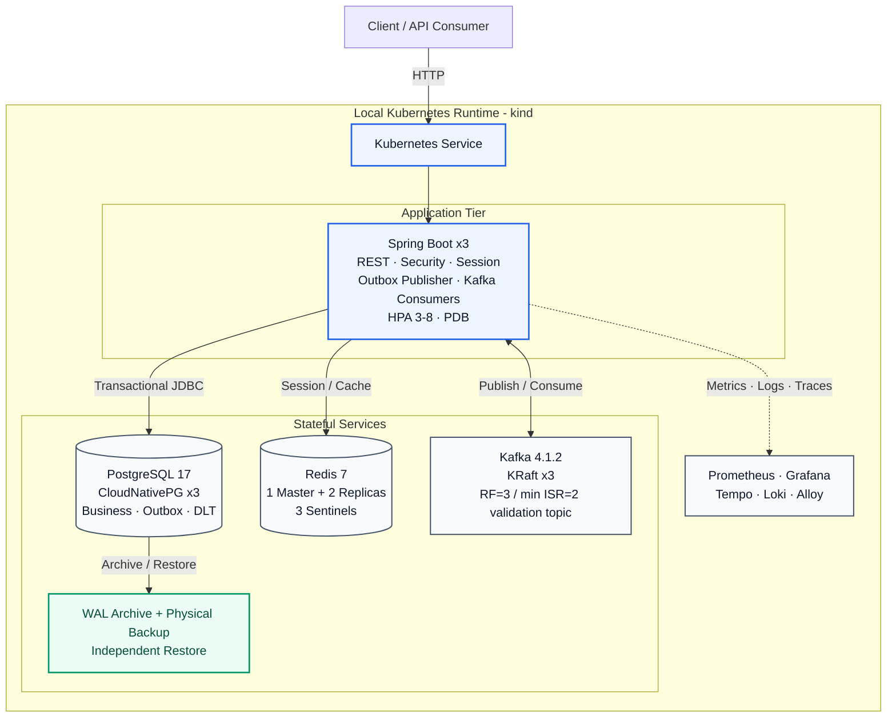
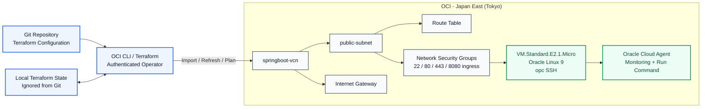
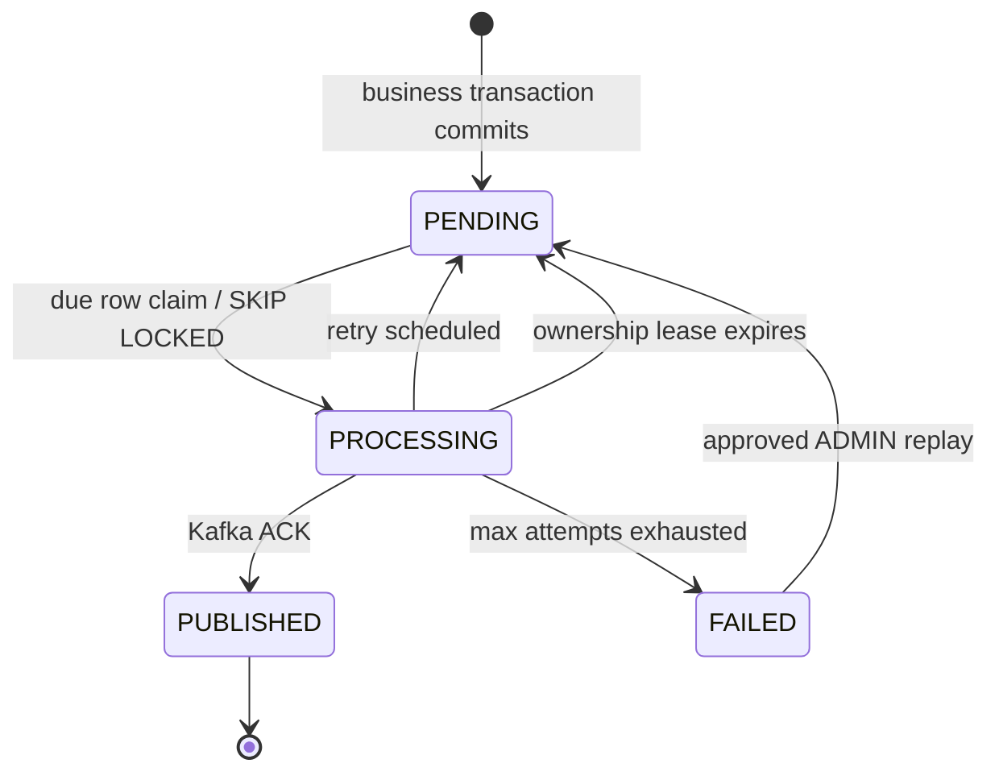

# Spring Boot E-Commerce Backend - System Architecture & Engineering Summary

> **Evidence-first engineering document**
> Verification date: **2026-08-10**
> Current `main`: **`67d2cf9`**
> Phase 8 milestone commit: **`ed626cb`**
> Phase 8 tag: **`phase8-oci-iac`**

## Executive Summary

This repository is a production-minded, event-driven commerce backend built with **Java 25** and **Spring Boot 4.1.0**. Its engineering value comes from integrating transactional correctness, idempotent command handling, durable asynchronous delivery, stateful failure recovery, Kubernetes application availability, observability, software supply-chain controls, and cloud Infrastructure as Code into one evidence-driven system.

The project is intentionally documented under a strict evidence model:

- **Implemented** means the control or mechanism exists in the repository.
- **Verified** means the corresponding behavior was executed and evidence was captured.
- **Observed** means a measured result applies only to the stated experiment.
- **Not claimed** means the project has not established production-equivalent proof.

The latest completed infrastructure milestone is **Phase 8 - OCI Brownfield Infrastructure Adoption with Terraform**. Existing Oracle Cloud Infrastructure resources were discovered, imported, reconciled into Terraform state, and brought to **zero drift** without replacing the running environment. OCI guest access, Oracle Cloud Agent health, Run Command delivery, IAM permissions, reboot recovery, and repository hygiene were also verified.

The accurate current classification is:

> **A locally verified distributed backend with tested application and stateful-service recovery, a verified software supply-chain pipeline, and a reproducible OCI brownfield IaC baseline. It is not yet production-proven multi-zone HA or a managed-cloud production platform.**

Under strict industry review, the evidence supports an **advanced student / strong junior backend-platform profile**, with selected reliability and operational practices showing **early mid-level reasoning**. Production mid-level ownership would still require managed multi-zone failure domains, external secret/workload identity, production traffic and incidents, production SLO/error-budget operation, cost governance, and third-party integration ownership.

---

## Current Verified Engineering Baseline

| Area | Verified state | Evidence boundary |
|---|---|---|
| Repository | `main` at `67d2cf9`; working tree clean after final maintenance cycle | Current repository state |
| Automated regression | **146 passed / 0 failed / 0 errors / 0 skipped** | Latest cited regression evidence |
| Application tier | 3 Spring Boot replicas; HPA 3-8 | Local Kubernetes availability engineering |
| Kubernetes | kind v1.36.1; 1 control-plane + 3 workers | Control plane remains a local SPOF |
| PostgreSQL | PostgreSQL 17; CloudNativePG; 3 instances | Single-primary failure + local restore path verified |
| Kafka | Kafka 4.1.2; 3 KRaft broker/controllers | One broker/node failure verified |
| Redis | 3 data nodes + 3 Sentinels | Async replication; no general zero-RPO claim |
| Flyway | V1-V11 validated | Schema managed by migration; Hibernate validates |
| Supply chain | CycloneDX, Trivy, GHCR digest, Cosign OIDC, provenance | No Kubernetes admission enforcement yet |
| OCI | Running VM, VCN, subnet, IGW, route/security objects adopted into Terraform | Brownfield dev infrastructure, not multi-zone production |
| Terraform | `fmt -check`, `validate`, final `plan` = **No changes** | Zero drift at verification time |
| OCI Run Command | `ACKED`, `SUCCEEDED`, exit code `0` | Verified against current dev instance |
| Final GitHub workflows | CI, CodeQL, Supply Chain Security all **successful** on latest main | Post-merge verification |
| Dependabot | 0 open Dependabot PRs after maintenance cycle | Snapshot at verification time |

### Version and milestone interpretation

The application release history currently reaches **`v1.9.0-phase7-supply-chain`**. Phase 8 is tracked as an infrastructure milestone using the annotated tag **`phase8-oci-iac`**, which points to commit **`ed626cb`**. Subsequent dependency-maintenance commits moved `main` forward to **`67d2cf9`**; the Phase 8 tag intentionally remains fixed at the milestone commit.

---

## Evidence Policy

| Evidence class | What qualifies | Allowed claim |
|---|---|---|
| Automated behavior | Unit, integration, Testcontainers, controller, concurrency, migration, context tests | Verified by automated test |
| Executed runtime drill | Pod/worker loss, primary/broker/master loss, backup/restore, HPA, drain, reboot, Run Command | Verified under tested conditions |
| Reconciled durability evidence | Client ACK set compared with recovered durable state | Observed RPO result for captured ACK set |
| Configured control | Probes, PDB, retry policy, SLO rules, IAM policy, signing workflow | Implemented/configured; not runtime proof alone |
| IaC reconciliation | Terraform import, refresh, validation, zero-drift plan | Infrastructure matches declared config at verification time |
| Production boundary | Multi-zone, production traffic, historical SLOs, real incident ownership | Explicitly not claimed |

---

# 1. System Architecture

## 1.1 Runtime Deployment View



### Availability boundary

| Component | Current verified topology | Verified behavior | Remaining production boundary |
|---|---|---|---|
| Application | 3 replicas; HPA 3-8; PDB | rolling update, HPA, drain, hard-worker recovery | abrupt worker loss still exposed transient transport failure |
| PostgreSQL | 3 CloudNativePG instances | synchronous failover, ACK reconciliation, physical backup, restore | local PV/MinIO; no multi-zone DR |
| Kafka | 3 KRaft broker/controllers | one-node loss, quorum survival, ISR recovery, ACK reconciliation | no correlated two-node or multi-region proof |
| Redis | 1 master + 2 replicas; 3 Sentinels | automatic promotion and topology convergence | asynchronous replication |
| Kubernetes | 1 control-plane + 3 workers | worker-level recovery tests | single local control-plane |
| Supply chain | signed/attested immutable image workflow | build artifact identity and provenance | no admission-time enforcement |
| OCI | single dev VM + network resources | SSH, agent, Run Command, reboot and IaC reconciliation | not a managed multi-zone application deployment |

## 1.2 Cloud / IaC Control Plane View



Phase 8 is a **brownfield adoption**, not a greenfield rebuild. The existing VCN, public subnet, internet gateway, route table, default security list, NSGs, NSG rules, and compute instance were imported and reconciled into Terraform. The final plan reported:

```text
No changes. Your infrastructure matches the configuration.
```

`prevent_destroy` safeguards were added for adopted resources to reduce accidental destructive changes during continued development.

---

# 2. Transaction Correctness and Durable Event Delivery

## 2.1 Commerce invariants

- Product detail reads use Redis caching; product mutations explicitly evict cached detail entries.
- Product stock uses optimistic locking through JPA `@Version`.
- Cart contents are not inventory reservations; checkout revalidates and deducts stock inside the order transaction.
- Order-item name, unit price, and subtotal snapshots preserve purchase-time evidence.
- Order creation, stock deduction, cart deletion, and `ORDER_CREATED` Outbox insertion commit atomically.
- Cancellation accepts only `PENDING`, restores stock, and shares the same pessimistic order lock used by payment.

## 2.2 Payment idempotency

```text
Idempotency-Key + request path
        -> SHA-256 request fingerprint
        -> SELECT order FOR UPDATE
        -> replay lookup under lock
        -> validate PENDING + no existing payment
        -> persist payment + replay metadata + response snapshot
        -> order = PAID
        -> persist PAYMENT_PAID Outbox event
        -> one PostgreSQL commit
```

Database constraints enforce one payment per order and one replay identity per `(idempotency_key, request_path)`. Reusing the same key with a different request fingerprint is rejected.

## 2.3 Transactional Outbox



Business state and event intent share one PostgreSQL transaction. Competing publishers use `FOR UPDATE SKIP LOCKED`; retry eligibility, ownership, terminal failure, and replay remain durable database state.

### Multi-replica Outbox drill

- 90 synthetic events.
- Claims distributed **30 / 30 / 30** across three application replicas.
- 90 Kafka records observed.
- No observed duplicates or missing records under that workload.

This demonstrates cooperative non-overlapping work under the tested workload; it is **not** a global exactly-once or fairness guarantee.

## 2.4 Consumer and DLT safety

Consumers persist `(event_id, consumer_name)` with the business side effect in the same transaction. Duplicate delivery becomes a unique-conflict skip. A failed side effect rolls back the marker so the message remains retry-safe.

Persisted DLT governance includes quarantine, replay reservation, original-destination preservation, audit history, lease recovery, and controlled operator replay.

---

# 3. Kubernetes Application Availability

The application tier uses:

- 3 baseline replicas.
- CPU HPA, min 3 / max 8, 60% target.
- `maxUnavailable: 0`, `maxSurge: 1`.
- startup, readiness, and liveness probes.
- PDB `minAvailable: 2`.
- topology spread with `maxSkew: 1`.
- preferred anti-affinity.
- 30-second NotReady/Unreachable `NoExecute` tolerations for local failure experiments.

### Verified scaling path

`3 -> 6 -> 8 -> 6 -> 4 -> 3`

### Hard worker loss

| Observation | Result |
|---|---:|
| Total completed trace attempts | 458 |
| HTTP 200 | 424 |
| Transport failures (HTTP 000) | 34 |
| Application-generated HTTP 5xx | 0 |
| Last observed transport failure | ~T+40s |
| Node Ready -> Unknown | ~T+48s |
| Replacement Pod created | ~T+78s |
| Replacement Ready / EndpointSlice convergence | ~T+94s |
| Final Deployment | 3/3 Ready |

**Engineering conclusion:** automatic application recovery passed. Zero-downtime continuity under abrupt worker loss was **not** demonstrated. The 424/458 ratio is not treated as a production availability SLI because request durations and timeout behavior differed.

---

# 4. PostgreSQL HA and Disaster Recovery

## 4.1 Synchronous primary failure

CloudNativePG runs three PostgreSQL 17 instances. The tested durability policy used `synchronous_commit=on` with quorum-style acknowledgement requiring one standby.

| Evidence | Observed result |
|---|---|
| Failure | hard loss of worker hosting `postgres-ha-1` primary |
| Promoted primary | `postgres-ha-2` |
| Client-visible write RTO | **51.543 s** |
| Failure injection -> first recovered commit | **52.468 s** |
| Captured acknowledged commits | 72 |
| Acknowledged writes missing after failover | **0** |
| Final topology | 3/3 healthy |

**RPO boundary:** observed RPO = 0 applies only to writes for which the client captured a successful `COMMITTED` acknowledgement in this experiment.

## 4.2 Backup and independent restore

Verified:

- CloudNativePG Barman Cloud plugin.
- S3-compatible MinIO object store.
- continuous WAL archiving.
- forced WAL switch.
- online physical base backup.
- catalog and artifacts present in object storage.
- independent `postgres-ha-restore` cluster.
- restored `spring_boot_lab` database queryable.
- `phase4_primary_failover_probe` restored with **3,864 rows**.
- local restore cluster reached healthy state in approximately **49 s**.

The first restore attempt failed because the restore source resolved the wrong backup server name. The corrected configuration restored successfully. Preserving this negative result is important: **backup creation alone is not evidence of recoverability**.

---

# 5. Kafka KRaft High Availability

The verified Kafka topology is 3 Kafka 4.1.2 nodes, each running broker + controller roles. The validation topic uses 6 partitions, replication factor 3, and `min.insync.replicas=2`.

During one hard broker/node loss:

- KRaft quorum survived.
- Controller and partition leadership moved.
- affected partitions operated with ISR=2.
- producer observed transient `NOT_LEADER_OR_FOLLOWER`.
- metadata refresh/retry recovered publication.
- failed broker rejoined after node recovery.
- all 6 partitions returned to ISR=3.
- final follower lag returned to zero.

### Durability reconciliation

| Evidence | Result |
|---|---:|
| Captured producer ACK records | 3,733 |
| Unique captured ACK values | 3,733 |
| Records consumed after recovery | 6,337 |
| Captured ACK values missing from Kafka | **0** |

**Engineering conclusion:** observed RPO = 0 acknowledged messages lost for the captured ACK set. It is not a universal zero-loss guarantee.

---

# 6. Redis Sentinel High Availability

Steady state:

- 3 Redis data nodes.
- 1 master + 2 replicas.
- 3 Sentinels.
- quorum = 2.
- Spring Boot/Lettuce uses Sentinel master discovery.

During hard loss of the active master:

- Sentinel quorum remained available.
- a replica was promoted.
- new master observed approximately **T+18 s** from recorded node stop.
- pre-failure replicated data remained readable.
- post-promotion writes succeeded.
- former master rejoined as a replica after recovery.
- final topology converged to 1 master + 2 replicas.
- targeted Redis/Lettuce error scan found no failover-related error in the captured application log window.

**Replication boundary:** Redis replication is asynchronous. The test establishes checked-data survival and failover mechanics, not a general zero-RPO guarantee.

---

# 7. Software Supply-Chain Security

```mermaid
flowchart LR
    Source["Commit / PR"] --> Test["Java 25 Tests"]
    Test --> AppSBOM["CycloneDX<br/>Application SBOM"]
    AppSBOM --> FSScan["Trivy Filesystem<br/>HIGH / CRITICAL Gate"]
    FSScan --> Build["Container Build"]
    Build --> ImageScan["Trivy Image Gate"]
    ImageScan --> Digest["GHCR Immutable Digest"]
    Digest --> Sign["Cosign Keyless Signing<br/>GitHub OIDC"]
    Sign --> Evidence["Image SBOM<br/>Build Provenance"]
    Evidence --> Promote["Digest-pinned<br/>Deployment Input"]

    classDef verified fill:#ecfdf5,stroke:#059669,stroke-width:2px,color:#064e3b;
    classDef gate fill:#fff7ed,stroke:#d97706,stroke-width:2px,color:#7c2d12;
    class Test,AppSBOM,Digest,Sign,Evidence,Promote verified;
    class FSScan,ImageScan gate;
```



Current controls:

- Java 25 regression tests.
- CycloneDX application SBOM.
- Trivy filesystem HIGH/CRITICAL gate.
- container image build.
- Trivy image HIGH/CRITICAL gate.
- GHCR immutable digest publishing.
- Cosign keyless signing using GitHub OIDC.
- container image SBOM.
- GitHub build provenance attestation.
- digest-pinned Kubernetes deployment helper.

### Final post-maintenance verification

On the latest `main` state, all three primary workflows completed successfully:

- **CI** - success.
- **CodeQL** - success.
- **Supply Chain Security** - success.

The successful Supply Chain Security run completed tests, SBOM generation, Trivy filesystem scan, GHCR publishing, Buildx, immutable image build/push, Cosign installation and OIDC signing, image SBOM, provenance attestation, and supply-chain evidence upload.

A non-blocking GitHub Actions warning remains: several Docker actions still target Node.js 20 and are currently forced by GitHub-hosted runners to execute on Node.js 24. This is a maintenance item, not a failed security gate.

### Boundary

Not yet established:

- signed-image Kubernetes admission policy.
- runtime signature verification.
- organization-wide signing policy.
- cloud workload identity validation.
- reproducible-build guarantee.
- full SLSA Build Level 3 claim.

---

# 8. Phase 8 - OCI Brownfield Infrastructure as Code

## 8.1 What Phase 8 completed

Existing OCI development infrastructure was adopted rather than recreated. Terraform now represents:

- VCN.
- public subnet.
- internet gateway.
- route table.
- default security list.
- network security groups.
- NSG ingress/egress rules.
- compute instance.

The dev instance is `VM.Standard.E2.1.Micro` with 1 OCPU, 1 GB memory, and Oracle Linux 9.

## 8.2 Network and access verification

Verified:

- instance lifecycle returned `RUNNING`.
- public TCP/22 reachable.
- OpenSSH banner: `SSH-2.0-OpenSSH_9.9`.
- correct OCI image user is `opc`.
- public-key SSH authentication succeeded.
- `sshd` active and listening on IPv4/IPv6 port 22.

The earlier SSH timeout was recovered through controlled instance restart and subsequent guest validation; it was not hidden from the verification history.

## 8.3 Oracle Cloud Agent and Run Command

Verified after restart:

- `oracle-cloud-agent.service` active.
- Compute Instance Run Command plugin runtime status `RUNNING`.
- IAM dynamic group created for the dev instance.
- IAM policy created to allow the instance to consume Run Commands.
- final smoke command:
  - delivery: `ACKED`
  - lifecycle: `SUCCEEDED`
  - exit code: `0`
  - output included `FINAL_RUN_COMMAND_OK`
  - command ran as `ocarun`.

An earlier Run Command attempt failed with exit code 127 because the command content included an incorrect `commandString` combination; the final source-only command definition succeeded. The failed attempt is diagnostic evidence, not part of the success claim.

## 8.4 Guest health after recovery

Verified through SSH:

- Oracle Linux kernel active.
- instance uptime normal after restart.
- memory available; swap unused in captured health check.
- root filesystem approximately 19% used.
- `sshd` active.
- Oracle Cloud Agent active.

OCI compute metrics were also successfully retrieved for CPU and memory utilization before the reboot.

## 8.5 Terraform reconciliation

Final repository verification:

- `terraform fmt -check -recursive` passed.
- `terraform validate` passed.
- required image and SSH public-key variables were resolved from the existing instance.
- final `terraform plan -no-color -input=false` returned:

```text
No changes. Your infrastructure matches the configuration.
```

Repository hygiene:

- `.tfstate` and backup state files are ignored and not tracked.
- private SSH keys are not tracked.
- OCI credential files are not tracked.
- Terraform provider lock file is committed.
- staged/working tree checks were clean at merge.

Phase 8 was merged in **PR #41** and tagged **`phase8-oci-iac`**.

---

# 9. Security, Identity, Observability, and Operations

## 9.1 Application identity controls

- short-lived HMAC JWT access tokens.
- opaque refresh tokens generated from secure randomness.
- SHA-256 refresh-token hashes persisted instead of raw reusable secrets.
- refresh rotation and predecessor revocation.
- stable session UUIDs and device/IP/time metadata.
- USER/ADMIN authorization.
- owner-based authorization where applicable.
- deny-by-default unmatched request policy.
- authentication audit persistence and action/outcome metrics.

## 9.2 Telemetry

| Signal | Implementation | Operational use |
|---|---|---|
| Correlation | HTTP -> MDC -> Outbox -> Kafka -> DLT | transaction traceability |
| Metrics | Actuator + Micrometer + Prometheus | rate, latency, failures, state |
| Traces | OpenTelemetry -> Tempo | distributed timing |
| Logs | JSON -> Alloy -> Loki | structured incident query |
| Alerts | Prometheus rules -> Alertmanager | runbook-linked response |
| Dashboards | Grafana | operating visibility |
| OCI guest metrics | OCI Compute Agent | cloud VM CPU/memory telemetry |

**SLO boundary:** current SLOs are engineering definitions, not evidence of historical production attainment.

---

# 10. Testing and Performance Evidence

## 10.1 Regression

Current cited regression:

**146 passed / 0 failed / 0 errors / 0 skipped**

Historical JaCoCo snapshot:

- instruction coverage: **89.78%**
- branch coverage: **73.63%**

This coverage snapshot predates later HA, supply-chain, and Phase 8 work and must not be described as release-current until regenerated.

## 10.2 Local performance profiles

| Profile | Verified evidence |
|---|---|
| Catalog read | 9,544 requests; 79.44 req/s; avg 9.92 ms; P95 17.93 ms; P99 20.12 ms; 0% failed |
| High-rate soak | 5 min @ 2,500 req/s; 750,000 requests; 2,499.91 req/s; P95 0.84 ms; P99 1.11 ms; 0.07% client failures; no observed application 5xx |
| Payment idempotency | 30 concurrent requests; 100% HTTP success; 1 payment row; 1 idempotency row; 0 duplicates |

These are reproducible local profiles, **not** production capacity, SLA, or cloud-performance guarantees.

---

# 11. Release and Milestone Progression

| Milestone | Engineering scope |
|---|---|
| `v1.1.0-phase1-hardening` | application hardening |
| `v1.2.0-phase2-observability` | observability stack |
| `v1.3.0-phase21-reliability` | reliability controls |
| `v1.4.0-phase3-kubernetes` | Kubernetes multi-replica baseline |
| `v1.5.0-phase33-multinode-ha` | multi-node application recovery |
| `v1.6.0-phase4-postgresql-dr` | PostgreSQL HA + physical backup/restore |
| `v1.7.0-phase5-kafka-ha` | Kafka KRaft broker-failure validation |
| `v1.8.0-phase6-redis-ha` | Redis Sentinel failover validation |
| `v1.9.0-phase7-supply-chain` | software supply-chain security |
| `phase8-oci-iac` tag | OCI brownfield Terraform adoption and cloud-guest operational verification |

---

# 12. Current Production Risk Register

| Priority | Current boundary | Required next step |
|---|---|---|
| P0 | Secrets/workload identity remain environment-oriented | external secret manager, workload identity, rotation and end-to-end secret scanning |
| P0 | Stateful HA is still validated in local kind/storage | managed failure domains, off-host object storage, repeated RPO/RTO drills |
| P1 | OCI currently hosts a dev VM, not the full managed multi-zone application platform | production cloud architecture, TLS, LB/ingress, DNS, managed data services or managed K8s |
| P1 | Single kind control-plane | managed or multi-control-plane Kubernetes |
| P1 | Abrupt worker loss produced transient transport failures | production CNI/LB validation and external time-weighted SLI |
| P1 | Redis replication is asynchronous | define accepted cache loss semantics |
| P1 | Supply-chain verification stops before cluster admission | signed-image admission and runtime policy |
| P1 | Payment provider remains simulated | real sandbox adapter, signed webhooks, reconciliation and provider idempotency |
| P1 | Terraform state is currently local | remote encrypted state + state locking before team/production use |
| P2 | No rate limiting / lockout / MFA | abuse controls and identity hardening |
| P2 | Partial retention lifecycle | approved retention and erasure automation |
| P2 | Telemetry cost/retention untuned | representative sampling and storage budgets |
| P2 | Cancel-vs-pay contention evidence is limited | high-iteration PostgreSQL contention drill |
| P2 | Some GitHub Docker actions still target Node.js 20 | upgrade to action releases natively supporting the current runner runtime |

---

# 13. Senior Engineering Assessment

## What the project demonstrates strongly

- Runtime reliability claims are tied to executed evidence rather than manifest presence.
- PostgreSQL and Kafka durability results reconcile client acknowledgements against recovered durable state.
- Backup validation includes independent restore and application data.
- Redis documentation preserves asynchronous-replication limitations.
- Transactional Outbox and DLT handling are modeled as durable operational state machines.
- Kubernetes failure analysis separates client errors, node state, replacement timing, readiness, EndpointSlice convergence, and restored capacity.
- Supply-chain controls extend system evidence from runtime correctness to artifact identity and provenance.
- Phase 8 demonstrates **brownfield IaC adoption**, a materially different engineering problem from simply creating cloud resources from scratch.
- The OCI recovery work preserves failed attempts, diagnoses environment/user/agent issues, and verifies final state rather than claiming success from configuration alone.
- Terraform ends with **zero drift**, not merely syntactically valid configuration.

## Current level

The repository supports an **advanced student / strong junior backend-platform assessment**. Several areas demonstrate **early mid-level reasoning**, especially:

- distributed failure modeling.
- transaction and idempotency boundaries.
- durable-state reconciliation.
- restoration-based DR validation.
- operational evidence collection.
- software supply-chain provenance.
- cloud resource adoption and Terraform reconciliation.
- explicit claim-boundary discipline.

It should **not** be described as production-proven senior engineering. Missing evidence still includes managed multi-zone operation, external secrets/workload identity, remote Terraform state and team workflow, real production traffic/incidents, historical SLO/error-budget ownership, cost controls, and third-party payment integration.

---

# 14. Recommended Next Sequence

1. **Remote Terraform state and locking** for Phase 8 infrastructure.
2. **External secrets + workload identity**, including rotation and policy validation.
3. **Managed cloud application deployment**, rather than only a standalone OCI development VM.
4. **TLS + ingress/load balancer + DNS** with external synthetic availability measurement.
5. **Off-host object storage** and repeated PostgreSQL/Kafka/Redis recovery-objective drills.
6. **Signed-image admission policy** and runtime provenance enforcement.
7. **Real payment-provider sandbox** with signed webhooks, reconciliation, and provider idempotency.
8. **Write-heavy/event-heavy soak tests**, retry storms, correlated failures, and postmortem-style evidence.
9. **Regenerate release-current coverage** and publish a consolidated versioned verification report.
10. **Upgrade remaining Node.js-20-targeting GitHub Docker actions** once compatible releases are selected and verified.

---

## Final Engineering Position

The current repository is no longer accurately described as only a Spring Boot CRUD backend. It is an evidence-driven backend/platform engineering project spanning:

**transaction correctness -> event durability -> application recovery -> stateful HA -> DR restore -> observability -> software supply chain -> cloud operations -> brownfield Infrastructure as Code.**

Its strongest professional characteristic is not the number of technologies used, but the discipline of requiring **runtime evidence, reconciliation, recovery validation, and explicit production boundaries before making reliability claims**.
