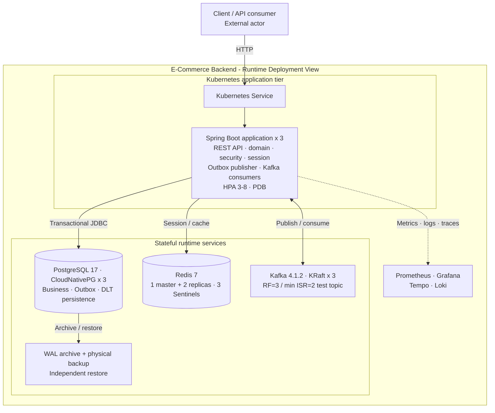
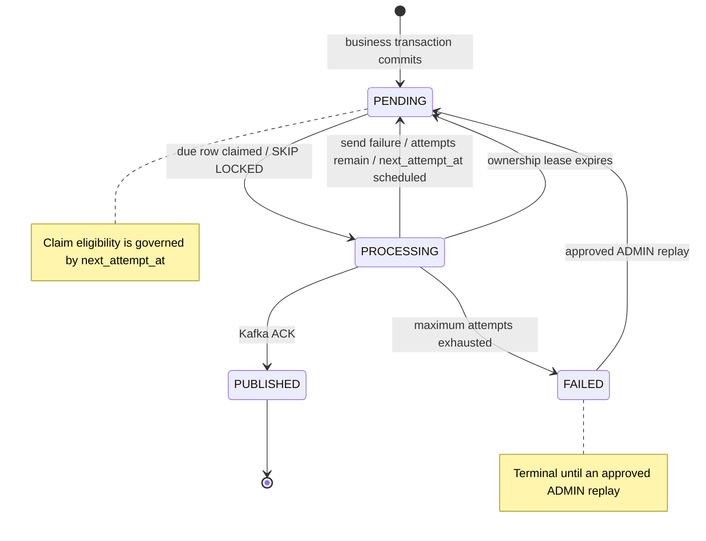

# Spring Boot E-Commerce Backend - System Architecture and Engineering Summary

## Executive Summary

This repository is a production-minded, event-driven commerce backend built with Java 25 and Spring Boot 4.1.0. Its engineering value is not the size of its framework list; it is the integration of transactional correctness, idempotency, asynchronous delivery, stateful high availability, observability, failure recovery, and artifact governance into one evidence-driven system.

This summary applies a senior-review lens: design intent, implemented controls, executed evidence, and claim boundaries are kept separate. A configured mechanism is not promoted to a reliability result until the corresponding behavior has been exercised and reconciled.

The current verified milestone is `v1.9.0-phase7-supply-chain` on main commit `6230e8c`. Since the earlier Phase 3.3 portfolio snapshot, the project has completed four additional reliability phases:

- **Phase 4:** CloudNativePG PostgreSQL HA, synchronous primary failover, WAL archiving, physical base backup, and independent restore validation.
- **Phase 5:** three-node Kafka KRaft with replicated topics, controller/partition failover, producer recovery, and acknowledgement-to-record reconciliation.
- **Phase 6:** Redis replication plus three Sentinels, automatic master failover, application Sentinel discovery, and topology convergence.
- **Phase 7:** SBOMs, vulnerability gates, immutable registry digests, keyless Cosign signing, provenance attestation, and digest-pinned promotion tooling.

The precise engineering classification is now:

> **A locally verified distributed backend with multi-replica application recovery and single-node-failure tolerance demonstrated for PostgreSQL, Kafka, and Redis under explicitly tested conditions. It is not production-proven multi-zone HA because the control plane, storage/object-store failure domains, cloud networking, workload identity, external secrets, and production SLO/RPO/RTO operation remain unverified.**

Under strict engineering review, the project is stronger than a typical CRUD portfolio. It demonstrates advanced student / strong junior backend-platform capability, with selected reliability practices approaching early mid-level reasoning. It still does not substitute for real production ownership.

## Verified Engineering Baseline

| Item | Current state |
|---|---|
| Release | `v1.9.0-phase7-supply-chain` |
| Main commit | `6230e8c` |
| Latest merged milestone | PR #33 - software supply-chain security controls |
| Verification date | 2026-08-09 |
| Automated tests | 146 passed; 0 failed; 0 errors; 0 skipped |
| Application | 3 replicas; HPA 3-8 |
| Kubernetes | 1 control-plane + 3 workers, v1.36.1 |
| PostgreSQL | PostgreSQL 17, CloudNativePG, 3 instances |
| Kafka | Kafka 4.1.2, 3 KRaft broker/controllers |
| Redis | 3 data nodes + 3 Sentinels |
| Flyway | V1-V11 validated |
| Supply chain | SBOM + Trivy + GHCR digest + Cosign OIDC + provenance |

### Evidence policy

Claims are split into four classes:

1. **Automated behavior** - unit, integration, Testcontainers, controller, concurrency, migration, application-context tests.
2. **Executed runtime drills** - Pod deletion, HPA, node drain, hard worker loss, PostgreSQL primary loss, Kafka broker loss, Redis master loss, backup/restore.
3. **Configured controls** - probes, PDB, topology policy, retry policies, SLO rules, runbooks, supply-chain workflow.
4. **Production boundaries** - anything not exercised under production-equivalent failure domains is not promoted to a production claim.

Configuration alone is not treated as evidence of runtime behavior.

## System Architecture - Runtime Deployment View

This view is intentionally limited to the deployed runtime topology. Build, signing, provenance, and artifact promotion are documented later as a separate delivery view.



### Current availability boundary

| Component | Verified topology | Verified behavior | Remaining boundary |
|---|---|---|---|
| Spring Boot | 3 replicas | rolling update, HPA, PDB, self-healing, hard-worker recovery | client transport failures still occurred during abrupt worker loss |
| PostgreSQL | 3 CloudNativePG instances | synchronous failover, ACK reconciliation, WAL backup, independent restore | local PV/object store; no multi-zone DR proof |
| Kafka | 3 KRaft broker/controllers | one broker/node loss, leader movement, ISR recovery, ACK reconciliation | no two-node/multi-region failure proof |
| Redis | 1 master + 2 replicas; 3 Sentinels | single master-node loss and automatic promotion | async replication; no general zero-RPO guarantee |
| Kubernetes control plane | 1 kind node | local orchestration | control-plane SPOF |
| Supply chain | CI-based signing/attestation | build artifact traceability | no cluster admission enforcement |

## Core Transaction and Reliability Design

### Commerce correctness

- Product reads use Redis caching with explicit mutation eviction.
- Product stock uses optimistic locking.
- Checkout revalidates stock inside the database transaction.
- Order-item snapshots preserve purchase-time values.
- Order creation, stock deduction, cart deletion, and `ORDER_CREATED` Outbox insertion commit atomically.
- Payment and cancellation serialize terminal transitions through a shared pessimistic order lock.

### Payment idempotency

```text
Idempotency-Key + request path
-> SHA-256 request fingerprint
-> SELECT order FOR UPDATE
-> replay lookup under lock
-> validate PENDING + no payment
-> persist payment + replay metadata + response snapshot
-> order = PAID
-> persist PAYMENT_PAID Outbox event
-> commit once
```

The database protects one payment per order and one replay identity per key/path. Request-fingerprint mismatch is rejected.

### Transactional Outbox



The key design property is that business state and event intent commit together in PostgreSQL. Kafka publication happens after commit, and the database persists publication ownership, retries, terminal failure, and replay eligibility.

### Consumer and DLT safety

Consumers persist `(event_id, consumer_name)` with the side effect in the same transaction. Duplicate delivery therefore becomes a database conflict rather than a second business effect. DLT evidence is persisted and governed through quarantine, replay reservation, audit history, and lease recovery.

## Kubernetes Application Availability

The application tier remains a 3-replica Deployment with CPU HPA from 3 to 8 replicas, readiness/liveness/startup probes, PDB `minAvailable=2`, `maxUnavailable=0`, `maxSurge=1`, topology spread, preferred anti-affinity, and 30-second NoExecute tolerations for local failure testing.

### Verified baseline

- 3/3 Ready behind ClusterIP Service.
- Deleted Pod automatically replaced.
- Rolling update preserved service-level continuity in the test trace.
- HPA scale-out: `3 -> 6 -> 8`.
- HPA scale-down: `8 -> 6 -> 4 -> 3`.
- Multi-replica Outbox: 90 events, 30/30/30 claims, 90 Kafka messages, no observed duplicates/missing.
- Controlled drain completed under PDB semantics.

### Hard worker loss

| Observation | Result |
|---|---:|
| Total attempts | 458 |
| HTTP 200 | 424 |
| Transport failures | 34 |
| Application HTTP 5xx | 0 |
| Last transport failure | ~T+40s |
| Node Ready -> Unknown | ~T+48s |
| Replacement Pod created | ~T+78s |
| Full 3/3 capacity | ~T+94s |

**Engineering conclusion:** automatic recovery passed. Zero-downtime hard-failure continuity did not.

## Phase 4 - PostgreSQL HA and Recovery

### Synchronous primary failover

CloudNativePG runs three PostgreSQL 17 instances. The tested durability policy used `synchronous_commit=on` and quorum synchronous replication requiring one standby acknowledgement.

Hard primary-node loss produced:

- old primary `postgres-ha-1`;
- promoted primary `postgres-ha-2`;
- client-visible RTO 51.543s;
- injection-to-recovered-commit 52.468s;
- 72 captured acknowledged commits;
- 0 acknowledged commits missing from the database after failover;
- return to 3/3 healthy instances after recovery.

**Engineering conclusion:** this is an observed RPO result scoped only to successfully acknowledged writes in the experiment.

### Backup and independent restore

The repository integrates the CloudNativePG Barman Cloud plugin with an S3-compatible MinIO object store.

Verified:

- continuous WAL archiving;
- forced WAL switch archive;
- online physical base backup;
- backup catalog and artifacts in object storage;
- independent `postgres-ha-restore` cluster;
- restored `spring_boot_lab` database queryable;
- `phase4_primary_failover_probe` restored with 3,864 rows;
- local restore cluster healthy in approximately 49s.

A first failed restore attempt caused by an incorrect backup server name is intentionally preserved in the verification narrative. That is useful evidence: a backup artifact is not equivalent to a proven restore path.

## Phase 5 - Kafka High Availability

Kafka now runs as 3 Kafka 4.1.2 KRaft broker/controllers across workers. The validation topic uses 6 partitions, RF=3, and `min.insync.replicas=2`.

During one hard broker/node loss:

- KRaft quorum remained available;
- controller leadership changed;
- partition leaders moved;
- affected partitions operated with ISR=2;
- the producer observed transient `NOT_LEADER_OR_FOLLOWER` responses and recovered through metadata refresh/retry;
- the broker rejoined after node recovery;
- all 6 partitions returned to ISR=3;
- final follower lag returned to zero.

Reconciliation compared captured producer acknowledgements with records read after recovery:

- 3,733 captured ACK records;
- 3,733 unique ACK values;
- 6,337 records consumed from the topic;
- 0 captured ACK values missing.

**Engineering conclusion:** **observed RPO = 0 acknowledged messages lost for the captured acknowledgement set**.

## Phase 6 - Redis Sentinel High Availability

Redis now uses 3 data nodes and 3 Sentinels. Steady state is one master and two replicas; Sentinel quorum is 2. Spring Boot uses Sentinel discovery rather than a fixed Redis host.

During hard loss of the active master node:

- Sentinel quorum remained available;
- a replica was automatically promoted;
- a new master was observed approximately 18s after the recorded node stop;
- pre-failure replicated data was present;
- post-promotion writes succeeded;
- the remaining replica followed the new master;
- after node recovery, the former master rejoined as a replica;
- the final topology converged to one master + two replicas;
- post-failover data was present on all three Redis nodes;
- targeted application logs showed no failover-related Redis/Lettuce error in the collected window.

**Engineering conclusion:** failover and convergence passed for the explicitly checked data and write path. Redis replication is asynchronous, so the result is **not** a general zero-RPO guarantee.

## Phase 7 - Software Supply-Chain Security

### Delivery and artifact provenance view

This delivery view is intentionally separate from the runtime Deployment View. It describes artifact identity and promotion controls, not deployed request or state flow.

```mermaid
flowchart LR
    Commit["Git commit / PR"] --> Verify["Java 25 regression tests"]
    Verify --> AppSBOM["CycloneDX application SBOM"]
    AppSBOM --> SourceGate["Trivy filesystem gate<br/>HIGH / CRITICAL"]
    SourceGate --> Build["Container build"]
    Build --> ImageGate["Trivy image gate<br/>HIGH / CRITICAL"]
    ImageGate --> Digest["GHCR immutable digest"]
    Digest --> Sign["Cosign keyless signing<br/>GitHub OIDC"]
    Sign --> Evidence["Image SBOM + build provenance"]
    Evidence --> Promote["Digest-pinned Kubernetes<br/>deployment input"]
```



The repository now has a dedicated supply-chain workflow with:

- Java 25 regression tests;
- CycloneDX application SBOM;
- Trivy filesystem scan with HIGH/CRITICAL gating;
- PR image build and Trivy image scan;
- GHCR publishing on non-PR runs;
- immutable image digest capture;
- Cosign keyless signing via GitHub OIDC;
- container image SBOM;
- GitHub build provenance attestation;
- digest-pinned Kubernetes deployment helper.

PR #33 passed CI, CodeQL, and the Supply Chain Security workflow before merge.

This is artifact-level supply-chain security. It does not yet include Kubernetes admission rejection of unsigned images, runtime signature verification, organization-wide policy, cloud workload identity verification, or a full SLSA Level 3 claim.

## Security and Session Lifecycle

- Short-lived HMAC JWT access tokens.
- Opaque refresh tokens generated from secure randomness; only hashes persisted.
- Refresh rotation and predecessor revocation.
- Stable session IDs and multi-device session visibility/revocation.
- USER/ADMIN authorization and ownership rules.
- ADMIN-only Outbox and DLT operations.
- Deny-by-default unmatched request policy.
- Authentication audit persistence and action/outcome metrics.

Remaining security hardening includes external secrets/workload identity, rate limiting, lockout/abuse controls, MFA, password-reset/email-verification workflows, and stronger deployment-time policy enforcement.

## Observability and Operational Controls

| Signal | Implementation | Purpose |
|---|---|---|
| Correlation | HTTP -> MDC -> Outbox -> Kafka -> DLT | transaction traceability |
| Metrics | Actuator + Micrometer + Prometheus | rate, latency, failures, state |
| Traces | OpenTelemetry -> Tempo | distributed timing |
| Logs | JSON -> Alloy -> Loki | structured incident query |
| Alerts | Prometheus rules -> Alertmanager | runbook-linked response |
| Dashboards | Grafana | operating visibility |

SLO definitions are not presented as historical production attainment.

## Testing and Performance

Current regression: **146 tests passed / 0 failed / 0 errors / 0 skipped**.

The historical JaCoCo snapshot is **89.78% instruction / 73.63% branch coverage**. It predates the current HA and supply-chain milestone and must not be presented as release-current coverage until regenerated.

Local benchmark evidence remains useful for regression and engineering comparison, not capacity planning:

- Catalog read: 9,544 requests; 79.44 req/s; average 9.92ms; P95 17.93ms; P99 20.12ms; 0% failed.
- High-rate soak: 5 minutes at 2,500 req/s; 750,000 requests; 2,499.91 req/s; P95 0.84ms; P99 1.11ms; 0.07% client failures; no observed application 5xx.
- Payment idempotency: 30 concurrent requests; 100% HTTP success; one payment row; one idempotency row; zero duplicates.

## Release Progression

| Release | Engineering milestone |
|---|---|
| v1.1.0 | hardening |
| v1.2.0 | observability |
| v1.3.0 | reliability controls |
| v1.4.0 | Kubernetes multi-replica baseline |
| v1.5.0 | multi-node application recovery |
| v1.6.0 | PostgreSQL HA + DR |
| v1.7.0 | Kafka KRaft HA |
| v1.8.0 | Redis Sentinel HA |
| v1.9.0 | software supply-chain security |

## Production Risk Register

| Priority | Boundary | Required next step |
|---|---|---|
| P0 | Secrets remain local/environment-oriented | external secret manager, workload identity, rotation, secret scanning |
| P0 | Stateful HA validated only on local kind/storage | cloud/managed failure domains, off-host backup, repeated RPO/RTO drills |
| P1 | Single kind control-plane | managed or multi-control-plane Kubernetes |
| P1 | No verified cloud/IaC delivery | Terraform/Pulumi, IAM, network, TLS, ingress/LB, DNS, rollback |
| P1 | Abrupt worker loss still caused transient transport failures | production CNI/LB evaluation, external synthetic SLI, time-weighted availability |
| P1 | Redis async replication | define cache durability semantics and acceptable loss window |
| P1 | Supply-chain enforcement stops before cluster admission | signed-image admission and runtime policy |
| P1 | Simulated payment provider | real sandbox adapter, signed webhooks, reconciliation, provider idempotency |
| P2 | No rate limiting / lockout / MFA | gateway/app abuse controls and identity hardening |
| P2 | Partial retention lifecycle | approved retention and erasure automation |
| P2 | Telemetry cost/retention untuned | representative sampling and storage budgets |
| P2 | Cancel-vs-pay contention evidence limited | high-iteration database contention drill |

## Senior Engineering Assessment

### What is strong

- Reliability claims are tied to runtime evidence, not YAML presence.
- Failover experiments preserve negative results and distinguish client-visible recovery from controller recovery.
- PostgreSQL and Kafka durability claims reconcile client acknowledgements against recovered durable state.
- Backup work validates restoration and application data, not merely backup-job success.
- Redis documentation explicitly preserves asynchronous-replication limits.
- Transactional Outbox and DLT are operational state machines rather than superficial design-pattern labels.
- Supply-chain work extends the reliability model from runtime state to build artifacts and promotion identity.

### Current level

The evidence supports an **advanced student / strong junior backend-platform profile**. Selected areas show **early mid-level reasoning**, especially around distributed failure modes, database/broker durability, operational evidence, and production-boundary discipline.

The project should not be described as production-proven senior engineering. Missing proof includes multi-zone cloud operation, external secret/workload identity, real incident ownership, production traffic, production SLO/error-budget governance, cost controls, and third-party payment integration.

## Recommended Next Sequence

1. External secrets + workload identity.
2. Cloud/IaC deployment on a managed multi-control-plane Kubernetes platform.
3. Off-host object storage and repeated measured PostgreSQL/Kafka/Redis recovery objectives.
4. External synthetic availability/latency monitoring through ingress/load balancer.
5. Admission control for signed images and provenance policy.
6. Real payment sandbox, webhook signature validation, provider reconciliation.
7. Write-heavy/event-heavy soak tests, retry storms, correlated failure drills, and postmortem-style incident evidence.
8. Regenerate release-current coverage and consolidate evidence into a versioned engineering report.
